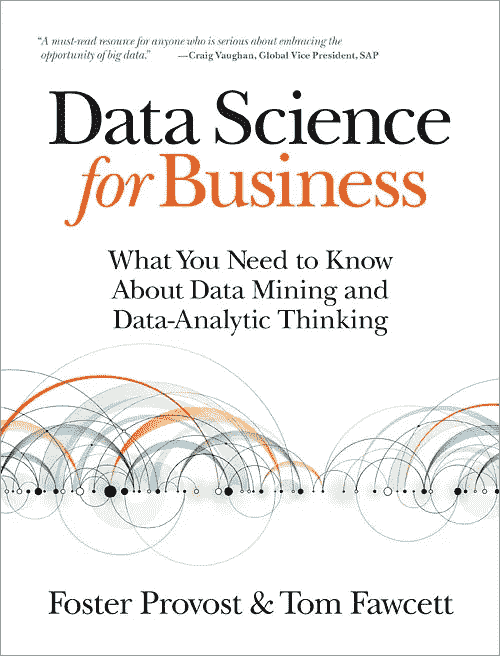
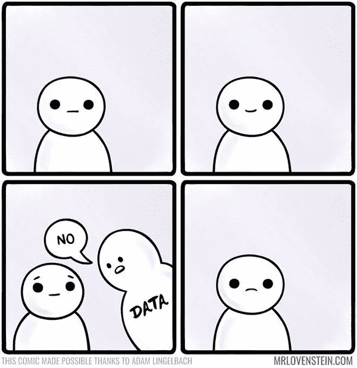

# 书评:商业数据科学

> 原文：<https://towardsdatascience.com/book-review-data-science-for-business-bfb980495288?source=collection_archive---------6----------------------->

在我找工作的过程中，我遇到了一些招聘人员，他们有能力招聘数据科学家。然而，当我与他们交谈时，他们首先诚实地问的一件事是“什么是数据科学？”我刚刚读完福斯特·普罗沃斯特和汤姆·福塞特合著的《商业数据科学》。我计划向任何需要与/雇佣/管理数据科学家一起工作，但不太了解他们做什么的人推荐这本书。

这本书涵盖了你对数据科学入门书籍的所有期望:各种建模技术(线性方法、支持向量机、决策树、knn)、监督与非监督学习、模型评估等等。这本书有一点数学，但没有代码，因为重点是帮助读者进行分析性思考，而不是培养读者成为一名实践者。它有几个相关的商业问题来说明技术/哲学的应用。贯穿全书的一个场景是，你是一家大型电信公司的一员，你必须想办法通过广告活动留住现有客户。

作为一个刚刚完成[大会](https://medium.com/u/ade87cdd122e?source=post_page-----bfb980495288--------------------------------)关于如何成为一名优秀的数据科学从业者的课程的人，有两个概念引起了我的注意:

1.  **期望值框架:**在分类问题中，我们学习了如何评估模型是否良好的各种指标:准确性、roc-auc、敏感性、特异性……我在课程中没有遇到的一种方法是期望值:

`Expected Profit = p(True Positive)b(True Positive) + p(False Positive)b(False Positive) + p(True Negative)b(True Negative) + p(False Negative)b(False Negative)`

在通过期望值框架评估分类模型时，你取[混淆矩阵](http://www.dataschool.io/simple-guide-to-confusion-matrix-terminology/)的每个单元的概率，乘以该单元的收益，并对结果求和。例如，如果通过添加活动保留的客户的真实正比率为 0.9，保留该客户的收益为 100 美元，则该给定单元的预期利润为 90 美元。

这种评估框架存在一些缺陷，主要是在一些预测问题中，没有一种明确的方法来评估模型的成本和收益。然而，我认为将一个模型转化为预期利润是利益相关者可以明确认同的事情。

**2。数据科学更像研发而不是软件工程:**许多数据科学家的工作描述要求熟悉敏捷和其他软件工程框架。这是有道理的，因为许多数据科学家都被科技公司聘用，但这让我相信，数据科学家可能也会受到同样的管理。

作者提出了一个很好的观点，即并非所有数据科学的努力都会有回报。一部分是运气，因为有一个很容易预测的问题。其他时候，数据只是说没有。

不仅拥有知道如何有效使用数据科学工具的从业者至关重要，而且拥有直觉知道哪些项目可能会有回报的从业者和管理者也很重要。

不可能期望每个与数据科学家一起工作/管理/雇佣数据科学家的人都成为数据科学专家。然而，对于数据科学家做什么以及他们给组织增加什么价值，应该有一个基本的了解。[商业数据科学](https://www.amazon.com/Data-Science-Business-Data-Analytic-Thinking/dp/1449361323/ref=sr_1_1?ie=UTF8&qid=1504031681&sr=8-1&keywords=data+science+for+business)对于任何想要获得这种知识的人来说都是一个很好的开始。