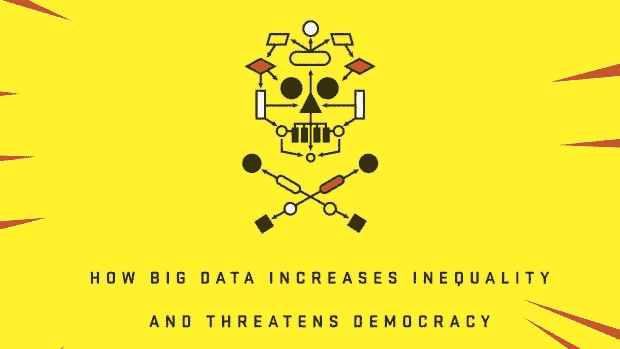

# 书评:摧毁数学的武器(凯西·奥尼尔)

> 原文：<https://towardsdatascience.com/book-review-weapons-of-math-destruction-cathy-oneil-a6546cc6ee91?source=collection_archive---------3----------------------->

这篇文章标志着我第一次试图强迫自己更好地理解我读过的书。以前，我发现自己读了一本书又一本书，却无法回忆起以前学过的重要的东西。

老实说，这很令人沮丧。

所以我尝试用这种方式来推动自己理解这本书，并综合这本书传达的各种概念和想法。

免责声明:我的评论不会试图保持中立或无偏见——因为我觉得我试图写这样一篇博文的任何尝试都会导致枯燥乏味的结果。

我猜你可能会说，这可能是一个咆哮，而不是审查。

继续前进。

我在四月份的时候从亚马逊上买了这本书，它已经在书架上放了一段时间了，因为那时我正在看另一本书。大纲相当有趣，因为它从第一人称的角度强调了大数据实施的陷阱。我不会说我迷上了它的前提(因此我没有立即读它)，但我很好奇作者在想什么。

作者凯茜·奥尼尔；她自己是一名数据科学家。这本书的封面上有一些对她的描述:

> 她获得了哈佛大学的数学博士学位，并在巴纳德学院任教，之后进入私营部门，为对冲基金 D. E. Shaw 工作。然后，她在多家初创公司担任数据科学家，建立预测人们购买和点击的模型。奥尼尔在哥伦比亚大学启动了数据新闻的 Lede 项目，并且是《做数据科学》的作者。她每周出现在 Slate 播客上

这本书一开始，作者讲述了她从学术界到 D.E .肖的经历，让读者充满了她对能够实践自己擅长的事情感到兴奋的故事。直到 2008 年的大金融危机，她才终于明白对冲基金，比如她工作的那家基金，是如何对破坏人们生活的结果负部分责任的。

她最终离开了公司，加入了一家为银行做风险评估的公司。毕竟，如果说监管不力是导致 2008 年崩盘的管理不善的罪魁祸首；那么评估未来交易的风险肯定会让世界变得更美好。

然而事情并没有变得那么好，因为她觉得这个行业只是在做一个橡皮图章生意。她在这些公司和其他公司的经历让她对大数据是如何被实施和滥用来优化盈利能力而无视伦理和道德问题的幻想破灭了。

本书的 2/3 讨论了在现实生活环境中部署的算法的各种例子，这些例子产生了意想不到的后果，影响了人们的生活，因为在开始时缺乏远见。

其中一个例子讲述了美国新闻创建的大学排名系统是如何开始军备竞赛的；在试图爬上排名系统的阶梯时，我们只是优化了算法所使用的确切特征(如学术引用)(嘿，现在…那不会让你想起家乡的事情吗..).然而，该系统未能在其算法中包括的是诸如学杂费等项目。这基本上给了私人实体提高学费的所有动机，并将其用于将使他们排名更高的事情上——所有这些虽然可能有助于为学生提供更好的学习环境，但也会在毕业时给他们带来沉重的债务负担。

作者称它们(模型)为数学毁灭武器(WMD)——就我所能回忆起的算法/模型而言:

1.  拥有庞大的目标受众
2.  不应用反馈循环来使用未来结果自我修正
3.  使用各种代理来说明预测结果，这在某些情况下可能是歧视性的。
4.  对观众来说是不透明的

这本书有这些大规模杀伤性武器的各种例子。以至于在我阅读的时候，我真的有跳过几章只看结论的冲动。但是*咳咳*沉没成本再次占了上风。虽然一段时间后它确实变干了，但它确实证明了没有第二项而用上面列表中的第三项填充的模型会遭受建模者或整个社会的偏见。更糟糕的是，它将如何再次强化社会的“世界观”。

因此，在为预测高利贷者的目标而创建的假设模型的情况下——低收入的人，大多数是黑人，住在某个街区；被一次又一次地掠夺，从而确保他们永远无法摆脱困境。他们现在是他们处境的受害者。

对我来说，这就是整本书的全部内容。证明这些大规模杀伤性武器的存在，并部署在我们日常生活中的各种机构。

那么，我们该如何处理这些大规模杀伤性武器呢？

1.  对于在非商业环境中使用的模型，她建议在提出用于制作预测模型的特征时应更好地考虑。虽然删除它们可能会导致模型的准确性得分较低，但她认为，与社会中存在的偏见相比，较低的准确性得分更好地反映了模型的表现。
2.  公众对模型的监督。
3.  监管，如欧洲正在使用的监管，在公司可以将他们的数据用于其他目的之前，客户必须选择加入。
4.  模型对公众的透明度。

**我的看法**

对大数据的伦理关注并不新鲜。但是通常道德规范被强调的角度(至少在我的经验中)更多的是关于透明度和保密性。我发现关于偏见和自我强化偏见的角度非常有趣，因为它确实对模型的受害者产生了更广泛和持续的影响。根据我以前的经验，修改你的模型总是为了确保你的模型不会过时——因为市场趋势会变化，你的模型必须根据这些变化进行调整。我想现在我有了更新模型的新动力。

我也想知道在这些情况下是否应该使用探索-利用策略(来自强化学习)。这意味着，我们应该让我们的模型产生一些错误，并观察结果是否会加强偏差。这将允许我们继续使用现有的(充满偏见的)特征，但如果结果显示不是这样，就要修正我们模型的假设。

*本帖首发于我的个人博客，*[*http://www . hafidzzulkifli . com/2017/07/book-review-weapons-of-math-destruction . html*](http://www.hafidzzulkifli.com/2017/07/book-review-weapons-of-math-destruction.html)