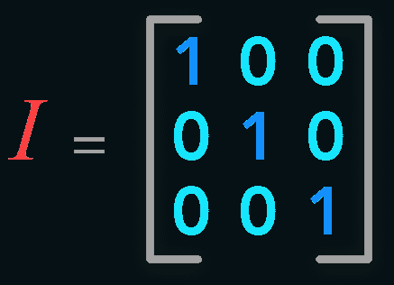
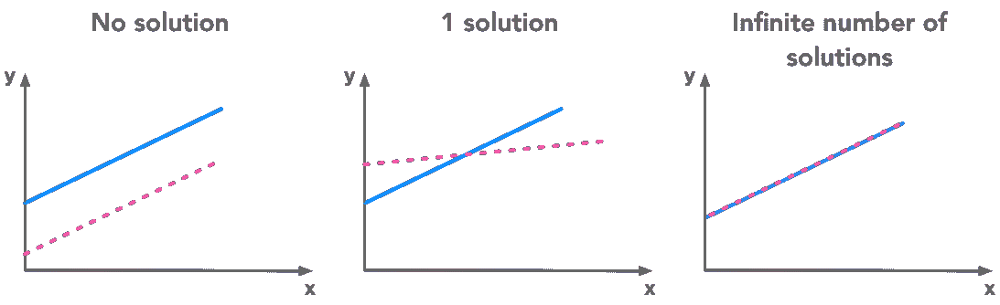
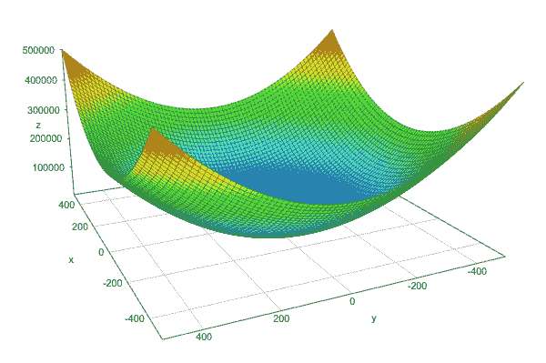
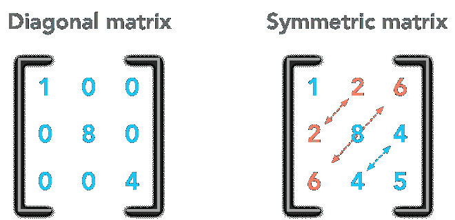
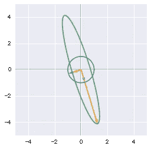
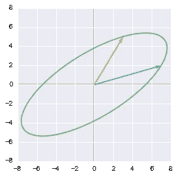
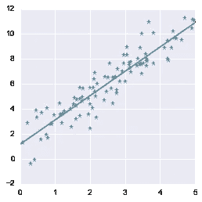
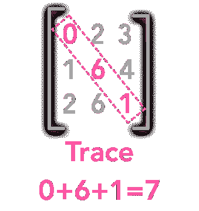
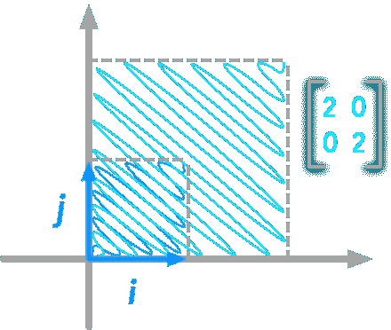
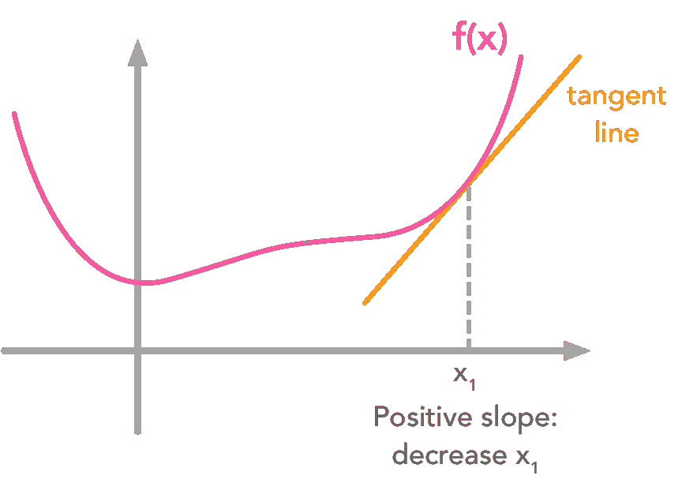

# 提升您的数据科学技能。学习线性代数。

> 原文：<https://towardsdatascience.com/boost-your-data-sciences-skills-learn-linear-algebra-2c30fdd008cf?source=collection_archive---------5----------------------->

我想介绍一系列博客帖子和他们相应的 Python 笔记本，收集了伊恩·古德费勒、约舒阿·本吉奥和亚伦·库维尔(2016 年)关于深度学习书籍的笔记。这些笔记本的目的是帮助初学者/高级初学者掌握深度学习和机器学习背后的线性代数概念。获得这些技能可以提高您理解和应用各种数据科学算法的能力。在我看来，它是机器学习、深度学习和数据科学的基石之一。

这些笔记涵盖了线性代数的第二章。我喜欢这一章，因为它给人一种在机器学习和深度学习领域最常用的感觉。因此，对于任何想要深入学习并获得线性代数概念的人来说，这是一个很好的教学大纲，有助于更好地理解深度学习算法。

你可以在 [Github](https://github.com/hadrienj/deepLearningBook-Notes) 上找到所有的笔记本，在我的博客上可以找到这篇文章[的一个版本。](https://hadrienj.github.io/posts/Deep-Learning-Book-Series-Introduction/)

# 线性代数入门

本系列的目标是为希望理解足够的线性代数以适应机器学习和深度学习的初学者提供内容。不过我觉得[深度学习书](http://www.deeplearningbook.org/)中关于线性代数的章节对初学者来说有点难。所以我决定在这一章的每一部分制作代码、示例和绘图，以便添加对初学者来说可能不明显的步骤。我也认为你可以通过例子传达比一般定义更多的信息和知识。插图是看到一个想法的全貌的一种方式。最后，我认为编码是一个很好的工具来具体实验这些抽象的数学概念。除了纸和笔，它还增加了一层你可以尝试通过新的视野来推动你的理解的东西。

> 编码是具体实验抽象数学概念的伟大工具

图形表示对理解线性代数也很有帮助。我试图将概念与情节(以及产生情节的代码)结合起来。做这个系列时，我最喜欢的表现形式是，你可以把任何矩阵看作空间的线性变换。在几章中，我们将扩展这一思想，看看它如何有助于理解特征分解，奇异值分解(SVD)或主成分分析(PCA)。

# Python/Numpy 的使用

另外，我注意到，创建和阅读实例对理解理论真的很有帮助。这就是我创建 Python 笔记本的原因。目标是双重的:

1.提供一个使用 Python/Numpy 应用线性代数概念的起点。由于最终目标是将线性代数概念用于数据科学，因此在理论和代码之间不断转换似乎是很自然的。您所需要的只是一个带有主要数学函数库的 Python 安装，比如 Numpy/Scipy/Matplotlib。

2.给出更具体的潜在概念。我发现玩和试验这些笔记本非常有用，可以帮助我理解一些复杂的理论概念或符号。我希望阅读它们会有所帮助。

# 摘要

教学大纲完全遵循深度学习书籍，所以如果你在阅读时不能理解某一点，你可以找到更多的细节。以下是内容的简短描述:

1.[标量、向量、矩阵和张量](https://hadrienj.github.io/posts/Deep-Learning-Book-Series-2.1-Scalars-Vectors-Matrices-and-Tensors/)

向量、矩阵、转置和基本运算的简单介绍(矩阵向量的加法)。还介绍了 Numpy 函数，最后介绍了广播。

2.[矩阵和向量相乘](https://hadrienj.github.io/posts/Deep-Learning-Book-Series-2.2-Multiplying-Matrices-and-Vectors/)

本章主要讲点积(向量和/或矩阵乘法)。我们还会看到它的一些性质。然后，我们将看到如何使用矩阵符号合成线性方程组。这是后面几章的主要过程。

3.[单位矩阵和逆矩阵](https://hadrienj.github.io/posts/Deep-Learning-Book-Series-2.3-Identity-and-Inverse-Matrices/)

我们将看到两个重要的矩阵:单位矩阵和逆矩阵。我们将看到为什么它们在线性代数中很重要，以及如何与 Numpy 一起使用。最后，我们将看到一个如何用逆矩阵求解线性方程组的例子。

4.[线性相关性和跨度](https://hadrienj.github.io/posts/Deep-Learning-Book-Series-2.4-Dependence-and-Span/)

本章我们将继续学习线性方程组。我们会看到，这样的系统不可能有一个以上的解，也不可能少于无穷多个解。我们将看到直觉，图形表示和这个陈述背后的证明。然后我们将回到系统的矩阵形式，并考虑吉尔伯特·斯特朗所说的*行图形*(我们看的是行，也就是说多个方程)和*列图形*(看的是列，也就是说系数的线性组合)。我们也会看到什么是线性组合。最后，我们将看到超定和欠定方程组的例子。

5.[规范](https://hadrienj.github.io/posts/Deep-Learning-Book-Series-2.5-Norms/)

向量的范数是一个函数，它接受一个向量作为输入，输出一个正值。它可以被认为是向量的长度。例如，它用于评估模型预测值和实际值之间的距离。我们会看到不同种类的规范(L⁰，l，L …)的例子。

6.[特殊类型的矩阵和向量](https://hadrienj.github.io/posts/Deep-Learning-Book-Series-2.6-Special-Kinds-of-Matrices-and-Vectors/)

我们已经在 [2.3](https://hadrienj.github.io/posts/Deep-Learning-Book-Series-2.3-Identity-and-Inverse-Matrices/) 中看到了一些非常有趣的特殊矩阵。在本章中，我们将看到其他类型的向量和矩阵。这不是一个很大的章节，但是理解接下来的章节是很重要的。

7.[特征分解](https://hadrienj.github.io/posts/Deep-Learning-Book-Series-2.7-Eigendecomposition/)

在本章中，我们将会看到线性代数的一些主要概念。我们将从了解特征向量和特征值开始。我们将会看到，一个矩阵可以被看作是一个线性变换，将一个矩阵应用到它的特征向量上会产生具有相同方向的新向量。然后我们会看到如何将二次方程表示成矩阵形式。我们会看到，二次方程对应的矩阵的特征分解可以用来求其最小值和最大值。另外，我们还将看到如何在 Python 中可视化线性变换！

8.[奇异值分解](https://hadrienj.github.io/posts/Deep-Learning-Book-Series-2.8-Singular-Value-Decomposition/)

我们将看到分解矩阵的另一种方法:奇异值分解或 SVD。从本系列开始，我就强调了这样一个事实:你可以把矩阵看成是空间中的线性变换。使用 SVD，您可以将一个矩阵分解成另外三个矩阵。我们会看到，我们可以把这些新矩阵看作空间的子变换。我们不是在一个动作中完成转换，而是将它分解为三个动作。另外，我们将把奇异值分解应用于图像处理。我们将看到奇异值分解对鹅露西图像的影响，所以请继续阅读！

9.[摩尔-彭罗斯伪逆](https://hadrienj.github.io/posts/Deep-Learning-Book-Series-2.9-The-Moore-Penrose-Pseudoinverse/)

我们看到不是所有的矩阵都有逆矩阵。这是不幸的，因为反演是用来解决方程组。在某些情况下，方程组无解，因此逆不存在。然而，找到一个几乎是解决方案的值(就最小化误差而言)可能是有用的。这个可以用伪逆来做！例如，我们将看到如何用伪逆找到一组数据点的最佳拟合线。

10.[追踪操作员](https://hadrienj.github.io/posts/Deep-Learning-Book-Series-2.10-The-Trace-Operator/)

我们将看到什么是矩阵的迹。主成分分析(PCA)的最后一章需要用到。

11.[行列式](https://hadrienj.github.io/posts/Deep-Learning-Book-Series-2.11-The-determinant/)

这一章是关于矩阵的行列式的。这个特殊的数字可以告诉我们很多关于我们矩阵的事情！

12.[例子:主成分分析](https://hadrienj.github.io/posts/Deep-Learning-Book-Series-2.12-Example-Principal-Components-Analysis/)

这是线性代数系列的最后一章！是关于主成分分析(PCA)的。我们将使用在前几章中获得的一些知识来理解这个重要的数据分析工具！

# 要求

这个内容是针对初学者的，但对于至少有一些数学经验的人来说应该更容易。

# 享受

我希望你能在这个系列中找到一些有趣的东西。我尽量做到准确。如果发现错误/误解/错别字…请举报！你可以给我发电子邮件，或者在笔记本 Github 中打开问题和请求。

# 参考

印第安纳州古德费勒、纽约州本吉奥和库维尔(2016 年)。深度学习。麻省理工出版社。