# 通过 Amazon EC2、Keras 和 GPU 加速来促进您的机器学习

> 原文：<https://towardsdatascience.com/boost-your-machine-learning-with-amazon-ec2-keras-and-gpu-acceleration-a43aed049a50?source=collection_archive---------2----------------------->

## 如何建立合适的深度学习环境


Photo by [JJ Ying](https://unsplash.com/@jjying?utm_source=medium&utm_medium=referral) on [Unsplash](https://unsplash.com?utm_source=medium&utm_medium=referral)

# 为什么我不能在笔记本电脑上使用数据科学？

深度学习神经网络(具有不止一个隐藏层)需要一卡车的数据才能成为有效的预测引擎。这些模型需要强大的计算节点和大容量 RAM 存储，数据负载需要充足的存储和缓存能力。

鉴于像[亚马逊网络服务(AWS)](https://aws.amazon.com) 这样的云解决方案所提供的价格和易用性，让您宝贵的笔记本电脑承受沉重的培训负担是没有意义的！

此外，当您的模型远程收敛时，释放您的本地计算机来浏览 Twitter 或观看数据科学教程！

本指南将帮助您:

*   在一个[弹性云计算(EC2)](https://aws.amazon.com/ec2/) 实例上，
*   那有[支持 GPU 的 Keras](https://keras.io) ，
*   还有一个 [Jupyter 笔记本](http://jupyter.org)。

我还发布了[这篇关于 Keras 最佳实践的附带文章](https://medium.com/@ultimatist/deep-learning-tips-and-tricks-1ef708ec5f53)，供环境设置好并准备好训练模型时使用。

> 免责声明:某些情况下，比如我们在本帖中设置的情况，可能需要 24 小时才能得到 AWS 团队的批准。如果您马上需要一个工作实例，可以按需提供较低的性能选项。

# 设置 EC2

*注:在整个介绍中，我将强调按钮点击* ***粗体*** *。另外，我在运行 High Sierra 的 Mac 上，所以你的*[*bash*](https://en.wikipedia.org/wiki/Bash_(Unix_shell))*命令在 Windows 或 Linux 机器上会有所不同。*

首先，犒劳自己一个 [AWS 账户](https://aws.amazon.com)。如果询问您付款方式，请不要担心；我们可以稍后配置免费或付费版本，AWS 有很好的预算工具来帮助您估计随时间推移的实例成本。

然后，在顶部菜单栏中导航到**服务:计算:EC2** :

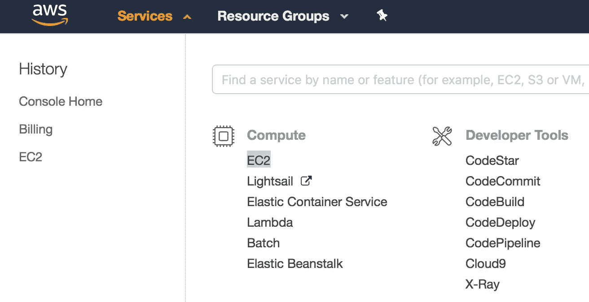

点击**启动实例**。是那个蓝色的大按钮！

然后，您将看到 AMI 浏览器窗口。点击左侧的**社区 ami**标签，搜索“Keras”:

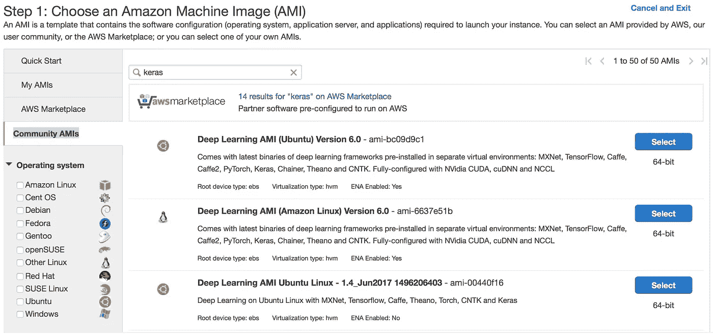

此时，您将选择一个内置了 Keras、依赖项和支持模块的 AMI。你可以从头开始设置你的环境——如果你有非常特殊的需求，我会推荐你构建一个 [Docker 容器](https://www.docker.com/what-docker)——但是在 AMI 市场上有这么多选项，这是多此一举。

我用的是**深度学习 AMI(Ubuntu)6.0 版** — ami-bc09d9c1。然而，对于未来的版本来说，事情可能是一样的。使用最新版本；截至 2018 年 5 月 16 日，这是 Ubuntu v9.0。

点击**选择**，你将被带到实例类型矩阵，这是一个你所拥有的所有硬件选项的分类。

## Amazon 实例类型

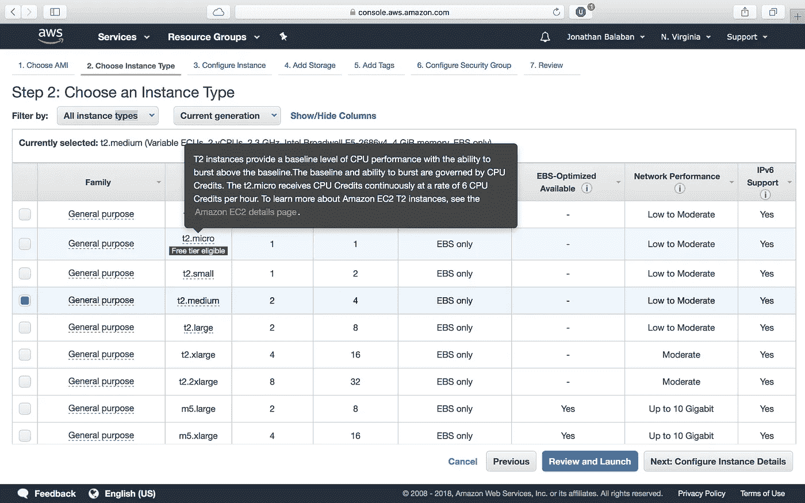

您会注意到，免费层仅提供一个核心/节点/CPU 和 1GB 内存。可以用 t2.micro 实例来设置本教程的环境，但是不能构建严肃的模型。所以，为真实建模寻找更健壮的东西；点击弹出窗口中橙色的**亚马逊 EC2 详情页面**链接，了解每小时的价格。

您会注意到，将鼠标悬停在**系列**链接上，会显示该特定实例系列的设计用途。这里是**计算优化:**

> 与其他系列相比，计算优化实例的 vCPU 与内存的比率更高，并且在所有 Amazon EC2 实例类型中，每个 vCPU 的成本最低。对于运行 CPU 受限的横向扩展应用程序，我们建议使用计算优化实例。此类应用的示例包括高流量前端车队、按需批处理、分布式分析、web 服务器、批处理以及高性能科学和工程应用。

这听起来很棒，但是在这些实例上没有 GPU。因此，如果您想要 GPU 加速，请转向 g2 或 g3 系列:

> GPU 图形实例为需要高性能图形加速的应用程序(如 3D 可视化、图形密集型远程工作站、3D 渲染、视频编码和虚拟现实)提供 GPU 以及高 CPU 性能、大内存和高网络速度。

或者更好的是，亚马逊为深度学习平台打造的 p 系列(GPU 计算)系列:

> GPU 计算实例为需要大规模浮点处理能力的应用程序提供通用 GPU 以及高 CPU 性能、大内存和高网络速度，如机器学习、高性能数据库、计算流体动力学、计算金融、地震分析、分子建模、基因组学和渲染。

为了找到 p 类实例， **filter by: GPU compute。**

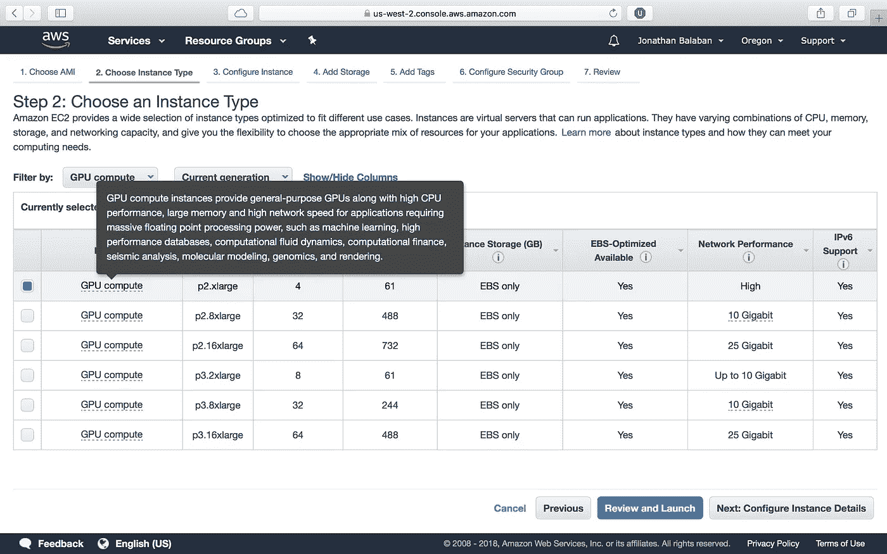

关于价格，请查阅 AWS 销售文件，例如 [P2 实例](https://aws.amazon.com/ec2/instance-types/p2/)的销售文件:

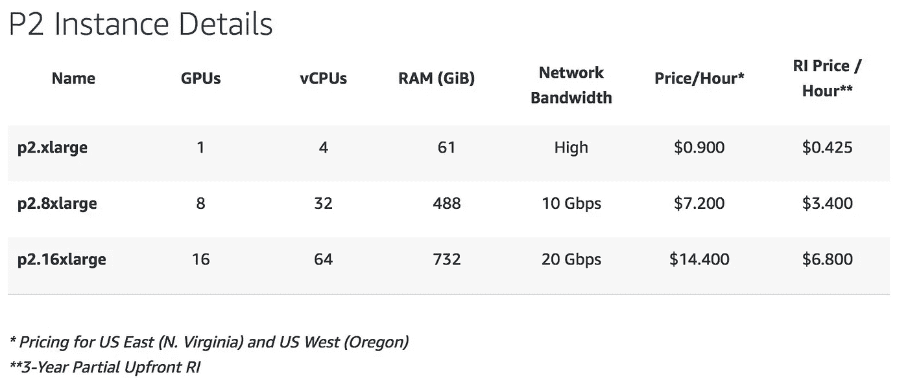

请注意以下几点:

1.  价格是每小时 90₵。对于一个相当强大的设置来说还不错！
2.  根据星号，某些实例类型仅在某些地区可用，或者因地区而定价不同。
3.  您选择的实例必须满足您的所有标准，否则建模将会失败。

我如何为实际建模选择一个类型？RAM、存储和带宽之类的东西是黑白分明的。你要么*可以*存储/处理数据，要么*不能*。有了 CPU 和 GPU，你就可以决定是花更少的钱训练，还是花更慢的速度训练，还是花更快的速度训练。

> 有时候你因为太廉价而付出更多；模型每小时的花费会更少，但需要更多的时间来适应！

## 详细配置

在本教程中，我们将选择`p2.xlarge`实例类型。点击 **Next:配置实例细节。**在第 3 步页面上，默认值是完美的，因此点击**下一步:添加存储:**

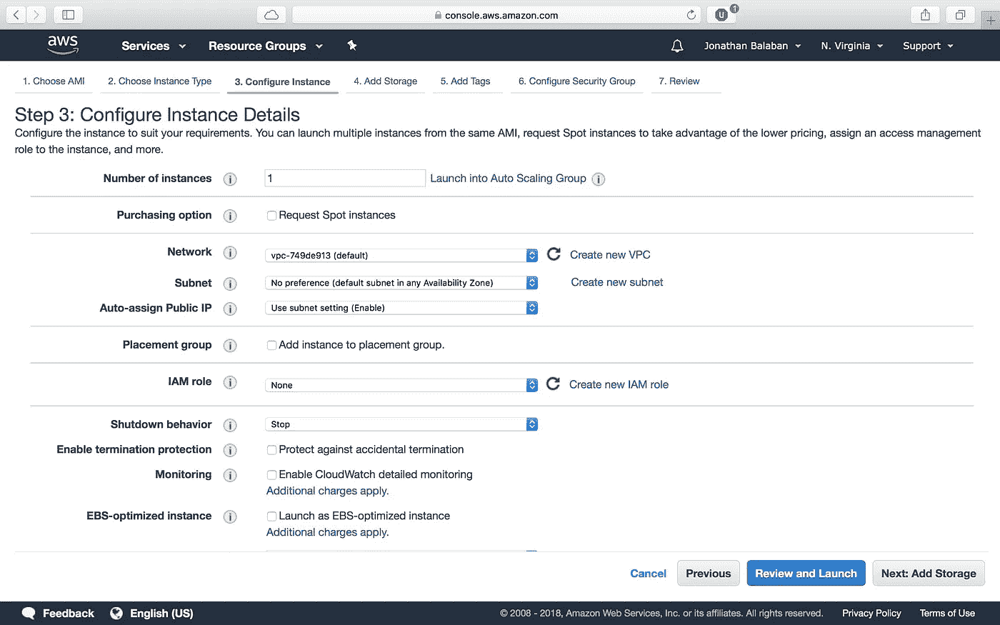

Can’t touch this!

请注意本页上的说明，根据说明，*自由层用户*最高可达 30GB。但是，如果您使用的是更高的层，比如我们下面的层，*保持指定的值*，否则您可能会增加潜在的额外存储成本。

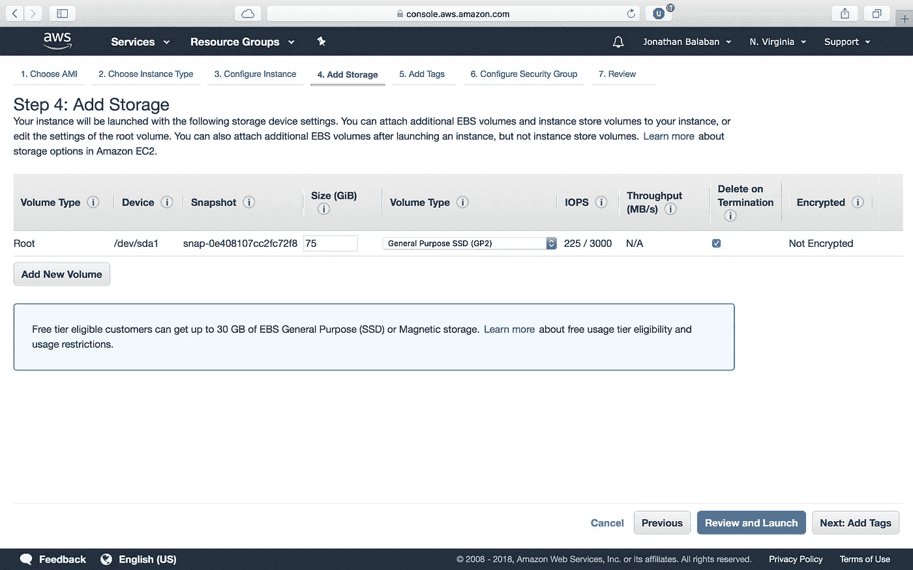

点击**下一步:**两次以上，直到我们到达 6。配置安全组。在这里，我们打开端口与我们的远程 Jupyter 笔记本进行对话。使用**添加规则**在端口范围 8888: 上创建一个*自定义 TCP 规则*

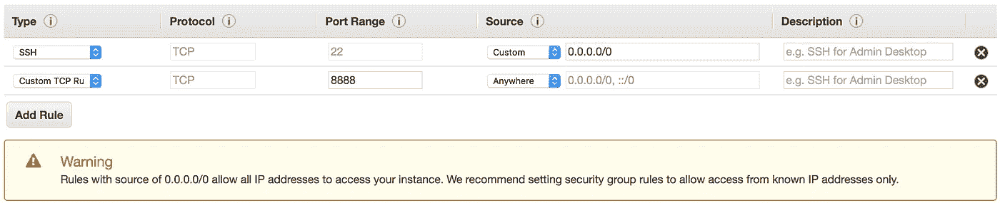

请注意，我通常在 Source 下选择“我的 IP”。如果您选择“任何地方”——正如黄色注释所警告的——*任何拥有您实例的公共 IP 的人都可以运行并修改您实例中的代码和文件*。还要注意的是，如果你改变你的工作程序去咖啡馆，你的 IP 地址已经改变，你必须*登录 AWS 并更新你的规则*才能登录。

点击**审查**，然后点击**启动:**

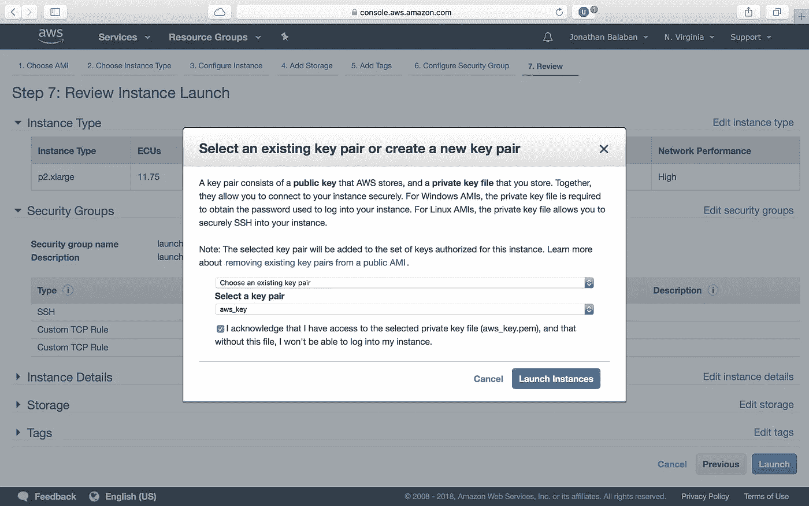

我将下载一个名为 *keras.pem* 的新密钥，这个文件在我的 hidden 中。我的 Mac 上的 ssh 目录。如果您还没有以前实例中的密钥，请设置一个密钥。或者，如果您正在[与其他人](https://docs.aws.amazon.com/general/latest/gr/aws-access-keys-best-practices.html)共享此实例，则创建一个新密钥！

如果您看到下面的屏幕，请转到提供的链接并提交申请表，这样亚马逊将允许您租用他们的服务！

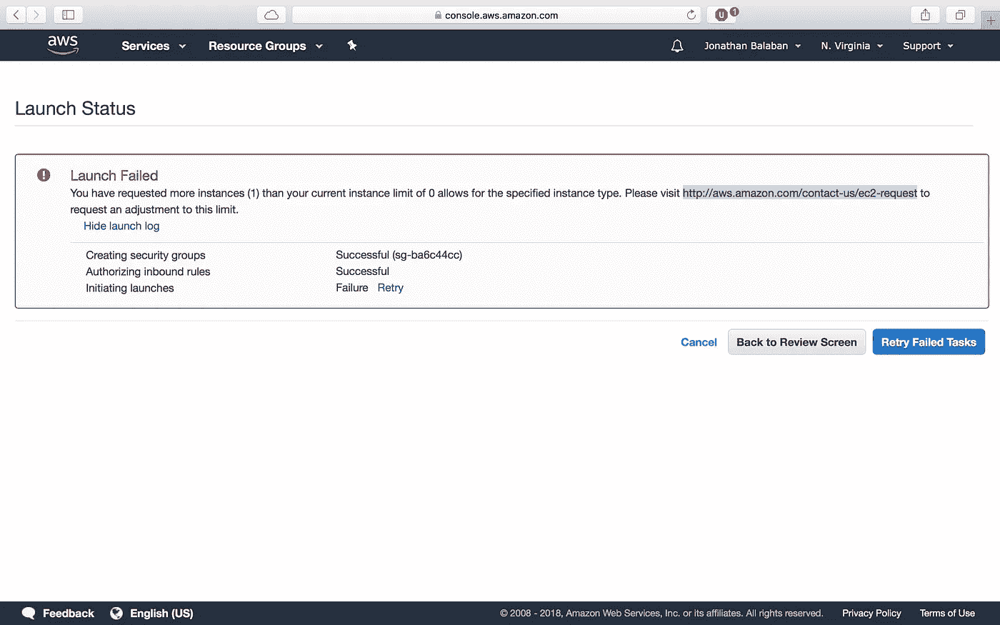

Please let me rent your stuff!

其实更复杂。以下是我从 AWS 联系人那里收到的回复:

> 最终用户无法管理这些限制。根据具体情况对限额进行审查，以确保基础设施的安全性和可用性。
> 
> 我目前正在处理您关于美国东部(北弗吉尼亚)地区 2 的 p2.xlarge Instances 限制增加请求。在这种特殊情况下，如上所述，我必须与我的服务团队合作以获得批准。请注意，服务团队可能需要 24 小时来处理此请求。

因此，亚马逊通过密切监控和管理整个基础设施的需求做得很好。否则，[互联网可能会再次关闭！](https://www.engadget.com/2017/03/02/amazon-admits-that-a-typo-took-the-internet-down-this-week/)

或者，不同的位置/地区有不同的限制。通常情况下，您应该选择能够提供您所需要的东西的最近的地区，但是由于世界上任何地方的延迟都很低，我们可以通过选择供应更多的地区来解决限制。

好了，我们应该开始行动了！接下来，我们将从本地机器连接到我们的实例。

# 通过安全外壳(SSH)连接

SSH 允许我们通过 [bash](https://en.wikipedia.org/wiki/Bash_(Unix_shell)) 远程命令和控制我们的实例。我将在我的 Mac 上启动**终端**:

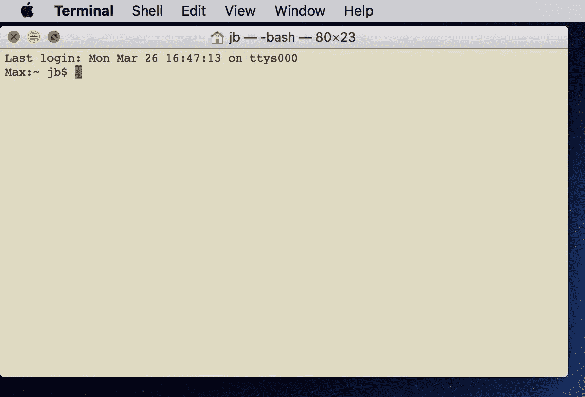

现在，回到 AWS 站点，EC2 仪表板，找到正在运行的`p2.xlarge`实例，并单击 **Connect** :

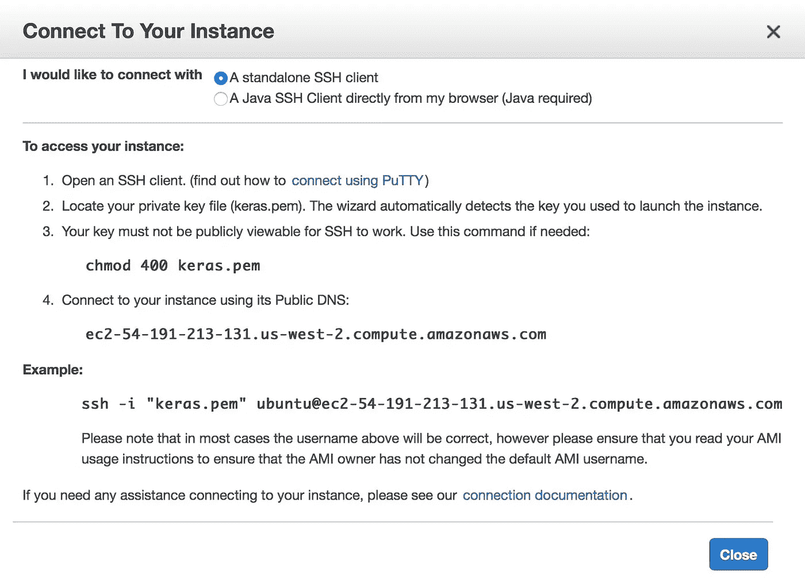

在 bash 中执行上述命令，您应该能够在。如果 SSH 要求您确认密钥指纹的真实性，您可能需要键入 yes，然后按 enter 键。

`**chmod 400 keras.pem**` 更改用户对密钥文件的权限，使任何人都无法读取或写入该文件。AWS 将对此进行检查，如果文件不安全，将拒绝进入！

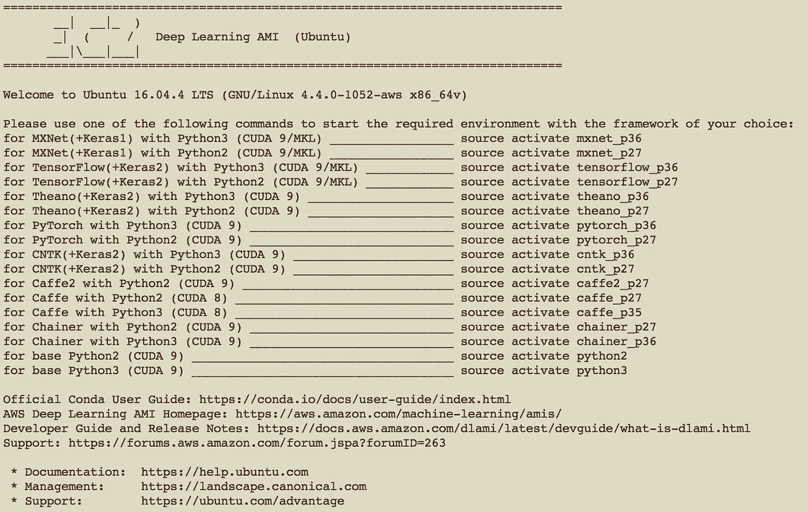

What success looks like!

请注意，该图像的加载顺序为我们提供了关于如何加载特定环境组合的很好的提示。这些是 [Conda envs](https://conda.io/docs/user-guide/tasks/manage-environments.html) ，它们加载各种 Python 版本并支持库。

你也可以更新最新最好的软件包，但是请记住你可能会破坏打包的设置，因为一些版本的库不能很好地一起运行。如果您想更新 Keras，您可以运行:

```
sudo pip install — upgrade keras
# are you sure you want to do this?
# things could break...
# FOMO?
# they don't make versions like they used to...
```

# 推出 Jupyter 笔记本

我将使用`source activate tensorflow_p36`在 Python 3 的 TensorFlow 后端发布 Keras 2。请注意，Keras 是 TensorFlow 上的一个包装器，因此它可以用简单的 Python 代码快速轻松地完成复杂的设置。然后我们启动 Jupyter notebook，没有指定浏览器，因为我们不需要在远程端安装 Javascript 或其他程序:

```
jupyter notebook --no-browser --port=8888
```

记下分配给您的令牌；我们很快就需要它了！

然后，[根据这个 AWS 指南](https://docs.aws.amazon.com/dlami/latest/devguide/setup-jupyter-configure-client-mac.html)，我们在终端(CMD+T)中打开一个新标签，SSH 进入我们的 Jupyter 隧道:

```
ssh -i ~/*keras.pem* -L 8157:127.0.0.1:8888 ubuntu@*ec2-###-##-##-###.compute-1.amazonaws.com*
```

第一个端口可以是你最喜欢的号码(我的是 8157)。这是第二个必须与 AWS 端打开的相匹配的。

在浏览器中导航至`[**http://127.0.0.1:8157**](http://127.0.0.1:8157)`，您应该会看到:

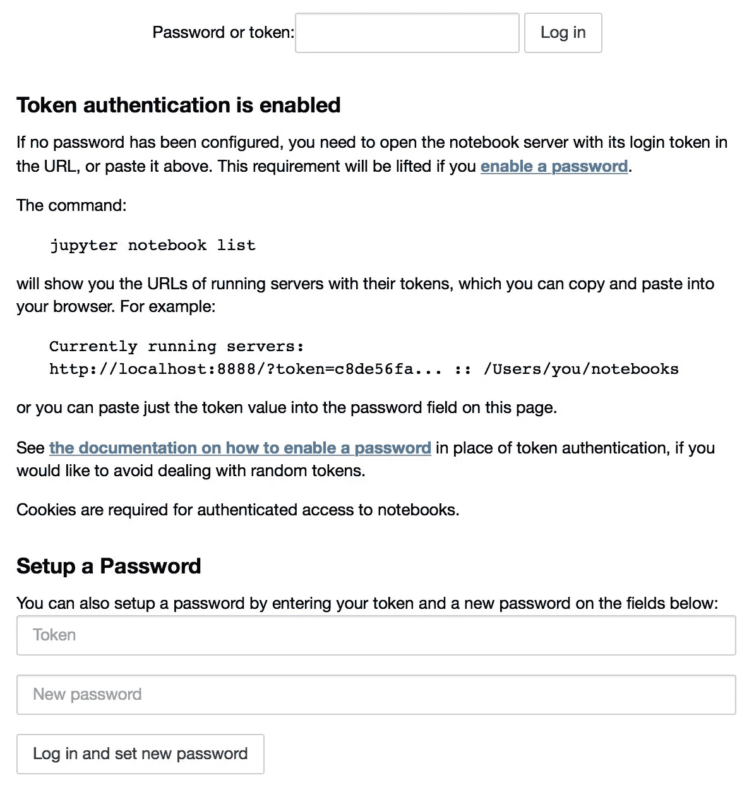

在顶部键入令牌，并选择密码，这样您就不需要每次登录时都复制令牌！你应该做好准备:

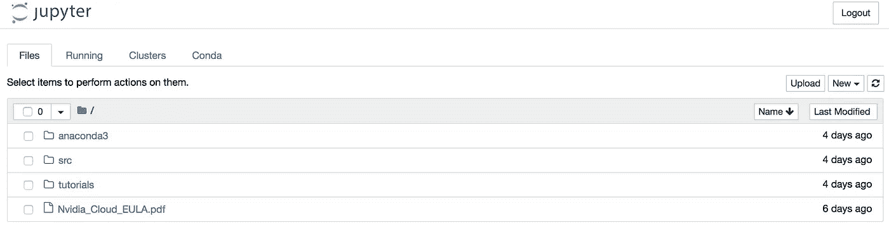

我希望这有所帮助！如果您遇到任何独特的问题，请告诉我，因为平台在不断变化。一定要在 [Twitter](https://twitter.com/ultimetis) 和 [LinkedIn](https://www.linkedin.com/in/jbalaban/) 上联系我！