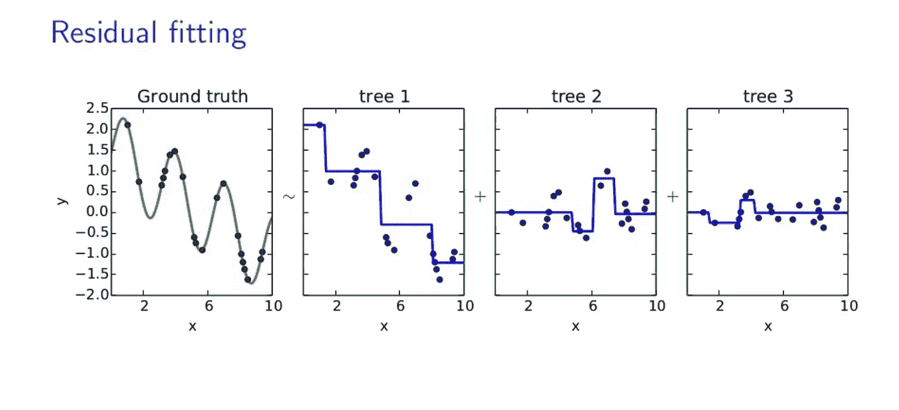
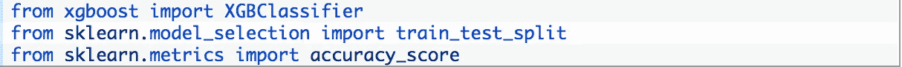
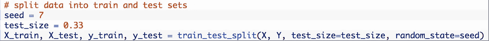
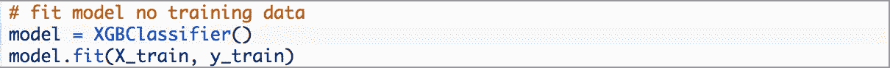
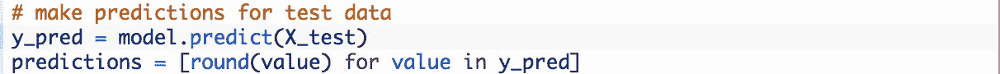
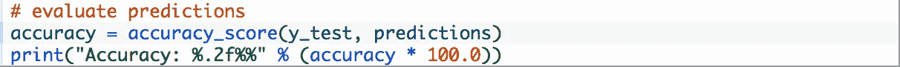

# 机器学习中的 Boosting 及 XGBoost 在 Python 中的实现

> 原文：<https://towardsdatascience.com/boosting-in-machine-learning-and-the-implementation-of-xgboost-in-python-fb5365e9f2a0?source=collection_archive---------1----------------------->

作为我上一篇概述合奏方法的文章 的延伸，这篇博客将深入推进和它所需要的一切。在其最简单的形式中，Boosting 是一种集成策略，它连续地建立在弱学习者的基础上，以便生成一个最终的强学习者。弱学习者是一个可能不是非常准确或者可能没有考虑许多预测因素的模型。通过建立弱模型，得出关于各种特征重要性和参数的结论，然后使用这些结论来建立新的、更强的模型，Boosting 可以有效地将弱学习者转换为强学习者。Boosting 既可以用于*也可以用于*分类和回归问题。如果这个概念现在仍然模糊不清，当我概述一些类型和例子时，无忧教育将变得更加清晰。

# 增压的类型

1.  AdaBoost ( **Ada** 感受性 **Boost** ing): AdaBoost 使用决策树桩作为弱学习器。决策树桩是只在一个层次上分裂的决策树模型，因此最终的预测只基于一个特征。当 AdaBoost 进行第一次决策时，所有的观察值被平均加权。为了纠正先前的错误，当移动到第二个决策树桩时，被错误分类的观测值现在比被正确分类的观测值具有更大的权重。AdaBoost 继续这个策略，直到建立了最佳分类模型。以下面的图表为例。

制作好 D1 模型后，观察结果在一个分割线处分开，将蓝色(+)和红色(—)分开。有三个错误归类(+)不在“蓝色”类别中。在制作 D2 时，这些错误分类的(+)现在比任何其他观察都更有分量。因此，D2 调整其“蓝色”分类，纳入所有(+)。连续的模型继续针对前一个模型面临的误差进行调整，直到建立最准确的预测器。

2.**梯度推进:**与所有推进方法类似，梯度推进寻求连续减少每个连续模型的误差，直到产生一个最终模型。给定一组数据观察，梯度提升适合简单的弱学习者来预测结果。然后，根据这个弱模型，绘制损失函数。我们可以在机器学习中使用各种损失函数，但每个损失函数的最终目标都是减少错误。接下来，将两个图(原始数据图和损失函数)结合起来，形成一个更强的预测值。在每一步之后，我们的预测值的总和变得越来越强。重复该过程，直到建立最终预测器。以下面的图表为例。“地面实况”绘制了一组数据，其中一条线贯穿每个点。

“树 1”是数据的最佳拟合线。“树 2”是一条曲线，它从“树 1”的图中绘出了误差。这些错误是基于“树 1”如何歪曲了原来的情节(在这种情况下是“地面真相”)。最后，“树 3”是“树 1”和“树 2”的组合。这是一个弱学习者在**梯度推进中的循环。**通过组合一个又一个弱学习者，我们的最终模型能够解决原始模型的大量误差，并随着时间的推移减少这种误差。

**渐变提升**得名于**渐变**下降。给定预定的损失函数，利用梯度下降来寻找最小化该损失函数的参数。最初，梯度下降使用一些参数来查看沿着损失函数的每个点，并找到该点的负导数。随着梯度下降沿着损失函数继续，它不断地调整参数，直到找到最小点。目标是找到损失函数下降最大的最佳参数。这就是梯度增强试图最小化误差的方式。通过连续最小化我们的损失函数(意味着我们连续最小化每个弱学习者的错误量)，我们的模型变得越来越强，直到找到最终的预测器。

# XGBoosting

在数据科学、机器学习算法和模型构建领域，最终目标是在考虑计算效率的同时构建最强的预测模型。这就是 **XGBoosting** 发挥作用的地方。XG Boost(e**X**treme**G**radient**Boost**ing)是梯度提升对决策树的直接应用。有无数的资源可以深入到 XGBoost 的数学支持和系统功能中，但主要优势如下:

> *1。易于使用*
> 
> *2。计算效率*
> 
> *3。模型精度*
> 
> *4。可行性—易于调整参数和修改目标。*

# **Python 中 XGBoost 的示例代码:**

(假设您已经在终端中运行了“pip install xgboost ”)

> 加载适当的库:

> 假设您有一个数据集，并且已经阐明了您的 X，y 值，需要将数据分成训练/测试集。

> 为 XGBoost 模型定型

> 使用 XGBoost 模型进行预测

