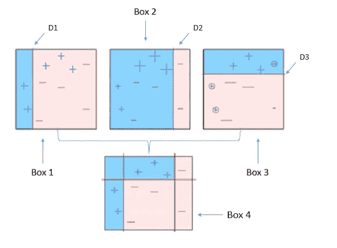

# 提高机器学习模型的准确性

> 原文：<https://towardsdatascience.com/boosting-the-accuracy-of-your-machine-learning-models-f878d6a2d185?source=collection_archive---------0----------------------->

厌倦了机器学习模型的低准确率吗？助推是来帮忙的。 *Boosting 是一种流行的机器学习算法，可以提高你的模型的准确性，*就像赛车手使用 nitrous boost 来提高他们的汽车速度一样。

Boosting 使用基本的机器学习算法来拟合数据。这可以是任何算法，但决策树是最广泛使用的。要知道为什么会这样，请继续阅读。 ***另外，boosting 算法很容易用决策树来解释，这将是本文的重点。*** 它建立在 boosting 之外的方法之上，可以提高决策树的准确性。关于基于树的方法的介绍，请在这里阅读我的另一篇文章**。**

## **拔靴带**

**我想先解释一个重要的基础技术，叫做**引导**。假设我们需要学习一个决策树，根据 100 个输入来预测房子的价格。*考虑到* [*方差*](https://medium.com/towards-data-science/balancing-bias-and-variance-to-control-errors-in-machine-learning-16ced95724db) *的问题，这样的决策树预测准确率会很低。*这意味着，如果我们将训练数据随机分成两部分，并为这两部分安装决策树，我们可能会得到完全不同的结果。我们真正想要的是一个结果，如果重复应用于不同的数据集，它的方差很低。**

> **我们可以使用 Bootstrapping 来提高决策树的预测精度**

1.  **使用替换创建数据集的许多(例如 100 个)随机子样本(意味着我们可以多次选择相同的值)。**
2.  **对每个样本学习(训练)一个决策树。**
3.  **给定新数据集，计算每个子样本的预测。**
4.  **计算我们收集的所有预测的平均值(也称为 bootstrap 估计)，并将其用作我们对数据的估计预测。**

**该程序同样适用于*分类树*。例如，如果我们有 5 个决策树，它们对输入样本进行以下类别预测:蓝色、蓝色、红色、蓝色和红色，我们将选择最频繁的类别并预测蓝色。**

*****用这种方法，树长得很深，不用修剪*** 。 ***因此每一株树都有很高的方差，但偏差很低。对这些树进行平均可以显著降低方差。*****

***Bootstrapping 是一种强大的统计方法，用于从数据样本中估计数量*。数量可以是一种描述性统计，如平均值或标准差。 ***将 Bootstrapping 过程应用于高方差机器学习算法，通常是上例所示的决策树，称为 Bagging(或 bootstrap aggregating)。*****

## ****误差估计****

**估算袋装模型测试误差的简单方法是**袋外误差估算**，无需交叉验证。未用于拟合给定袋装树的观测值称为袋外(OOB)观测值。我们可以简单地预测第 *i* 次观察的反应，使用每一棵树，其中观察是 OOB。我们对这些预测的回答进行平均，或者采取多数投票，这取决于回答是定量的还是定性的。*可以计算总体 OOB MSE(均方误差)或分类误差率。*这是一个可接受的测试误差率，因为预测仅基于不适合使用该观测值的树木。**

## **随机森林**

**决策树渴望最小化成本，这意味着它们利用最强的预测器/分类器来分割分支。*因此，从自举样本中得到的大多数树将在不同的分裂中使用相同的强预测器。这与树相关并导致差异*。**

> **我们可以使用随机森林来提高袋装树的预测精度**

**在分割任何树的分支时，从全部的 *p* 预测值中选择随机抽样的 *m* 个预测值作为分割候选值。然后允许分裂只使用那些 *m* 预测器中的一个。在每一次分裂时，都要对 m 个预测值进行新的采样。您可以尝试不同的值，并使用交叉验证进行调整。**

*   **对于分类，一个好的缺省值是:m = sqrt(p)**
*   **对于回归，一个好的缺省值是:m = p/3**

**因此，平均而言，splits 的(*p*—*m*)/*p*甚至不会考虑强预测器。这被称为 ***去相关*** *树，因为我们使用相同的强预测器来解决每个树的问题。***

> ****如果 *m* = *p* 那么随机森林等于装袋。****

## **特征重要性**

**计算完全长成的树的一个问题是，我们不容易解释结果。也不再清楚哪些变量对这种关系是重要的。*计算变量在每个分割点的误差函数的下降，给我们一个特征重要性的概念*。 ***这意味着我们记录了由于给定预测因子上的分裂而减少的误差总量，对所有袋装树进行平均。较大的值表示重要的预测值。*** 在回归问题中这可能是残差平方和的下降，在分类中这可能是基尼系数。**

## **助推**

> **使用 Boosting 算法可以进一步提高决策树的预测精度。**

**boosting 背后的基本思想是将许多弱学习者转化成一个强学习者。 我们所说的弱学习者是什么意思？**

*****弱学习器*** 是一种学习器，当它试图标记数据时，无论训练数据的分布如何，它总是比机会做得更好。比机会做得更好意味着我们的错误率总是小于 1/2。*这意味着学习算法总是要学习一些东西，并且不会总是完全准确，即，当学习输入和目标之间的关系时，它是弱的和差的。*这也意味着使用单个预测器/分类器形成的规则单独来说并不强大。**

**我们开始在数据集中寻找弱学习者，通过做一些分布并从它们形成小决策树。树的大小是使用它的分裂数来调整的。通常情况下，1 可以很好地工作，其中每棵树都由一个单独的裂口组成。这种树被称为**决策树桩。****

**boosting 采用的另一个参数是迭代次数或树的数量。此外，它会根据输入是否被正确预测/分类来为输入分配权重。让我们看看算法。**

1.  ****首先，用相等的权重初始化输入**。它使用第一个基本学习算法来完成这个任务，这通常是一个决策树桩。这意味着，在第一阶段，它将是一个弱学习者，将适合数据的子样本，并对所有数据进行预测。**
2.  **现在我们做下面的**直到达到树的最大数量**:**

*   **基于以前的运行更新输入的权重，对于错误预测/分类的输入，权重更高**
*   **制定另一个规则(在这种情况下是决策树桩),并使其适合数据的子样本。注意，这个时间规则将通过记住错误分类的输入(具有较高权重的输入)来形成。**
*   **最后，我们使用该规则预测/分类所有输入。**

**3.**迭代完成后，我们将弱规则组合成一个强规则**，然后将其用作我们的模型。**

**借助图表可以更好地解释上述算法。假设我们有 10 个输入观察值，我们想把它们归类为“+”或“-”。**

****

**Image source : Analytics Vidhya**

*   **如上所示，升压算法将从框 1 开始。它为所有输入分配相等的权重(由符号的大小表示),并使用决策树桩 D1 预测蓝色区域的输入为“+”,红色区域的输入为“-”。**
*   **在下一次迭代中，框 2，您可以看到错误分类的加号的权重大于其他输入。所以选择了一个判定难题 D2，这样，这些观察现在被正确地分类了。**
*   **在最后的迭代中，框 3，它具有来自先前运行的 3 个错误分类的否定。因此选择判定树桩 D3 来纠正这种情况。**
*   **最后，输出强学习器或框 3 具有通过组合各个弱决策树桩而形成的强规则。你可以看到我们是如何提高模型的分类能力的。**

**在回归设置中，预测误差(通常使用最小二乘法计算)用于调整输入的权重，因此学习者更关注误差大的输入。**

****这种类型的增强方法被称为自适应增强或 AdaBoost。**与树一样，boosting 方法也将损失函数降至最低。*在 Adaboost 的情况下，是指数损失函数*。**

****boosting 的另一个流行版本是梯度 Boosting 算法**。基本概念保持不变，*除了这里我们不玩权重，但是* ***拟合残差*** (预测和原始结果的差异的度量)而不是原始结果上的模型。这意味着新的弱学习器是在牢记具有高残差的输入的情况下形成的。**

**在这两种算法中，调谐参数***λ*或*收缩*** 通过允许更多不同形状的树攻击残差来进一步减慢过程。这也被称为**学习率**，因为它控制每棵树对模型贡献的大小。如你所见， ***Boosting 也不涉及*** 的自举，取而代之的是每棵树都适合原始数据的一个修改版本。而不是拟合单个大型决策树，这导致难以拟合数据，并可能过度拟合。 ***助推法学习慢。*****

**正如你所看到的，这个算法用决策树解释得很清楚，但是还有其他的原因，它主要用在树上。**

1.  *****决策树是非线性的。用线性模型来提升根本就不能很好地工作。*****
2.  *****弱学习者需要始终如一地胜过随机猜测。您通常不需要对决策树进行任何参数调整来获得该行为。*** 比如训练一只 SVM，确实需要参数搜索。由于数据在每次迭代中被重新加权，所以您可能需要在每次迭代中进行另一次参数搜索。所以你要大幅度增加你的工作量。**
3.  **决策树的训练速度相当快。 因为我们要建造 100 或 1000 座这样的房子，这是一笔不错的资产。它们的分类速度也很快，当您需要运行 100 个或 1000 个来输出您的决策时，这也很重要。**
4.  **通过改变深度 ***你可以简单容易地控制偏差/方差的权衡，*** 知道增强可以减少偏差，但也可以显著减少方差。**

**这是对 boosting 的一个极其简化(可能很天真)的解释，但会帮助您理解非常基础的东西。实现这个算法的一个流行库是 **Scikit-Learn** 。它有一个很棒的 api，只需几行 python 代码就能让你的模型运行起来。**

**如果你喜欢这篇文章，一定要点击下面的❤来推荐它，如果你有任何问题，**留下评论**，我会尽力回答。**

**我很快会写更多关于如何实现不同的升压算法。所以，为了更加了解机器学习的世界，**跟我来**。这是最好的办法，等我多写点这样的文章就知道了。**

**也可以在 **Twitter 关注我在**[**@ pra shant _ 1722**](https://twitter.com/Prashant_1722)， [**直接发邮件给我**](mailto:pr.span24@gmail.com) 或者 [**在 linkedin**](https://www.linkedin.com/in/prashantgupta17/) 上找我。我很乐意收到你的来信。**

**乡亲们，祝你们有美好的一天:)**