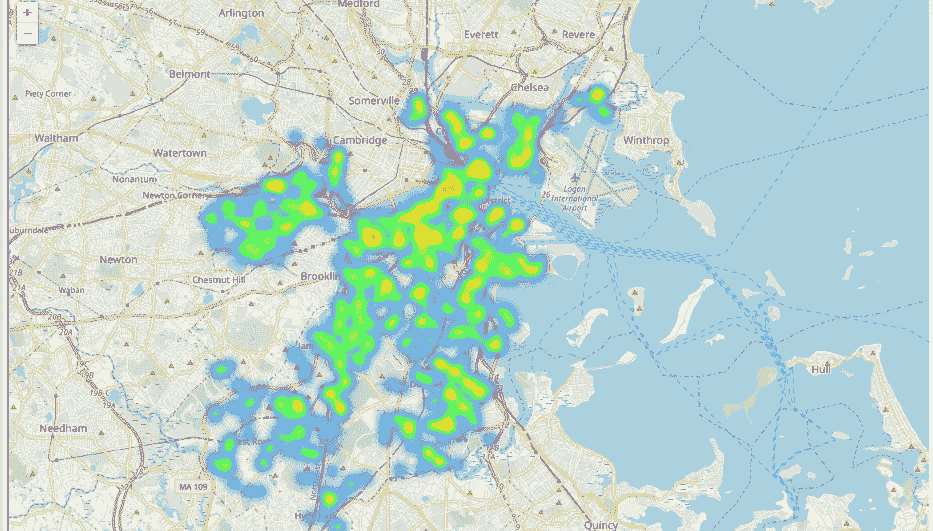
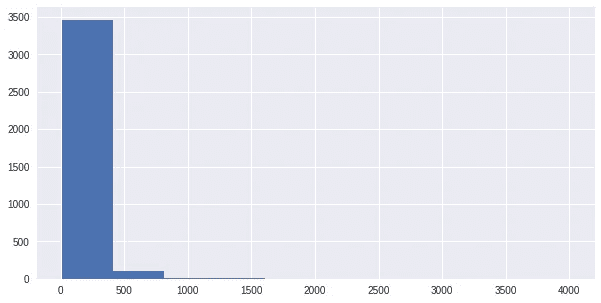
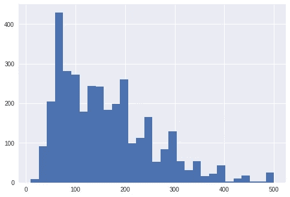
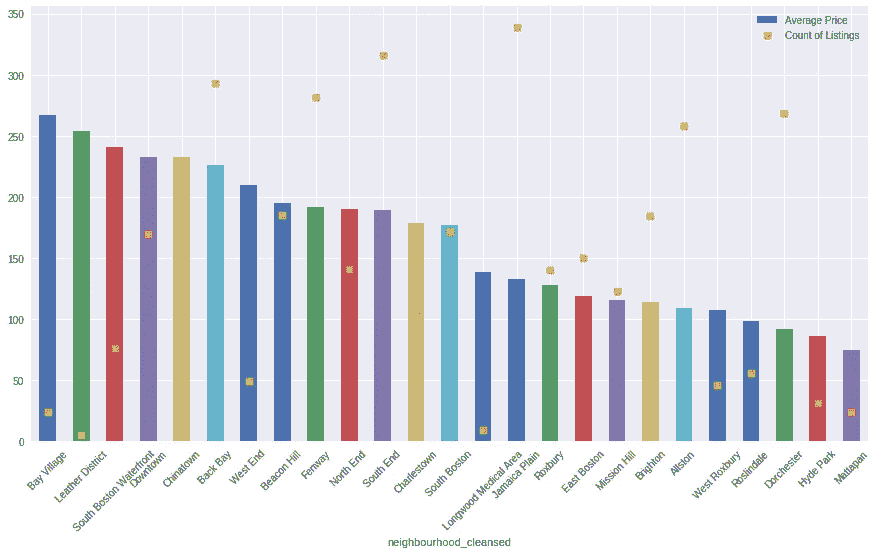
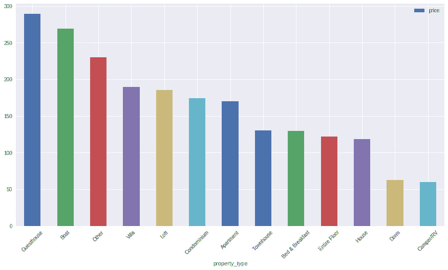
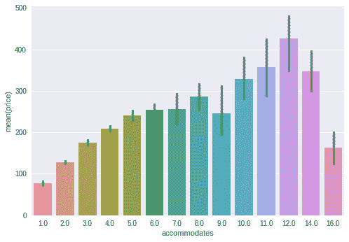
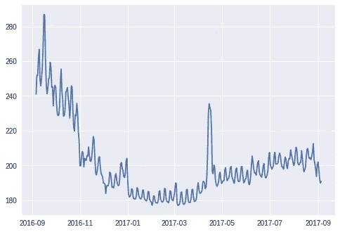
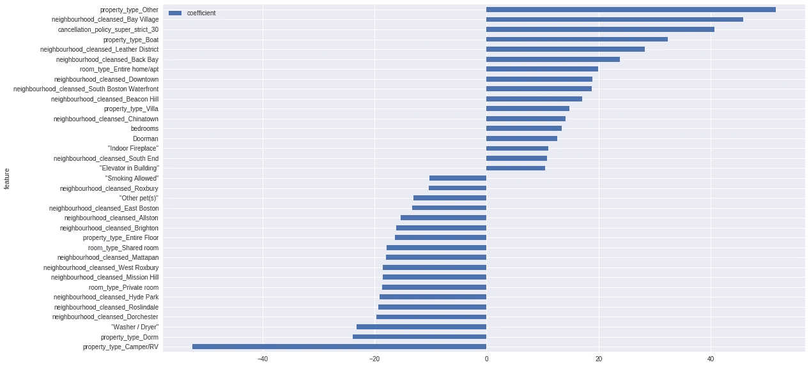

# 波士顿 Airbnb 分析

> 原文：<https://towardsdatascience.com/boston-airbnb-analysis-e7034c377c4a?source=collection_archive---------7----------------------->

## 波士顿不仅仅是 chowdah 和 Marky Mark:Airbnb 定价的权威指南。



Heat Map of Boston airbnb properties Sep 16-Sep 17

自 2009 年以来，Airbnb 一直在世界各地让人们进入陌生人的家中。波士顿也不例外，因为 Airbnb 上有成千上万的房产出租。列表包括照片、描述和关键特征，如位置和便利设施。对于旅行者来说，Airbnb 提供了一些家的舒适，同时比传统的酒店选择更省钱。对于业主来说，这项服务将未充分利用的资产货币化，并允许他们欢迎人们来到他们生活和热爱的城市。与其他在线服务一样，评论是对好房东的制衡，而背景调查则确保房东可以信任他们的房客。

张贴引人注目的物业需要一些工作来展示和准确描述物业，最重要的是，选择一个合适的价格，让业主既提高物业利用率又增加利润。下面的帖子帮助业主确定什么因素影响价格。

为了支持这一分析，我访问了 2016 年 9 月至 2017 年 9 月的数据集，其中包括超过 3000 个房产列表、评论和时间线。我需要回答几个问题，以确保我完全能够推荐一个定价模型。

# 业务问题:

1.  波士顿哪些小区租房价格最高？
2.  一年中什么时候租金最高？
3.  影响波士顿 Airbnb 租赁价格的主要因素是什么？

# 数据准备:

这些数据需要几个清理步骤。首先，我想确保我只有一个因变量(价格)，所以我删除了每周和每月的价格以及保证金。我必须清理几列中的值:价格有一个美元符号($)和逗号(，)。我去掉了这些，所以数据可以转换成整数。其他列的数据类型也需要更改，以便可以在计算中使用。价格、卧室、浴室、床和住宿的数量必须改为整数值。

接下来，我想了解底层数据，找出任何可能影响我的模型准确性的异常值。



This histogram indicates that most prices were between $0-$500, so anything over $500 may be considered an outlier.

我根据这个直方图确定大多数价格在 0 美元到 500 美元之间，因此任何超过 500 美元的价格都可能被认为是异常值。我减少了数据集，只包括低于 500 美元的价格。您可以在结果直方图中看到下面的新值:



使用这些数据，我进行了一些初步的探索性数据分析。这里是我开始确定我的第一个问题的答案的地方:

```
1\. Which neighborhoods in Boston have the highest rental prices?
```



Average Price and Number of Properties by Neighborhood

你可以看到海湾村，皮革区和南波士顿海滨物业吸引了最高的租金。我还画出了这些街区出租房产的数量。价格最高的社区在 Airbnb 上可供出租的房产似乎也较少。这可能是原因，也可能是结果。这些邻域的成本更高是因为选项更少，还是因为选项太少而无法得出这些邻域更昂贵的结论(即，这些邻域是离群值)？也许建模会帮助我回答这些问题，所以我坚持下去。

虽然这不是一个原始的问题，但我也想看看房地产的类型是否会影响定价。



房产类型的价格也各不相同，如下图所示，宾馆和游艇类房产价格最高。最低的价格是租一辆露营车或一间宿舍(想想我看过的一些宿舍——恶心！).

另一个快速检查是定价如何受到列表容纳的人数的影响。作为一个家里有 5 口人的人，我总是发现 4 人的酒店房间是合理的，但是如果你告诉他们你需要 5 人的空间，价格就会飙升，或者你需要租第二个房间！让我们看看 Airbnb 房源是什么样的。



Prices increase linearly until 9 people.

你可以在这里看到，价格直线上升，直到 9 人。如果我的五口之家预订 Airbnb 租赁，我们只需支付比四口之家略高的费用——这是这项服务的另一个关键优势。

我的第二个问题是

```
2\. What time of year has the highest rental prices?
```

这个时间序列图提供了一个容易看到的趋势，即 2017 年的价格从 2016 年开始下降，并在 4 月波士顿马拉松比赛期间飙升。



Boston Airbnb rental prices from Sep 16 — Sep 17 by day

在我开始建模之前，最后一件事:一张地图！

我承认我对波士顿了解不多(除了前面提到的万人迷 Marky Mark)，所以我想想象一下附近的街区和这些房产的位置。所以我使用了叶包([https://pypi.org/project/folium/](https://pypi.org/project/folium/))来创建一个地图。


Average Rental Price by Day Sep 2016 — Sep 2017

# 为建模准备数据:

我必须采取几个步骤来清理建模数据。

首先，我对分类变量进行了编码，并将包含所有便利设施的便利设施列转换为单独的列。这增加了列的数量，使得数据框相当稀疏。然后我检查了整个数据集中的空值。

有几列包含大量空数据，所以这些列(平方英尺和评论列)被删除了。虽然我认为在模型中包含评论数据会有所帮助，但超过 700 个列表没有评论，所以我可能希望在单独的分析中只查看那些有评论的列表。具有一些空值的其他列(浴室数量、卧室数量和床位数量)具有从平均值估算的值。考虑到少量的缺失值，这种方法似乎是合理的。如果这些列有更多的缺失数据，有更高级的方法来估算这些指标。

# 建模

开发该模型是为了了解波士顿 Airbnb 租赁价格的驱动因素。我尝试了三种不同的回归模型。我从一个基本的线性模型开始。首先，我将数据分成测试/训练数据集，并对数据进行标准化，以确保变量得到正确解释。

除了一个基本的线性回归，我决定使用岭和套索回归模型。这些模型可以很好地处理稀疏数据集，方法是将模型中的维度降低到一个非常低的系数，或者像 Lasso 一样，将维度降低到零。对于这个有数百个变量要评估的数据集，这是一个很好的选择。

# 模型的评估和解释。

岭回归在模型得分和交叉验证方面表现最好。岭模型最小化了不相关特征的系数值及其对训练模型的影响。

作为一个对 Airbnb 上的租赁物业定价感兴趣的人，了解定价中的关键因素很重要。如果您已经有一个属性，那么有些方面是无法更改的(例如位置和属性类型)。但是，该模型的输出可以用来对您可能影响的其他因素提出建议。

这个模型帮助我回答了第三个问题——如何最大化租金收入。我使用前面提到的模型来确定最重要的系数是什么。在这种情况下，查看大的正系数和最大的负系数非常重要。



Most positively and negatively correlated features for model.

有几个因素与价格密切相关，如位置、房产类型和取消政策(注意，我推断严格的政策是溢价上市价格的结果，而不是原因！)

该模型证实了我们在上面看到的数据，海湾村、皮革区和后湾社区是最贵的。此外,“其他”、船只和整个住宅/公寓等物业类型也属于高级物业。

另一方面，有几个变量与价格负相关。这些变量包括露营车/房车、宿舍和私人房间的财产类型。价格较低的街区包括海德公园、罗斯林代尔和多切斯特。

探索性分析支持这些发现，而模型的系数为我们提供了一种方法来确定这些变量对价格的影响。

概括一下，我去了解了波士顿 Airbnb 租赁公司的一些情况:

```
1\. Which neighborhoods in Boston have the highest rental prices?
I found that Bay Village, Leather District, South Boston Waterfront have the highest prices.2\. What time of year has the highest rental prices?
After the end of 2016, prices dropped. There was a spike in April, the weekend of the Boston Marathon.3\. How can we maximize our rental revenue?  What are the major factors that influence the price of an Airbnb rental in Boston?
Unfortunately, most of the factors cannot really be manipulated by the owner. The neighborhood and the property type have the greatest impact on the pricing. Buying the right property in the right location provides the most pricing power.
```

有了上面的分析，为波士顿的 Airbnb 房源定价应该会简单得多，这种分析也可能对其他市场有用。