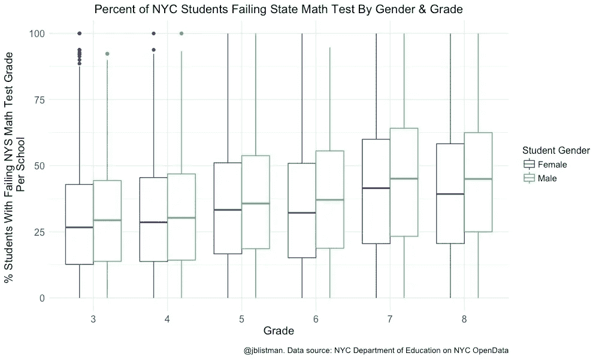
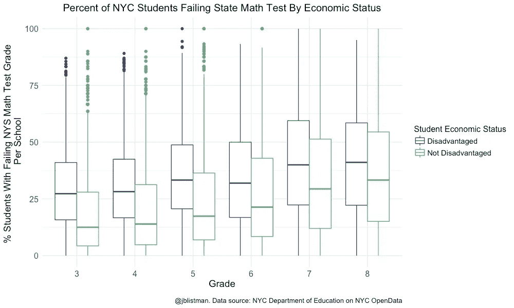
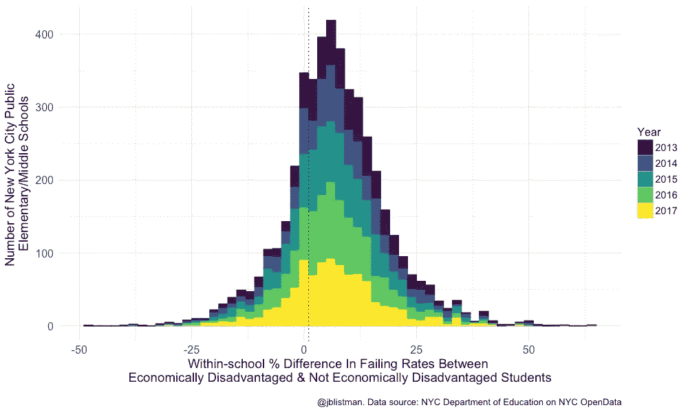

# 男孩&纽约市低收入家庭的学生比他们的同龄人更有可能通不过州数学考试

> 原文：<https://towardsdatascience.com/boys-low-income-students-in-nyc-more-likely-than-their-peers-to-fail-state-math-tests-3dd40798ca24?source=collection_archive---------4----------------------->

纽约市教育局监管着全国最大的公立学校系统，为大约[110 万](http://schools.nyc.gov/AboutUs/schools/data/stats/default.htm)学生服务，运营预算略高于[240 亿美元](http://schools.nyc.gov/AboutUs/funding/overview/default.htm)(带 B)。像纽约州的其他学校系统一样，纽约市对 3 至 8 年级的学生进行年度测试，分别评估英语语言艺术和数学的共同核心学习标准的熟练程度。

最近，纽约市能源部在纽约市的 [OpenData 网站](https://opendata.cityofnewyork.us)上增加了 2013-2017 年 3-8 年级的纽约州数学和英语考试成绩。每个学校的每个年级都有年度总分，按性别和经济状况等人口统计数据进行划分。学生可以选择退出州测试，纽约州是选择退出运动的领导者，尽管纽约市的选择退出率远低于该州的平均水平。

我制作了一些数据可视化，显示了:

> 在州数学考试中，成绩低于标准的学生比例随着年级的增长而增加。
> 
> 在每个年级中，男生比女生更有可能在数学方面不如女生。
> 
> **在每个年级中，经济困难的学生比非困难学生更有可能在数学方面表现不佳。**
> 
> 在一所给定的学校里，经济困难的学生比他们的正常同学更有可能在数学方面不如人意。

州测试分为 1 到 4 级，1 级是最低的。纽约州教育部门将 1 级定义为“学生在这个级别的表现远低于他们年级的标准。他们表现出纽约州 P-12 共同核心数学学习标准所体现的有限的知识、技能和实践，被认为不足以满足该年级的期望。”2 级定义为部分熟练，3 级定义为熟练，4 级定义为超过足够熟练。这里所有的可视化描述了在纽约州数学考试中获得 1 分的学生的分布。

上面的方框图显示了 2013-2017 年期间，每所学校在纽约州数学考试中获得 1 分(低于熟练水平)的学生百分比分布，分别针对 3 至 8 年级的男生和女生。对于大多数学校来说，得分低于熟练的女生(紫色)的百分比低于男生(绿色)的百分比。下面的方框图是基于学生经济状况的类似数据总结:弱势与非弱势。对于大多数学校来说，得分低于标准的弱势学生(紫色)的百分比高于非弱势学生(绿色)的百分比。在方框图中，每个方框内的水平线标记一组数据点的中间值。中位数不同于平均值，因为它描述了一组值的中点；一半的数值高于中间值，一半低于中间值。当数据集呈偏态分布时，中位数通常比平均值更能提供信息。

为了了解不及格率与学校的关系是否比学生的经济状况更大，我绘制了一张 3-8 年级经济困难和非困难学生不及格率的校内差异直方图。在下面的直方图中，X 轴值(范围从-50 到大约 65)描述了在州数学考试中获得“1”分的学校中经济困难学生的百分比减去相同分数的非困难学生的百分比。正值表示在一所学校内，经济弱势学生比非弱势学生更容易失败。负值表示相反的情况。大部分学校落在垂直虚线右侧“0”处；在纽约市的大多数学校里，经济困难的学生比他们正常的同学更有可能在州数学考试中失败。

纽约市独立预算办公室对 2009-2010 年数据的分析显示，州测试(T2)的分数与学生家庭的经济状况和他们同学的平均经济状况都有关联。之前的[总结](https://www.politico.com/states/new-york/albany/story/2014/09/mapping-poverty-and-test-scores-in-new-york-state-016124\)显示，不仅仅是纽约市，整个纽约州的家庭收入和数学考试成绩之间也有类似的相关性。纽约市教育部根据学生是否有资格享受减价或免费餐来决定学生的经济状况，而这又是由家庭收入决定的。

这些分析中使用的测试分数来自 2013 年及以后，因为 2013 年之前的分数不具有可比性。在 2013 年纽约州引入共同核心标准后，考试分数[直线下降](http://www.businessinsider.com/nys-test-plummet-standards-2013-8)，然后反弹。然而，由于州考试的年度变化，甚至 2013 年和 2017 年考试成绩的可比性也受到了质疑。从 2018 年起，纽约州将把数学和英语考试从三天缩短到两天，这将使与往年的比较变得困难。选择退出与不退出的学生的人口统计数据可能会稍微影响这里显示的结果。例如，在 2016 年选择退出的 2.5%的纽约市学生中，经济上处于不利地位的学生与非经济上处于不利地位的学生的比例是多少？

## 感谢您的阅读。

我欢迎建设性的反馈——您可以“鼓掌”表示赞同，或者如果您有具体的回应或问题，请在此给我发消息。我也有兴趣听听你想在未来的帖子中涉及哪些主题。用于数据操作和数据可视化的代码可以在 [my GitHub](https://github.com/JListman/NYC_Math_Test_Scores) 中找到。

**阅读更多关于我的作品**[**【jenny-listman.netlify.com】**](https://jenny-listman.netlify.com)**。欢迎随时通过 Twitter**[**@ jblistman**](https://twitter.com/jblistman)**或**[**LinkedIn**](https://www.linkedin.com/in/jenniferlistman/)**联系我。**

注意事项:

1.  数据集包括 1136 所公立学校的分数(特许学校的数据单独报告)。对于任何类别的学生，如果学生人数少于 6 人，则不会报告考试成绩数据，以保护学生隐私。例如，如果一所学校的三年级在 2014 年有 5 名女生，则不会提供该学校 2014 年三年级女生的平均考试分数。
2.  从[https://data . cityofnewyork . us/Education/2013-2017-School-Math-Results-Gender/x4ai-kstz](https://data.cityofnewyork.us/Education/2013-2017-School-Math-Results-Gender/x4ai-kstz)下载纽约市学校、学生性别和年级的纽约州数学考试成绩数据
3.  按 NYC 学校、学生经济状况、年级划分的纽约州数学考试成绩数据下载自[https://data . cityofnewyork . us/Education/2013-2017-School-Math-Results-Economic/9 vgx-wa3i](https://data.cityofnewyork.us/Education/2013-2017-School-Math-Results-Economic/9vgx-wa3i)
4.  使用 [R](https://www.r-project.org) 中的工具处理和绘制数据。
5.  参见 my [GitHub](https://github.com/JListman/NYC_Math_Test_Scores) 获取用于数据争论&数据可视化的 R 代码。