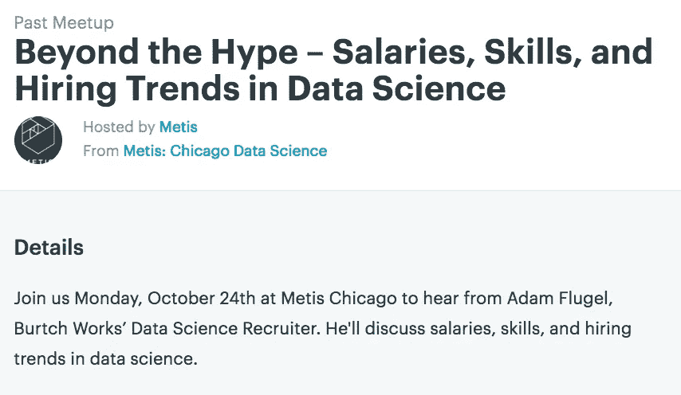
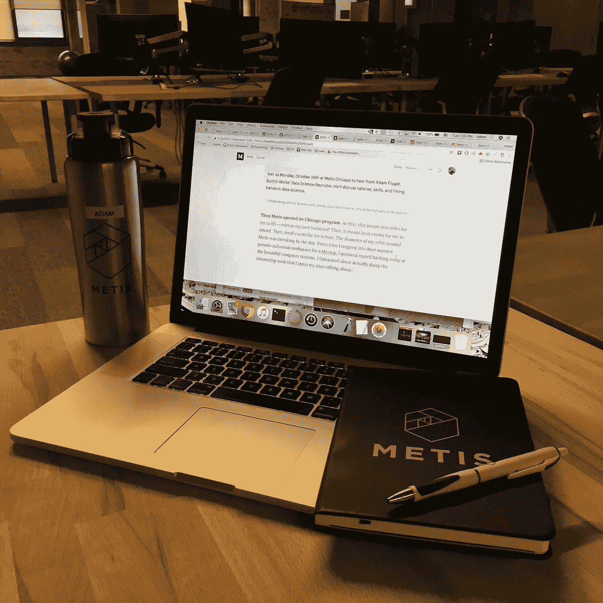

# 突破到另一边

> 原文：<https://towardsdatascience.com/break-on-through-to-the-other-side-89998642826b?source=collection_archive---------4----------------------->

从 2014 年开始我就一直在说数据科学。不断地。好像这是我的工作。

那是因为它是！作为 [Burtch Works](https://www.burtchworks.com/) 的第一个数据科学招聘人员，表面上也是第一批专门针对数据科学的招聘人员之一，[谈论的领域*是*我的工作](https://www.pcworld.com/article/3028002/hoping-to-land-this-years-hottest-job-heres-what-you-need-to-be-a-data-scientist.html)——或者至少是它的很大一部分。

Me (c. 2014) — so innocent and technically unskilled

招聘经理需要弄清楚所有这些“数据科学”的废话是关于什么的，更重要的是，他们将为此付出什么代价。

分析专家需要知道他们实际上是否是数据科学家，并且*甚至* ***更重要的是*** *通过一点谈判，他们可能会让雇主付出什么代价*。

老实说，辅导招聘经理并不是最令人愉快的任务。当然，我这个 22 岁刚从大学毕业的人从向经验丰富的高管发出坚定的指令中得到了一种反常的快感，但在一天结束时，我作为数据科学招聘人员的工作亮点是与数据科学家交谈。每周他们都告诉我一些新的不可思议的强大工具，或者描述一个很容易被误认为是黑镜规范脚本的新项目。

随着我招聘时间的推移，我参加了越来越多的技术聚会和会议。我与候选人的对话变得更长，更深入，也更关注他们工作背后的技术阴谋。
( *注意:对于招聘人员来说，这可不是什么好习惯。当时间就是金钱时，深度潜水和真正的理解是对两者的巨大浪费。*)

然而，有一个客户我真的很喜欢和他一起工作: **Metis** ，一个需要我帮忙寻找导师的数据科学训练营。搜索并不容易。他们要求候选人既热爱教学*又热爱*当前行业中最前沿的数据科学职位。尽管寻找很困难，但帮助这家公司有一些令人惊讶的事情:一家真正了解这个领域的公司，一家为有动力的个人提供进入新经济的实用技能的公司。我的老板无法理解一个人不回去读硕士或博士如何成为数据科学家，而 Metis 则提供了一条进入前所未有的新领域的前所未有的道路。

Collaborating with my favorite client, talking about Data Science — one of the highlights of my past life

然后 Metis 开设了它的芝加哥项目。起初，这意味着我要扮演新的角色——我自己后院的角色！然后，这意味着我要参加当地的活动。然后，让我主持当地的活动。我环绕麦提斯的轨道直径一天比一天小。每次我走进他们巨大的伪工业工作区开会时，我都会想象自己在漂亮的计算机工作站上不停地工作。我幻想着*真的在做*我花了几天时间谈论的有趣的工作。

…

***快进*** 。我现在写这篇博客是作为芝加哥 2018 年冬季 Metis 训练营的一部分。我刚开始第二周。我已经几个月没有发邮件或者和招聘经理讨价还价了。

我现在开始了我计划了多年的旅程，这个博客将是一个旅行日志。一个合适的*在那里，再黑一次*。现在我只需要找到咕鲁并偷出一个算法来统治他们。

My fantasy come true, in all of its stunning beauty