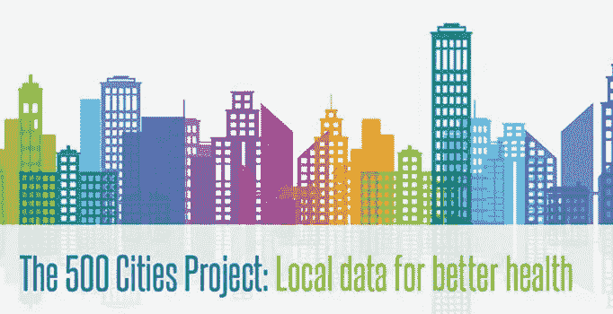

# 分解 CDC 的“500 个城市”健康指标数据集(包括代码)

> 原文：<https://towardsdatascience.com/breaking-down-the-cdcs-500-cities-health-metrics-data-set-code-included-625ed534088e?source=collection_archive---------21----------------------->

[疾病预防控制中心的“500 个城市”数据集](https://chronicdata.cdc.gov/500-Cities/500-Cities-Local-Data-for-Better-Health-2017-relea/6vp6-wxuq)包含了美国 500 个最大城市超过 28，000 个不同人口普查区域的各种健康指标。这是一个令人敬畏的数据集，因为它包含了大量的地点，也因为它包含了每个非常具体的地点的大量详细的结构化数据。在这篇文章中，我会给你一些关于如何重新格式化“500 个城市”的建议，让它更有用。



像许多数据集一样，“500 个城市”将需要我们做一些工作，使其成为可用的格式。首先要注意的是，数据集大约有 800，000 多行，因为 28，000 多个人口普查区域中的*每个*都有一行用于收集 20 多个指标中的*每个*，包含这些人口普查区域的 500 个城市中的*每个*都有一行用于收集同样 20 多个指标中的*每个*的平均值。我不确定 CDC 为什么决定以这种格式发布数据，但有一种快速的方法可以清理数据，使其可用于各种项目和实验。下面是几个例子。

**更改数据帧格式**

正如我上面提到的，数据集的实际布局并不理想。组织数据框的一种更直观的方式是将 28，000 多个人口普查区中的每一个表示为单独的一行，并在该行中为每个健康测量值设置单独的一列。以这种方式组织需要几个步骤:

阅读《和熊猫在一起:`500_cities_data = pd.read_csv("./<your file path")`中的“500 个城市”数据

屏蔽数据框以隔离城市级数据或人口普查区级数据。如果您的目标是人口普查级别的数据，您的代码应该是:

```
census_data = 500_cities_data[500_cities_data["GeographicLevel"] == "Census Tract"] 
```

如果您查看`census_data`(我们在步骤 1 中创建的新数据框架)的列，您会看到一个标记为“Measure”的列查看带有`census_data["Measure"].value_counts()`的那一列中的唯一值，您将看到收集的所有健康指标(例如，“18 岁以上成年人中的慢性肾病”)。请注意，每个测量值有 28，004 个，数据集中表示的每个普查区域一个。

创建一个感兴趣的所有健康指标的列表，确保它们在上面的 value_counts 中的拼写正确，如下所示

```
measures_of_interest = [“Chronic kidney disease among adults aged >=18 Years",”No leisure-time physical activity among adults aged >=18 Years", ... , ...]
```

我们将为列表`measures_of_interest`中的每个测量制作一个数据帧。一个快速的方法是从列表理解开始，制作一个数据帧列表，如下所示:

```
data_frame_list = census_data[census_data[“Measure”] == x] for x in measures_of_interest] 
```

如果您查看`data_frame_list` ( `data_frame_list[0]`)中的第一个数据帧，您将看到一个包含您的`measures_of_interest`列表中第一个健康指标数据的数据帧，每个人口普查区域占一行。

下一步是循环通过`data_frame_list`并提取每个普查区域的实际值。有几种方法可以做到这一点，但是我使用了一个 for 循环来提取列表中每个数据帧的`Data_Value`列，以及我想要保留用于分析的其他各种列。确保保留`UniqueID`列；我们需要重置每个数据帧的索引(原文如此),以适当地循环，保持`UniqueID`将允许我们正确地合并我们的数据。我们还可以使用`UniqueID`来使我们的健康数据与其他数据框架兼容，我将在本文稍后介绍。我还建议保留`GeoLocation`列，因为我们稍后可以用它来生成纬度和经度。

为了提取信息，我们将创建一个空列表，我们可以用新的数据帧填充它，并循环通过`data_frame_list`来提取我们想要的信息。将您想要从`data_frame_list`内的数据帧中提取的任何更多列作为键/值对添加到`temp_df`行，其中键是列名，值是列本身:

```
metric_dfs = []
for df in data_frame_list:
    df.reset_index(inplace=True, drop=True)
    temp_df = pd.DataFrame({df.MeasureId[0]:df.Data_Value,                
              "UniqueID":df.UniqueID, "GeoLocation":df.GeoLocation, 
               "state":df.StateAbbr, "population":df.PopulationCount, ... })
    metric_dfs.append(temp_df)
```

我们在`metric_dfs`中的数据帧现在是一种直观的格式！现在让我们制作一个`master`数据框架，使用`UniqueID`作为我们连接`metric_dfs`的列。首先实例化`master`数据帧，如下所示:

```
master = pd.merge(left = metrics_dfs[0], right = metrics_df[1],
                  how = 'left', on = 'UniqueID')
```

我们可以使用 for 循环将`metrics_dfs`中剩余的数据帧与`master`合并:

```
for i in metric_dfs[2:]:
    master = master.merge(i, how = "left",on="GeoLocation")
```

最后一步是从`metric_dfs`中的数据帧中删除重复的列。为此，只需像这样重新分配`master`(在下面的代码块中，我们用`.T`转置数据帧，删除重复的列，然后将数据帧转置回其原始配置):

```
master = master.T.drop_duplicates().T
```

现在，您已经有了一个格式正确的“500 个城市”数据集可以使用了！您仍然可以删除或创建大量的列，但是我让您按照自己的意愿去做。如果您想从数据中获得更多信息，请继续阅读！

**使用正则表达式提取纬度和经度**

我建议在创建纬度和经度之前清理您的数据，但是您可以在过程**的任何步骤中这样做，只要您保留了** `**GeoLocation**` **列**。`GeoLocation`这个数据帧中的值实际上是填充在一个字符串中的人口普查区域的纬度和经度，但是我们可以使用 RegEx 通过以下步骤将它们提取出来:

进口 RegEx: `import regex as re`。如果您还没有，请使用`!pip install regex`。

接下来我们将使用 RegEx 的`.findall()`函数来定位纬度和经度。如果你不熟悉正则表达式，我强烈推荐 [RegEx101](https://regex101.com/) 来掌握窍门或者为你的给定任务开发正确的正则表达式模式。下面两行使用列表理解和特定的正则表达式模式来提取纬度和经度，并将它们转换为`float64`对象，并将新列添加到我们的 DataFrame 中:

```
master['Latitude'] = [float(re.findall("(\d+.\d+),", master.GeoLocation[i])[0]) for i in master.index]master['Longitude'] = [float(re.findall("-\d+.\d+", master.GeoLocation[i])[0]) for i in master.index]
```

您的数据现在有明确的纬度和经度数据！您可以将这些数据用于地图绘制或任何需要纬度和经度列的事情。

**从唯一 ID 创建 5 位 FIPS 代码**

对我们的数据帧的一个快速但有用的修改是拉出五位数的 FIPS 码(注意:有几种不同的 FIPS 格式；五位数格式指定了州和县)，这将允许我们将“500 个城市”数据与其他外部数据集适当地结合起来。我们的`UniqueID`列实际上是一个长格式的 FIPS 代码，其中前两位指定州，第三、第四和第五位指定县。提取前五个数字，并创建一个新的`FIPS5`列，其列表理解如下:

```
master['FIPS5'] = [x[0:5] for x in master.UniqueID]
```

现在让我们把这些新的 FIPS 代码工作！

**结合“500 城”与收入数据**

让我们把健康数据和收入数据结合起来。维基百科上有一个很棒的表格([这里是](https://en.wikipedia.org/wiki/List_of_United_States_counties_by_per_capita_income))包含了美国每个县的收入数据。如果你知道怎么刮，那就去刮吧！如果你是这类事情的新手，去 [Wiki 表格转换器](http://wikitable2csv.ggor.de/)，粘贴 Wikipedia 页面链接，下载 csv。无论你选择哪条路线，用熊猫读取数据:`us_income_data = pd.read_csv('./<your file name>')`

如果你查看维基百科表格中的数据，我们有县和州名，但没有 FIPS 代码。幸运的是，我们可以使用一个名为`addfips`的库来添加它们！安装库，并导入`addfips`。我们可以使用`.get_county_fips()`函数获得五位数的 FIPS 代码，只要我们指定县和州名。下面是如何对它进行编码(注意，在指定县和州时，我使用“f-strings”来创建动态字符串):

```
fips_codes = []
index = 0
for i in range(us_county_income.shape[0]):
    af = addfips.AddFIPS()
    fip = af.get_county_fips(county = f"{us_county_income['County-equivalent'][i]}",
                             state = f"{us_county_income['State'][i]}")
    fips_codes.append(fip)us_county_income['FIPS5'] = fips_codes
```

现在，我们的`master`健康数据框架和`us_county_income`数据框架上都有了我们的`FIPS5`栏目。像这样结合两者:

```
health_and_income_df = pd.merge(master, us_county_income,how = 'left', on = 'FIPS5')
```

希望这有助于你将“500 个城市”的数据转换成更有用的格式，我很高兴听到你用它做了什么！如果您有任何问题，请联系我们，或者分享您使用这些数据创建的东西！