# 乳腺癌细胞类型分类器

> 原文：<https://towardsdatascience.com/breast-cancer-cell-type-classifier-ace4e82f9a79?source=collection_archive---------7----------------------->

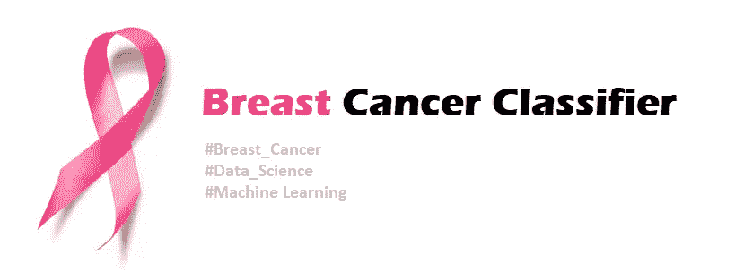

在参加了许多数据科学和机器学习的在线课程后，现在是我着手一些项目并扩展我的技能和知识的时候了。除了这门课的实验室，这个项目将是我的第一个项目。其目的是在癌细胞特征数据集上训练分类器模型，以预测细胞是 B =良性还是 M =恶性。

该数据集由威斯康星大学创建，具有 569 个实例(行-样本)和 32 个属性(特征-列)。有关数据来源的更多信息，请访问 UCI 网站([点击此处](https://archive.ics.uci.edu/ml/datasets/Breast+Cancer+Wisconsin+%28Diagnostic%29))。然而，作为第一步，解释什么是属性信息以及它们是如何计算的是很重要的。

在本文中，我将带您经历分析数据、构建模型并最终评估它的步骤。一些读者可能对编码部分不感兴趣，所以他们可以跳过它，享受数据分析、可视化和评估部分。

# 步骤 1 —数据集信息和理解

如 UCI 网站所述，“特征是从乳腺肿块的细针抽吸(FNA)的数字化图像中计算出来的。它们描述了图像中出现的细胞核的特征”。此外，FNA 是一种活检程序，在 CT 扫描或超声监视器的引导下，将一根非常细的针插入异常组织或细胞区域(图 1)。然后将收集到的样本转移给病理学家，在显微镜下进行研究，并检查活检中的细胞是否正常。

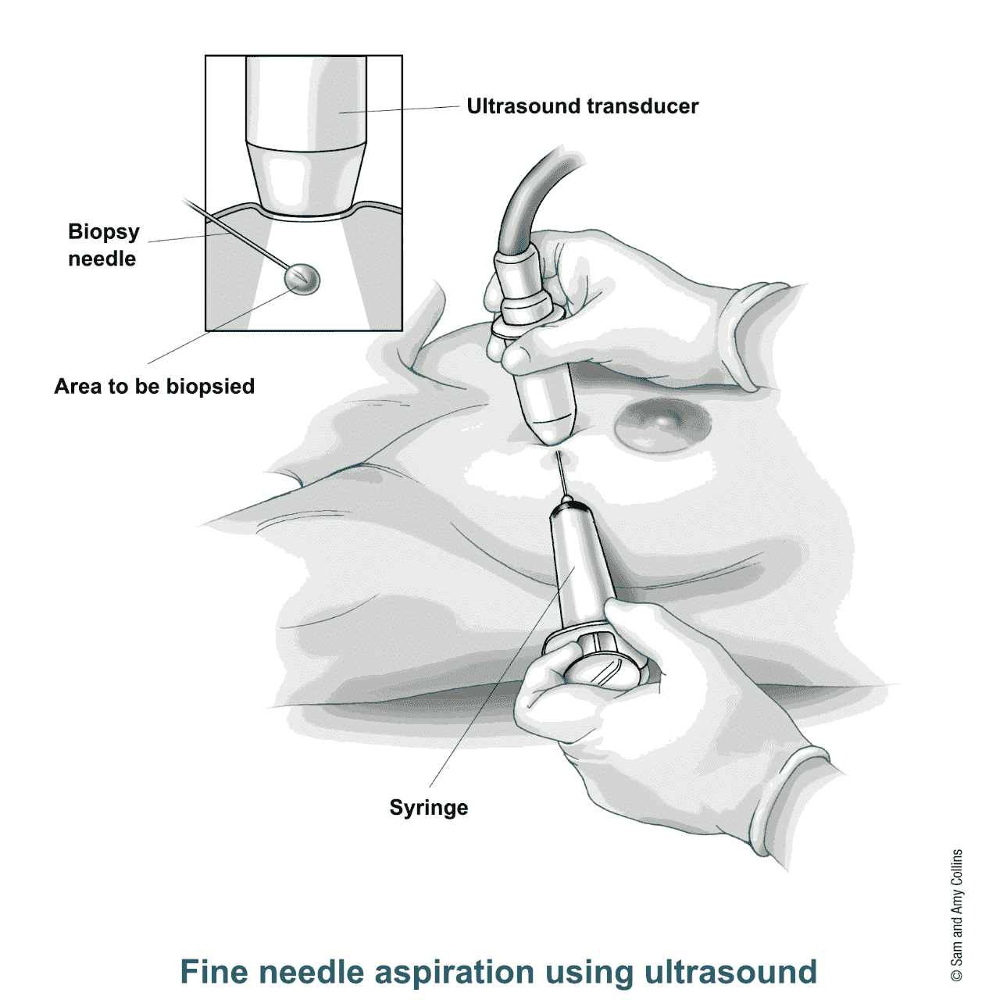

figure 1

数据集属性信息:

1)身份证号码

2)诊断(M =恶性，B =良性)

3–32)

为每个细胞核计算十个实值特征:

a)半径(从中心到周边各点的平均距离)

b)纹理(灰度值的标准偏差)

c)周界

d)面积

e)平滑度(半径长度的局部变化)

f)紧密度(周长/面积-1.0)

g)凹度(轮廓凹入部分的严重程度)

h)凹点(轮廓的凹入部分的数量)

I)对称性

j)分形维数(“海岸线近似值”-1)

对每幅图像计算这些特征的平均值、标准误差和“最差”或最大值(三个最大值的平均值)，得到 30 个特征。例如，字段 3 是平均半径，字段 13 是半径 SE，字段 23 是最差半径。”

# 步骤 2 —导入函数

我用的是 ANACODA NAVIGATOR V1.5 和 Jupyter 笔记本环境。在网络环境中，我开始了一个新的 Python 3 笔记本，将其命名为“乳腺癌分类器”，并导入了一些功能:

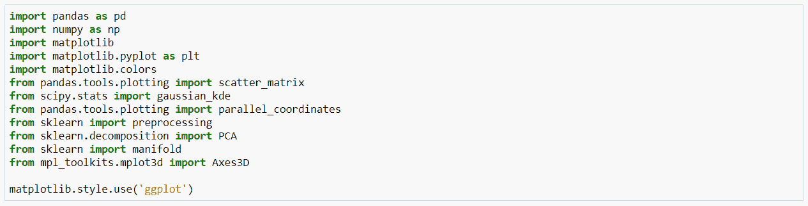

# 步骤 3 —加载数据集

下载并检查 wdbc.data 文件后，我需要将它加载到笔记本中，分配列名并检查前五个示例:

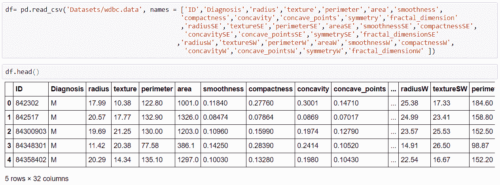

# 第 4 步—数据争论

在这一步中，我删除了每个属性的“ID”列、标准误差和最差值，以检查分类器如何处理主平均值。

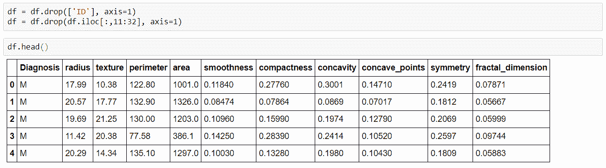

已检查是否有任何要处理的缺失值:

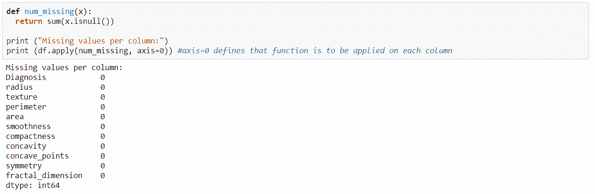

太好了，看起来没有丢失值。当然，我必须确保 na _ 值在加载阶段被识别。接下来，检查数据类型并在需要时进行转换是很重要的。

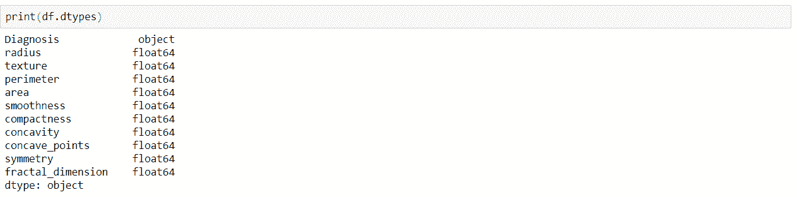

一切都很好，除了标签列“诊断”，我稍后将映射它的信息。

# 步骤 5 —数据探索和可视化

数据集中标签列和视图 B 与 M 比率的条形图(1.7: 1)。

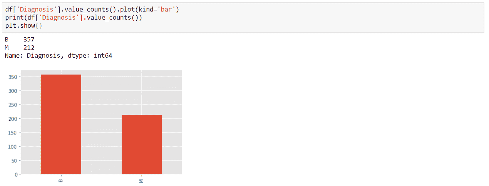

打印描述所有数值数据的功能和检查数据统计的摘要。但是，创建箱线图，检查数据分布，并尝试发现一些细节(如异常值)是一个好主意。

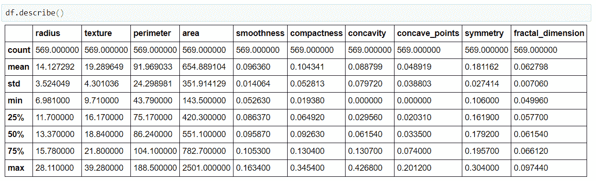

我做了一个 for 循环，为按诊断标签分组的所有数字特征创建单独的箱线图。以下是一些例子:“半径”、“面积”和“凹度”:

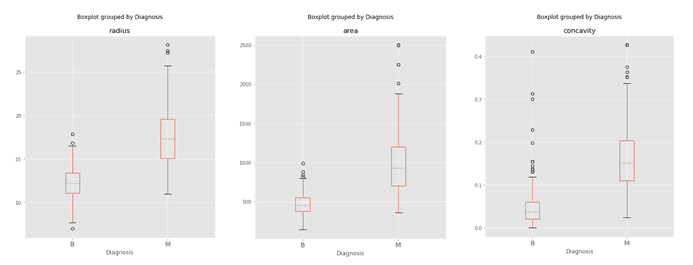

虽然有轻微的重叠，但我们仍然可以注意到大多数良性细胞的半径(面积)比恶性细胞小。凹度也是如此，良性细胞比恶性细胞的凹度小。此外，还有一些潜在的异常值，我们稍后可能需要处理它们。

直方图绘制，直观显示数据频率和总体数据分布的密度图。创建另一个 for 循环来绘制所有特征。以下是“半径”、“面积”和“凹度”特征:

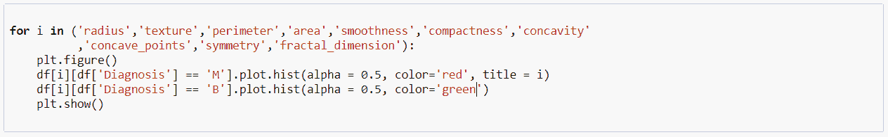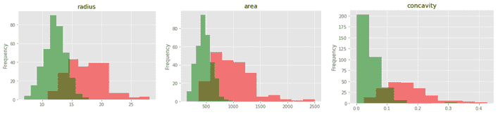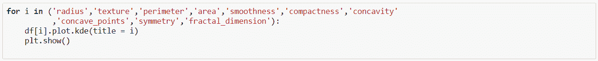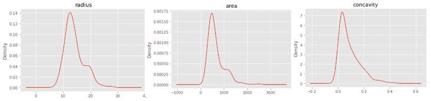

曲线是正峰度和正偏斜的。显然，这是因为恶性细胞的可用数据较少(检查直方图)。半径和面积密度图中的第二个峰值是由于良性和恶性曲线的累积拟合，而不是由于异常值。我们可以将它们分为以下几类:

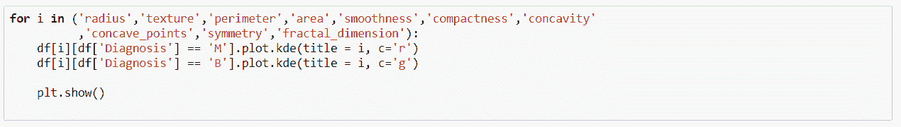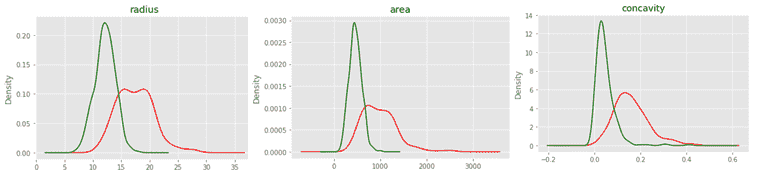

我必须记住，一些分类模型需要数据的正态分布。对于散点图，我喜欢对所有特征运行矩阵函数，这样我就可以理解并收集一些见解。此外，我用不同的颜色标记了两个类。为此，我利用了 seaborn 库的一个强大功能:

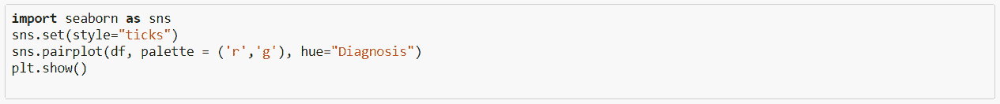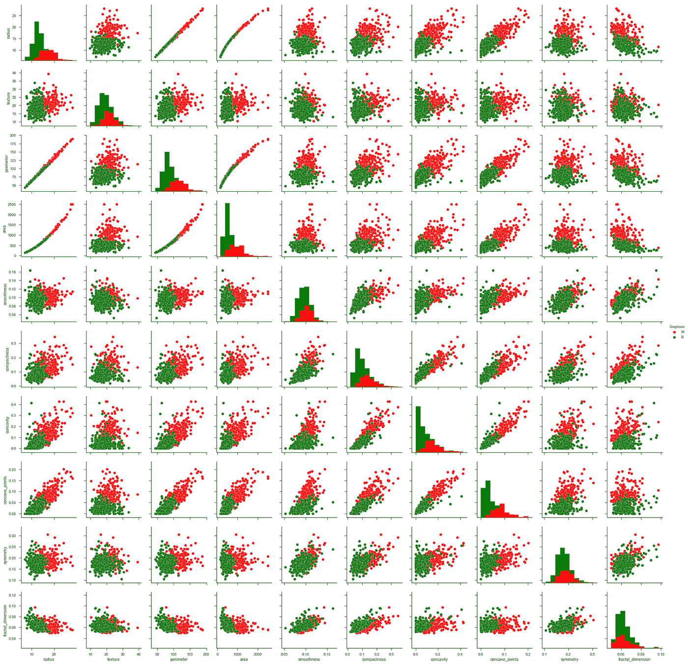

在本文中，我不会逐一查看每个图表。然而，你可以注意到一些线性关系，例如(半径对凹点)，(凹度对紧密度)…等等。半径和分形维数之间似乎存在指数关系。因为面积= π(半径)&周长= 2π(半径)，所以它们之间应该具有所示的关系。我们可以用相关性指标来总结所有这些:

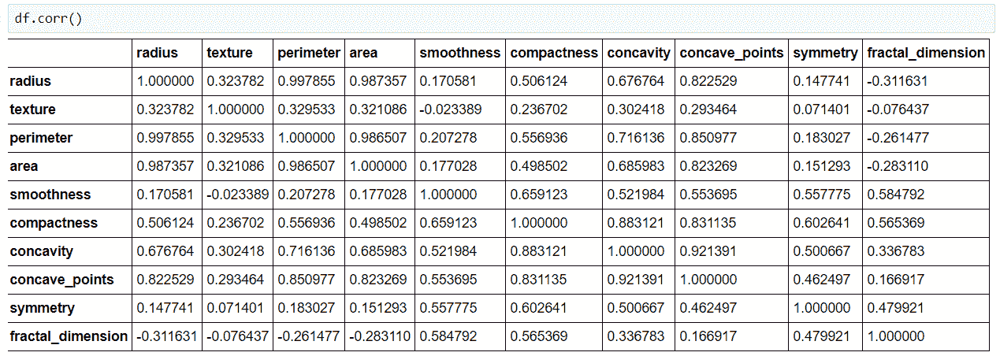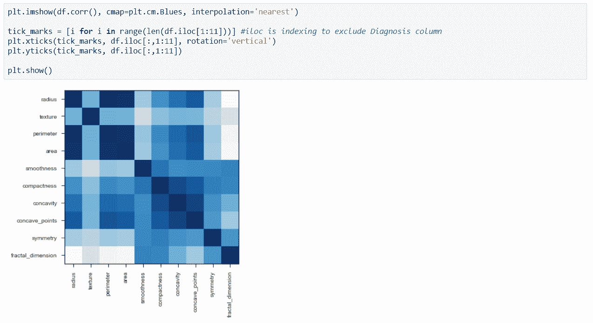

# 步骤 6 —数据转换

我将特性列分配给 X，将标签列“诊断”分配给 y:

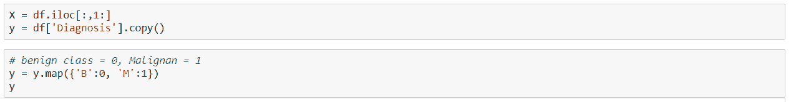

接下来，我分割 30%的数据作为我的测试输入和输出，以便稍后对分类器模型进行评分。其余的分配给训练数据集(X_train 和 y_train)

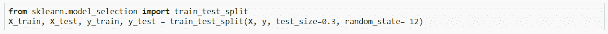

之后，我运行一个著名的无监督降维算法:主成分分析(PCA)。它通过捕捉数据的最大可变性来模拟数据的线性子空间。由于它对最易变的数据很敏感，我标准地缩放了所有的特征，并使它们的方差统一起来。

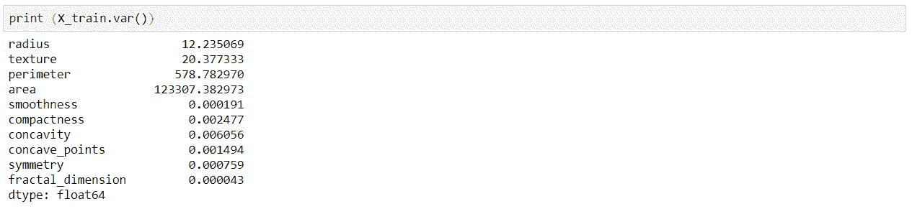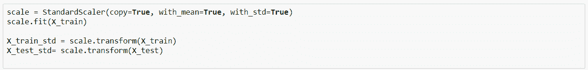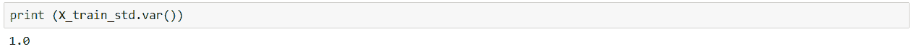

然后，建立 n _ omponents = 7 的 PCA 模型，将其拟合到训练数据，然后使用 PCA 模型转换测试和训练数据:

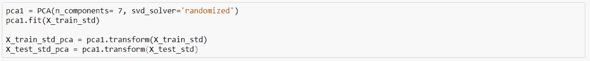

# 步骤 7 —分类建模

我在训练数据上尝试了许多分类算法，并用测试数据对模型进行评分，以了解它们的表现如何。实际上，我得到了许多好的准确率分数，其中之一是通过径向核支持向量分类器(SVC)。通过少量迭代，我设置了以下参数:C= 0.9 和 gamma = 0.063，并用测试数据对模型进行评分:

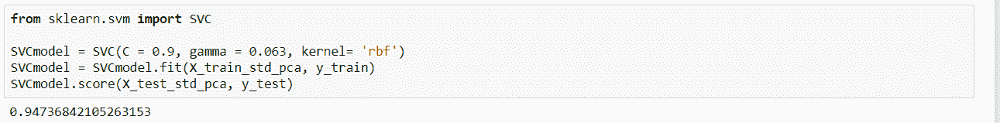

该模型的得分为:94.7%的准确率。但是我们必须转到交叉验证步骤，以验证模型的准确性，并观察它的表现。

# 步骤 8 —模型评估

在这里，我对训练数据运行 10 重交叉验证函数。这样，训练数据首先被切割成多个“K”组(在本例中是 10)。然后，训练模型的“K”个版本，每个版本使用“K”个可用集合中的独立的 K-1 个。每个模型都用最后一套来评估，它是一套:

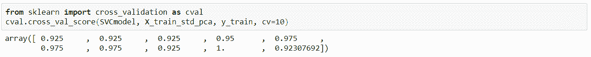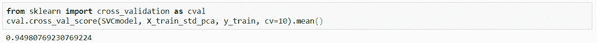

10 倍交叉验证准确度的平均值为:%94.98，AUROC(接收器工作曲线下面积)= 0.99

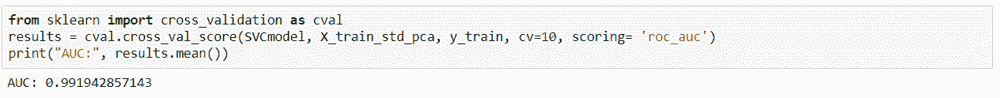

让我们深入挖掘分类器评估，看看它是如何执行的，特别是恶性类别(映射为 1)。如你所知，假阴性非常低或为零是非常重要的，因为实际上在阳性时错过恶性细胞是非常危险和昂贵的。

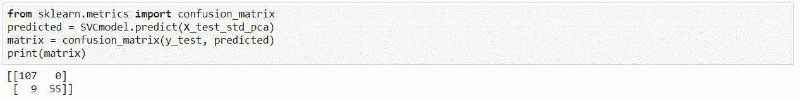

利用测试数据集(原始数据的 30%)，分类器能够检测所有良性细胞(真阴性)，而在预测恶性细胞时，它有 9 个假阴性和 55 个真阳性。此外，让我们检查评分标准:

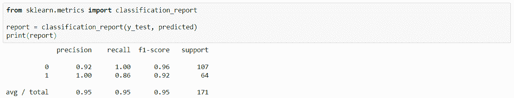

最后，我将提到一些可能影响模型准确性的优化想法，更重要的是减少假阴性预测。然而，我将期待着收到您的经验丰富的思想和想法，以优化模型，除了整个项目。我相信知识共享，并认为这是提高技能的最佳方式。最后但同样重要的是，这里有一些优化“乳腺癌分类器”的想法:

处理异常值并研究其影响，包括更多数据集，例如:标准误差和最大值，使模型更“偏向”恶性类别以移除假阴性事件，对其他分类模型(如决策树和朴素贝叶斯)进行更多试验，或使用 RandomizedSearchCV 函数试验更多参数..等等。