# 使用支持向量机(SVM)的乳腺癌分类

> 原文：<https://towardsdatascience.com/breast-cancer-classification-using-support-vector-machine-svm-a510907d4878?source=collection_archive---------1----------------------->

**背景:**

**乳腺癌**是世界上女性中最常见的癌症。它占所有癌症病例的 25%，仅在 2015 年就影响了超过 210 万人。当乳房中的细胞开始不受控制地生长时，它就开始了。这些细胞通常形成肿瘤，可以通过 X 射线看到或在乳房区域感觉到肿块。

早期诊断大大增加了存活的机会。对其检测的关键挑战是如何将肿瘤分类为恶性(癌性)或良性(非癌性)。如果肿瘤细胞可以生长到周围组织或扩散到身体的远处，则肿瘤被认为是恶性的。良性肿瘤不会侵犯附近的组织，也不会像恶性肿瘤那样扩散到身体的其他部位。但是，如果良性肿瘤压迫血管或神经等重要结构，就会很严重。

机器学习技术可以显著提高乳腺癌的诊断水平。研究表明，经验丰富的医生可以以 79%的准确率检测癌症，而使用机器学习技术可以达到 91 %(有时高达 97%)的准确率。

**项目任务**

在这项研究中，我的任务是使用从几个细胞图像中获得的特征将肿瘤分为恶性(癌性)或良性(非癌性)。

从乳腺肿块的细针抽吸(FNA)的数字化图像中计算特征。它们描述了图像中出现的细胞核的特征。

**属性信息:**

1.  识别号
2.  诊断(M =恶性，B =良性)

**为每个细胞核计算十个实值特征:**

1.  半径(从中心到周边各点的平均距离)
2.  纹理(灰度值的标准偏差)
3.  周长
4.  面积
5.  平滑度(半径长度的局部变化)
6.  紧凑性(周长/面积— 1.0)
7.  凹度(轮廓凹入部分的严重程度)
8.  凹点(轮廓凹陷部分的数量)
9.  对称
10.  分形维数(“海岸线近似值”-1)

# 加载 Python 库和乳腺癌数据集

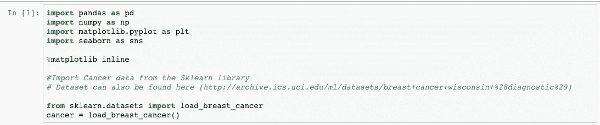

# 让我们来看看数据框中的数据

# 功能(列)细分

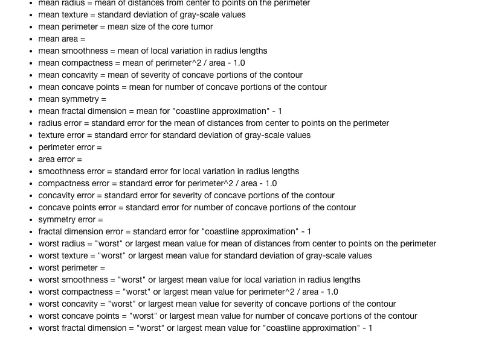

# 想象我们特征之间的关系

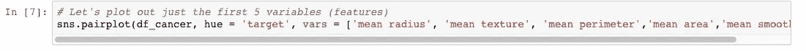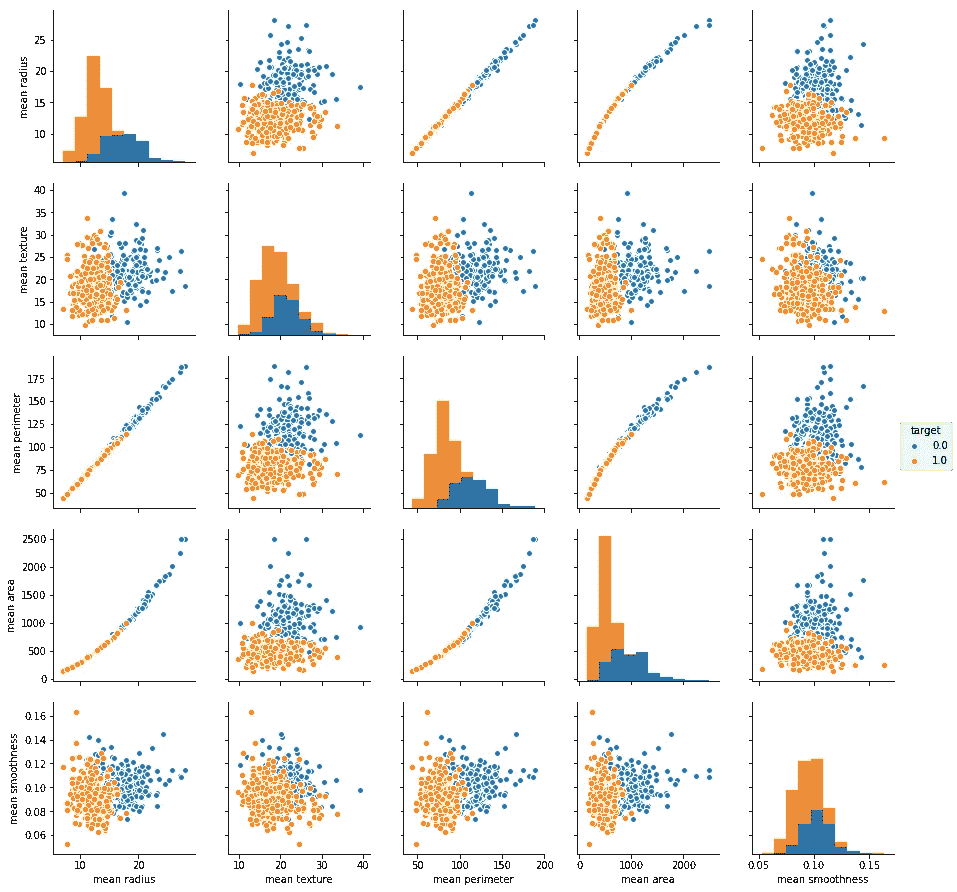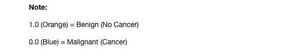

# 让我们检查一下我们特征之间的相关性

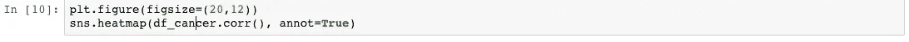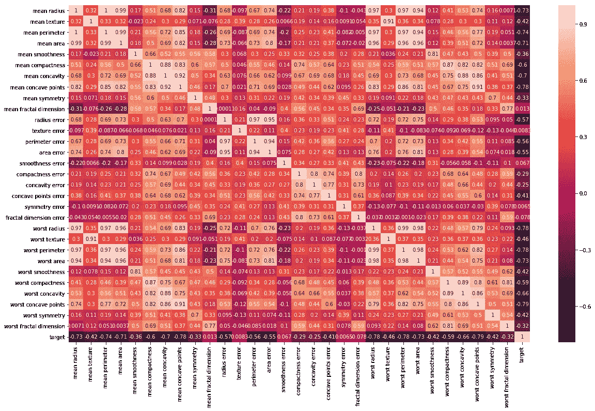

**There is a strong correlation between mean radius and mean perimeter, as well as mean area and mean perimeter**

先说数据科学中的建模。

# 我们说“建模”是什么意思？

根据我们在一个特定的地方住了多长时间和去了一个地方，我们可能对我们所在地区的通勤时间有很好的了解。例如，我们通过地铁、公交车、火车、优步、出租车、拼车、步行、骑自行车等方式去上班/上学。

所有人类都自然地模仿他们周围的世界。

随着时间的推移，我们对交通的观察建立了一个心理数据集和心理模型，帮助我们预测不同时间和地点的交通状况。我们可能使用这种思维模式来帮助计划我们的一天，预测到达时间和许多其他任务。

*   作为数据科学家，我们试图通过使用数据和数学/统计结构，使我们对不同量之间关系的理解更加精确。
*   这个过程叫做建模。
*   模型是对现实的简化，帮助我们更好地理解我们观察到的事物。
*   在数据科学环境中，模型通常由感兴趣的独立变量(或输出)和一个或多个被认为会影响独立变量的因变量(或输入)组成。

# **基于模型的推理**

*   我们可以使用模型进行推理。
*   给定一个模型，我们可以更好地理解自变量和因变量之间或多个自变量之间的关系。

**一个心智模型的推理很有价值的例子是:**

决定一天中什么时候我们工作得最好或者最累。

# 预言；预测；预告

*   我们可以使用模型进行预测，或者在给定至少一个自变量的值的情况下估计因变量的值。
*   即使预测不完全正确，它们也是有价值的。
*   好的预测对于各种各样的目的来说都是非常有价值的。

**心智模型预测有价值的一个例子:**

预测从 A 点到 b 点需要多长时间。

# 模型预测和推断有什么区别？

*   推断是判断数据和输出之间的关系，如果有的话。
*   预测是基于数据和基于该数据构建的模型对未来情景进行猜测。

**在这个项目中，我们将讨论一种叫做支持向量机(SVM)的机器学习模型**

# 分类建模简介:支持向量机(SVM)

# 什么是支持向量机(SVM)？

支持向量机(SVM)是一种二元线性分类，其决策边界被显式构造以最小化泛化误差。它是一个非常强大和通用的机器学习模型，能够执行线性或非线性分类、回归甚至异常值检测。

SVM 非常适合对复杂的中小型数据集进行分类。

# SVM 如何分类？

对于 SVM 的**特殊线性可分**分类案例，从直觉开始很重要。

如果观察值的分类是**“线性可分”**，那么 SVM 符合**“决策边界”**，它是由每类最近点之间的最大差值定义的。这就是通常所说的**“最大边缘超平面(MMH)”**。

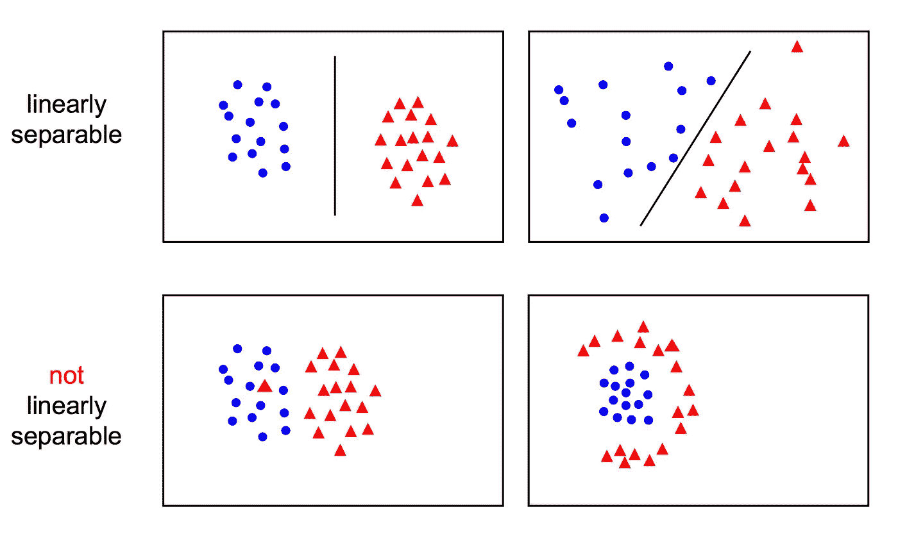

# 支持向量机的优势在于:

*   在高维空间有效。
*   在维数大于样本数的情况下仍然有效。
*   在决策函数中使用训练点的子集(称为支持向量)，因此它也是内存高效的。
*   通用:可以为决策函数指定不同的[内核](http://scikit-learn.org/stable/modules/svm.html#svm-kernels)函数。提供了通用内核，但是也可以指定定制内核。

# 支持向量机的缺点包括:

*   如果特征的数量远大于样本的数量，在选择[核函数](http://scikit-learn.org/stable/modules/svm.html#svm-kernels)和正则项时避免过拟合是至关重要的。
*   支持向量机不直接提供概率估计，而是使用昂贵的五重交叉验证来计算(参见[得分和概率](http://scikit-learn.org/stable/modules/svm.html#scores-probabilities))。

现在我们对建模和支持向量机(SVM)有了更好的理解，让我们开始训练我们的预测模型。

# 模特培训

**从我们的数据集中，让我们创建目标和预测矩阵**

*   “y”=是我们试图预测的特征(输出)。在这种情况下，我们试图预测我们的“目标”是癌性的(恶性)还是非良性的(良性)。也就是说，我们将在这里使用“目标”功能。
*   “X”=剩余列(平均半径、平均纹理、平均周长、平均面积、平均平滑度等)的预测值。)

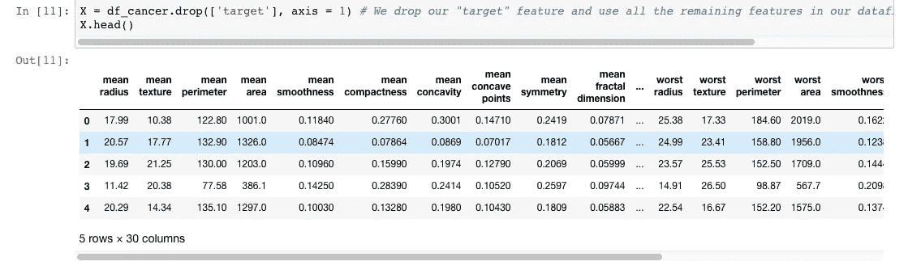

# 创建培训和测试数据

既然我们已经为“X”和“y”赋值，下一步就是导入 python 库，它将帮助我们将数据集分成训练和测试数据。

*   训练数据=用于训练模型的数据子集。
*   测试数据=模型以前没有见过的数据子集(我们将使用这个数据集来测试模型的性能)。

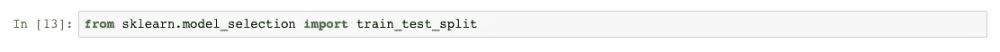

让我们将数据分成两部分，80%用于训练，剩下的 20%用于测试。

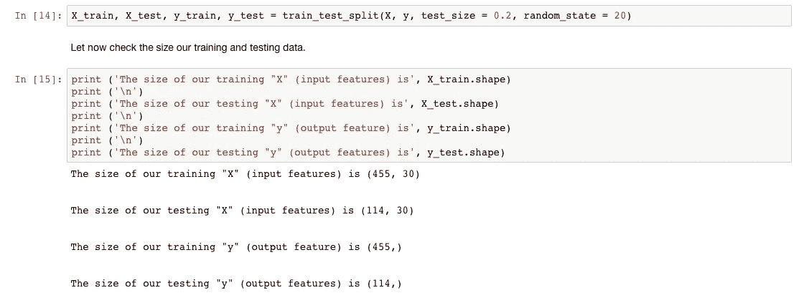

# 导入支持向量机(SVM)模型

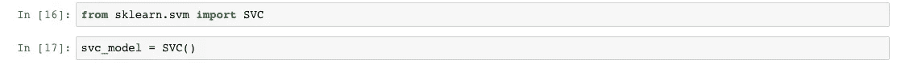

# 现在，让我们用“训练”数据集来训练我们的 SVM 模型。

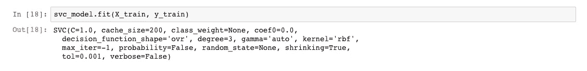

# 让我们使用训练好的模型，利用我们的测试数据进行预测

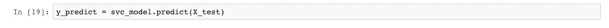

**下一步是通过与我们已有的输出(y_test)进行比较来检查我们预测的准确性。我们将使用混淆矩阵进行比较。**

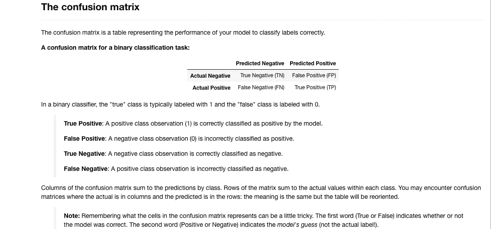

**让我们为分类器在测试数据集上的性能创建一个混淆矩阵。**

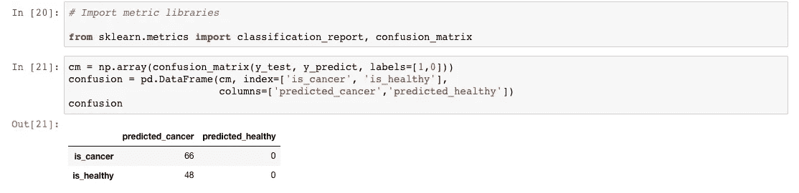

让我们在热图上可视化我们的混淆矩阵

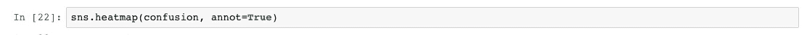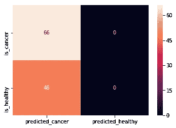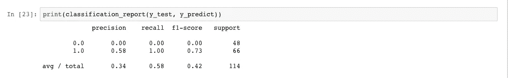

如我们所见，我们的模型在预测方面做得并不好。它预测有 48 名健康患者患有癌症。我们只达到了 34%的准确率！

让我们探索提高模型性能的方法。

# 改进我们的模型

我们将尝试的第一个过程是通过**标准化**我们的数据

**数据标准化**是一个将所有值纳入范围[0，1]的特征缩放过程

X ' =(X-X _ min)/(X _ max-X _ min)

# 规范化培训数据

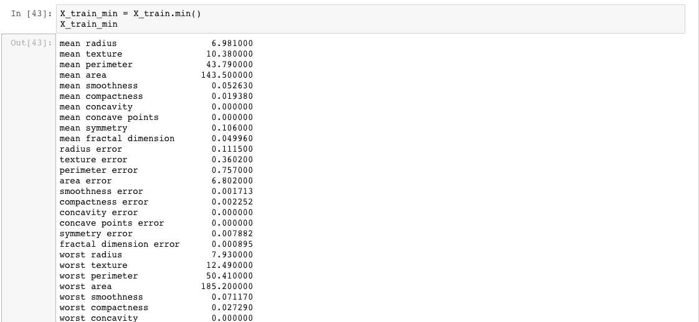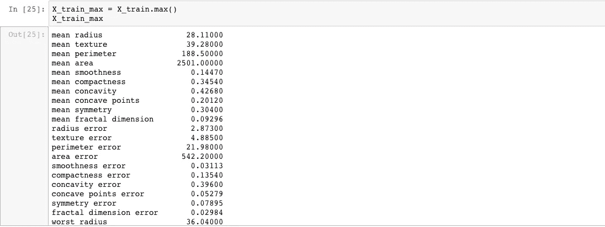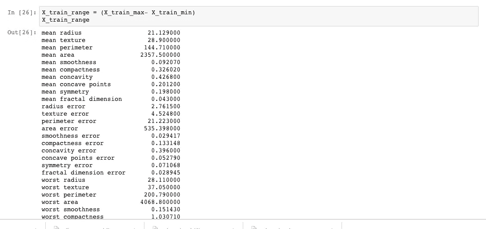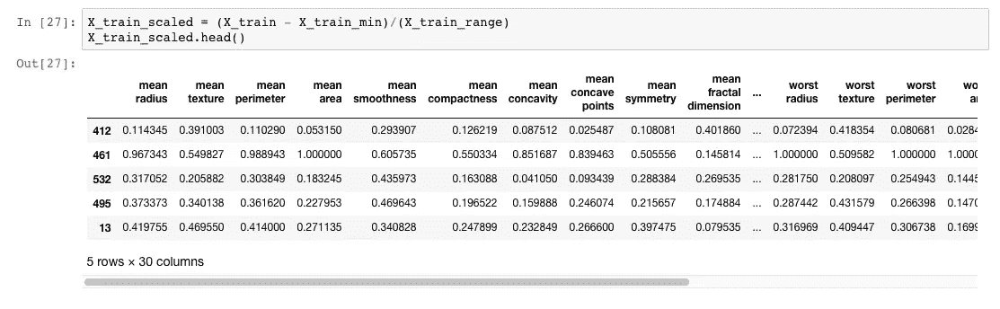

# 规范化培训数据

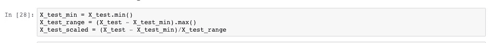

现在，让我们用我们的缩放(标准化)数据集来训练我们的 SVM 模型。

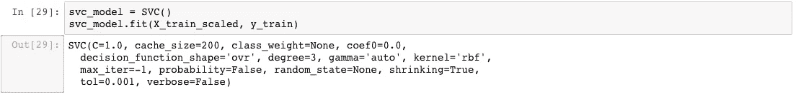

# **利用缩放数据集进行预测**

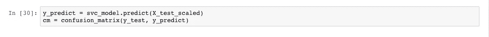

# **缩放数据集上的混淆矩阵**

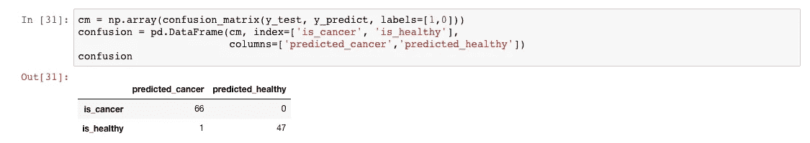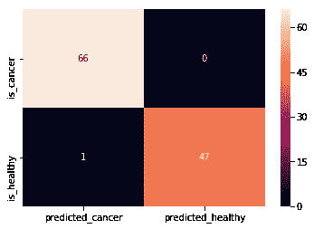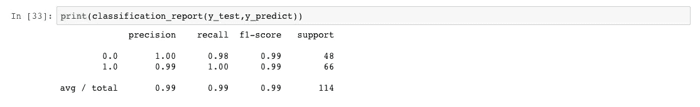

**我们的预测好了很多，只有一个错误预测(预测癌症而不是健康)。我们达到了 98%的准确率！**

# **总结:**

本文带我们经历了解释“建模”在数据科学中的含义、模型预测和推理之间的差异、支持向量机(SVM)介绍、SVM 的优点和缺点、训练 SVM 模型以进行准确的乳腺癌分类、提高 SVM 模型的性能以及使用混淆矩阵测试模型准确性的旅程。

如果你想要一个 **Jupyter 笔记本**格式的这个项目的所有代码，你可以从我的 [**GitHub 仓库**](https://github.com/nalamidi/Breast-Cancer-Classification-with-Support-Vector-Machine/blob/master/Breast%20Cancer%20Classification.ipynb) 下载它们。

# **来源:**

1.  [http://scikit-learn.org/stable/modules/svm.html](http://scikit-learn.org/stable/modules/svm.html)
2.  [http://www.robots.ox.ac.uk/~az/lectures/ml/lect2.pdf](http://www.robots.ox.ac.uk/~az/lectures/ml/lect2.pdf)
3.  [http://pyml.sourceforge.net/doc/howto.pdf](http://pyml.sourceforge.net/doc/howto.pdf)
4.  [https://www.bcrf.org/breast-cancer-statistics](https://www.bcrf.org/breast-cancer-statistics)
5.  [https://www . cancer . org/cancer/breast-cancer/about/what-is-breast-cancer . html](https://www.cancer.org/cancer/breast-cancer/about/what-is-breast-cancer.html)