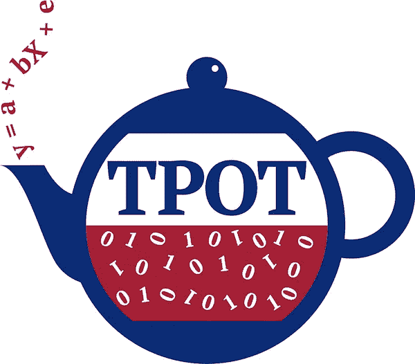
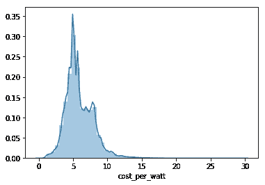
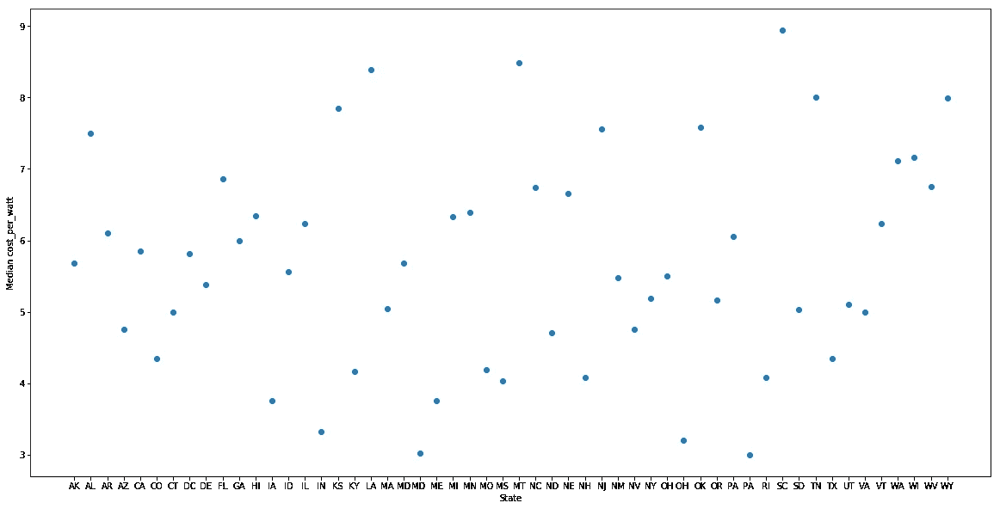
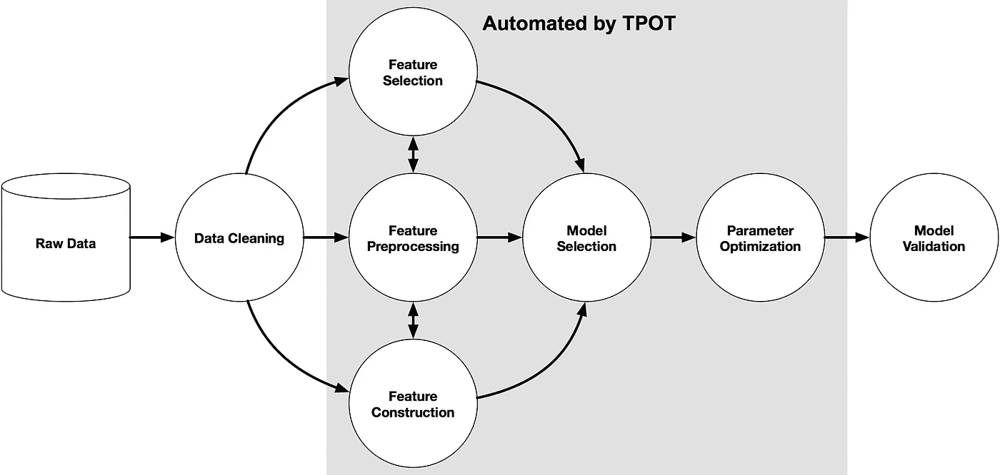
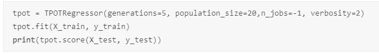
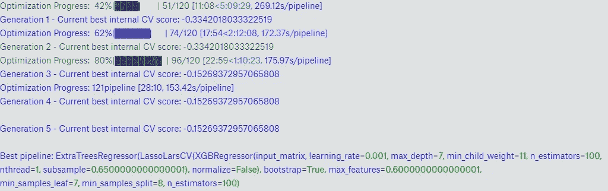

# 和 TPOT 一起酝酿一批机器学习

> 原文：<https://towardsdatascience.com/brewing-a-batch-of-machine-learning-with-tpot-2930c376b884?source=collection_archive---------5----------------------->

当处理一个新的数据集时，我经常会考虑以迭代的方式可视化、分析和构建模型的最佳工具。也许我很难理解数据的某些方面。我可能会研究一些致力于类似问题集可视化的 Kaggle 内核，以便收集一些新的想法。我也可能会向一些朋友和同事请教。我继续尝试新的方法来找到一个充分的解决方案。

如果我的模型管道没有产生期望的结果，我可能会做出大量的特征选择、缩放和算法选择。这些选择有些是基于经验，有些是凭直觉。然而，大多数时候我最终做了很多工作，尝试了一系列不同的模型和超参数、特征工程等。

近年来，像 [h2o.ai](http://h2o.ai) 和 [AutoML](https://www.automl.org/) 这样的工具通过自动化这些更繁琐的任务变得越来越流行。虽然出于教学目的，我偶尔喜欢尝试不同的模型架构，但是在其他情况下，我希望自动化其中的一些选择。虽然这些工具令人印象深刻，但我最近了解到一个开源项目，它将几乎完整的机器学习管道直接送到您的手中:。

TPOT 使用进化框架来优化超参数、选择特性，甚至为您选择算法。方便的是，它利用了几乎所有数据科学家都熟悉和使用的 [sklearn](http://scikit-learn.org) 算法。乍一看，TPOT 看起来太强大了，令人难以置信，所以我知道我必须尝试一下。

此外，我最近对进化系统及其在机器学习方面的持续成功非常着迷。这篇[博文](http://blog.otoro.net/2017/10/29/visual-evolution-strategies/)启发我甚至构建了自己的[进化算法](https://www.linkedin.com/pulse/evolutionary-amoebas-playing-space-invaders-deep-learning-franck/)来扮演太空入侵者。《走向数据科学》也有一些非常好的文章。当我听说 TPOT 使用 ES 时，我受到了进一步的启发，开始着手一个试验项目。

正如我前面提到的，通常我手头有一项任务，我会为这项工作选择一套工具。在这篇文章中，我打破了这个模式:TPOT 是我唯一的工具，我将收集一个数据集来测试它！我想要一些相对简单的、由开放数据组成的、我热爱的东西。一个辅助目标是让数据足够小，任何人都可以将其加载到笔记本电脑上或在 Kaggle 上使用(如果你感兴趣，这就是我最终存储[数据集](https://www.kaggle.com/franckjay/openpv-solar-data-with-opendatagov-zipcodes)的地方)。

我对可再生能源和环境感到非常兴奋。在之前的博客[帖子](https://www.linkedin.com/pulse/san-francisco-energy-efficiency-community-focused-data-jay-franck/)中，我使用了来自三藩市的建筑能效公开数据来描述这些数据的趋势。对于这个练习，我想我会利用来自国家可再生能源实验室(NREL)的关于太阳能的邮政编码级别的[数据集](https://openpv.nrel.gov/)。我将这些数据与 catalog.data.gov/dataset/zip-code-data 的邮政编码信息结合在一起。

我很快在这个数据集中为我的目标变量寻找一个重要的特征。我决定让 TPOT 决定预测太阳能装置每瓦成本的最佳模型。有几个主要原因:

*   作为一个社会，我们需要从化石燃料快速过渡到碳中性能源。
*   不幸的是，这一切发生得还不够快，尽管*与气候变化*有着难以置信的代价(人类痛苦、环境等)。
*   幸运的是，可再生能源的成本正在下降。在美国，只有当一项行动与金钱利益相关联时，这种行动才会发生。

Median cost_per_watt at the state level

如果我(或者更确切地说是 TPOT)能够有效地从数据中学习一些能够预测某些地区低*每瓦成本*的驱动特征，也许这个结果可以在该国的其他地区进一步探索。

我故意不帮 TPOT 提什么东西。我的实验试图确定系统的开箱即用效率。该算法声称可以处理数据科学管道中的几乎每一部分。我写了一个快速的 [Kaggle 内核](https://www.kaggle.com/franckjay/kernel1dea72c27c)，它加载数据，加入数据，删除一些 nan，释放 TPOT 的愤怒。我们可以期待什么？来自 TPOT [的文件](http://epistasislab.github.io/tpot/using/#what-to-expect-from-automl-software):

1.  对于默认的 TPOT 参数，100 个“基因样本”将在您的数据集上运行 100 代，每代都由各种算法和超参数组成
2.  每个样本(在这种情况下是 10，000 个独特的样本)将进行 10 次交叉验证。如果你愿意，你甚至可以使用一个自定义的损失函数！
3.  如果找到了最佳管道，将输出 CV 分数和管道参数。

API 调用非常简单，看起来很像您在 Python 中使用的任何 ML 算法:

Pretty simple!

我肯定会建议在多个 CPU 上运行这个程序( *n_jobs=-1* )，然后去做午饭，因为这可能需要很长时间。在免费的 Kaggle 机器上，我保持了较小的世代和群体规模，并且仍然需要将我的特征空间减少到只有 5-10 个相关特征。TPOT 的文档警告用户可能需要一整天的时间来实现融合模型！在会话结束时，我收到了如下输出:

Best negative Mean Squared Error: -0.137

现在我可以去 *sklearn* ，做一点功能工程，然后使用相对简单的 ExtraTreesRegressor 来构建这个模型。上述模型仅使用了 OpenPV 数据集中的要素样本。后来的一个测试，仅使用邮政编码数据，表现不尽如人意。

然而，这篇文章的目的并不是深入这个特殊的数据问题，所以我们不会进一步讨论它。这应该都是关于 TPOT 的！总的结论是，TPOT 值得进一步探索。积极的一面是:

*   它容易使用，非常危险。它与您日常的 Python 数据工作流相集成。一个完全的初学者可以加载并使用它。
*   它探讨了多项式特性、大量超参数和各种组合的算法。
*   一旦管道决定了一个模型，你可以稍后在 *sklearn* 中构建它，而不用再使用 TPOT。
*   文档是以简单明了的方式编写的。
*   您可以轻松地提供自定义损失函数。

我发现的唯一真正的缺点是我在使用 Kaggle 内核时遇到的速度和内存问题。但是，这真的是一个问题吗？在一个装备更加完善的数据科学平台上，TPOT 真的可以大放异彩。

在过去的几年里，随着 AutoML 变得越来越强大，我已经听到了数据科学职业生涯的厄运。有一些令人信服的反驳观点没有得到太多的关注。数据科学家的工作流程中有哪一块没有包括在 TPOT 管道中？*数据清洗。*在我的日常工作中，这一项就能消耗我 80%的时间和精神能量。

如何制定正确的问题？在类似 Kaggle 的竞赛中，问题集和数据都是为数据科学家精心准备的，这很少被考虑。在商业环境中工作时，简单地问正确的问题是成功项目的重要组成部分。你在优化什么？企业需要什么？你如何向决策者解释这一点？TPOT 对此没有帮助。

总的来说，TPOT 和 AutoML 将使数据科学家更有效率。计算是廉价的，但我们的时间是宝贵的。使用这些工具来改进您的工作流程，花时间问正确的问题，有效地清理/分析数据，并交流您的结果。网格搜索超参数不是对你时间的有效利用。我肯定会再次使用 TPOT，我希望你也能尝试一下。如果你喜欢这篇文章，请看看我的其他帖子！我感谢你的读者。