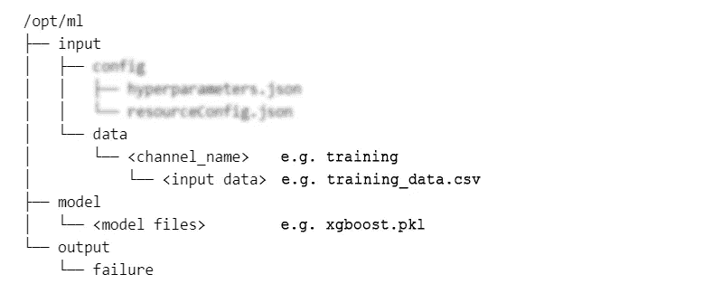
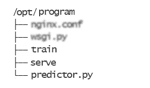
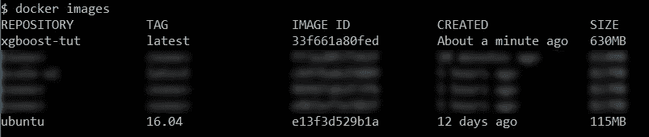
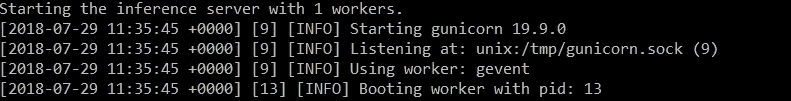
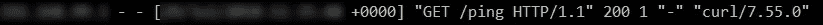
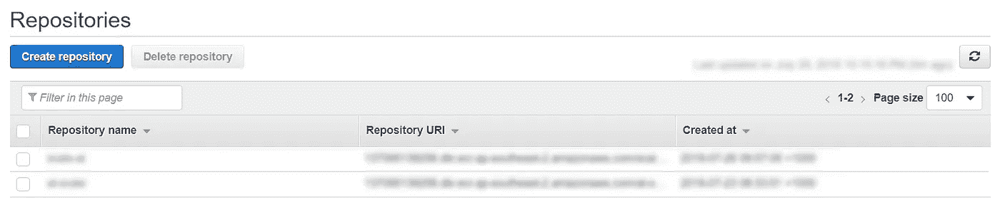

# 在 AWS SageMaker 上酝酿定制 ML 模型

> 原文：<https://towardsdatascience.com/brewing-up-custom-ml-models-on-aws-sagemaker-e09b64627722?source=collection_archive---------1----------------------->


最近爱上了 SageMaker。仅仅是因为它太方便了！我真的很喜欢他们的方法，向客户隐藏所有的基础设施需求，让他们专注于解决方案中更重要的 ML 方面。只需在这里或那里点击几下并输入，瞧，您就有了一个准备好生产的模型，每天可以处理 1000 个(如果不是数百万个)请求。如果你需要一个关于 SageMaker 的好的介绍，看看下面这个非亚马逊公司的视频吧！

# 那么可能会出什么问题呢？

但是当您试图在自己的 docker 容器中设置和创建自己的模型来执行定制操作时，麻烦就来了！这不像一开始就用 SageMaker 构建一切那样简单流畅。

# 为什么您需要定制模型？

您需要自己的定制模型的原因有很多。你可能是:

*   使用一些特定的 python 库版本，而不是最新的版本(例如 TensorFlow)
*   使用 SageMaker 上不可用的库

# 继续之前…

在继续之前，请确保您具备以下条件。

*   Docker 安装并运行在您的操作系统中
*   Docker 工作原理的基本知识

# 我们如何做到这一点？

现在有了一个好的背景，让我们深入了解为 SageMaker 做准备的细节。教程将有三个不同的部分。

*   用你的代码创建一个 docker 图像
*   在本地测试 docker 容器
*   在 Amazon ECR(弹性容器存储库)上部署映像

让我在这里把这些观点具体化。首先，您创建一个 docker 映像，其中包含库和代码以及其他需求(例如对端口的访问)。然后，从该映像创建一个容器并运行该容器。然后，您用容器中的一小块数据测试代码/模型。成功测试后，您将 docker 映像上传到 ECR。然后，您可以将该图像指定为 ML 模型，并通过 Amazon SageMaker 将其用于训练/预测。

此外，我将使用这个[教程/指南](https://github.com/awslabs/amazon-sagemaker-examples/blob/master/advanced_functionality/scikit_bring_your_own/scikit_bring_your_own.ipynb)作为这个博客的参考框架。真的是很好的教程。我想重新创作这篇博文的原因很少:

*   如果你只依赖 scikit-learn，这是一个很好的教程。我想到用 [XGBoost](https://github.com/dmlc/xgboost/tree/master/python-package) 创建一个容器，所以我们必须对 Docker 容器做一些修改。
*   我想要 Python 3 而不是 Python 2，原因[显而易见](https://pythonclock.org/)。
*   我还觉得这里和那里缺少一些细节(尤其是在本地测试时)。

为了演示这个过程，我将在[虹膜数据集](https://archive.ics.uci.edu/ml/datasets/iris)上训练一个 XGBoost 分类器。你可以在这里 找到所有代码 [**的 Github 库。**](https://github.com/thushv89/xgboost-aws-container)

# Docker 概述

你知道还有什么比 SageMaker 更神奇吗？码头工人。Docker 极其强大，便携，快速。但这不是讨论原因的地方。所以让我们直接开始设置吧。使用 Docker 时，您有一套清晰的步骤:

*   创建一个包含代码/模型的文件夹和一个名为`Dockerfile`的特殊文件，该文件包含用于创建 docker 图像的**配方**
*   运行`docker build -t <image-tag>`创建一个 docker 映像
*   通过运行`docker run <image>`来运行图像
*   使用`docker push <image-tag>`将 docker 映像推送到将存储该映像的某个存储库(例如 dockerhub 或 AWS ECR 存储库)

# SageMaker 兼容 Docker 容器概述

注意，SageMaker 要求图像有一个特定的文件夹结构。SageMaker 寻找的文件夹结构如下。主要有两个父文件夹`/opt/program`存放代码，和`/opt/ml`存放工件。请注意，我已经模糊掉了一些您可能不需要编辑的文件(至少对于本练习来说是这样)，它们超出了本教程的范围。



Adapted from of awslabs/ [amazon-sagemaker-examples](https://github.com/awslabs/amazon-sagemaker-examples) Github



Program structure in the Docker container

现在让我们详细讨论一下这些实体中的每一个。首先，`opt/ml`是所有人工制品将要存放的地方。现在让我们来谈谈每个子目录。

## 目录:/opt/ml

`input/data`是存储模型数据的目录。它可以是任何与数据相关的文件(假设您的 python 代码可以读取数据，并且容器具有这样做所需的库)。这里的`<channel_name>`是模型将要使用的一些消耗性输入源的名称。

`model`是模型将要驻留的地方。您可以将模型放在它自己的容器中，您可以指定一个 URL (S3 桶位置),模型工件以一个`tar.gz`文件的形式保存在那里。例如，如果您有亚马逊 S3 桶中的模型工件，您可以在 SageMaker 上的模型设置期间指向那个 S3 桶。然后，当您的模型启动并运行时，这些模型工件将被复制到`model`目录中。

最后，`output`是控制器，如果失败，它将存储请求/任务失败的原因。

## 目录:/opt/program

现在让我们深入研究我们模型的精华部分；算法。这应该可以在我们 Docker 容器的`/opt/program`目录中找到。关于`train`、`serve`和`predictor.py`，我们需要小心的主要有三个文件。

`train`保存用于训练模型和存储训练模型的逻辑。如果`train`文件运行无故障，它将保存一个模型(即 pickle 文件)到`/opt/ml/model`目录。

`serve` essential 使用 *Flask* 将`predictor.py`中编写的逻辑作为 web 服务运行，它将监听任何传入的请求，调用模型，做出预测，并返回带有预测的响应。

## Dockerfile 文件

这是支持 Docker 容器中可用内容的文件。这意味着这个文件极其重要。所以让我们来看看里面。如果您已经熟悉如何编写 Dockerfile 文件，这是非常简单的。不过，还是让我带你简单参观一下吧。

*   `FROM`指令指定一个基本图像。所以这里我们使用一个已经构建好的 Ubuntu 映像作为我们的基础映像。
*   接下来使用`RUN`命令，我们使用`apt-get install`安装几个包(包括 Python 3.5)
*   然后再次使用`RUN`命令，我们安装 pip，接着是`numpy`、`scipy`、`scikit-learn`、`pandas`、`flask`等。
*   随后，我们使用`ENV`命令在 Docker 容器中设置了几个环境变量。我们需要将我们的`/opt/program`目录添加到`path`变量中，这样，当我们调用容器时，它会知道我们的算法相关文件在哪里。
*   最后但同样重要的是，我们将包含算法相关文件的文件夹`COPY`到`/opt/program`目录，然后将其设置为`WORKDIR`

# 创建我们自己的 Docker 容器

首先，我将使用[aw slaps Github 库](https://github.com/awslabs/amazon-sagemaker-examples/tree/master/advanced_functionality/scikit_bring_your_own/container)提供的惊人包的修改版本(链接[此处为](https://github.com/thushv89/xgboost-aws-container))。这个原始存储库包含了我们运行 SageMaker 模型所需的所有文件，因此只需编辑这些文件，使其符合我们的需求。将原始链接中的内容下载到一个名为`xgboost-aws-container`的文件夹中，如果你想从头开始，或者，你可以摆弄我的版本。

> **注意**:如果你是 Windows 用户，并且你是那些运行过时的 [Docker 工具箱](https://docs.docker.com/toolbox/toolbox_install_windows/)的不幸者之一，确保你使用了`C:\Users`目录中的某个目录作为你的项目主文件夹。否则，将文件夹挂载到容器时，您会遇到非常糟糕的体验。

## 对现有文件的更改

1.  将`decision-trees`文件夹重命名为`xgboost`
2.  编辑存储库中提供的`train`文件。我本质上所做的是，我导入了`xgboost`并将决策树模型替换为`XGBClassifier`模型。*注意，一旦出现异常，就会被写入* `*/opt/ml/output*` *文件夹中的故障文件。因此，您可以自由地包含尽可能多的描述性异常，以确保您知道程序失败时哪里出错了。*
3.  编辑存储库中提供的`predictor.py`文件。本质上，我所做的类似于在`train`上所做的改变。我导入了`xgboost`，把分类器改成了`XGBClassifier`。
4.  打开你的`Dockerfile`进行以下编辑。

我们使用`python3.5`而不是`python`，并根据 xgboost 的要求添加了`libgcc-5-dev`。

```
RUN apt-get -y update && apt-get install -y — no-install-recommends \
 wget \
 python3.5 \
 nginx \
 ca-certificates \
 libgcc-5-dev \
 && rm -rf /var/lib/apt/lists/*
```

我们将询问`numpy`、`scikit-learn`、`pandas`、`xgboost`的具体版本，以确保它们相互兼容。指定您想要使用的库的版本的另一个好处是，您知道**它不会仅仅因为某个库的新版本与您的代码不兼容而中断**。

```
RUN wget [https://bootstrap.pypa.io/3.3/get-pip.py](https://bootstrap.pypa.io/3.3/get-pip.py) && python3.5 get-pip.py && \
 pip3 install numpy==1.14.3 scipy scikit-learn==0.19.1 xgboost==0.72.1 pandas==0.22.0 flask gevent gunicorn && \
 (cd /usr/local/lib/python3.5/dist-packages/scipy/.libs; rm *; ln ../../numpy/.libs/* .) && \
 rm -rf /root/.cache
```

然后，我们将拷贝命令更改为以下内容

```
COPY xgboost /opt/program
```

# 建立码头工人形象

现在打开您的 Docker 终端(如果在 Windows 上，否则是 OS 终端)并转到包的父目录。然后运行以下命令。

```
docker build -t xgboost-tut .
```

这应该建立我们需要的一切形象。确保映像是通过运行，

```
docker images
```

您应该会看到如下所示的内容。



# 运行 Docker 容器来训练模型

现在是运行容器的时候了，开始执行下面的命令。

```
docker run --rm -v $(pwd)/local_test/test_dir:/opt/ml xgboost-tut train
```

让我们来分解这个命令。

`--rm`:表示当你离开集装箱时，集装箱将被销毁

`-v <host location>:<container location>`:将卷安装到容器中的所需位置。**警告** : Windows 用户，如果你选择`C:\Users`之外的任何东西，你都会有麻烦。

`xgboost-tut`:图像的名称

`train`:随着容器的启动，将自动开始运行`/opt/program`目录下的火车文件。这就是为什么指定`/opt/program`作为`PATH`变量的一部分很重要。

事情应该运行良好，您应该会看到类似下面的输出。

```
Starting the training.
Training complete.
```

您还应该在您的`<project_home>/local_test/test_dir/model`目录中看到`xgboost-model.pkl`文件。这是因为我们将`local_test/test_dir`目录挂载到了容器的`/opt/ml`中，所以无论`/opt/ml`发生什么都将反映在`test_dir`中。

# 在本地测试容器以供食用

接下来，我们要看看服务(推理)逻辑是否正常工作。现在让我在这里再次警告，如果你错过了以上！如果您是 Windows 用户，请注意正确安装宗卷。为了避免任何不必要的问题，确保您在`C:\Users`文件夹中选择一个文件夹，作为您的项目主目录。

```
docker run --rm --network=host -v $(pwd)/local_test/test_dir:/opt/ml xgboost-tut serve
```

让我指出我们在 Docker run 命令中指定的一个特殊选项。

`--network=host`:表示主机的网络栈将被复制到容器中。所以这就像在本地机器上运行一些东西。这是检查 API 调用是否正常工作所必需的。

> **注意**:我用的是`--network=host`，因为`-p <host_ip>:<host_port>:<container_port>`不工作(至少在 Windows 上)。我推荐使用-p 选项(如果有效的话)，如下所示。**警告:仅使用其中一个命令，不要同时使用两个**。但我将假设`--network=host`选项继续前进。

```
docker run --rm -p 127.0.0.1:8080:8080 -v $(pwd)/local_test/test_dir:/opt/ml xgboost-tut serve
```

`serve`:这是调用推理逻辑的文件

这将向您显示类似下面的输出。



现在，为了测试我们是否能成功 ping 通服务，运行以下命令(在单独的终端窗口中)。

```
curl http://<docker_ip>:8080/ping
```

您可以通过以下方式找到 Docker 机器的 IP

```
docker-machine ip default
```

这个 ping 命令应该在主机端和服务器端产生两条消息。类似下面的东西。



如果这一切进展顺利(我非常希望如此)，直到这一点。恭喜你！您几乎已经建立了一个 SageMaker 兼容的 Docker 映像。直播前我们还需要做一件事。

现在让我们试试更刺激的东西。让我们试着通过我们的 web 服务做一个预测。为此，我们将使用位于`local_test`文件夹中的`predict.sh`文件。请注意，我已经对它进行了修改，以适应我的需求，这意味着它不同于原始 awslabs 存储库中提供的那个。确切地说，我引入了一个新的用户提示参数，除了原始文件中的 IP 地址和端口之外，它还会接受这些参数。我们使用下面的命令调用修改后的`[predict.sh](https://github.com/thushv89/xgboost-aws-container/blob/master/local_test/predict.sh)`文件。

```
./predict.sh [<container_ip>:<](http://192.168.99.100:8080)port> payload.csv text/csv
```

这里我们使用`payload.csv`中的数据调用推理 web 服务，并说它是一个 csv 文件。它应该会返回以下内容。它将其中的数据点标识为属于类`setosa`。

```
* timeout on name lookup is not supported
* Trying <container_ip>…
* TCP_NODELAY set
* Connected to <container_ip> (<container_ip>) port <port> (#0)
> POST /invocations HTTP/1.1
> Host: <container_ip>:<port>
> User-Agent: curl/7.55.0
> Accept: */*
> Content-Type: text/csv
> Content-Length: 23
>
* upload completely sent off: 23 out of 23 bytes
< HTTP/1.1 200 OK
< Server: nginx/1.10.3 (Ubuntu)
< Date: <date and time> GMT
< Content-Type: text/csv; charset=utf-8
< Content-Length: 7
< Connection: keep-alive
<
setosa
* Connection #0 to host <container_ip> left intact
```

# 把它推到控制室

好吧。所以努力终于有了回报。是时候将我们的图像推送到亚马逊弹性容器库(ECR)了。在此之前，请确保您在 ECR 中创建了一个存储库，以便将图像推送到其中。如果你有一个 AWS 账户，这很简单。

从 AWS 仪表板转到 ECR 服务，然后单击“创建存储库”



创建存储库后，在存储库中，您应该能够看到完成推送 ECR 的指令。

注意:您也可以使用存储库中提供的 build_and_push.sh。但是我个人觉得自己做事情更舒服。推动存储库其实没有那么多步骤。

首先，您需要获得登录 ECR 的凭证

```
aws ecr get-login — no-include-email — region <region>
```

它应该会返回一个输出，

```
docker login …
```

复制粘贴该命令，现在您应该登录到 ECR。接下来，您需要重新标记您的图像，以便能够正确地推送至 ECR。

```
docker tag xgboost-tut:latest <account>.dkr.ecr.<region>.amazonaws.com/xgboost-tut:latest
```

现在是时候将图像推送到您的存储库了。

```
docker push <account>.dkr.ecr.<region>.amazonaws.com/xgboost-tut:latest
```

现在图像应该出现在您的 ECR 存储库中，标签为`latest`。困难的部分已经完成，接下来您需要创建一个 SageMaker 模型并指向图像，这就像用 SageMaker 本身创建一个模型一样简单。所以我不会在博文中详述这些细节。

你可以在这里 找到所有代码 [**的 Github 库。**](https://github.com/thushv89/xgboost-aws-container)

# 结论

这是一次漫长的旅行，但(在我看来)很有收获。所以我们在本教程中做了以下工作。

*   首先，我们理解了为什么我们可能需要制作我们自己的定制模型
*   然后我们检查了 SageMaker 运行容器所需的 Docker 容器的结构。
*   然后，我们讨论了如何创建容器的 Docker 映像
*   接下来是如何构建映像和运行容器
*   接下来，我们讨论了在推出之前，如何在本地计算机上测试容器
*   最后，我们讨论了如何将图像推送到 ECR，以便通过 SageMaker 使用。

特别感谢做出[原始 Github 库](https://github.com/awslabs/amazon-sagemaker-examples/tree/master/advanced_functionality/scikit_bring_your_own)的贡献者给了我一个令人敬畏的起点！最后但重要的是，如果你喜欢这篇文章，请留下一些掌声:)

# 想在深度网络和 TensorFlow 上做得更好？

检查我在这个课题上的工作。


[1] [(书)TensorFlow 2 在行动——曼宁](https://www.manning.com/books/tensorflow-in-action)

[2] [(视频教程)Python 中的机器翻译](https://www.datacamp.com/courses/machine-translation-in-python) — DataCamp

[3] [(书)TensorFlow 中的自然语言处理 1](https://www.amazon.com.au/Natural-Language-Processing-TensorFlow-Ganegedara/dp/1788478312/ref=sr_1_25?dchild=1&keywords=nlp+with+tensorflow&qid=1603009947&sr=8-25) — Packt

# 新的！加入我的新 YouTube 频道

[](https://www.youtube.com/channel/UC1HkxV8PtmWRyQ39MfzmtGA/)

如果你渴望看到我关于各种机器学习/深度学习主题的视频，请确保加入 [DeepLearningHero](https://www.youtube.com/channel/UC1HkxV8PtmWRyQ39MfzmtGA/) 。