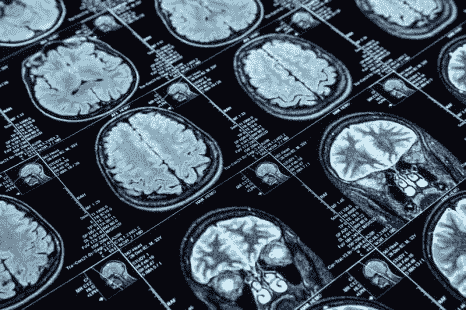
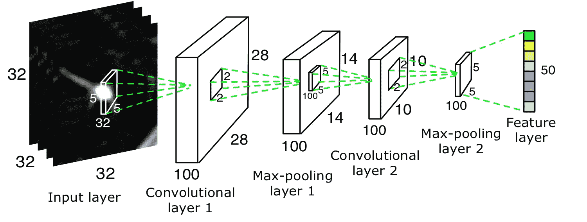
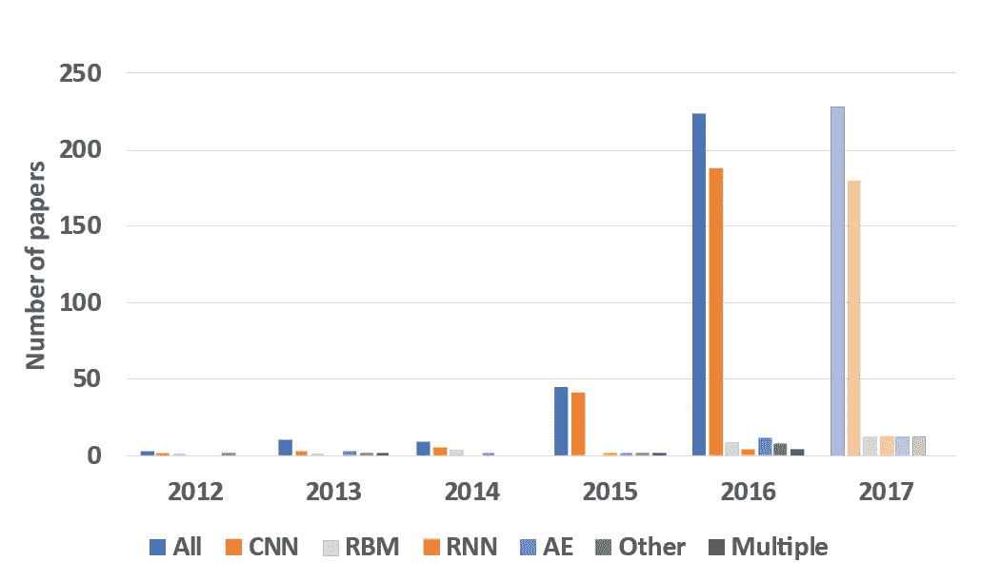

# 医学图像分析和深度学习简介

> 原文：<https://towardsdatascience.com/brief-intro-to-medical-image-analysis-and-deep-learning-9d8e5ef358e0?source=collection_archive---------23----------------------->

我最近开始从事一个与医学图像分析相关的项目，在寻找关于图像分析及其医学应用的资源时，我觉得我们通常没有一些关于这些信息的合适文章。在本文中，我们将简要介绍过去如何分析医学图像，以及自从引入深度学习以来发生了什么变化。对于图像分析，我们通常使用 *CNN* (卷积神经网络)，虽然在这里解释它会使整篇文章变得繁琐，但我将提供一些链接来正确解释*CNN*。

一旦有可能扫描医学图像并将其加载到计算机中，研究人员就试图建立系统来自动分析这些图像。最初，从*20 世纪 70 年代*到*20 世纪 90 年代*，医学图像分析是通过顺序应用低级像素处理(边缘和线检测器过滤器)和数学建模来构建一个**基于规则的系统**，该系统只能解决特定的任务。同时还有一些基于 if-else 规则的代理，在人工智能领域很流行，通常被称为 *GOFAI* (老式人工智能)代理。

*20 世纪 90 年代末，*监督技术开始流行，其中训练数据用于训练模型，并且它们在医学图像分析领域变得越来越流行。例子可能包括**活动形状模型**、**图谱方法**。这种模式识别和机器学习仍然流行，但引入了一些新的想法。因此，我们可以看到从人类设计的系统到计算机基于示例数据训练的系统的转变。计算机算法现在有足够的能力来确定边缘和重要特征，以分析图像并给出最佳结果。

迄今为止，最成功的图像分析模型是卷积神经网络(*CNN*)。单个 CNN 模型包含许多不同的层，这些层在较浅的层上识别边缘和简单特征，在较深的层上识别更深的特征。用滤波器(有人称之为核)对图像进行卷积，然后应用池化，这个过程可以在一些层上继续，最后获得可识别的特征。CNN 的工作从*80 年代*就开始了，在 *1995 年*就已经应用于医学图像分析。CNN 的第一个真实应用出现在**LeNetT11【1998】中，用于手写数字识别。尽管早期取得了一些小的成功，但 CNN 获得了动力，直到引入了深度学习中的改进训练算法。*GPU*的引入有利于该领域的研究，自 **ImageNet** 挑战赛引入以来，可以看到此类模型的快速发展。**

Illustration of CNN (Convolutional Neural Network)

在计算机视觉领域，CNN 已经成为首选。医学图像分析社区已经注意到这些关键的发展。然而，从使用手工特征的系统到从数据本身学习特征的系统的过渡是渐进的。深度学习在医学图像分析中的应用首先开始出现在研讨会和会议上，然后出现在期刊上。如图所示，论文数量在 *2015* 和 *2016* 有所增长。

*   **分类**:这是医学图像分析中最早使用深度学习的领域之一。**诊断图像分类**包括诊断图像的分类，在这种设置下，每个诊断检查都是样本，数据量小于计算机视觉的数据量。**对象或病变分类**通常集中于将医学图像的一部分分类成两个或多个类别。对于这些任务中的许多，精确分类需要关于病变外观和位置的局部和全局信息。
*   **检测**:器官/病变等解剖对象定位是分割任务的重要预处理部分。图像中对象的定位需要图像的 *3D* 解析，已经提出了几种算法来将 *3D* 空间转换为 *2D* 正交平面的组合。使用计算机辅助技术检测医学图像中的病变，提高检测精度或减少人类的检测时间，已经成为一种长期的研究趋势。有趣的是，第一个这样的系统是在 1995 年开发的，它使用一个有 4 层的 CNN 来检测 x 光图像中的结节。
*   **分割**:医学图像中器官和其他子结构的分割允许与形状、大小和体积相关的定量分析。分割的任务通常被定义为识别定义感兴趣的轮廓或对象的一组像素。病灶的分割结合了在深度学习算法的应用中对象检测以及器官和子结构分割的挑战。肿瘤分割与对象检测共有的一个问题是类别不平衡，因为图像中的大多数像素来自非患病类别。
*   **配准**:有时也称为空间对准，是一种常见的图像分析任务，其中计算从一幅图像到另一幅图像的坐标变换。这通常是在迭代框架中执行的，其中假设了特定类型的转换，并且优化了预先训练的度量。尽管病变检测和对象分割被视为深度学习算法的主要用途，但研究人员发现，深度网络有利于获得最佳的配准性能。
*   **医学成像中的其他任务**:深度学习在医学成像中还有一些其他用途。**基于内容的图像检索** ( *CBIR* )是一种在大型数据库中进行知识发现的技术，为病历和理解罕见疾病提供类似的数据检索。**图像生成和增强**是另一项使用深度学习来提高图像质量、标准化图像、数据完善和模式发现的任务。将图像数据与报告结合起来是另一项任务，在现实世界中似乎有非常大的应用规模。这导致了两个不同的研究领域(1)利用报告来提高图像分类的准确性。(2)从图像生成文本报告。

Number of papers in different application areas of Deep Learning in medical imaging

很明显，深度学习在医学图像分析中的应用存在许多挑战，大数据集的不可用性经常被提到。然而，这种观点只是部分正确。在放射科使用 *PACS* 系统已经成为大多数西方医院的惯例，它们装满了数百万张图像。我们还可以看到大型公共数据集是由组织提供的。因此，主要的挑战不是图像数据本身的可用性，而是这些图像的标记。传统上 *PACS* 系统存储放射科医生描述他们发现的自由文本报告。以自动化的方式将这些报告转换成准确的注释或适当的标签，这本身就是一个需要复杂的文本挖掘技术的研究课题。

在医学成像中，分类或分割通常表现为二元任务:正常对异常，对象对背景。然而，这通常是一种粗略的简化，因为两个类都是高度异构的。例如，正常类别通常包括完全正常的组织，但也包括几种良性发现，这可能是罕见的。这导致了一个系统非常善于排除最常见的正常子类，但在几个罕见的子类上却失败得很惨。一个直接的解决方案是通过为系统提供所有可能子类的详细注释，将系统变成多类系统。再次，这是另一个问题，专业地标记所有的类，这似乎不实际。

在医学图像分析中，有用的信息不仅仅包含在图像本身中。医生通常会查看患者的病史、年龄和其他属性，以做出更好的决定。已经进行了一些研究，以在深度学习中包括除图像之外的这些特征，但结果显示，这并不那么有效。挑战之一是平衡深度学习网络中的成像特征与临床特征的数量，以防止临床特征被忽略。

*原载于 2018 年 10 月 16 日*[*medium.com*](https://medium.com/@saurabh.yadav919/brief-intro-of-medical-image-analysis-and-deep-learning-810df940d2f7)*。*