# 为数据科学带来 Jupyter 笔记本电脑的最佳性能

> 原文：<https://towardsdatascience.com/bringing-the-best-out-of-jupyter-notebooks-for-data-science-f0871519ca29?source=collection_archive---------0----------------------->

## 使用这些提示和技巧提高 Jupyter 笔记本的工作效率。


Photo by [Aaron Burden](https://unsplash.com/@aaronburden?utm_source=medium&utm_medium=referral) on [Unsplash](https://unsplash.com?utm_source=medium&utm_medium=referral)

> 重新想象 Jupyter 笔记本可以是什么，可以用它做什么。

[](https://hub.packtpub.com/how-everyone-at-netflix-uses-jupyter-notebooks-from-data-scientists-machine-learning-engineers-to-data-analysts/)**旨在为其 1.3 亿观众提供个性化内容。网飞的数据科学家和工程师与他们的数据交互的重要方式之一是通过 Jupyter 笔记本。笔记本电脑利用协作、可扩展、可扩展和可复制的数据科学。对于我们中的许多人来说，Jupyter 笔记本电脑是快速原型制作和探索性分析的事实平台。然而，这并不像看上去那样简单。Jupyter 的许多功能有时隐藏在幕后，没有得到充分开发。让我们尝试探索 Jupyter 笔记本电脑的功能，这些功能可以提高我们的工作效率。**

# **目录**

1.  **执行 Shell 命令**
2.  **Jupyter 主题**
3.  **笔记本扩展**
4.  **Jupyter 小工具**
5.  **Qgrid**
6.  **幻灯片**
7.  **嵌入 URL、pdf 和 Youtube 视频**

# **1.执行 Shell 命令**

*****笔记本是新壳*****

**外壳是一种与计算机进行文本交互的方式。最流行的 Unix shell 是 Bash(***Bourne Again SHell***)。Bash 是大多数现代 Unix 实现和大多数为 Windows 提供类 Unix 工具的包中的默认 shell。**

**现在，当我们使用任何 Python 解释器时，我们需要定期在 shell 和 IDLE 之间切换，以防我们需要使用命令行工具。然而，Jupyter 笔记本通过在命令前添加一个额外的`**!**`,让我们可以轻松地从笔记本中执行 shell 命令。[任何在命令行运行的](https://jakevdp.github.io/PythonDataScienceHandbook/01.05-ipython-and-shell-commands.html#Shell-Commands-in-IPython)命令都可以在 IPython 中使用，只需在前面加上`**!**`字符。**

```
In [1]: !ls
example.jpeg list tmpIn [2]: !pwd
/home/Parul/Desktop/Hello World Folder'In [3]: !echo "Hello World"
Hello World
```

**我们甚至可以像下面这样在 shell 之间传递值:**

```
In [4]: files= !lsIn [5]: **print**(files)
['example.jpeg', 'list', 'tmp']In [6]: directory = !pwdIn [7]: **print**(directory)
['/Users/Parul/Desktop/Hello World Folder']In [8]: type(directory)
IPython.utils.text.SList
```

***注意，返回结果的数据类型不是列表。***

# **2.Jupyter 主题**

**将你的 Jupyter 笔记本主题化！**

**如果你是一个盯着 Jupyter 笔记本的白色背景会感到厌烦的人，那么主题就是为你准备的。主题也增强了代码的表现形式。你可以在这里找到更多关于 Jupyter 主题[的信息。让我们开始工作吧。](https://github.com/dunovank/jupyter-themes)**

****安装****

```
pip install jupyterthemes
```

****可用主题列表****

```
jt -l
```

**目前，可用的主题有 **chesterish，3 年级，gruvboxd，gruvboxl monokai，oceans16，onedork，solarizedd，solarizedl。****

```
# **selecting a particular theme**jt -t <name of the theme># **reverting to original Theme**jt -r
```

*   **每次更改主题时，您都必须重新加载 jupyter 笔记本，才能看到效果。**
*   ***通过在命令前放置“* `*!*` *”，也可以从 Jupyter 笔记本中运行相同的命令。***

******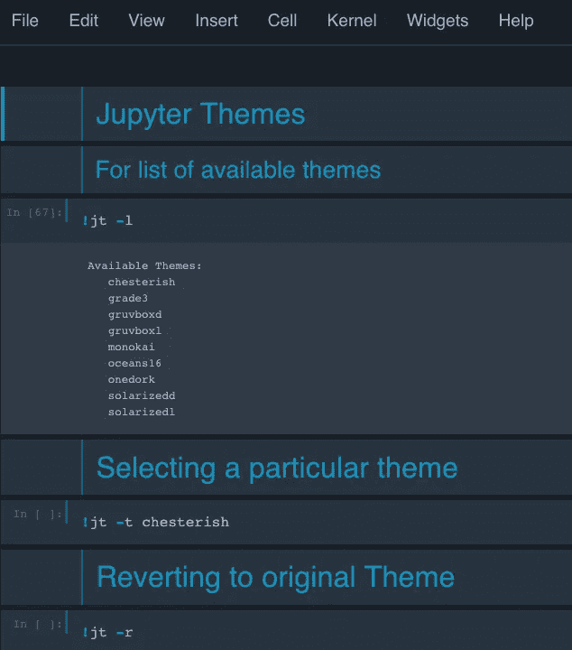****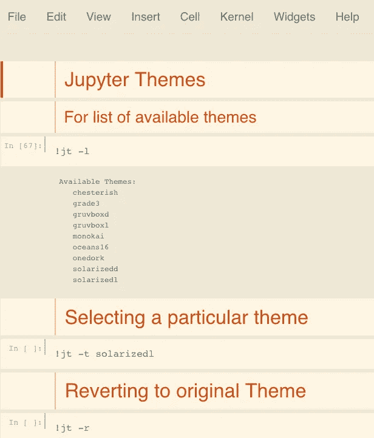**

**Left: **origina**l | Middle: **Chesterish** Theme | Right: **solarizedl** theme**

**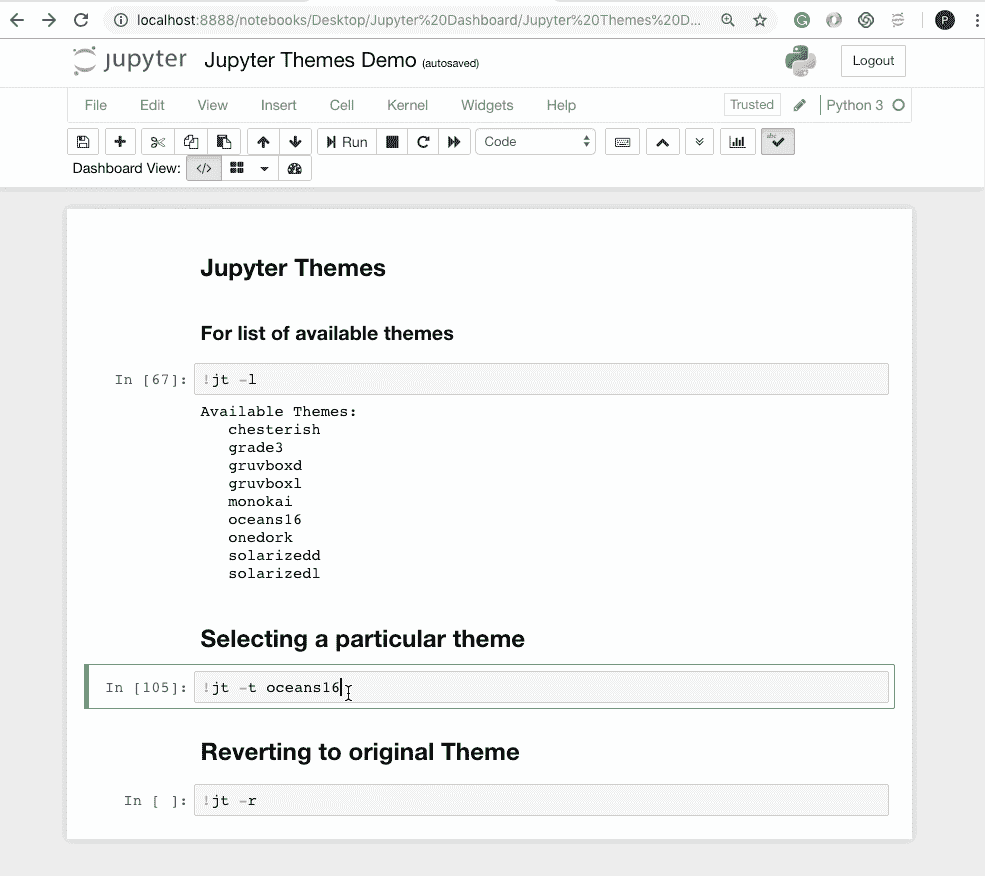**

# **3.笔记本扩展**

*****扩展可能性*****

**笔记本扩展功能让您超越 Jupyter 笔记本的常规使用方式。笔记本扩展(或 nbextensions)是 JavaScript 模块，您可以将其加载到笔记本前端的大多数视图中。这些扩展修改了用户体验和界面。**

## **[安装](https://github.com/Jupyter-contrib/jupyter_nbextensions_configurator#installation)**

**安装 conda:**

```
conda install -c conda-forge jupyter_nbextensions_configurator
```

**或使用画中画:**

```
pip install jupyter_contrib_nbextensions && jupyter contrib nbextension install#incase you get permission errors on MacOS,pip install jupyter_contrib_nbextensions && jupyter contrib nbextension install --user
```

**现在启动一个 Jupyter 笔记本，你应该能看到一个有很多选项的 **NBextensions 标签**。点击你想要的，看看奇迹发生。**

**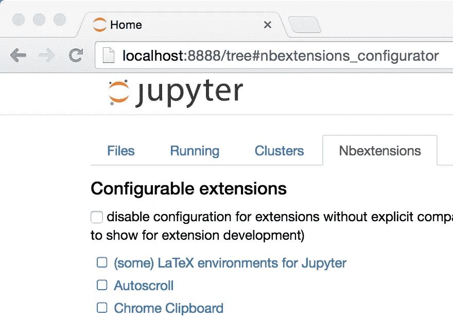**

**如果你找不到标签，可以在菜单`**Edit**` **下找到第二个小的 nbextension。****

**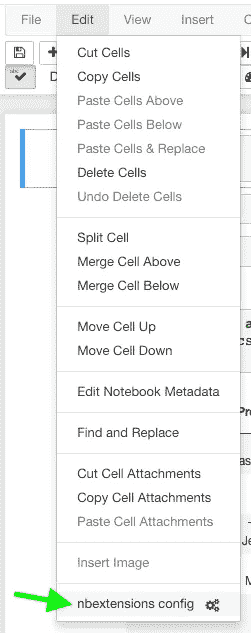**

**让我们讨论一些有用的扩展。**

## **1.内地**

****腹地**为代码单元格中的每一次按键启用代码自动完成菜单，而不仅仅是用 tab 调用它。这使得 Jupyter notebook 的自动补全像其他流行的 ide 一样，比如 PyCharm。**

**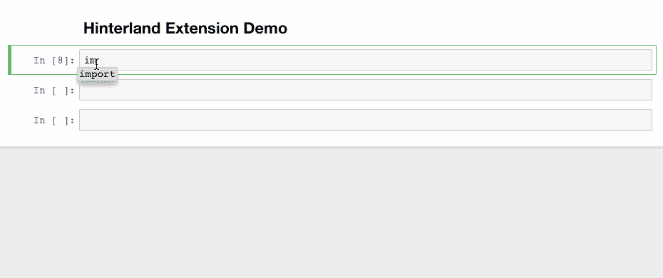**

## **2.片段**

**该扩展向笔记本工具栏添加了一个下拉菜单，允许将代码片段单元格轻松插入到当前笔记本中。**

**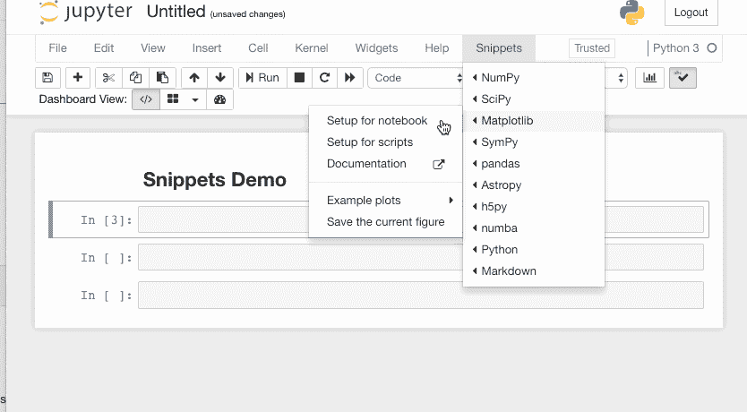**

## **3.分裂细胞笔记本**

**这个扩展将笔记本的单元格分开，然后彼此相邻放置。**

**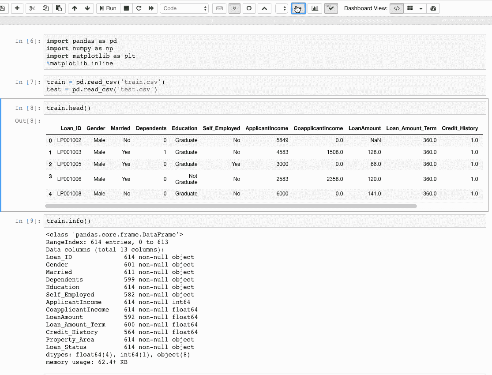**

## **4.目录**

**这个扩展使得能够收集所有正在运行的标题，并在一个浮动窗口中显示它们，作为一个侧边栏或一个导航菜单。该扩展也是可拖动、可调整大小、可折叠和可停靠的。**

**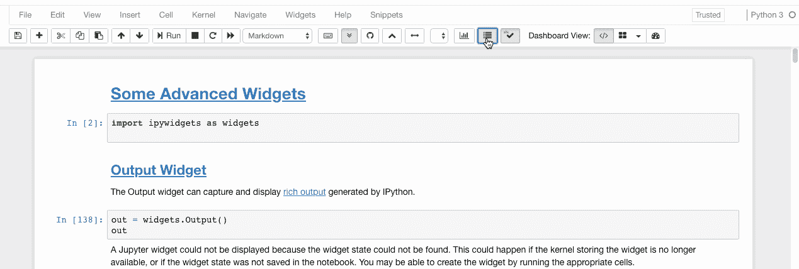**

## **5.可折叠标题**

****可折叠标题 a** 允许笔记本拥有可折叠的部分，由标题分隔。因此，如果你的笔记本中有很多脏代码，你可以简单地折叠它，以避免反复滚动。**

**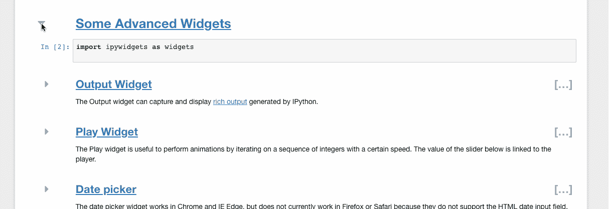**

## **6.Autopep8**

**只需点击一下，Autopep8 就可以帮助重新格式化/修饰代码单元格的内容。如果你厌倦了一次又一次地敲空格键来格式化代码，autopep8 就是你的救星。**

**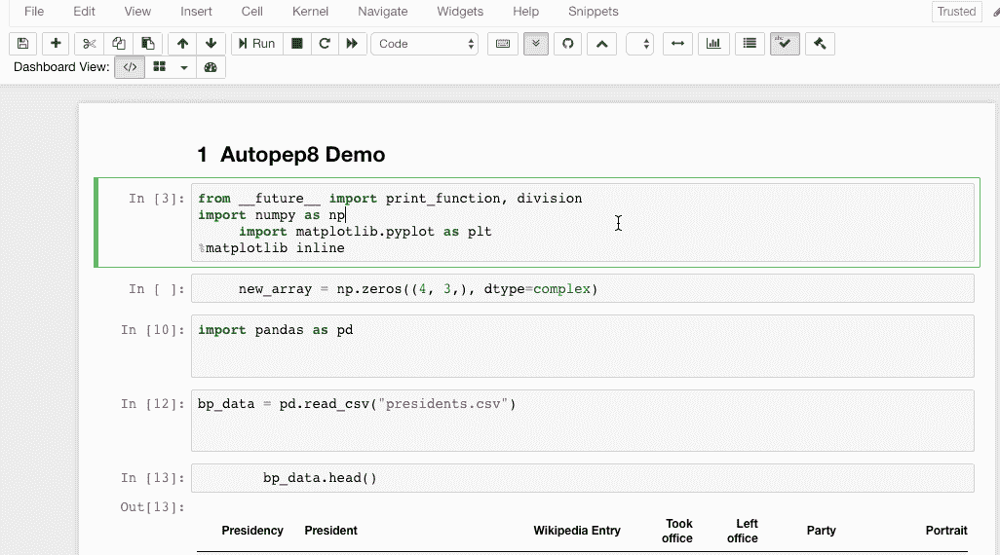**

# **4.Jupyter 小工具**

*****让笔记本互动*****

**小部件是多事件的 python 对象，在浏览器中有一个表示，通常是像滑块、文本框等控件。小部件可以用来为笔记本电脑构建**交互式图形用户界面**。**

## **装置**

```
# **pip**
pip install ipywidgets
jupyter nbextension enable --py widgetsnbextension# **Conda** conda install -c conda-forge ipywidgets#Installing **ipywidgets** with conda automatically enables the extension
```

**让我们来看看一些小部件。完整的细节，你可以访问他们的 [Github 库](https://github.com/jupyter-widgets/ipywidgets/blob/1223d4128aebe6c8831a034a73d1546a91f5138a/docs/source/examples/Using%20Interact.ipynb)。**

****交互****

**`interact`函数(`ipywidgets.interact`)自动创建一个用户界面(UI)控件，用于交互式地浏览代码和数据。这是开始使用 IPython 小部件的最简单的方法。**

```
# Start with some imports!from ipywidgets import interact
import ipywidgets as widgets
```

## **1.基本部件**

```
def f(x):
    return x# Generate a slider 
interact(f, x=10,);
```

**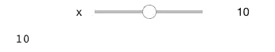**

```
# Booleans generate check-boxes
interact(f, x=True);
```

**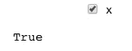**

```
# Strings generate text areas
interact(f, x='Hi there!');
```

**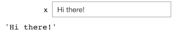**

## **2.高级小部件**

**这里列出了一些有用的高级小部件。**

## **[播放小工具](https://ipywidgets.readthedocs.io/en/stable/examples/Widget%20List.html?highlight=Play%20widget#Play-(Animation)-widget)**

**Play 小部件有助于通过以一定速度迭代整数序列来执行动画。下面滑块的值与播放器相关联。**

```
play = widgets.Play(
    # interval=10,
    value=50,
    min=0,
    max=100,
    step=1,
    description="Press play",
    disabled=False
)
slider = widgets.IntSlider()
widgets.jslink((play, 'value'), (slider, 'value'))
widgets.HBox([play, slider])
```

****

## **[日期选择器](https://ipywidgets.readthedocs.io/en/stable/examples/Widget%20List.html?highlight=Play%20widget#Date-picker)**

**日期选择器小部件可以在 Chrome 和 IE Edge 中工作，但目前不能在 Firefox 或 Safari 中工作，因为它们不支持 HTML 日期输入字段。**

```
widgets.DatePicker(
    description='Pick a Date',
    disabled=False
)
```

**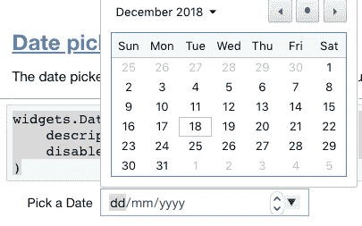**

## **颜色选择器**

```
widgets.ColorPicker(
    concise=False,
    description='Pick a color',
    value='blue',
    disabled=False
)
```

**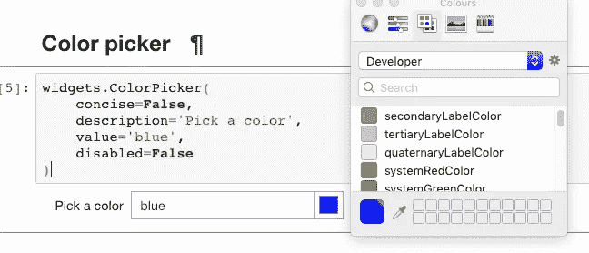**

## **[标签页](https://ipywidgets.readthedocs.io/en/stable/examples/Widget%20List.html?highlight=Play%20widget#Tabs)**

```
tab_contents = ['P0', 'P1', 'P2', 'P3', 'P4']
children = [widgets.Text(description=name) for name in tab_contents]
tab = widgets.Tab()
tab.children = children
for i in range(len(children)):
    tab.set_title(i, str(i))
tab
```

**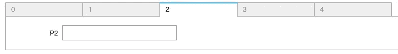**

# **5.Qgrid**

*****使数据帧直观*****

**Qgrid 也是一个 Jupyter 笔记本小部件，但主要集中在数据帧上。它使用 [SlickGrid](https://github.com/mleibman/SlickGrid) 在 Jupyter 笔记本中呈现熊猫数据帧。这使您可以通过直观的滚动、排序和过滤控件来浏览数据框，并通过双击单元格来编辑数据框。Github 库包含了更多的细节和例子。**

# **装置**

**使用 pip 安装:**

```
pip install qgrid
jupyter nbextension enable --py --sys-prefix qgrid# only required if you have not enabled the ipywidgets nbextension yet
jupyter nbextension enable --py --sys-prefix widgetsnbextension
```

**使用 conda 安装:**

```
# only required if you have not added conda-forge to your channels yet
conda config --add channels conda-forgeconda install qgrid
```

**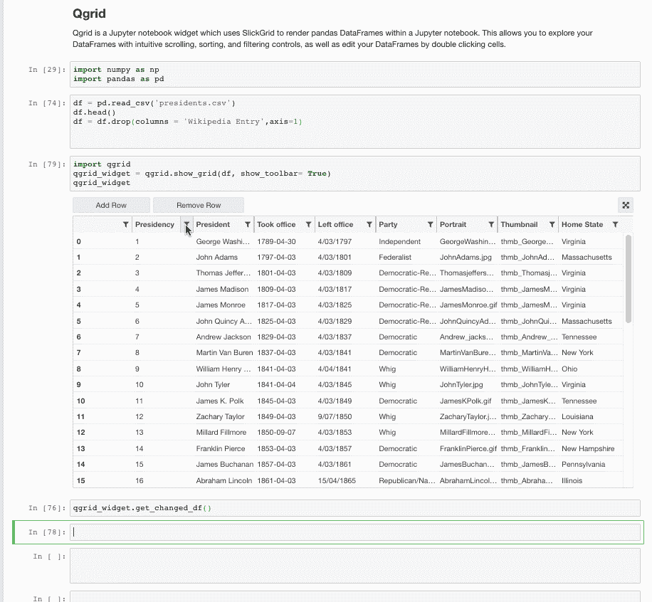**

# **6.幻灯片**

*****沟通时代码是伟大的。*****

**笔记本是教授和编写可解释代码的有效工具。然而，当我们想要展示我们的作品时，我们要么展示整个笔记本(包括所有代码)，要么借助 powerpoint。不再是了。Jupyter 笔记本可以轻松转换成幻灯片，我们可以轻松选择在笔记本上显示什么和隐藏什么。**

**有两种方法可以将笔记本转换成幻灯片:**

## **1.Jupyter 笔记本的内置滑动选项**

**打开一个新笔记本，导航到**视图→单元格工具栏→幻灯片。**每个单元格顶部会出现一个浅灰色条，您可以自定义幻灯片。**

**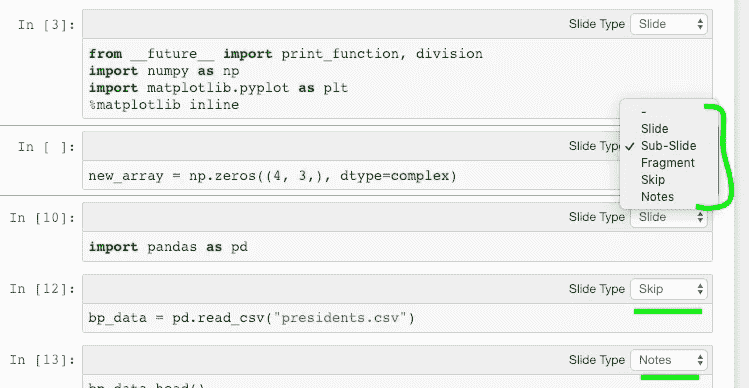**

**现在转到笔记本所在的目录，输入以下代码:**

```
jupyter nbconvert *.ipynb --to slides --post serve
*# insert your notebook name instead of* **.ipynb*
```

**幻灯片在端口 8000 显示。另外，目录中会生成一个`.html`文件，您也可以从那里访问幻灯片。**

**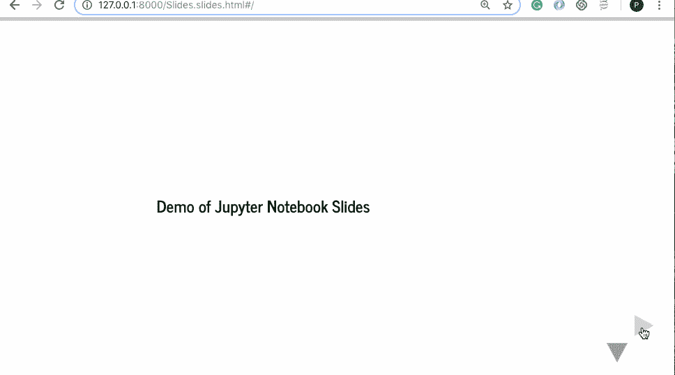**

**如果有主题背景，看起来会更有格调。让我们将主题' **onedork** '应用到笔记本上，然后将其转换为幻灯片。**

**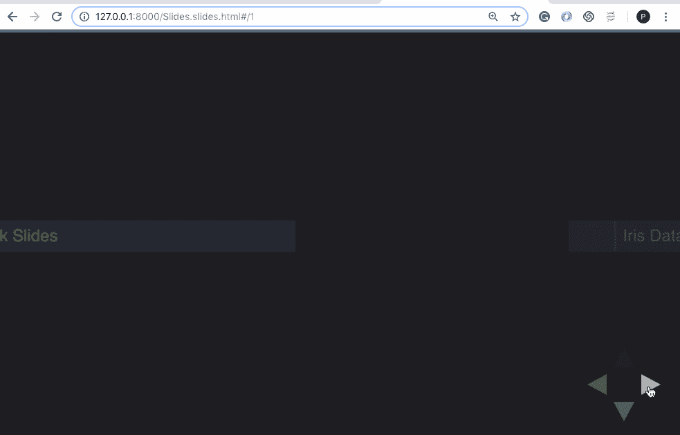**

**这些幻灯片有一个缺点，即你可以看到代码，但不能编辑它。RISE plugin 提供了一个解决方案。**

## **2.使用 RISE 插件**

**RISE 是 **Reveal.js 的缩写——Jupyter/IPython 幻灯片扩展**。它利用 [reveal.js](https://revealjs.com/#/) 来运行幻灯片。这非常有用，因为它还提供了无需退出幻灯片就能运行代码的能力。**

****安装****

**1 —使用 conda(推荐):**

```
conda install -c damianavila82 rise
```

**2 —使用画中画(不太推荐):**

```
pip install RISE
```

**然后再分两步将 JS 和 CSS 安装到正确的位置:**

```
jupyter-nbextension install rise --py --sys-prefix**#enable the nbextension:** jupyter-nbextension enable rise --py --sys-prefix
```

**现在让我们使用 RISE 进行交互式幻灯片演示。我们将重新打开之前创建的 Jupyter 笔记本。现在我们注意到一个新的扩展，上面写着“进入/退出上升幻灯片”**

****

**点击它，你就可以开始了。欢迎来到互动幻灯片的世界。**

**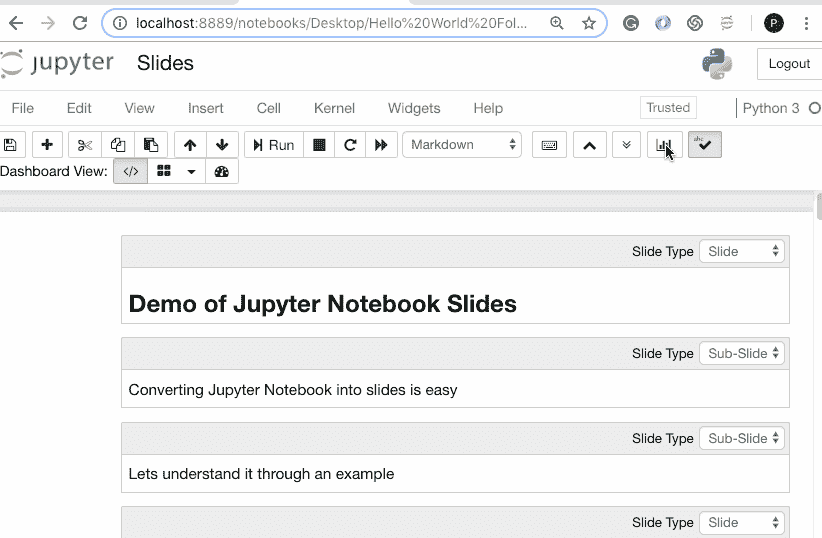**

**更多信息请参考[文件](https://rise.readthedocs.io/en/docs_hot_fixes/customize.html)。**

# **6.嵌入 URL、pdf 和 Youtube 视频**

*****就显示在那里！*****

**当你可以使用 IPython 的[显示](https://ipython.org/ipython-doc/3/api/generated/IPython.display.html)模块轻松地将 URL、pdf 和视频嵌入到你的 Jupyter 笔记本中时，为什么还要选择链接呢？**

## **资源定位符**

```
#Note that http urls will not be displayed. Only https are allowed inside the Iframefrom IPython.display import IFrame
IFrame('[https://en.wikipedia.org/wiki/HTTPS'](https://en.wikipedia.org/wiki/HTTPS'), width=800, height=450)
```

**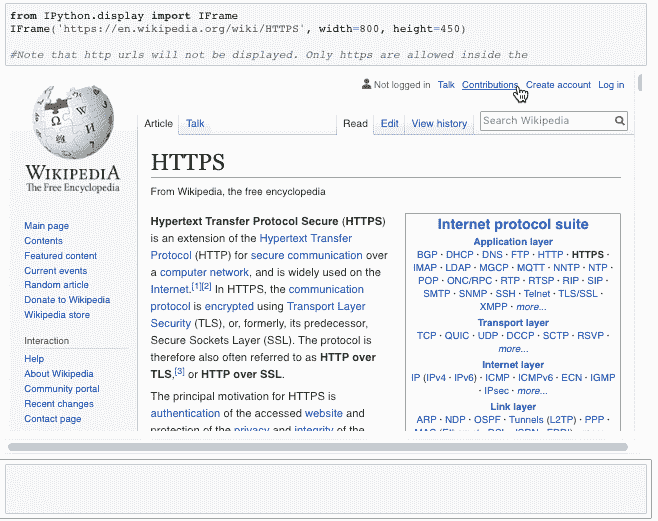**

## **pdf**

```
from IPython.display import IFrame
IFrame('[https://arxiv.org/pdf/1406.2661.pdf'](https://arxiv.org/pdf/1406.2661.pdf'), width=800, height=450)
```

**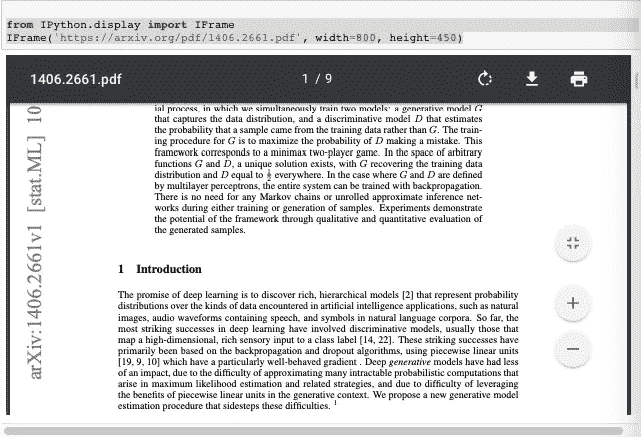**

## **Youtube 视频**

```
from IPython.display import YouTubeVideoYouTubeVideo('mJeNghZXtMo', width=800, height=300)
```

**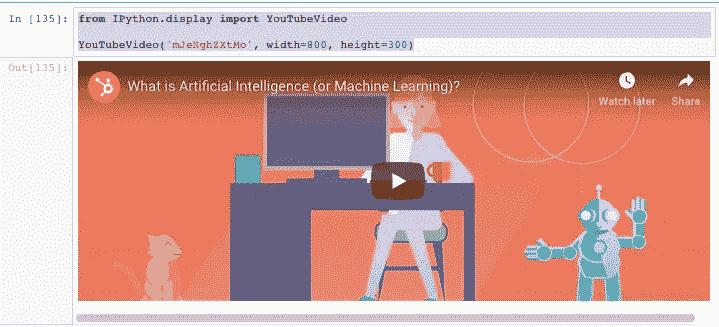**

# **结论**

**以上是 Jupyter 笔记本的一些功能，我觉得很有用，值得分享。有些对你来说是显而易见的，而有些可能是新的。所以，继续用它们做实验吧。希望他们能够节省你一些时间，给你一个更好的 UI 体验。也可以在评论中提出其他有用的功能。**