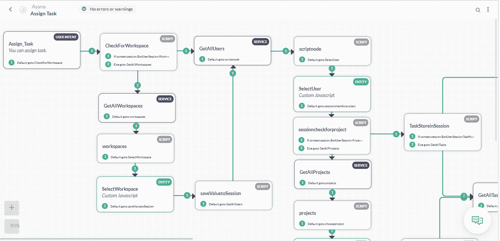
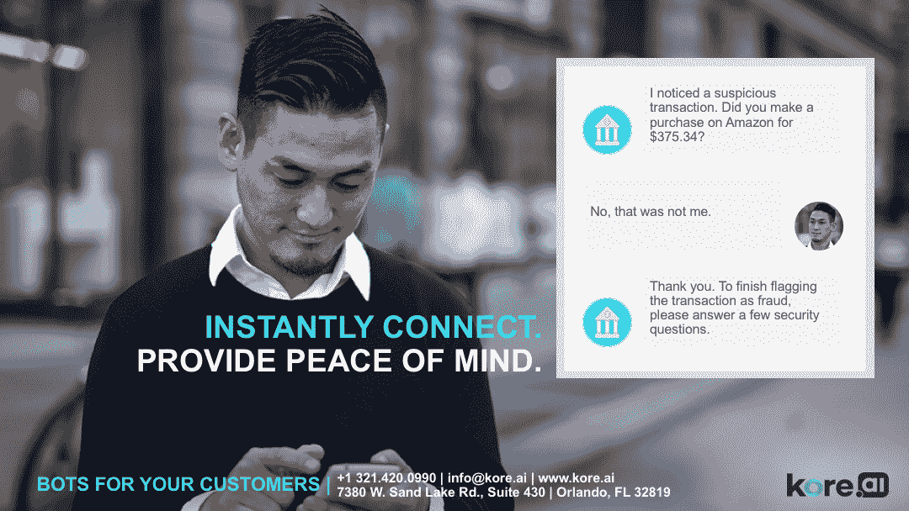

# 顾客幸福吗？为他们建造一个聊天机器人。

> 原文：<https://towardsdatascience.com/build-a-chatbot-for-your-customers-happiness-4f3e6a2c1944?source=collection_archive---------11----------------------->

人工智能(AI)以聊天机器人的形式首次亮相主流商业。各种规模的组织都在构建简单的信使机器人，以便更容易被他们的客户访问，特别是在支持场景中。聊天机器人使用逻辑来帮助人们更快地回答问题，而不是将人们指引到通用的电子邮件地址或服务台。这就像和一个人交谈——只不过你是在和一个机器人交谈。

聊天机器人对于规模较小、资源匮乏的组织尤其有价值。众所周知，各种规模的公司在向客户展示自己时，都会建立更牢固、更有同理心的关系。组织可以通过自动化往往是多余的对话来节省员工的宝贵时间。公司节省资金，提高客户成功的结果，引导人们通过销售周期，并提供支持。

对于不经意的观察者来说，聊天机器人可能看起来很复杂，但它们并不像看起来那么复杂。

简单而有效的聊天机器人在没有编码知识的情况下也是可以构建的。遵循这个框架，用更少的资源在几个小时内构建您的。

# #研究您的聊天机器人的具体使用案例，并据此制定您的计划

Kore.ai 是一个允许人们在没有编程专业知识的情况下构建聊天机器人的工具。这家总部位于美国的公司由设计师、技术专家和学者组成，从用户体验的角度来看，它将自己描述为类似于苹果 Siri 这样的软件。该平台提供的是一种简单的方式来构建满足特定目的的聊天机器人应用程序。

“聊天机器人需要激发对话，”Kore.ai 的创始人拉杰·科内鲁(Raj Koneru)说，“它需要帮助处理自然语言是最佳沟通选择的那部分互动，它在这方面做得很好。一家在全球拥有超过 4.5 万名员工的 10 亿美元公司在内部使用 Kore.ai 的聊天机器人，为每位员工提供轻松的信息访问，以及即时请求创建和警报。该公司还消除了人为错误带来的风险，转而标准化和简化他们的成功方法”

[Kore.ai](https://www.kore.ai) Bot platform 使您能够构建对话机器人，这些机器人可以回答用户的查询，推动用户通过对话来执行业务功能或交易。Kore.ai 使用一种称为自然语言处理双重模式(NLP)的技术，实时适应对话。

在 Kore.ai 中建立对话

该平台结合了两种不同的 NLP 方法(机器学习+基本含义)，可以即时构建对高达 70%的对话有用的对话机器人——无需语言培训即可开始。使用同义词、模式和完整的话语可以非常快速地完成额外的训练，这减少了开发人员提供的手动训练输入的数量，从而减少了启动和运行聊天机器人的时间。如果一开始就有大量的训练数据，也可以从一开始就应用 ML 模型，或者随着时间的推移使用 ML 模型来继续训练机器人以实现更好的意图识别。

“所有这些都是可以定制的，可以由机器人的制造者来训练。因为在 Kore.ai 平台中，所有的服务都是集成的。上下文信息(对话如何展开)被输入到神经网络，使其能够做出更明智的决定。Kore.ai 的首席技术官 Prasanna Arikala 说:“通过这种方式，该引擎允许用户模拟更复杂的对话流，如聊天期间转换对话主题，或从网站浏览行为中获取上下文信息。”

聊天机器人构建者需要采取以下步骤:

*   确定使用案例和渠道
*   设计您的流程、撰写文案并添加多媒体
*   训练你的机器人
*   集成服务
*   确定 KPI 并与测试对象一起评估
*   重复

# #战略性地使用自动化，永远不要取代组织中人的一面

聊天机器人 AI 可能足够智能，可以做出简单的判断，但你构建的东西不会有取代人类同情心的情商。

“如果一家公司主要想降低成本，投资人工智能机器人是一个明智的商业举措，”Kore.ai 的 CMO 赛拉姆·维达姆说

然而，如果目标是客户满意，事情看起来就完全不同了。机器人还不能给出口头暗示，比如偶尔的“mhm”，来保证有人在听。他们也不能在棘手的情况下运用同情心和道德观。这些缺陷阻碍了机器人解决复杂的、个体的问题，而这些问题顾客可能连自己都无法识别。

如今，这种移交可以通过两种方式设计到 Kore.ai 平台上构建的机器人中:开发人员设计一个对话框，其中包含一个节点，在用户提出特定问题或采取其他行动后，可以移交给一个实时代理。这基于 Kore.ai 客户选择的预定义规则和业务逻辑。例如，对于特定类型的问题，您希望人工代理接管对话，或者对于特定类型的客户群或级别，您可能也希望人工代理介入。利用平台的情绪分析工具，开发人员可以设计情绪阈值(例如:如果用户情绪低于 3.0，则为负)，以触发机器人移交给实时代理。一旦移交给代理，当用户在他们使用的任何通道中键入或说话时，消息将进入实时代理已经使用的软件中的聊天线程，允许他们无缝地响应用户，反之亦然。Kore.ai 的平台已经测试了与 Live Chat Inc，Genesys 等的集成。，并且可以轻松地与其他呼叫中心解决方案集成，作为我们客户的定制功能。

自 90 年代中期以来，[美国客户满意度指数](https://www.theacsi.org/national-economic-indicator/us-overall-customer-satisfaction)的最大跌幅发生在 2013 年至 2015 年间。在这一时期，许多技术变革正在发生，包括互联网接入的增加、市场和独立电子商务商店的增长，以及客户对更快服务的期望的改变。市场上需要企业提供更有同情心和更有知识的客户服务代理。尽管有这个令人清醒的统计数据，[32%的组织计划将客户服务从现场协助转变为自动化服务，剥夺了客户与品牌进行更有效对话和互动的机会。](http://www.execsintheknow.com/wordpress/wp-content/uploads/2017/01/2016-CXMB-Series_Corporate-Edition_Resized.pdf)

“在创建聊天机器人时，用户体验需要放在第一位，其次才是技术。Tech Republic 说:“聊天机器人就像一个婴儿，需要培养和教导，你不能只建立一个聊天机器人就让它走了。”

“当企业考虑在联络中心实施人工智能和机器学习时，请记住，技术不应该取代人类，”赛拉姆说。“相反，它应该提高他们的生产力，让人们参与并培养与客户的关系，让你的品牌与众不同。确保你的组织不会变成一个不知名的实体。”

聊天机器人不是人，所以避免用它们来代替人。相反，把聊天机器人看作是一种让生活变得更好的工具。

# #必须优先考虑安全性，而不是事后才想到

聊天机器人是新的数字通信媒介，这意味着它们给企业带来了新的漏洞。任何负责构建聊天机器人的人都需要在计划中采取措施来防止潜在的安全漏洞。每一次对话都为一个坏演员打开了新的通道。

安全性对一切数字化事物的影响程度无需赘述。要了解安全性正在成为一个多么重要的考虑因素——对于即使是最小的企业也必须做出的每一个微决策——[看看来自加州大学圣地亚哥分校、萨尔兰大学和特温特大学的这份报告](http://ucsdnews.ucsd.edu/pressrelease/a_third_of_the_internet_is_under_attack),看看攻击的范围有多广。

“即使是非技术人员也可以通过 [DDoS 即服务提供商(即 Booters)](https://www.theregister.co.uk/2016/09/12/denial_of_service_as_a_service/) 发起重大攻击，”该研究的第一作者 Mattijs Jonker 说。"人们可以向他人支付订阅费，只需几美元。"

为了应对潜在的不良行为者——可能看起来像自动化或机器人的聊天机器人用户——了解在哪里采取预防措施很重要。关键是关注客户参与聊天机器人对话的原因，以便您可以实施贵公司特有的安全协议作为预防措施。

这里有一些数据可以帮助聊天机器人的开发者理解聊天机器人的用例，并将其吸收到他们的策略中。

*   超过一半的搜索该类别的人在社交媒体上寻求与客户互动的帮助(55%)
*   最具前瞻性的[聊天机器人平台](https://kore.ai/bots-platform/)，脸书，已经取得了明显的收益，超过三分之二的受访者称其拥有聊天机器人参与的理想平台。
*   买家寻求帮助的其他领域包括客户服务(27%)、购物和下订单(24%)以及收集线索信息(39%)。
*   一家最大的零售商很好地利用了这一点，通过聊天机器人提供实时时尚推荐。通过询问顾客本季的流行风格，这款应用“游戏化”了销售过程的各个方面，让那些可能不确定自己想要什么的顾客在网上购物变得有趣。
*   一家领先的旅游服务提供商利用聊天机器人作为 24/7 自助客户支持平台，不仅可以解决客户关于航班的查询，还可以帮助客户预订酒店。因此，简化了客户支持流程，从而带来了总体收入
*   一家最大的投资银行最近推出了一款聊天机器人，能够更快、更有效地分析复杂的法律合同。自推出以来，该机器人仅在 6 个月内就帮助了公司超过 360，000 小时的人力

谢谢你

法尼·马鲁帕卡，

产品营销和解决方案布道者—聊天机器人|AL、NLP、ML | https://www.linkedin.com/in/phani-marupaka-02646b33/ |区块链|