# 用 R 构建一个加密货币交易机器人

> 原文：<https://towardsdatascience.com/build-a-cryptocurrency-trading-bot-with-r-1445c429e1b1?source=collection_archive---------2----------------------->

Photo by [Branko Stancevic](https://unsplash.com/@landb?utm_source=medium&utm_medium=referral) on [Unsplash](https://unsplash.com?utm_source=medium&utm_medium=referral)

***请注意，本教程中使用的 API 已经不再使用。考虑到这一点，这篇文章应该作为示例来阅读。*

交易者的思想是任何交易策略或计划中的薄弱环节。有效的交易执行需要与我们的本能背道而驰的人类输入。我们应该在我们爬行动物的大脑想卖的时候买。当我们的直觉希望我们买更多的时候，我们应该卖出。

如果加密货币的构成非常关键，那么交易加密货币就更加困难。年轻和新兴市场充斥着“泵组”，它们助长了强烈的 FOMO(害怕错过)，将价格推高，然后再将价格推回地面。许多新手投资者也在这些市场交易，这些投资者可能从未在纽约证券交易所交易过。在每笔交易中，都有一个创造者和一个接受者，精明的加密投资者发现利用充斥这个领域的新手很容易。

为了将我的情绪从加密交易中分离出来，并利用 24/7 开放的市场，我决定建立一个简单的交易机器人，它将遵循简单的策略，并在我睡觉时执行交易。

许多被称为“机器人交易员”的人使用 Python 编程语言来执行这些交易。如果你在谷歌上搜索“加密交易机器人”，你会在各种 Github 存储库中找到 Python 代码的链接。

我是数据科学家，R 是我的主要工具。我搜索了一个关于使用 R 语言构建交易机器人的教程，但是一无所获。当我发现包 [rgdax](https://cran.r-project.org/web/packages/rgdax/index.html) 时，我开始构建自己的包来与 [GDAX API](https://docs.gdax.com/) 接口，它是 GDAX API 的 R 包装器。下面是一个拼凑交易机器人的指南，你可以用它来建立自己的策略。

# 战略

简而言之，我们将通过 rgdax 包装器通过他们的 API 在 GDAX 交易所交易以太币-美元对。我喜欢交易这一对，因为以太坊(ETH) 通常处于看涨立场，这使得这一策略大放异彩。

注意:这是一个超级简单的策略，在牛市中只会赚几个钱。对于所有的意图和目的，使用它作为建立你自己的策略的基础。

当[相对强弱指数(RSI)](https://www.investopedia.com/terms/r/rsi.asp) 指标组合指向暂时超卖市场时，我们将买入，假设多头将再次推高价格，我们可以获利。

一旦我们买入，机器人将输入三个限价卖单:一个是 1%的利润，另一个是 4%的利润，最后一个是 7%的利润。这使我们能够快速释放资金，进入前两个订单的另一个交易，7%的订单提高了我们的整体盈利能力。

# 软件

我们将使用 [Rstudio](https://www.rstudio.com/) 和 Windows 任务调度器定期(每 10 分钟)执行我们的 R 代码。你需要一个 [GDAX](https://www.gdax.com/) 账户来发送订单，还需要一个 Gmail 账户来接收交易通知。

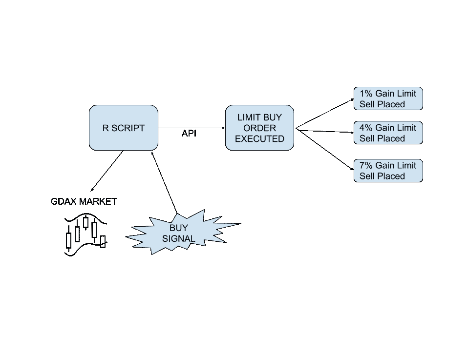

Our Process

# 第 1 部分:调用库和构建函数

我们将从调用几个库开始:

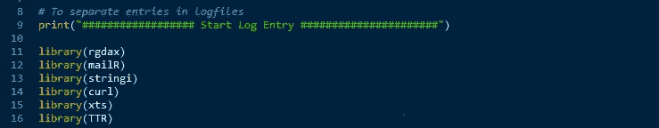

rgdax 包提供了 GDAX api 的接口，mailR 用于通过 Gmail 帐户向我们发送电子邮件更新，stringi 帮助我们解析来自 JSON 的数字，TTR 允许我们执行技术指标计算。

**功能:*curr _ bal _ USD*&*curr _ bal _ eth***

您将在 api 部分使用从 GDAX 生成的 API 密钥、秘密和密码短语。这些函数查询您的 GDAX 帐户的最新余额，我们将在交易中重复使用这些余额:

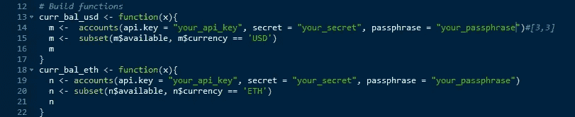

**功能:RSI**

我们将使用 RSI 或相对强弱指数作为这一策略的主要指标。 *Curr_rsi14_api* 使用 15 分钟蜡烛线获取最近 14 个周期的 rsi 值。 *RSI14_api_less_one* 等等拉入之前时段的 RSI:

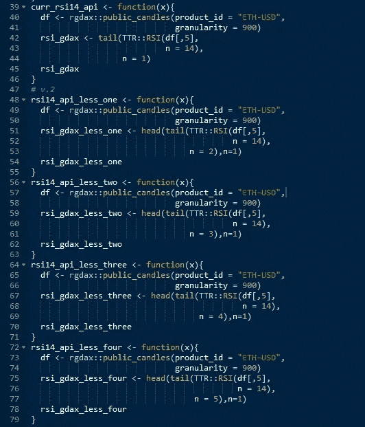

**功能:*出价&询问***

接下来，我们需要当前的出价，并为我们的策略询问价格:

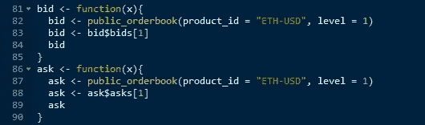

**功能: *usd_hold、eth_hold* 和 *cancel_orders* 和**

为了让我们以迭代的方式下限价单，我们需要能够拉进我们已经下的订单的当前状态，并且能够取消已经在订单簿上移动得太远而无法完成的订单。对于前者，我们将使用 rgdax 包的“holds”功能，对于后者，我们将使用“cancel_order”功能:

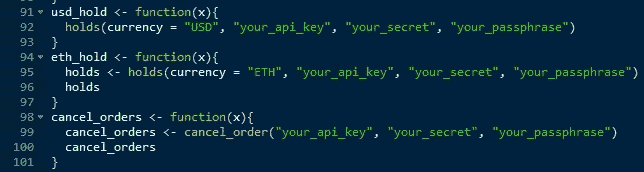

**功能:*buy _ exe***

这是实际执行我们的限价单的重要功能。这个函数有几个步骤。

> 1.Order_size 函数计算我们可以购买多少 eth，因为我们希望每次购买尽可能多的 eth，减去 0.005 eth 以考虑舍入误差
> 
> 2.我们的 WHILE 函数在我们的 ETH 仍然为零时发出限价单。
> 
> 3.以 bid()价格添加一个订单，系统休眠 17 秒钟以允许订单被执行，然后检查订单是否被执行。如果不是，则重复该过程。

# 第 2 部分:存储变量

接下来，我们需要存储一些我们的 RSI 指标变量作为对象，以便交易循环运行得更快，并且我们不会超过 API 的速率限制:

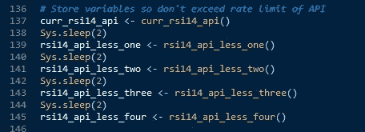

# 第 3 部分:交易循环执行

到目前为止，我们一直在准备函数和变量，以便执行交易循环。以下是实际交易循环的口头演练:

如果我们账户的美元余额大于 20 美元，我们将开始循环。接下来，如果当前的 RSI 大于或等于 30，而前一期的 RSI 小于或等于 30，并且前 3 期的 RSI 至少有一次小于 30，那么我们就用当前的美元余额尽可能多地买入 ETH。

接下来，我们将购买价格保存到一个 CSV 文件中。

然后，我们给自己发一封电子邮件，提醒我们购买行动。

然后循环输出“buy ”,这样我们可以在日志文件中跟踪它。

然后系统休眠 3 秒钟。

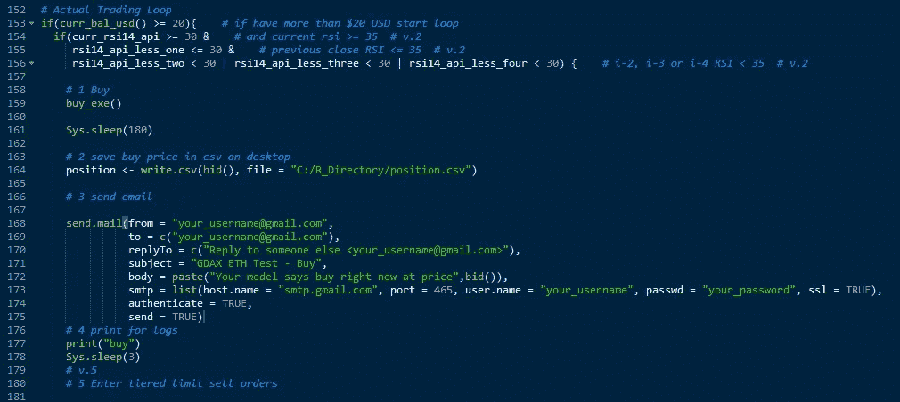

现在，我们输入 3 层限价单来获利。

我们的第一个限价卖单获利 1%，第二个获利 4%，最后一个获利 7%。

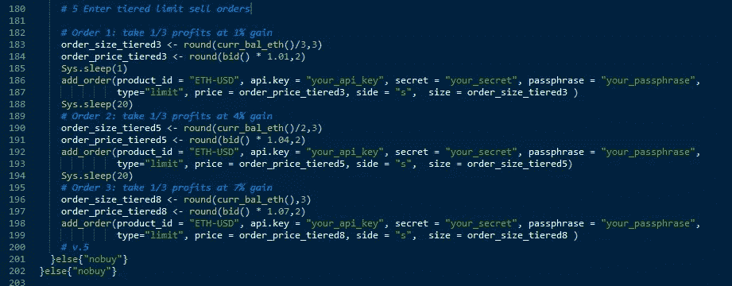

就这样，这就是整个剧本。

# 第 4 部分:使用 Windows 任务计划程序自动化脚本

这个机器人的全部目的是消除交易中的人为错误，让我们不必出现在屏幕前就可以进行交易。我们将使用 Windows 任务计划程序来完成这一任务。

## 使用 Rstudio 插件调度脚本

使用方便的 Rstudio 插件轻松安排脚本:

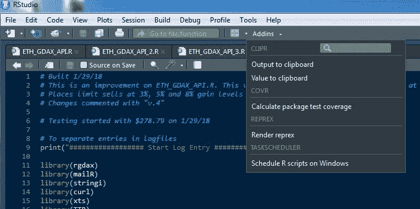

## 使用任务计划程序修改计划的任务

导航到由 Rstudio 插件创建的任务，并调整触发器以您希望的时间间隔触发。在我的例子中，我无限期地选择每 10 分钟一次。

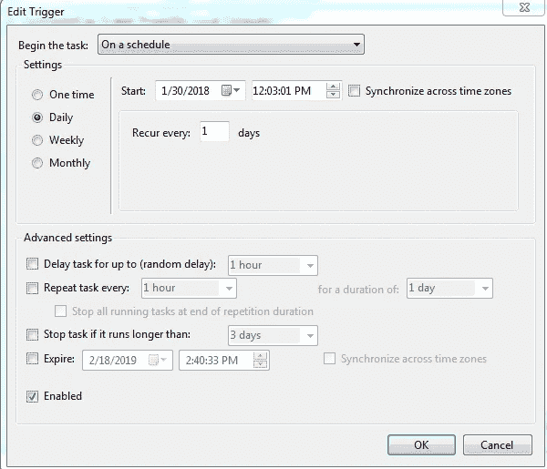

## 使用日志文件关注您的任务

每次运行脚本时，它都会在文本日志文件中创建一个条目，这允许您排除脚本中的错误:

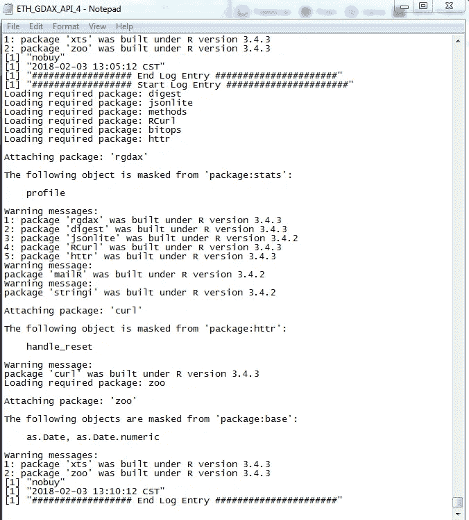

您可以看到“开始日志条目”和“结束日志条目”打印功能如何方便地将我们的条目分开。

# 让它成为你自己的

您可以修改这个脚本，让它变得简单或复杂。我正在改进这个脚本，添加了来自 Tensorflow for Rstudio 的 Keras 模块的神经网络。这些神经网络为脚本增加了指数级的复杂元素，但对于发现数据中的隐藏模式来说却非常强大。

此外，TTR 包为我们提供了大量的财务函数和技术指标，可用于改进您的模型。

综上所述，不要玩你输不起的钱。市场不是一场游戏，你可能会输得精光。

[链接到 Github 上的完整源代码](https://github.com/beavertrapper07/GDAX_Trader/blob/master/GDAX_Trader.R)

