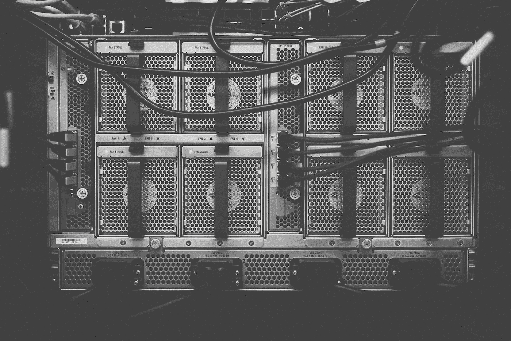
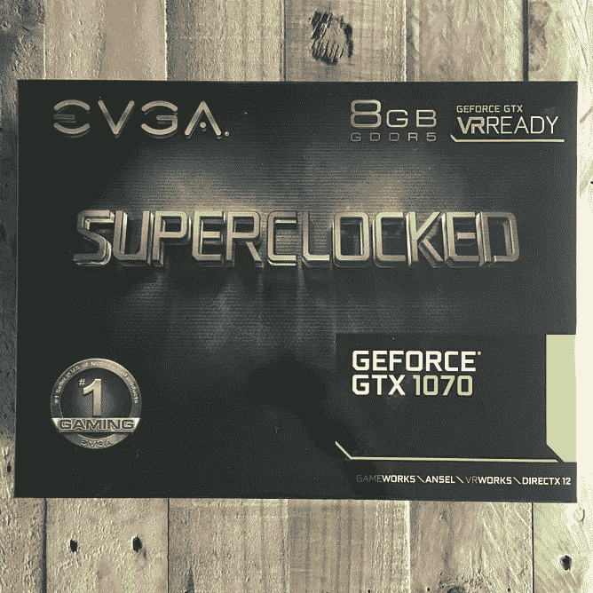
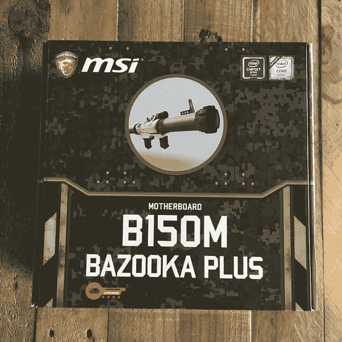
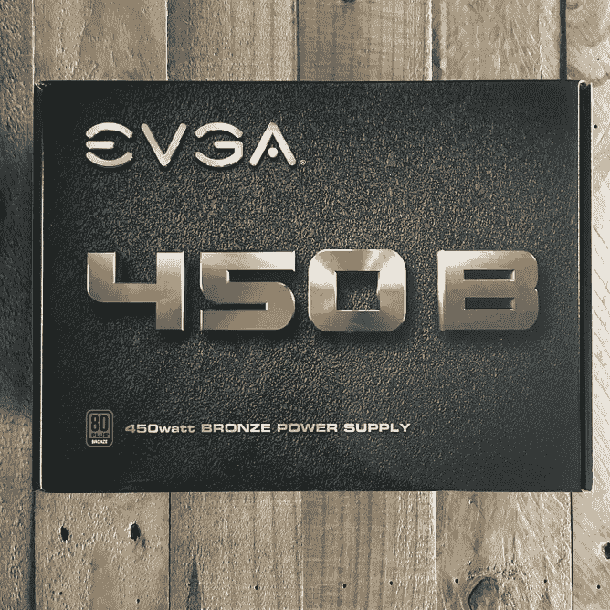
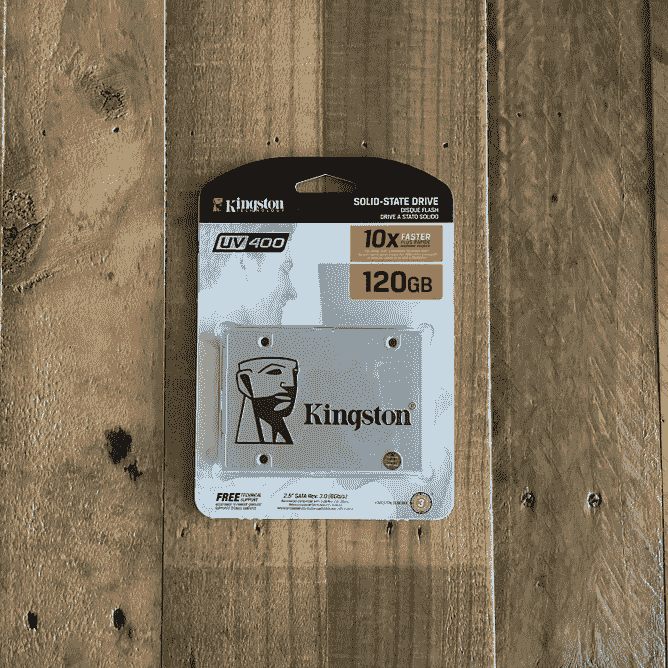
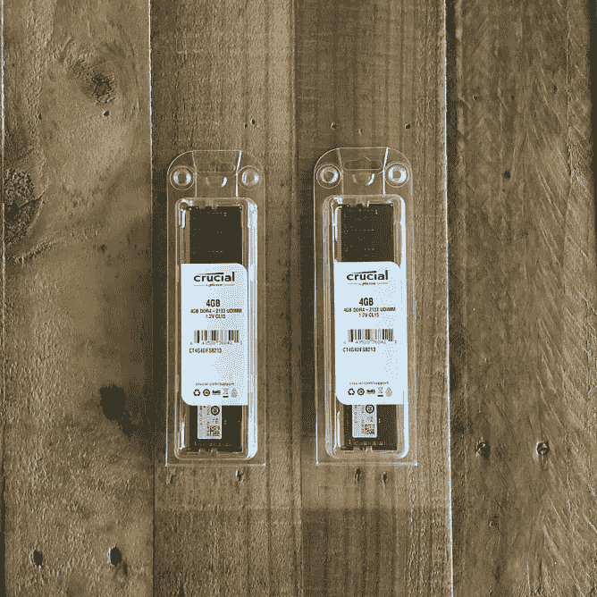
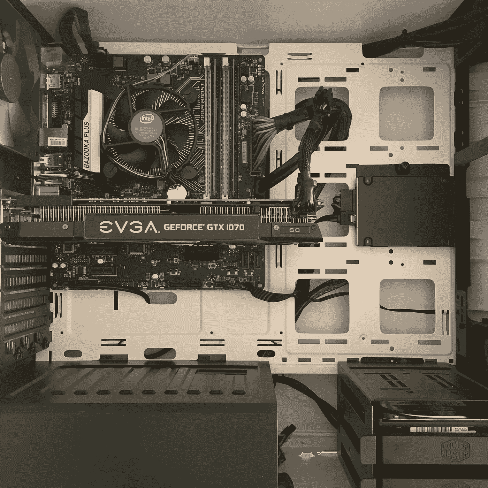

# 花 1000 加元打造一台深度学习 PC

> 原文：<https://towardsdatascience.com/build-a-deep-learning-pc-for-1-000-cad-f3c5f26ba134?source=collection_archive---------0----------------------->

## 因为加拿大人也很便宜

[Photo by: Thomas Kvistholt](https://unsplash.com/@freeche) [Copenhagen](https://unsplash.com/search/copenhagen-denmark)

在参与了由 [Fast.ai](http://www.fast.ai/) 创始人[瑞秋·托马斯](https://medium.com/u/ee56d0bac1b7?source=post_page-----f3c5f26ba134--------------------------------)和[杰瑞米·霍华德](https://medium.com/u/34ab754f8c5e?source=post_page-----f3c5f26ba134--------------------------------)创建的一个名为[程序员实用深度学习](http://course.fast.ai)的 MOOC 之后，我第一次想到要建立自己的深度学习机器。

课程本身并不要求你有自己的设置，而是使用 AWS(在我写作时，我正在学习第 1 部分的第 3 课)。不幸的是，为课程使用 p2 实例支付 0.90 美元/小时的费用很快就会增加。但对我来说，我最大的问题不是成本——我限制使用 AWS 来降低成本——而是生产率。

想象一下本地工作的周转时间——将文件传输到 AWS 来运行测试，失败，关闭 AWS，在本地重新思考问题，并重新做一遍——从生产力的角度来看，这是不合理的。

值得庆幸的是，有很多学生有类似的问题或成本问题，并在我之前铺平了道路，如 [Brendan Fortuner](https://medium.com/u/b51c67c513a3?source=post_page-----f3c5f26ba134--------------------------------) 和 [Sravya Tirukkovalur](https://medium.com/u/69a655fa6c1e?source=post_page-----f3c5f26ba134--------------------------------) ，以及来自 [fast.ai 课程论坛](http://forums.fast.ai/t/making-your-own-server/174)、Tim Dettmers 的[深度学习硬件指南](http://timdettmers.com/2015/03/09/deep-learning-hardware-guide/)和 O'Reilly.com [建造一台低于 1000 美元的“超快”DL 机器](https://www.oreilly.com/learning/build-a-super-fast-deep-learning-machine-for-under-1000)的大量灵感。

伟大的建议和建议的组件列表，但他们都有一些缺失。

1.  加拿大的价格(很少的电子公司和没有大的交易)
2.  “足够快/足够好”的版本(我真的需要 2 个 GPU 和一个英特尔酷睿 i7 处理器吗！？！？)

为什么是 1000 美元？因为最新和最棒的 NVIDIA GPU GTX 1080Ti 基本上是 1K CAD，所以我认为这是一个很好的价格目标。

## **假设:**

> 花 1000 加元就可以建造一台“快速”深度学习机器

## 预测:

> 如果我使用多个在线供应商和折扣/销售，我可以将预算/初学者深度学习机器的成本降低到 1000 美元，同时仍然允许未来的扩展(更多的 RAM，更好的 GPU 等)

当然，术语“快”是相对的，我也使用了“预算/初学者”，所以让我们限定一下:我认为初学者是像我这样的人，他对 DL 感兴趣，要么正在学习 DL 课程，要么正在积极参加 Kaggle 比赛(或者两者都有)。在这种情况下，您需要一台速度足够快的机器，这样您的端到端实验/测试不会影响您的工作效率。

生产力何时开始下降并没有固定的数字，所以我将尝试用我一直使用的 AWS p2 实例来测试性能。

由于我不想重复其他人提供的所有伟大的建议，下面我给你我对每个组件的想法，以及我为什么选择它们。主要是，我有两个总是需要回答“是”的问题。

1.  (目前)够好了吗？
2.  **我可以以后再升级吗(不需要重建一个全新的盒子)？**

Btw，强烈推荐 [PCPartsPicker](https://ca.pcpartpicker.com/) ，太牛逼了！你可以在最后找到我的组件列表的链接。

A little eye candy before we get started

# 中央处理器

这是一个棘手的问题。深度学习机器都是关于 GPU 的，所以理论上我可以得到最便宜的 CPU，对吗？也许，从我在网上读到的一切来看，这似乎是普遍的共识，但你仍然需要不要购买会成为你 GPU 瓶颈的组件。

> ***英特尔 i3***

[比较您的英特尔酷睿 i3、5 & 7 芯片](http://www.makeuseof.com/tag/intel-core-i3-vs-i5-vs-i7-one-really-need/)

# 国家政治保卫局。参见 OGPU

市场上最新的卡是 GTX 1080Ti，我不会说你为什么要买 NVIDIA，你只要买就行了。但是你需要最新最好的吗？在加拿大，1080Ti 基本上是 1000 美元起。

1.  这是我应该花钱的地方吗？是啊！
2.  Cuda 内核有多重要？很多！
3.  一个 1070 或者 1060 够好吗？是啊！

> ***EVGA GTX 1070***

# 储存；储备

让我们长话短说。我正在努力达到 1000 美元大关，所以我有非常具体的需求…

1.  足够存储完成课程所需的任何数据
2.  足够的存储空间，可用于 Kaggle 比赛和个人项目

固态硬盘比硬盘更贵，但从长远来看更快更好。

> ***金士顿固态硬盘 120GB***

# 主板和机箱

对于“mobo”(显然这是主板的简称)有一些事情要记住…

*   主板的外形会影响机箱大小，有时还会影响成本(ATX > mATX)
*   确保你的 GPU 可以放在你的箱子里(特别是如果你买的是很漂亮的那种)
*   检查内存插槽，PCIe，如果 SLI 是受支持的(你不希望主板规定你可以选择哪些组件)。

如果你使用电脑零件选择器，兼容性问题应该不是问题。我想要一个有成长空间的简约盒子。我决定在微 ATX 董事会和 ATX 的情况。

我的主板只有 1 个 PCIe x16 插槽，但我真的需要并行运行两个 GPU 吗？升级的话我就把 1070 卖了买个 1080Ti(还是 1090？1100?等等)。

> ***微星微 ATX 和 ATX 中塔***

# 电源装置(PSU)

回顾网上的文章，人们有一台正在运行的机器，但是东西坏了或者不能正常工作，这种情况似乎很常见。它们最终都用更强大的力量解决了。

为了避免令人讨厌的调试问题，我选择了一款合适但便宜的 PSU。再问一次，够不够好？我可以以后升级吗？是的，都是。

> **EVGA 450 w**

# 记忆

> 散热器？我们要去的地方，不需要散热器([回到未来](https://youtu.be/flge_rw6RG0)参考，以防你今天跑得慢)。

我们在省钱，对吧？那么大部分 RAM 就是 RAM，忽略 RAM 的散热器的市场营销…尽管它们看起来很酷。

我们要用 DDR 4(“2133”因为主板不能处理更多，即使 RAM 可以)。购买 2，4GB 而不是 1 8GB 的记忆棒。听说了一些关于双通道的伟大之处，但不知道是不是真的。

> ***关键 4GB DDR 4–2133(2x)***

# 最终结果

A lot of room to grow (2TB HDD salvaged from old PC)

把所有东西放在一起非常简单。为我的深度学习环境安装软件将是一个更大的挑战。

*更新:用 Nvidia GPU 安装 Ubuntu 非常困难。*

但在此之前，让我们先解决一些细节问题。

**不含税:**加拿大的税是个痛。他们一有机会就会毁了你的一天。一旦包括在内，账单将超过 1000 美元，但我懒得在订购零件之前手动计算，所以我们将忽略税务员。

邮寄返利:我无法抗拒一笔好交易的冲动，这笔交易帮助我将成本降低到略低于 1000 美元。我能拿回我的钱吗？大概不会。但是如果我幸运的话，在 8 到 10 周内。总之，我“节省”了大约 35 美元。

**运输+处理:**虽然 PC Parts Picker 试图将它包括在内，但它很难显示何时有额外成本。一些零件的运费+手续费约为 11 美元，而其他商店的基本价格高出 5 美元，但不含运费+手续费。做一点工作，为自己省钱。

**其他:**显示器、键盘、鼠标、机箱外风扇、CPU 冷却器等。那些都被遗漏了。我确实有几个键盘和一个显示器，但因为这是一台 DL 机器，我真的不需要它们(我将主要使用我的 mac book 上的 ssh)。同样，目前不需要额外的机箱风扇或 CPU 冷却器。

**最终名单:**

*   **GPU**:EVGA GeForce GTX 1070 8GB SC 游戏 ACX 3.0
*   **CPU** :英特尔酷睿 i3–6100 3.7 GHz 双核处理器
*   **主板**:微星 B150M 火箭筒加微型 ATX
*   **内存**:至关重要的 4GB(2x4gb)DDR 4–2133 内存
*   **存储**:金士顿 SSDNow UV400 120GB
*   **案例**:冷却器主箱 5 ATX 中塔案例
*   **电源**电源:EVGA 450W 80+青铜认证 ATX 电源

**总价:997.43 美元**