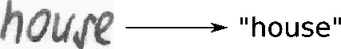
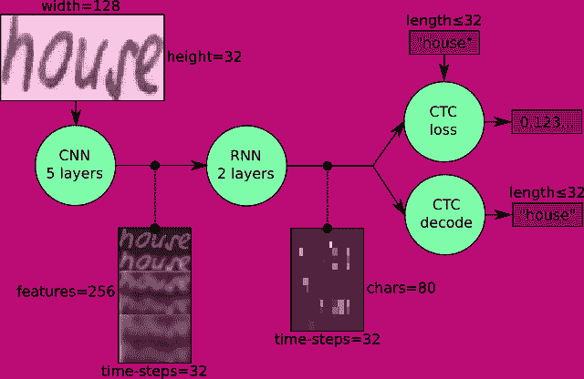
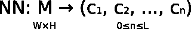
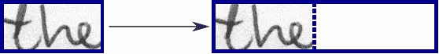
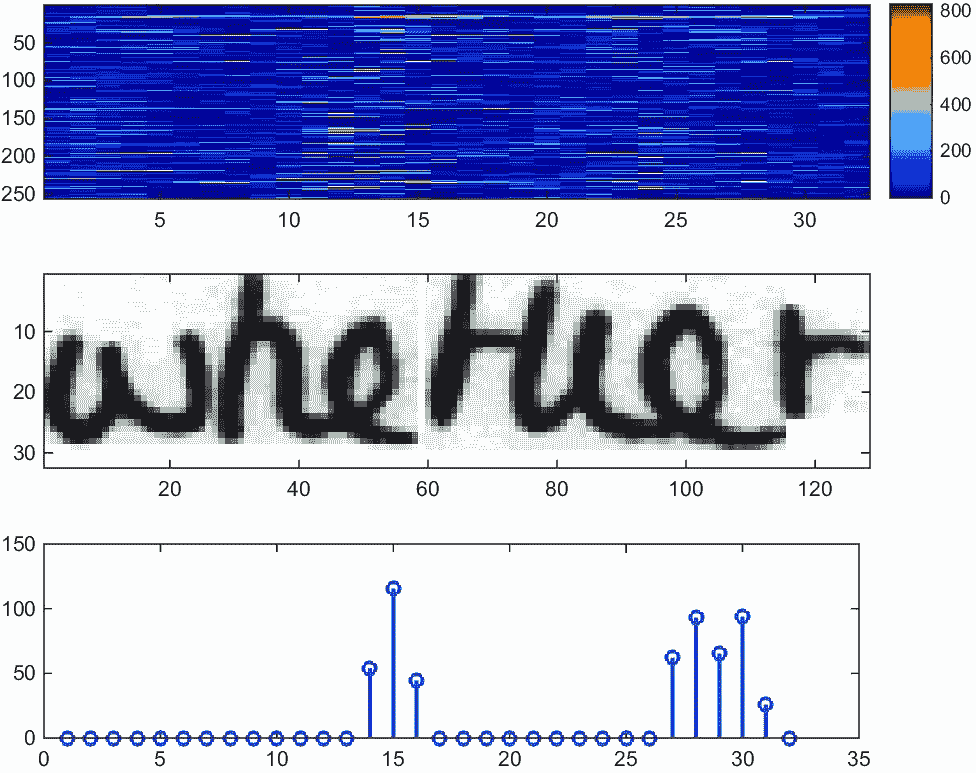
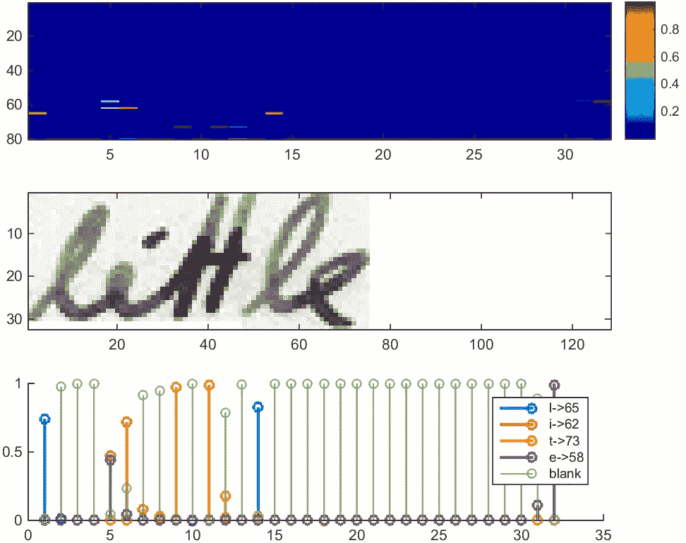
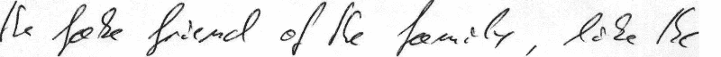

# 使用 TensorFlow 构建手写文本识别系统

> 原文：<https://towardsdatascience.com/build-a-handwritten-text-recognition-system-using-tensorflow-2326a3487cd5?source=collection_archive---------1----------------------->

## **可在 CPU 上训练的最小神经网络实现**

离线手写文本识别(HTR)系统将包含在扫描图像中的文本转录成数字文本，图 1 中示出了一个例子。我们将建立一个神经网络(NN ),它是根据来自 IAM 数据集的单词图像进行训练的。由于文字图像的输入层(以及所有其他层)可以保持较小，因此 NN 训练在 CPU 上是可行的(当然，GPU 会更好)。这个实现是 HTR 使用 TF 所需的最低要求。

Fig. 1: Image of word (taken from IAM) and its transcription into digital text.

# 获取代码和数据

1.  你需要安装 Python 3，TensorFlow 1.3，numpy 和 OpenCV
2.  从 GitHub 获取实现:要么采用本文所基于的[代码版本](https://github.com/githubharald/SimpleHTR/tree/97c2512f593760b14669b37a159ead2f1e54961b)，要么采用[最新的代码版本](https://github.com/githubharald/SimpleHTR)，如果你可以接受文章和代码之间的一些不一致
3.  更多说明(如何获取 IAM 数据集、命令行参数等)可以在自述文件中找到

# 模型概述

我们使用神经网络来完成我们的任务。它由卷积神经网络(CNN)层、递归神经网络(RNN)层和最终的连接主义者时间分类(CTC)层组成。图 2 显示了我们的 HTR 系统的概况。

Fig. 2: Overview of the NN operations (green) and the data flow through the NN (pink).

我们也可以用一种更正式的方式把神经网络看作一个函数(见等式)。1)它将大小为 W×H 的图像(或矩阵)M 映射到长度在 0 和 l 之间的字符序列(c1，c2，…)。正如您所看到的，文本是在字符级别上被识别的，因此未包含在训练数据中的单词或文本也可以被识别(只要单个字符被正确分类)。

Eq. 1: The NN written as a mathematical function which maps an image M to a character sequence (c1, c2, …).

## 操作

**CNN** :输入图像被送入 CNN 层。这些层被训练以从图像中提取相关特征。每一层由三个操作组成。首先是卷积运算，它在前两层中应用大小为 5×5 的滤波器核，在后三层中应用大小为 3×3 的滤波器核。然后，应用非线性 RELU 函数。最后，汇集层汇总图像区域并输出输入的缩小版本。当图像高度在每层中缩小 2 倍时，添加特征图(通道)，使得输出特征图(或序列)具有 32×256 的大小。

**RNN** :特征序列每个时间步包含 256 个特征，RNN 通过这个序列传播相关信息。使用流行的长短期记忆(LSTM)实现的 RNNs，因为它能够通过更长的距离传播信息，并且提供比普通 RNN 更健壮的训练特征。RNN 输出序列被映射到大小为 32×80 的矩阵。IAM 数据集由 79 个不同的字符组成，CTC 操作还需要一个额外的字符(CTC 空白标签)，因此 32 个时间步长中的每一个都有 80 个条目。

**CTC** :在训练 NN 时，CTC 得到 RNN 输出矩阵和地面真实文本，它计算**损失值**。在推断时，CTC 仅获得矩阵，并将其解码为**最终文本**。基本事实文本和识别文本的长度最多为 32 个字符。

## 数据

**输入**:大小为 128×32 的灰度图像。通常，数据集中的图像没有这个大小，因此我们调整它的大小(没有失真),直到它的宽度为 128 或高度为 32。然后，我们将该图像复制到大小为 128×32 的(白色)目标图像中。这个过程如图 3 所示。最后，我们归一化图像的灰度值，这简化了神经网络的任务。通过将图像复制到随机位置，而不是将其向左对齐或随机调整图像大小，可以轻松集成数据扩充。

Fig. 3: Left: an image from the dataset with an arbitrary size. It is scaled to fit the target image of size 128×32, the empty part of the target image is filled with white color.

**CNN 输出**:图 4 示出了长度为 32 的 CNN 层的输出。每个条目包含 256 个特征。当然，这些特征由 RNN 层进一步处理，然而，一些特征已经显示出与输入图像的某些高级属性的高度相关性:存在与字符(例如“e”)或者与重复字符(例如“tt”)或者与诸如循环(包含在手写“l”或“e”中)的字符属性高度相关的特征。

Fig. 4: Top: 256 feature per time-step are computed by the CNN layers. Middle: input image. Bottom: plot of the 32nd feature, which has a high correlation with the occurrence of the character “e” in the image.

**RNN 输出**:图 5 示出了包含文本“little”的图像的 RNN 输出矩阵的可视化。最上面的图表中显示的矩阵包含字符的得分，包括作为其最后一个(第 80 个)条目的 CTC 空白标签。其他矩阵条目从上到下对应于以下字符:“！”# & '()*+，-。/0123456789:;？ABCDEFGHIJKLMNOPQRSTUVWXYZabcdefghijklmnopqrstuvwxyz”。可以看出，在大多数情况下，字符是在它们出现在图像中的位置被准确预测的(例如，比较“I”在图像和图形中的位置)。只有最后一个字符“e”没有对齐。但是这是可以的，因为 CTC 操作是无分段的，并且不关心绝对位置。从显示字符“l”、“I”、“t”、“e”和 CTC 空白标签的分数的最下面的图中，文本可以很容易地被解码:我们只是从每个时间步中取出最可能的字符，这形成了所谓的最佳路径，然后我们丢弃重复的字符，最后是所有的空白:“l-ii-t-t-l-…-e”→“l-I-t-t-…-e”→“little”。

Fig. 5: Top: output matrix of the RNN layers. Middle: input image. Bottom: Probabilities for the characters “l”, “i”, “t”, “e” and the CTC blank label.

# 使用 TF 实现

实施由 4 个模块组成:

1.  SamplePreprocessor.py:从 IAM 数据集中为 NN 准备图像
2.  py:读取样本，将它们放入批处理中，并提供一个迭代器接口来遍历数据
3.  py:如上所述创建模型，加载并保存模型，管理 TF 会话，并为训练和推理提供接口
4.  将前面提到的所有模块放在一起

我们只看 Model.py，因为其他源文件涉及基本文件 IO (DataLoader.py)和图像处理(SamplePreprocessor.py)。

## 美国有线新闻网；卷积神经网络

对于每个 CNN 层，创建一个 k×k 大小的核，用于卷积运算。

然后，将卷积的结果输入 RELU 运算，然后再次输入大小为 px×py、步长为 sx×sy 的池层。

对 for 循环中的所有层重复这些步骤。

## RNN

创建并堆叠两个 RNN 层，每层 256 个单位。

然后，从它创建一个双向 RNN，这样输入序列从前到后遍历，反之亦然。结果，我们得到大小为 32×256 的两个输出序列 fw 和 bw，我们随后沿着特征轴将它们连接起来以形成大小为 32×512 的序列。最后，它被映射到大小为 32×80 的输出序列(或矩阵),该输出序列(或矩阵)被馈送到 CTC 层。

## 同ＣIＴＹ ＴＥＣＨＮＯＬＯＧＹ ＣＯＬＬＥＧＥ

对于损失计算，我们将基础事实文本和矩阵输入到操作中。基本事实文本被编码为稀疏张量。输入序列的长度必须传递给两个 CTC 操作。

我们现在有了创建丢失操作和解码操作的所有输入数据。

## 培养

批次元素损失值的平均值用于训练神经网络:它被输入到优化器中，如 RMSProp。

## 改进模型

如果你想输入完整的文本行，如图 6 所示，而不是文字图像，你必须增加神经网络的输入大小。

Fig. 6: A complete text-line can be fed into the NN if its input size is increased (image taken from IAM).

如果您想提高识别准确性，可以遵循以下提示之一:

*   数据扩充:通过对输入图像应用进一步的(随机)变换来增加数据集的大小
*   去除输入图像中的草书书写风格(参见[去除草书风格](https://github.com/githubharald/DeslantImg))
*   增加输入大小(如果神经网络的输入足够大，可以使用完整的文本行)
*   添加更多 CNN 图层
*   用 2D-LSTM 取代 LSTM
*   解码器:使用令牌传递或字束搜索解码(参见 [CTCWordBeamSearch](https://github.com/githubharald/CTCWordBeamSearch) )将输出限制为字典单词
*   文本更正:如果识别的单词不在字典中，则搜索最相似的单词

# 结论

我们讨论了一种能够识别图像中文本的神经网络。NN 由 5 个 CNN 和 2 个 RNN 层组成，输出一个字符概率矩阵。该矩阵或者用于 CTC 丢失计算，或者用于 CTC 解码。提供了一个使用 TF 的实现，并给出了部分重要的代码。最后，给出了提高识别准确率的建议。

# 常见问题解答

关于展示的模型有一些问题:

1.  如何识别样品/数据集中的文本？
2.  如何识别行/句中的文本？
3.  如何计算识别文本的置信度得分？

我在[的 FAQ 文章](https://medium.com/@harald_scheidl/27648fb18519)中讨论了它们。

# 参考资料和进一步阅读

源代码和数据可从以下网址下载:

*   [呈现 NN 的源代码](https://github.com/githubharald/SimpleHTR)
*   [IAM 数据集](http://www.fki.inf.unibe.ch/databases/iam-handwriting-database)

这些文章更详细地讨论了文本识别的某些方面:

*   [常见问题解答](https://medium.com/@harald_scheidl/27648fb18519)
*   [文本识别系统实际看到的内容](/6c04864b8a98)
*   [CTC 简介](/3797e43a86c)
*   [普通波束搜索解码](/5a889a3d85a7)
*   [字束搜索解码](/b051d28f3d2e)

在这些出版物中可以找到更深入的介绍:

*   [关于历史文献中手写文本识别的论文](https://repositum.tuwien.at/retrieve/10807)
*   [字束搜索解码](https://repositum.tuwien.at/retrieve/1835)
*   [卷积递归神经网络](https://arxiv.org/abs/1507.05717)
*   [识别页面级文本](http://www.tbluche.com/scan_attend_read.html)

最后，概述一下我的[其他媒体文章](https://harald-scheidl.medium.com/c4683d776120)。