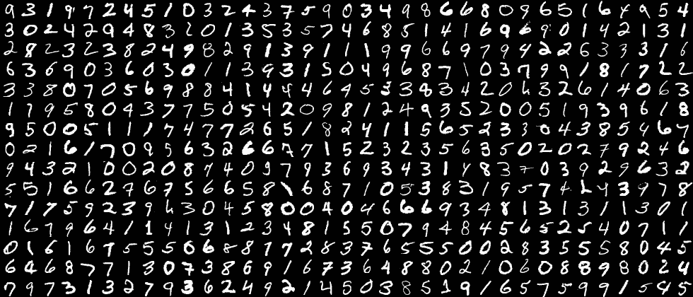
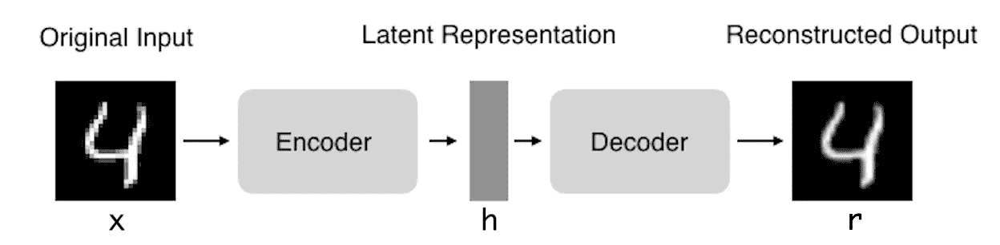
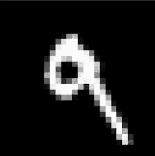
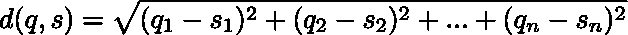
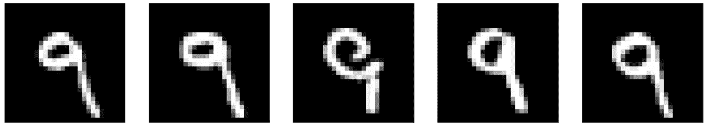

# 用自动编码器构建一个简单的图像检索系统

> 原文：<https://towardsdatascience.com/build-a-simple-image-retrieval-system-with-an-autoencoder-673a262b7921?source=collection_archive---------6----------------------->

图像检索是近十年来非常活跃且发展迅速的研究领域。最著名的系统是谷歌图片搜索和 Pinterest 视觉大头针搜索。在本文中，我们将学习使用一种特殊类型的神经网络构建一个非常简单的图像检索系统，称为**自动编码器**。我们将以无人监管的方式进行，即不看图像标签。事实上，我们只能通过图像的视觉内容(纹理、形状等)来检索图像。这种类型的图像检索被称为**基于内容的图像检索(CBIR)** ，与基于关键词或文本的图像检索相对。

对于本文，我们将使用手写数字的图像、MNIST 数据集和 Keras 深度学习框架。

The MNIST dataset

## 自动编码器

简而言之，自动编码器是旨在将其输入复制到其输出的神经网络。它们的工作原理是将输入压缩成一个**潜在空间表示**，然后从这个表示中重建输出。这种网络由两部分组成:

1.  **编码器:**这是将输入压缩成潜在空间表示的网络部分。可以用编码函数 *h=f(x)* 来表示。
2.  **解码器:**该部分旨在从潜在空间表示中重建输入。可以用解码函数 *r=g(h)* 来表示。

> 如果你想了解更多关于自动编码器的知识，我建议你阅读我之前的博客文章。

这种潜在的表示或代码是我们感兴趣的，因为这是神经网络压缩每幅图像视觉内容的方式。这意味着所有相似的图像将以相似的方式编码(希望如此)。

有几种类型的自动编码器，但由于我们正在处理图像，最有效的是使用**卷积自动编码器**，它使用卷积层来编码和解码图像。

因此，第一步是用我们的训练集来训练我们的自动编码器，让它学习将我们的图像编码成潜在空间表示的方法。

一旦完成训练，我们只需要网络的编码部分。

这个编码器现在可以用来编码我们的查询图像。

Our query image

同样的编码必须在我们的搜索数据库中完成，我们希望在其中找到与查询图像相似的图像。然后，我们可以将查询代码与数据库代码进行比较，并尝试找到最接近的代码。为了进行这种比较，我们将使用最近邻技术。

## 最近邻居

我们将通过执行最近邻算法来检索最近的代码。最近邻方法背后的原理是找到距离新点最近的预定义数量的样本。距离可以是任何度量单位，但最常见的选择是欧几里得距离。对于尺寸都为 *n、*的查询图像 *q* 和样本 *s、*来说，该距离可以通过以下公式来计算。

在这个例子中，我们将检索与查询图像最接近的 5 个图像。

## 结果

这些是我们取回的图像，看起来很棒！所有检索到的图像都与我们的查询图像非常相似，并且都对应于相同的数字。这表明，即使没有显示图像的相应标签，自动编码器也找到了以非常相似的方式编码相似图像的方法。

The 5 retrieved images

## 摘要

在本文中，我们学习了使用自动编码器和最近邻算法创建一个非常简单的图像检索系统。我们通过在一个大数据集上训练我们的 autoencoder 来进行，让它学习如何有效地编码每个图像的视觉内容。然后，我们将查询图像的代码与搜索数据集的代码进行比较，并检索最接近的 5 个代码。我们看到，我们的系统给出了相当好的结果，因为我们的 5 个检索图像的视觉内容接近我们的查询图像，而且它们都表示相同的数字，即使在这个过程中没有使用任何标签。

## 我希望这篇文章对新的深度学习实践者来说是清晰和有用的，并且它让你很好地了解了使用自动编码器进行图像检索是什么样子的！如果有不清楚的地方，请随时给我反馈或问我问题。

 [## nathan hubens/无监督图像检索

### GitHub 是人们构建软件的地方。超过 2800 万人使用 GitHub 来发现、分享和贡献超过…

github.com](https://github.com/nathanhubens/Unsupervised-Image-Retrieval)