# 使用 TensorFlow 对象检测 API、ML 引擎和 Swift 构建 Taylor Swift 检测器

> 原文：<https://towardsdatascience.com/build-a-taylor-swift-detector-with-the-tensorflow-object-detection-api-ml-engine-and-swift-82707f5b4a56?source=collection_archive---------0----------------------->


**注意:**在撰写本文时，Swift 还没有官方的 TensorFlow 库，我使用 Swift 构建了针对我的模型的预测请求的客户端应用程序。这种情况将来可能会改变，但泰勒对此有最终决定权。

这是我们正在建造的:

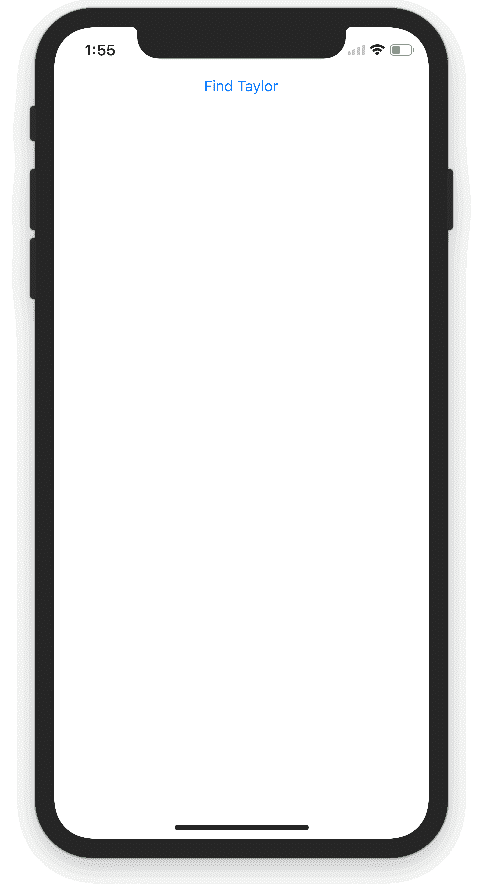

TensorFlow 对象检测 API 演示可以让您识别图像中对象的位置，这可以带来一些超级酷的应用程序。但是因为我花更多的时间给人拍照，而不是给东西拍照，所以我想看看是否同样的技术可以应用于识别人脸。结果证明效果相当好！我用它建造了上图中的泰勒斯威夫特探测器。

在这篇文章中，我将概述我将**从 T-Swift 图像集合中获取到一个 iOS 应用程序的步骤，该应用程序根据一个训练好的模型进行预测:**

1.  **图像预处理**:调整大小，标记，分割成训练集和测试集，转换成 Pascal VOC 格式
2.  **将图像转换为 TFRecords** 以提供给目标检测 API
3.  **使用 MobileNet 在云 ML 引擎上训练模型**
4.  **导出**训练好的模型，**部署**到 ML 引擎服务
5.  **构建一个 iOS 前端**，针对训练好的模型发出**预测请求**(显然是在 Swift 中)

这是一个架构图，展示了这一切是如何组合在一起的:

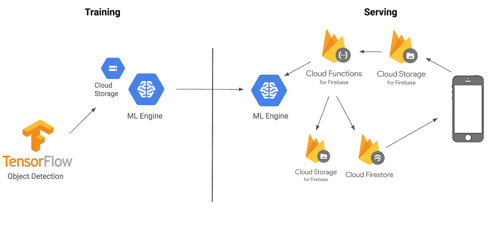

如果你想直接跳到代码，你可以在 GitHub 上找到它。

## 现在看起来，这一切似乎很简单

在我深入这些步骤之前，解释一下我们将使用的一些技术和术语会有所帮助: **TensorFlow 对象检测 API** 是一个构建在 TensorFlow 之上的框架，用于识别图像中的对象。例如，你可以用许多猫的照片来训练它，一旦训练好了，你可以传入一张猫的图像，它会返回一个矩形列表，它认为图像中有一只猫。虽然它的名字中有 API，但你可以把它看作是一套方便的迁移学习工具。

但是训练一个模型来识别图像中的物体需要时间和*吨*数据。对象检测最酷的部分是它支持五个预训练模型用于**迁移学习**。这里有一个类比来帮助你理解迁移学习是如何工作的:当一个孩子学习他们的第一语言时，他们会接触到许多例子，如果他们识别错误，就会得到纠正。例如，他们第一次学习识别一只猫时，他们会看到父母指着猫说“猫”这个词，这种重复加强了他们大脑中的路径。当他们学习如何识别一只狗时，孩子不需要从头开始。他们可以使用与对猫相似的识别过程，但应用于一个稍微不同的任务。迁移学习也是如此。

我没有时间找到并标记成千上万的 TSwift 图像，但我可以通过修改最后几层并将它们应用于我的特定分类任务(检测 TSwift)来使用从这些模型中提取的特征，这些模型是在*数百万*图像上训练的。

# **步骤 1:预处理图像**

非常感谢 [Dat Tran](https://medium.com/u/4ff6d2f67626?source=post_page-----82707f5b4a56--------------------------------) 写了[这篇关于训练浣熊探测器进行物体探测的超赞帖子](/how-to-train-your-own-object-detector-with-tensorflows-object-detector-api-bec72ecfe1d9)。我关注了他的博客文章，为图片添加标签，并将其转换为 TensorFlow 的正确格式。他的帖子有详细内容；我在这里总结一下我的步骤。

我的第一步是从谷歌图片下载 200 张泰勒·斯威夫特的照片。原来 Chrome 有一个[扩展](https://chrome.google.com/webstore/detail/fatkun-batch-download-ima/nnjjahlikiabnchcpehcpkdeckfgnohf?hl=en)——它会下载谷歌图片搜索的所有结果。在标记我的图像之前，我把它们分成两个数据集:训练和测试。我保留了测试集，以测试我的模型在训练期间没有看到的图像上的准确性。根据 Dat 的建议，我写了一个[调整脚本](https://github.com/sararob/tswift-detection/blob/master/resize.py)来确保没有图像宽于 600 像素。

因为对象检测 API 将告诉我们我们的对象在图像中的位置，所以您不能仅仅将图像和标签作为训练数据传递给它。您需要向它传递一个边界框，标识对象在图像中的位置，以及与该边界框相关联的标签(在我们的数据集中，我们只有一个标签，`tswift`)。

为了给我们的图像生成边界框，我使用了 Dat 的浣熊探测器博文中推荐的 [LabelImg](https://github.com/tzutalin/labelImg) 。LabelImg 是一个 Python 程序，它允许您手工标记图像，并为每个图像返回一个带有边框和相关标签的 xml 文件(我确实花了一整个上午标记 tswift 图像，而人们带着关切的目光走过我的桌子)。它是这样工作的——我在图像上定义边界框，并给它贴上标签`tswift`:

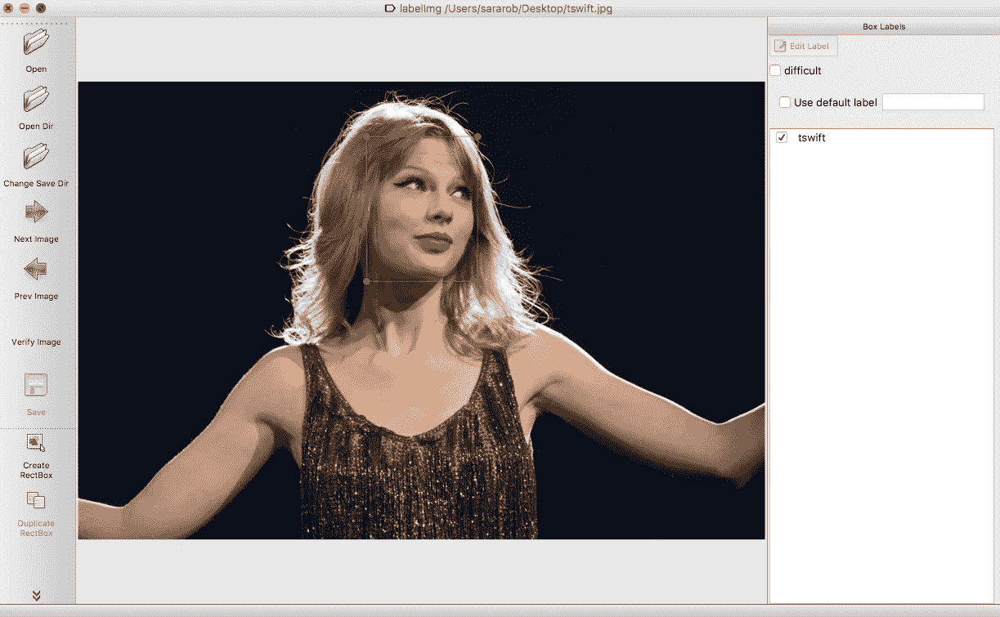

然后 LabelImg 生成一个 xml 文件，如下所示:

现在我有了一个图像、一个边界框和一个标签，但是我需要将它转换成 TensorFlow 可以接受的格式——这种数据的二进制表示称为`TFRecord`。我基于对象检测报告中提供的[指南](https://github.com/tensorflow/models/blob/master/research/object_detection/g3doc/using_your_own_dataset.md)编写了一个[脚本来完成这个](https://github.com/sararob/tswift-detection/blob/master/convert_to_tfrecord.py)。要使用我的脚本，您需要在本地克隆 [tensorflow/models](https://github.com/tensorflow/models) repo 并打包对象检测 API:

```
# From tensorflow/models/research/
python setup.py sdist
(cd slim && python setup.py sdist)
```

现在您已经准备好运行`TFRecord`脚本了。从`tensorflow/models/research`目录运行下面的命令，并向其传递以下标志(运行两次:一次用于训练数据，一次用于测试数据):

```
python convert_labels_to_tfrecords.py \
--output_path=train.record \ 
--images_dir=path/to/your/training/images/ \
--labels_dir=path/to/training/label/xml/
```

# 步骤 2:在云机器学习引擎上训练 TSwift 检测器

我可以在我的笔记本电脑上训练这个模型，但这需要时间和大量的资源，如果我不得不把我的电脑放在一边做其他事情，训练工作就会突然停止。这就是云的用途！我们可以利用云在许多核心上运行我们的培训，以便在几个小时内完成整个工作。当我使用 Cloud ML Engine 时，我可以通过利用 GPU(图形处理单元)来更快地运行训练作业，GPU 是专门的硅芯片，擅长我们的模型执行的计算类型。利用这种处理能力，我可以开始一项训练工作，然后在我的模型训练时去 TSwift 玩几个小时。

## 设置云 ML 引擎

我所有的数据都是`TFRecord`格式的，我准备把它们上传到云端，开始训练。首先，我在 Google Cloud 控制台中创建了一个项目，并启用了 Cloud ML 引擎:

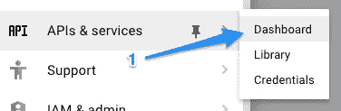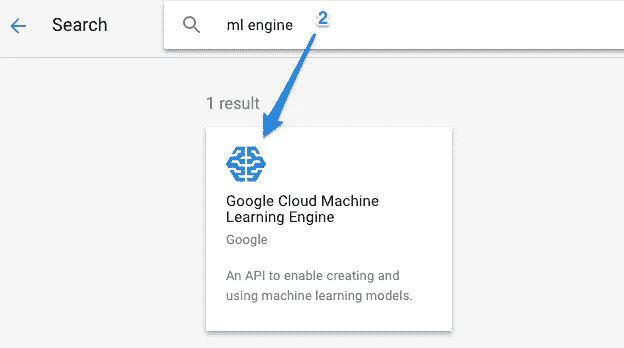

然后，我将创建一个云存储桶来打包我的模型的所有资源。确保为存储桶指定一个区域(不要选择多区域):

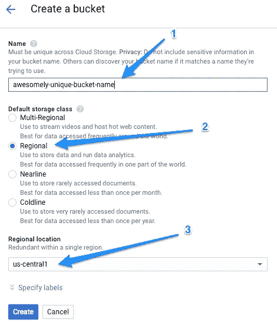

我将在这个 bucket 中创建一个`/data`子目录来存放训练和测试`TFRecord`文件:

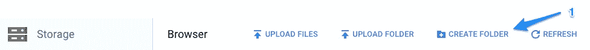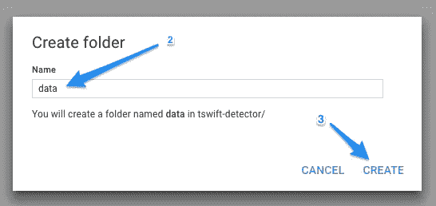

对象检测 API 还需要一个将标签映射到整数 ID 的`pbtxt`文件。因为我只有一个标签，所以这将非常简短:

## 为迁移学习添加 MobileNet 检查点

我不是从零开始训练这个模型，所以当我运行训练时，我需要指向我将要建立的预训练模型。我选择使用一个 [MobileNet](https://research.googleblog.com/2017/06/mobilenets-open-source-models-for.html) 模型——MobileNet 是一系列针对移动优化的小型模型。虽然我不会直接在移动设备上提供我的模型，但 MobileNet 将快速训练并允许更快的预测请求。我下载了这个 MobileNet 检查点用于我的培训。检查点是包含张量流模型在训练过程中特定点的状态的二进制文件。下载并解压缩检查点后，您会看到它包含三个文件:

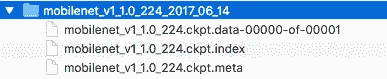

我需要它们来训练模型，所以我把它们放在我的云存储桶的同一个`data/`目录中。

在运行培训作业之前，还有一个文件要添加。对象检测脚本需要一种方法来找到我们的模型检查点、标签映射和训练数据。我们将通过一个配置文件来实现。TF Object Detection repo 为五种预训练模型类型中的每一种都提供了示例配置文件。我在这里使用了 MobileNet [的占位符](https://github.com/tensorflow/models/blob/master/research/object_detection/samples/configs/ssd_mobilenet_v1_coco.config)，并用我的云存储桶中的相应路径更新了所有的`PATH_TO_BE_CONFIGURED`占位符。除了将我的模型连接到云存储中的数据，该文件还为我的模型配置了几个超参数，如卷积大小、激活函数和步骤。

在我开始培训之前，以下是应该放在我的`/data`云存储桶中的所有文件:

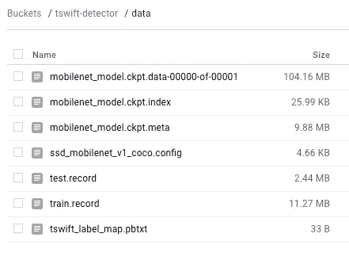

我还将在我的 bucket 中创建`train/`和`eval/`子目录——这是 TensorFlow 在运行训练和评估作业时写入模型检查点文件的地方。

现在我准备好运行训练了，这可以通过`[gcloud](https://cloud.google.com/sdk/)`命令行工具来完成。请注意，您需要在本地克隆[tensor flow/models/research](https://github.com/tensorflow/models/tree/master/research),并从该目录运行这个训练脚本:

在训练跑步的同时，我也拉开了评测工作的序幕。这将使用以前没有见过的数据来评估我的模型的准确性:

您可以通过导航到您的云控制台中 ML 引擎的作业部分来验证您的作业是否正常运行，并检查特定作业的日志:

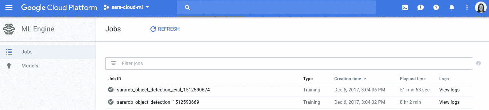

# 步骤 3:部署模型以服务于预测

为了将模型部署到 ML 引擎，我需要将我的模型检查点转换成 ProtoBuf。在我的`train/`桶中，我可以看到在整个训练过程中从几个点保存的检查点文件:

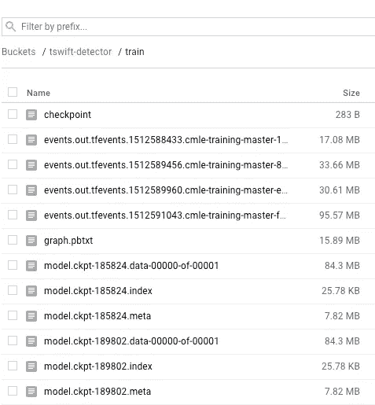

`checkpoint`文件的第一行将告诉我最新的检查点路径——我将从该检查点本地下载 3 个文件。每个检查点应该有一个`.index`、`.meta`和`.data`文件。将它们保存在本地目录中，我可以利用 Objection Detection 的便利的`export_inference_graph`脚本将它们转换成 ProtoBuf。要运行下面的脚本，您需要定义 MobileNet 配置文件的本地路径、从培训作业下载的模型检查点的检查点编号，以及您希望将导出的图形写入的目录的名称:

在这个脚本运行之后，您应该在您的`.pb`输出目录中看到一个`saved_model/`目录。将`saved_model.pb`文件(不用担心其他生成的文件)上传到您的云存储桶中的`/data`目录。

现在，您已经准备好将模型部署到 ML 引擎进行服务了。首先，使用`gcloud`创建您的模型:

```
gcloud ml-engine models create tswift_detector
```

然后，创建您的模型的第一个版本，将它指向您刚刚上传到云存储的保存的模型 ProtoBuf:

```
gcloud ml-engine versions create v1 --model=tswift_detector --origin=gs://${YOUR_GCS_BUCKET}/data  --runtime-version=1.4
```

一旦模型部署，我准备使用 ML 引擎的在线预测 API 来生成对新图像的预测。

# 步骤 4:使用 Firebase 函数和 Swift 构建预测客户端

我用 Swift 编写了一个 iOS 客户端，用于对我的模型进行预测请求(因为为什么要用其他语言编写 TSwift 检测器呢？).Swift 客户端将图像上传到云存储，这将触发 Firebase 函数，该函数在 Node.js 中发出预测请求，并将生成的预测图像和数据保存到云存储和 Firestore。

首先，在我的 Swift 客户端中，我添加了一个按钮，让用户可以访问他们设备的照片库。一旦用户选择了一张照片，就会触发一个将照片上传到云存储的操作:

接下来，我为我的项目编写了上传到云存储桶时触发的 Firebase 函数。它获取图像，对其进行 base64 编码，并将其发送到 ML 引擎进行预测。你可以在这里找到完整的功能代码。下面我包含了函数中向 ML 引擎预测 API 发出请求的部分(感谢 [Bret McGowen](https://medium.com/u/74d1a945048e?source=post_page-----82707f5b4a56--------------------------------) 的专家云函数帮助我完成这项工作！):

在 ML 引擎响应中，我们得到:

*   如果在图像中检测到 Taylor，我们可以使用它来定义她周围的边界框
*   `detection_scores`返回每个检测框的置信度值。我将只包括分数高于 70%的检测
*   `detection_classes`告诉我们与检测相关的标签 ID。在这种情况下，因为只有一个标签，所以它总是`1`

在函数中，我使用`detection_boxes`在图像上画一个框，如果泰勒被检测到，以及置信度得分。然后，我将新的盒装图像保存到云存储中，并将图像的文件路径写入 Cloud Firestore，这样我就可以读取路径，并在我的 iOS 应用程序中下载新图像(带矩形):

最后，在我的 iOS 应用程序中，我可以收听 Firestore 路径的图像更新。如果发现检测，我将下载图像并在我的应用程序中显示它以及检测置信度得分。该函数将替换上述第一个 Swift 片段中的注释:

呜哇！我们有一个泰勒·斯威夫特探测器。请注意，这里的重点不是准确性(在我的训练集中，我只有 140 张图像)，所以该模型确实错误地识别了一些人的图像，您可能会将其误认为 tswift。但是如果我有时间手工标注更多的图片，我会更新模型并在应用商店发布应用:)

# **接下来是什么？**

这个帖子包含了很多信息。想自己造吗？下面是这些步骤的详细说明，并附有参考资料的链接:

*   **预处理数据**:我跟随 Dat 的博客帖子使用 LabelImg 手工标记图像并生成带有包围盒数据的 xml 文件。然后我写了[这个脚本](https://github.com/sararob/tswift-detection/blob/master/convert_to_tfrecord.py)来将标签图像转换成 TFRecords
*   **训练和评估一个对象检测模型**:使用[这篇博文](https://cloud.google.com/blog/big-data/2017/06/training-an-object-detector-using-cloud-machine-learning-engine)中的方法，我将训练和测试数据上传到[云存储](https://cloud.google.com/storage/)，并使用 [ML 引擎](http://cloud.google.com/ml-engine)运行训练和评估
*   **将模型部署到 ML 引擎**:我使用`gcloud` CLI 来[将我的模型](https://cloud.google.com/ml-engine/docs/deploying-models)部署到 ML 引擎
*   **发出预测请求**:我使用 [Firebase 云函数 SDK](https://firebase.google.com/docs/functions/gcp-storage-events)向我的 ML 引擎模型发出在线预测请求。这个请求是由从我的 Swift 应用程序向 Firebase Storage 上传的[触发的。在我的函数中，我将预测元数据写到](https://firebase.google.com/docs/storage/ios/upload-files) [Firestore](https://firebase.google.com/docs/firestore/manage-data/add-data) 。

你有什么问题或话题想让我在以后的帖子中涉及吗？留言或者在 Twitter 上找我 [@SRobTweets](https://twitter.com/srobtweets) 。