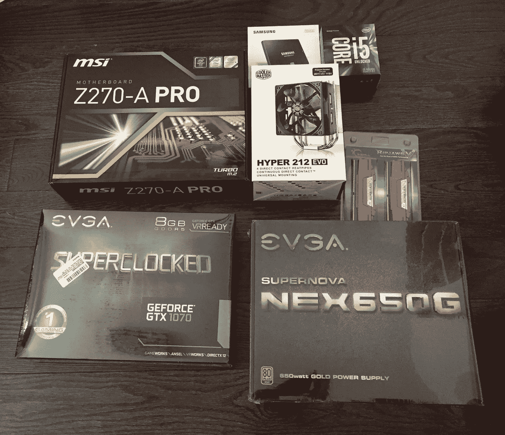
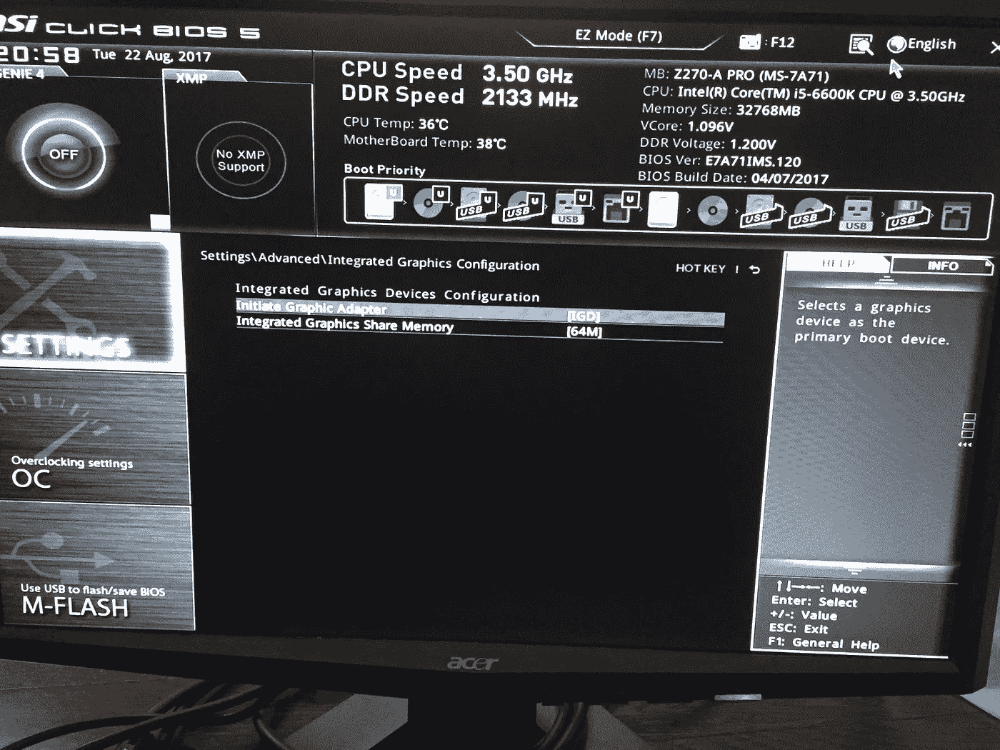
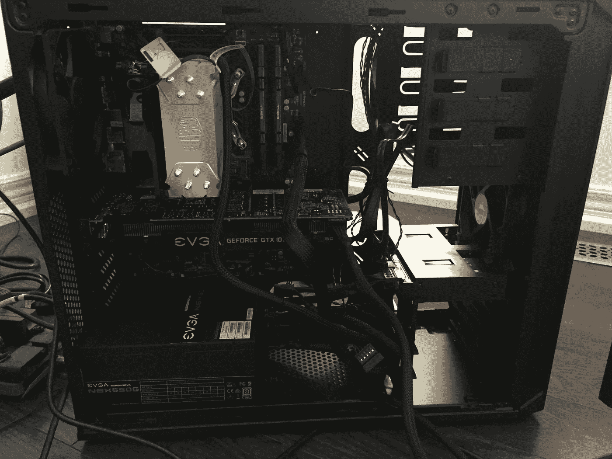

# 从头开始构建和设置您自己的深度学习服务器

> 原文：<https://towardsdatascience.com/build-and-setup-your-own-deep-learning-server-from-scratch-e771dacaa252?source=collection_archive---------1----------------------->

今年早些时候，我完成了杰瑞米·霍华德的“[实用深度学习—第一部分](http://course.fast.ai/)”课程。这是一门实用的课程，教你如何使用 AWS 实践各种深度学习技术。AWS 是一种快速启动和运行的方式，但成本会迅速增加。我有一个大约 0.9 美元/小时的 p2 实例，我们不要忘记 AWS 带来的所有额外的隐藏成本。我每月挣 50-100 美元。这影响了我的工作效率，因为我试图限制 AWS 的使用来降低成本。我想在深度学习方面追求更多，并决定冒险建立自己的深度学习服务器。这种东西变化很快，所以当你读到这篇文章的时候，如果内容已经过时了，我不会感到惊讶。然而，我希望这能让你对如何构建自己的服务器有所了解。

## **构建自己的深度学习服务器的 6 个步骤**

> 1.选择组件
> 2。五金件组装
> 3。安装操作系统
> 4。安装显卡和驱动程序
> 5。设置深度学习环境
> 6。设置远程访问

## 1.选择组件

做大量的研究(例如阅读博客)来了解你需要购买哪些零件是很有用的。

在你购买之前，使用 pcpartpicker.com。该网站帮助你做“兼容性检查”,以确保你的所有组件都相互兼容。我的零件清单是这里的。

一般来说，您需要以下内容:

> **CPU**—[Intel—Core i5–6600k 3.5 GHz 四核处理器](https://ca.pcpartpicker.com/product/gx648d/intel-cpu-bx80662i56600k)$ 289.50
> **RAM**—[G . Skill—rip jaws V 系列 32GB (2 x 16GB) DDR 4–2133 内存](https://ca.pcpartpicker.com/product/zMvZxr/gskill-memory-f42133c15d32gvr)$ 330
> **GPU**—[EVGA—GeForce GTX 1070 8GB SC 游戏 ACX 3.0 显卡](https://ca.pcpartpicker.com/product/Tv38TW/evga-geforce-gtx-1070-8gb-sc-gaming-acx-30-video-card-08g-p4-6173-kr)【589】
> **SSD**—[三星— 850 EVO 系列 500GB 2.5 英寸固态硬盘](https://ca.pcpartpicker.com/product/FrH48d/samsung-internal-hard-drive-mz75e500bam)
> **主板** — [MSI —](https://ca.pcpartpicker.com/product/KvvZxr/msi-z270-a-pro-atx-lga1151-motherboard-z270-a-pro)[EVGA—SuperNOVA NEX 650 w 80+金牌认证全模块化 ATX 电源](https://ca.pcpartpicker.com/product/g63RsY/evga-power-supply-120g10650xr)120 美元
> 机箱 — [海盗船— 200R ATX 中塔机箱](https://ca.pcpartpicker.com/product/cTQypg/corsair-case-200r)75 美元**总计:**1800 美元以下 CAD



**关键要点:**

*   **GPU 是最重要的组件！如果你预算紧张，一定要把钱花在好的显卡上。NVIDIA 拥有多年构建显卡的经验。做一些额外的研究，你就会明白我的意思。在撰写本文时，GTX1080Ti 是最新的最佳选择，不过 GTX1070 也可以。**
*   **想一想能让您在未来升级的组件。**考虑多付一点钱买一块可以支持多个 16e PCIe 插槽的主板。这使您能够安装一个额外的 GPU，如果你想获得性能提升以后。同样，也要确保有足够的内存插槽用于升级。
*   当有疑问时，选择顾客评论最多的零件。我发现，如果有很多评论，这意味着该零件已经过测试，你更有可能在网上找到帮助或操作指南。
*   **从可信的卖家那里购买！**pcpartpicker.com 会给你不同卖家的报价。我注意到有一家经销商以略低的价格提供组件。只要有可能，省点钱总是好的。我正准备从这个不太出名的经销商那里买一些东西，直到我看到他们的评论。感谢上帝我做了，因为他们的评论是可怕的！我选择了更安全的方式，从我信任的商店如亚马逊和新蛋购买组件。
*   **免运费&处理:**考虑从亚马逊等提供免运费&处理的地方购买零件。你可以给自己省点钱。

**其他有用的资源:**

*   [打造自己的深度学习盒子](https://medium.com/towards-data-science/building-your-own-deep-learning-box-47b918aea1eb)
*   [伟大的深度学习盒子装配设置和基准](https://blog.slavv.com/the-1700-great-deep-learning-box-assembly-setup-and-benchmarks-148c5ebe6415)
*   [深度学习硬件指南](http://timdettmers.com/2015/03/09/deep-learning-hardware-guide/)
*   [以一种懒惰但快速的方式建立深度学习机器](https://medium.com/impactai/setting-up-a-deep-learning-machine-in-a-lazy-yet-quick-way-be2642318850)
*   [打造个人深度学习平台](http://guanghan.info/blog/en/my-works/building-our-personal-deep-learning-rig-gtx-1080-ubuntu-16-04-cuda-8-0rc-cudnn-7-tensorflowmxnetcaffedarknet/)

## 2.硬件装配

我从高中开始就没有接触过计算机硬件，所以一开始我有点紧张。如果你真的不愿意把硬件组装在一起，你可以去加拿大计算机公司或类似的公司，他们可以为你组装，价格大约 80 美元。对我来说，我不想错过这个绝佳的学习机会。

在做任何事情之前，我建议浏览说明手册和操作视频，以熟悉各种组件。你已经花了这么多美元，你还不如花一点时间来确保你知道你在做什么！

以下是一些对我使用的组件有帮助的视频:

**关键要点:**

*   开始前观看所有视频。文字和手册只能交流这么多。看别人安装后你会觉得自信很多。通常有一些手册没有指出的问题。
*   **确保所有的插头都插好了。**我害怕弄坏自己的零件，所以我对所有东西都很温柔。第一次插上电源线，打开电源，什么也没发生——没有灯，没有声音。我想我一定是打碎了什么东西，浪费了 1000 美元。我把它关掉，检查了所有的插头，确保所有的插头都插好了。你瞧，后来一切都正常了。
*   **先不要安装你的 GPU！**等到你安装好你的操作系统。我犯了这个错误，以为我的主板坏了，因为我的显示器出现了黑屏。暂时把你的显卡放在一边。请看下面的细节——我专门为此写了一节。

## 3.安装操作系统

我选择用 USB 安装 ubuntu 16.04。从技术上来说，你也可以安装 Windows，但我认为目前没有这个必要。

**3.1 创建一个可引导的 USB 驱动器**

1.买一个 2GB 或更大的 USB。
2。从 [Ubuntu](https://www.ubuntu.com/download/desktop) 下载 ISO 文件。我用的是 16.04
3。按照这些说明[创建一个可引导的 u 盘。](https://tutorials.ubuntu.com/tutorial/tutorial-create-a-usb-stick-on-macos#0)

**3.2 安装 Ubuntu**

重新启动你的系统，Ubuntu 安装界面应该会弹出。按照屏幕上的指示做，应该很简单。这里有一个[有用的教程](https://tutorials.ubuntu.com/tutorial/tutorial-install-ubuntu-desktop#0)。

有些人可能不会自动获得 Ubuntu 设置屏幕。如果你是这种情况，你只需要重新启动进入 BIOS(对我来说是在电脑启动时按 F11)，并配置你的启动优先级，先加载 USB 驱动器，再加载硬盘驱动器(SSD)。

**3.3 获取最新信息**

打开您的终端并运行以下命令:

```
sudo apt-get update
sudo apt-get upgrade
sudo apt-get install build-essential cmake g++ gfortran git pkg-config python-dev software-properties-common wget
sudo apt-get autoremove
sudo rm -rf /var/lib/apt/lists/*
```

## 4.安装图形卡及其驱动程序

NVIDIA 显卡很难安装。有点鸡生蛋的意思因为只有安装了驱动程序才能使用显卡，但是除非主板检测到你的显卡安装了，否则是不能真正安装驱动的。如果我的主板检测到 PCI 插槽中有显卡，它也会首先自动启动显卡，但因为我还没有安装驱动程序，所以我最终只能看到一个空白屏幕。那你是做什么的？在做了大量的研究后，我发现下面的步骤是可行的。希望能给你省些麻烦。

**4.1 更改 BIOS 设置**

主板应该有一个集成的图形设备，这样你就可以把显示器直接连接到主板上。现在，您应该已经将显示器连接到主板显示设备上了。因为我们要安装一个图形卡，这是你需要告诉 BIOS 首先启动哪个图形设备的地方。BIOS 中有两种设置:

*   **PEG — PCI Express 显卡:**如果在 PCI 插槽上检测到显卡，主板会引导显卡。如果没有，那么它会从主板启动内置的那个。
*   **IGD —集成图形设备:**将始终使用主板的内置卡

默认情况下，BIOS 将设置为 PEG。在正常情况下，一旦你安装了 NVIDIA 驱动程序，这是有意义的，因为你想利用卡。然而，当你必须安装 NVIDIA 驱动程序时，它会引起问题。



通过以下方式更改 BIOS 配置:

1.  重新启动计算机并引导至 BIOS (F11)。
2.  转到:设置->集成图形配置->启动图形适配器
3.  将设置从 PEG 更改为 IGD
4.  保存并关闭您的计算机

**4.2 物理插入显卡**

现在系统已经关闭，将图形卡插入 PCI 插槽。有时候你必须比你想象的更努力。确保它完全进去了。



**4.3 安装驱动程序**

现在显卡已经连接到主板上了，打开机器安装 NVIDIA 驱动程序。

1.  找到您的显卡型号

```
lspci | grep -i nvidia
```

2.确定适用于您的显卡的最新版本的 NVIDIA 驱动程序

*   访问图形驱动程序 [PPA 页面](https://launchpad.net/~graphics-drivers/+archive/ubuntu/ppa)并查看可用的驱动程序版本。截至 2017 年 8 月，384 是最新版本。
*   访问 [NVIDIA 驱动程序下载网站](http://www.nvidia.com/Download/index.aspx?lang=en-us)以确定与您的卡和操作系统兼容的版本。

3.添加和更新图形驱动程序 PPA

```
sudo add-apt-repository ppa:graphics-drivers
sudo apt-get update
```

4.安装 NVIDIA 驱动程序。输入与您的卡兼容的版本号。例如，我安装了 384 版本

```
sudo apt-get install nvidia-384
```

5.重新启动系统并验证您的安装

```
lsmod | grep nvidia
```

如果有问题，需要从头开始，可以使用以下命令清除所有内容。我听说升级显卡的人经常遇到驱动问题。

```
sudo apt-get purge nvidia*
```

6.再次将 BIOS 图形设备优先级更改为 PEG。(参见步骤 2)

## 5.设置深度学习环境

在你开始安装任何东西之前，或者盲目地遵循博客上的指导，花一些时间去了解你需要什么库版本。这些东西变化如此之快，以至于当你阅读它们的时候，大多数博客都已经过时了。还有，也不要盲目下载安装最新版本。例如，Tensorflow 1.3 支持最高 python 3.6(截至 2017 年 8 月 1 日)，但 Theano 仅支持最高 python 3.5。Anaconda 的最新版本运行在 python 3.6 上，但是您可以使用 python 3.5 创建 conda 环境。我在深度学习课程的第 1 部分中使用的代码是用 pythonn2.7 编写的，但课程的第 2 部分使用 python 3.5——因此我创建了 2 个 conda 环境。

我最终使用了下面的库列表及其相应的版本。

> [**【CUDA】**](https://developer.nvidia.com/cuda-toolkit)**(V8)——一个利用 GPU 能力的并行计算平台**
> 
> **[**cud nn**](https://developer.nvidia.com/cudnn)(V6)——位于 CUDA 之上的 CUDA 深度神经网络库。**
> 
> **[**Anaconda**](https://docs.continuum.io/)**(v 3.6)——一个很好的包和环境管理器，自带了很多数据科学计算工具，比如 Numpy、Pands 和 Matplotlib。Anaconda 的另一个好处是它使得创建定制的 python 环境变得容易。****
> 
> ****[**tensor flow**](https://www.tensorflow.org/install/install_linux)(v 1.3)——谷歌的机器学习框架****
> 
> ****[**the ano**](http://deeplearning.net/software/theano/install.html)**(v 0.9)**——一个另类的机器学习框架。********
> 
> ******[**Keras**](https://keras.io/#installation)**——运行在 Tensorflow、Theano 或其他机器学习框架之上的更高级的神经网络库。********

********5.1 安装 CUDA********

*   ****转到 NVIDIA 网站并找到下载 CUDA 工具包。****
*   ****运行下面的代码来安装 CUDA。更改与您的系统兼容的软件包对应的版本。****

```
**wget http://developer.download.nvidia.com/compute/cuda/repos/ubuntu1604/x86_64/cuda-repo-ubuntu1604_8.0.44-1_amd64.deb
sudo dpkg -i cuda-repo-ubuntu1604_8.0.44-1_amd64.deb
sudo apt-get update
sudo apt-get install cuda**
```

*   ****将路径添加到您的环境中****

```
**echo 'export PATH=/usr/local/cuda/bin:$PATH' >> ~/.bashrc
echo 'export LD_LIBRARY_PATH=/usr/local/cuda/lib64:$LD_LIBRARY_PATH' >> ~/.bashrc
source ~/.bashrc**
```

*   ****检查您是否安装了正确的版本****

```
**nvcc -V**
```

*   ****查看有关您的显卡的详细信息****

```
**nvidia-smi**
```

******5.2 安装 cuDNN******

*   ****转到 NVIDIA 网站下载该库。你必须注册才能下载。该网站说可能需要几天时间才能批准，但对我来说周转时间是即时的。****
*   ****将文件解压并复制到安装 CUDA 的地方(通常是/usr/local/cuda)****

```
**cd ~/<folder you downloaded the file>
  tar xvf cudnn*.tgz
  cd cuda
  sudo cp */*.h /usr/local/cuda/include/
  sudo cp */libcudnn* /usr/local/cuda/lib64/
  sudo chmod a+r /usr/local/cuda/lib64/libcudnn***
```

******5.3 安装蟒蛇******

*   ****转到[网站](https://www.anaconda.com/download/)下载安装程序并按照说明操作。最新的 Tensorflow 版本(撰写本文时是 1.3 版)需要 Python 3.5。所以下载 python 3.6 版本，就可以用特定的 python 版本创建 conda 环境了。****
*   ****使用以下命令创建一个虚拟环境。关于如何管理环境的更多细节可以在[这里](https://uoa-eresearch.github.io/eresearch-cookbook/recipe/2014/11/20/conda/)找到。您可能希望为 Theano 和 Tensorflow 分别创建一个环境，因为它们通常支持不同版本的库。****

```
**conda create -n tensorflowenv anaconda python=3.5**
```

*   ****激活您刚刚创建的 conda 环境****

```
**source activate tensorflowenv**
```

******5.4 安装 TensorFlow******

*   ****安装 TensorFlow 库。根据您的操作系统、Python 版本和 CPU 与 GPU 支持，有不同的包。看一下这里的[来决定你应该使用的 TensorFlow 二进制 URL。](https://www.tensorflow.org/install/install_linux#the_url_of_the_tensorflow_python_package)****

```
**pip install --ignore-installed --upgrade <*tensorFlowBinaryURL>***
```

****例如，如果您在具有 GPU 支持的 Ubuntu 上运行 Python 3.5，您可以使用以下命令。****

```
**pip install --ignore-installed --upgrade \https://storage.googleapis.com/tensorflow/linux/gpu/tensorflow_gpu-1.3.0-cp35-cp35m-linux_x86_64.whl**
```

****有关 TensorFlow 安装的更多详细信息，请参见此处的。****

******5.5 安装 no******

****你可以在找到安装细节[。然而，它几乎只是一个命令。](http://deeplearning.net/software/theano/install_ubuntu.html#installation)****

```
**sudo pip install Theano**
```

******5.6 安装 Keras******

*   ****使用以下命令安装 Keras****

```
**sudo pip install keras**
```

*   ****根据您使用的后端(TensorFlow 或 Theano ),您必须对其进行相应的配置。****

```
**vi ~/.keras/keras.json**
```

****配置文件如下所示。你只需要将“后端”改为“tensorflow”或“theano ”,这取决于你使用的后端。****

```
**{ 
   “image_data_format”: “channels_last”, 
   “epsilon”: 1e-07, 
   “floatx”: “float32”, 
   “backend”: “tensorflow” 
}**
```

****关于 Keras 安装的更多细节: [1](https://machinelearningmastery.com/introduction-python-deep-learning-library-keras/) ， [2](https://keras.io/#installation)****

******5.7 其他有用的资源:******

*   ****[用于深度学习的 Ubuntu 16.04 上的英伟达 GTX 1080](https://yangcha.github.io/GTX-1080/)****
*   ****[从零开始设置深度学习机器](https://github.com/floydhub/dl-setup)****

## ****6.设置远程访问****

****这一步是可选的，但是如果您计划从笔记本电脑远程工作，这里有一些选项。****

******6.1 团队浏览器******

****[Teamviewer](https://www.teamviewer.com/en/) 基本上是一个屏幕共享软件。它有时有点笨重，但对于远程控制来说是个不错的选择。****

******6.2 SSH******

****大多数开发人员希望通过终端 SSH 到机器中，并不真正需要图形用户界面。可以用 [OpenSSH](http://ubuntuhandbook.org/index.php/2016/04/enable-ssh-ubuntu-16-04-lts/) 。****

****您可以使用以下命令来安装并检查其状态。默认情况下，OpenSSH 服务器将在第一次引导时开始运行。****

```
**sudo apt-get install openssh-server
sudo service ssh status**
```

******6.3 远程 Jupyter 笔记本******

****我经常使用 Jupyter 笔记本。如果你想在笔记本电脑的浏览器上运行它，这是一个非常酷的技巧。点击查看完整的教程[。总之，只需在您的笔记本电脑和服务器上运行以下代码。](http://www.justinkiggins.com/blog/zero-configuration-remote-jupyter-server/)****

```
**$laptop: ssh -l <username>@<yourNewServerIP>
$server: jupyter notebook --no-browser --port=8888
$laptop: ssh -NL 8888:localhost:8888 <username>@<yourNewServerIP>**
```

****然后你可以在笔记本电脑的浏览器上进入 [http://localhost:8888](http://localhost:8888) 并远程查看/编辑你的 Jupyter 笔记本。****

****就是这样！我很想听听你的设置体验！****