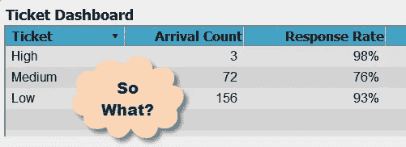
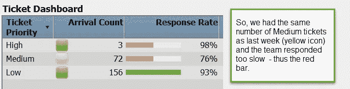

# 您的仪表板对组织有影响吗？

> 原文：<https://towardsdatascience.com/build-dashboards-that-impact-the-organization-b0e39985029d?source=collection_archive---------8----------------------->

Photo by [Julien-Pier Belanger](https://unsplash.com/@julienpier?utm_source=medium&utm_medium=referral) on [Unsplash](https://unsplash.com?utm_source=medium&utm_medium=referral)

## 怎么会？就用“那又怎样？”试验

我的第一个数字仪表板并没有得到管理层的好评。经过数周的计划和准备，在一个下雨的周五下午，我和我的同事向总经理展示了最终产品。

会议期间，我们向她详细介绍了我们的杰作——我敢肯定，我们脸上挂着大大的傻笑。

她最后说了什么…“ ***那又怎样？”***

## 那一年，带有向下钻取功能的网页非常流行

在网络报道的早期，能够深入了解更多信息是非常棒的(或者对我们来说是这样)！我们为我们的仪表板感到骄傲。我们设想赢得*世界最佳仪表板*奖，并获得一个镶满钻石的皇冠，戴在我们聪明的小脑袋上。

我们花哨的仪表板是为客户支持部门设计的。它展示了有关故障单计数和代理回复率的数据。经理可以根据过去 30 天的回复率，选择计数以深入查看 traffic-lite 客户问题列表。

## 我们有技术，但没有可操作的分析

总经理继续说，“那又怎样？那又怎样？”看完之后耸了耸肩。我们面面相觑，然后看向我们的经理，因为我们不知道如何回答。总经理是一个令人印象深刻的人物，我们想给她留下深刻的印象，仿效她。

我的经理从军队退休了。在他的职业生涯中，他见过更糟糕的情况，但对我们来说这就像是一场战争。我们的经理不好意思地问总经理，“你是什么意思？”

“如果有 72 张严重性为中等的罚单，响应率为 76%，那又如何。它应该是什么？应该少票吗？更多？回复率好吗？不好？你希望我用这些信息做什么？”，她一边举起双手一边继续说道。她变得不耐烦了。

“目标是 85%。他表示:“未来几周，到达的门票数量将会下降——这是一个积极的趋势。”。

“团队没有达到目标，工作票也少了，这是这份报告想要表达的意思吗？她问。"我是不是应该先看看这份报告，然后打电话给你问清楚？"

“我明白了。这个仪表板需要说明这一点。”我们的经理回答道。

“他们为什么会错过目标？对此正在做些什么？”她继续说道。这是真正的标题和数据的真正要点。

# 结论，而不是建议

好消息是仪表板开始工作了。我们已经将数据提炼为几个简单的关键绩效指标(KPI)，她已经准备好应对这种情况。

> 坏消息是我们的仪表板没有回答“那又怎样”的问题——它只呈现了一些事实。

管理层在寻找一个结论，这是仪表板的一个关键元素。那天，我戴上最好的仪表板头饰的梦想就像放了一天的结婚蛋糕一样被抛到了一边。总经理证实，我们已经建立了一个花哨的网络报告，而不是一个有用的工具。

# 将报表更改为仪表板

报表不同于仪表盘，有些人没有意识到这一点。这两个术语经常互换使用——对我来说，仪表板可以帮助您了解性能。

报告提供了您可以查看的事实，例如，故障单的数量或响应率。在下图中，我使用 SAS Visual Analytics 重新创建了一个简单的示例，展示了我们的仪表板的外观。

## 应用“那又怎样”测试

如果你试图确定你正在看的是一份报告还是一个仪表板，使用通用汽车公司的“那又怎样？”测试。你可以很容易地问“如果上周有 156 张低优先级票，那又怎么样？”你不知道这是一个好的还是坏的事实——它只是一个事实。页面上没有支持信息来帮助您确定“什么”

## 你需要帮助来下结论

没有任何支持信息——上表没有通过*测试，所以没有通过*测试。我们需要一种方法来知道事实是好是坏。为了测量到达的票计数，我们采用前一周的计数或过去六周的平均值来确定趋势。然后我们可以分配一个显示规则，如下所示:

*   如果本周的票数高于上周，将该事实标记为红色
*   如果低于前一周，则显示为绿色
*   如果是一样的，那就把它变成黄色或者什么都没有

回应率基于服务水平协议。如果客户期望特定的回复率，则使用该回复率作为衡量标准。对于高优先级票证，他们希望 99%的票证在 24 小时内关闭，中等优先级票证在五天内关闭 85%。在这种情况下，条形不是红色就是绿色。团队是否达到了目标。如果他们有一个大问题，顾客很少关心他们的票是否几乎准时关闭。

如果您将“那又怎样”测试应用于该仪表板，它将不起作用。本周有 156 张低优先级票，比上周低，这很好。当有结论时，经理可以查看仪表板，看看他们下一步需要确定什么。

## 推动组织向前发展

在上面的仪表板中，经理需要知道为什么团队没有达到服务级别。也许团队人手不足？可能安装了一个热补丁，破坏了许多客户系统，所以它让每个人都很忙。

我并不是说仪表板从来没有任何事实，但是事实应该是支持信息，而不是表演的明星。例如，在上图中，查看 12 周或 6 个月的票证关闭率会有所帮助，这样我们就可以知道这种情况是异常还是持续存在。

# 你的外卖

*   什么时候需要事实，什么时候结论更有用？
*   你如何提供数据来帮助管理者理解需要采取的行动？

*最初在 www.zencos.com 出版。*