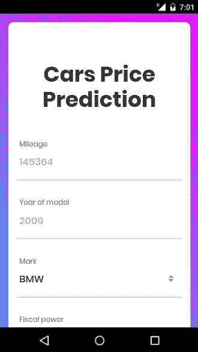
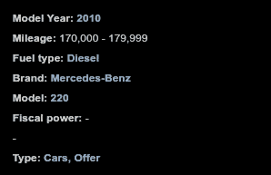
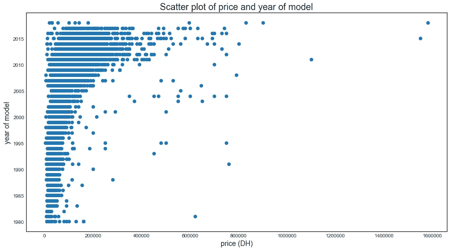
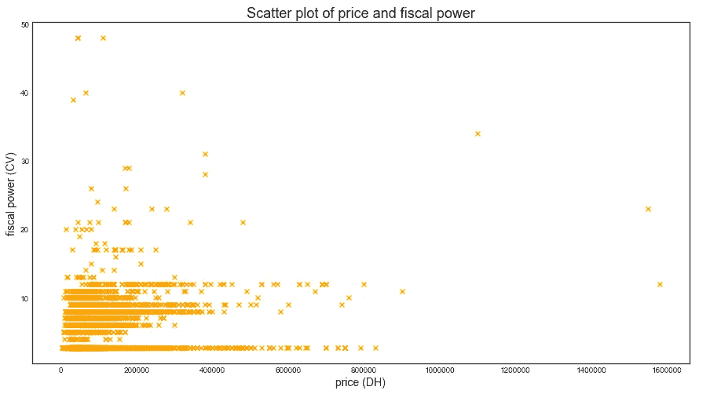
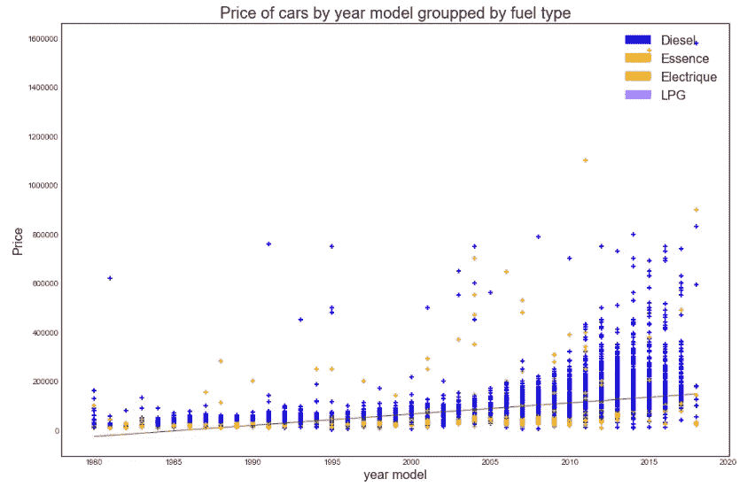
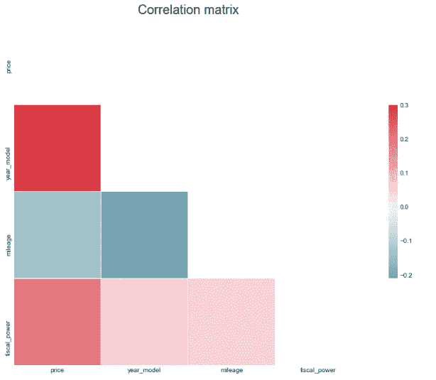
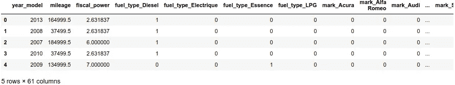
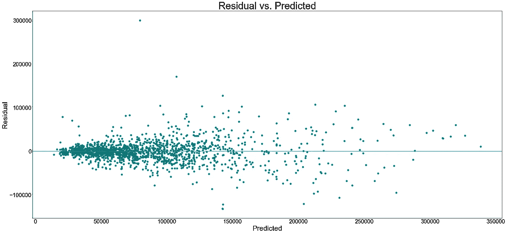
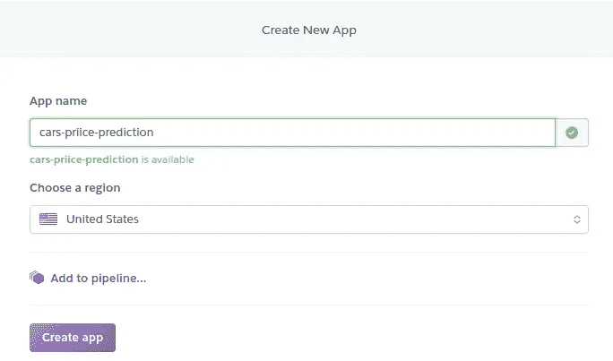

# 建立、开发和部署一个机器学习模型，使用梯度推进来预测汽车价格。

> 原文：<https://towardsdatascience.com/build-develop-and-deploy-a-machine-learning-model-to-predict-cars-price-using-gradient-boosting-2d4d78fddf09?source=collection_archive---------1----------------------->

# 介绍

在这篇博文中，我将介绍一个数据科学过程，通过以下步骤来构建和部署一个可以预测汽车价格的机器学习模型:

1.  设定研究目标
2.  检索数据
3.  数据预处理和清理
4.  数据探索和可视化
5.  数据建模
6.  模型部署

# 设定研究目标

这项工作的目的是通过构建和部署一个机器学习模型来熟悉如上所述的数据科学过程，该模型可以根据汽车的特征来预测汽车价格，方法是尝试 4 个回归模型，并选择具有最高 R 分数和最低均方根误差的模型。



Demo of the Web App

# 检索数据

检索数据是设定研究目标后的重要步骤，为此，我使用了专门从事这类任务的著名 python 库`“BeautifulSoup”`。该任务的过程非常简单，首先我们循环遍历广告页面，通过增加基本 URL 中名为`o`的页码参数来收集广告 URL，如下所示:

```
basic_url = "[https://www.avito.ma/fr/maroc/voitures-](https://www.avito.ma/fr/maroc/voitures-)à_vendre&o="
```

一旦 URL 被收集，我将它们设置在一个名为“ads_urls.csv”的`csv`文件中，如下所示:

```
[https://www.avito.ma/fr/temara/voitures/peugeot_508_26753561.htm](https://www.avito.ma/fr/temara/voitures/peugeot_508_26753561.htm)
[https://www.avito.ma/fr/safi/voitures/renualt_kasket_26753552.htm](https://www.avito.ma/fr/safi/voitures/renualt_kasket_26753552.htm)
[https://www.avito.ma/fr/oued_fes/voitures/Citroen_C3_Diesel_26753551.htm](https://www.avito.ma/fr/oued_fes/voitures/Citroen_C3_Diesel_26753551.htm)
.
...
```

上面这些链接中的每个链接都包含广告中发布的汽车的相关数据，例如:“车型年”、“里程”、“燃料类型”、“价格”…，看起来就像这样:



Car features published on the Ad page

然后，我读取这个包含要在广告页面上抓取的 URL 列表的文件，并提取必要的数据，所以这里有一个关于它如何工作的简短代码快照。

Extracting ad data procedure

最后我得到以下数据模式:

```
price, year_model, mileage, fuel_type, mark, model, fiscal_power, sector, type, city
135 000 DH,Année-Modèle:2013,Kilométrage:160 000–169 999,Type de carburant:Diesel,Marque:Peugeot,Modèle:508,Puissance fiscale:-,-,”Type:Voitures, Offre”, Temara
60 000 DH,Année-Modèle:2009,Kilométrage:130 000 - 139 999,Type de carburant:Essence,Marque:Ford,Modèle:Fiesta,Puissance fiscale:7 CV,Secteur:saies,"Type:Voitures, Offre", Fès
.
...
```

下一步是每个数据科学流程中最耗时的步骤，即数据预处理和清理。

# 数据预处理和清理

## 数据清理

数据预处理的原因是将我们的原始数据转换成有用的数据，并减少数据大小，以便于分析，在这种情况下，我们需要:

*   `price`:去掉`price`中的“DH”(迪拉姆货币)字符和空格，然后转换成整数。
*   `year_model`:从`year_model`列中删除不需要的字符串，如:“Anne-modèle:”或“ou plus ancien”，然后将其转换为整数。
*   `mileage`:对于这个字段来说，事情完全不同，我们有一个里程范围，例如在每次观察中，我们的里程在 160000 - 169999 公里之间，所以在删除“公里”和“-”字符后，我必须呈现这个列，以便只保留一个值而不是一个范围，我们可以使用最小值或最大值，对我来说，我选择使用平均值，以便我们保持在该范围的中间。
*   `fuel_type`:从`fuel_type` 栏中移除不需要的字符串，如“de 型增碳剂:”。
*   `mark`:从`mark`栏中移除“品牌:”字符串。
*   `fiscal_power`:对于这个字段，我必须处理两种情况:删除不需要的字符串，如“Puissance fiscale: CV ”,并处理缺失值，因此处理缺失值的技巧之一是用所有`fiscal_power`列的平均值填充它们。

## 删除不需要的列

对于数据探索和分析，我们不需要一些列，如“sector”和“type ”,所以我们最终将它们从数据框中删除。

# 数据探索和可视化

在数据提取和数据预处理步骤之后，我现在应该可视化我的数据集，这样我就可以更深入地了解幕后发生了什么，以及我的数据是如何分布的。

在接下来的部分中，我将运行一个问答会话，以回答许多基于直方图和图的问题。

**问:价格在年度模型中是如何分布的？**



Price distribution over the year of released model

**答:**从上面的图中我们可以看出，汽车价格逐年上涨，更明确地说，我们可以说，最近发布的汽车越多，价格上涨越多，而另一方面，最老的汽车仍然价格低廉，这是完全符合逻辑的，因为每当汽车从发布之日起变得有点旧，价格就开始下降。

**问:价格如何在财权上分配？**



Price distribution over fiscal power

**答:**从上面的图中我们可以清楚地注意到，在[2800 DH，800000 DH]和[3 CV，13 CV]范围内存在着巨大的积分集中度，这可以解释为:首先，中型财政动力汽车在市场上占据着巨大的主导地位，价格是正确的；其次，财政动力越大，价格也越高。

## 问:燃料类型的价格如何按年分配？



Simple linear regression between price and year model grouped by fuel type

**答:**虽然疲软，但似乎在`year_model`和`price`之间存在正相关关系。让我们看看价格和其他数据点之间的实际相关性。我们将通过查看热图关联矩阵来确认。



Correlation matrix with Heatmap visualization

正如我们所看到的，在`price`和 `year_model`特性之间有很强的相关性，相关性分数为 0.47，这验证了`price`和`year_model`列之间的强关系。

# 数据建模

现在，我们来到了整个过程中的主要任务，即数据建模，为此，我将使用 4 个专门用于回归问题的机器学习模型，最后我将制作一个基准表来比较每个模型`r2_score`，并选择最佳模型。使用的模型有:K 近邻回归、多元线性回归、决策树回归和梯度推进回归。

**数据转换**

我有意让这一部分一直进行到数据建模，而不是为了一些可视化的目的对数据进行预处理。

目前，我仍然有两个分类特征，它们是`fuel_type`和`mark`，这一部分的目的是预处理这些特征，以便将它们数字化，使它们适合我们的模型。在文献中，有两种著名的分类变量转换方法，第一种是**标签编码**，第二种是 **one hot 编码**，对于这个用例，我们将使用 one hot position，我选择这种数据标签的原因是因为我以后不需要任何类型的数据标准化，这样做的好处是不会对值进行不正确的加权，但也有向数据集添加更多列的缺点。

Features engineering and Data Transformation



Result of one hot encoding on the data frame

如上图所示，使用 one hot 编码将分类特征转换为数字特征后，我们得到了一个宽数据框。

**数据拆分**

通常我们将数据分成三部分:训练、验证和测试集，但为了简单起见，我们将只使用 20%的测试规模进行训练和测试，其余的用于训练。

**梯度推进回归**

Boosting 是另一种用于创建强大预测器集合的集成技术，而梯度 Boosting 是一种用于生成由回归变量集合组成的回归模型的技术。

集合是预测者的集合，其预测通常通过某种加权平均或投票进行组合，以提供从集合本身获得指导的总体预测。因此，boosting 是一种集成技术，在这种技术中，学习者按顺序学习，早期的学习者将简单的模型拟合到数据中，然后分析数据中的错误，这些错误识别出困难或难以拟合的问题或数据的特定实例，因此，后来的模型主要关注那些试图使它们正确的例子。

最后，所有模型贡献权重，集合被组合成一些整体预测器，因此 boosting 是一种将弱学习器序列转换成非常复杂的预测器的方法，它是一种增加特定模型复杂性的方法。最初的学习器往往非常简单，然后随着学习器的增加，加权组合会变得越来越复杂。

**渐变增强背后的数学原理**

这个算法是梯度推进的一个例子，它被称为梯度推进，因为它与梯度下降过程有关。

*   首先，我们为每个数据点做一组预测`ŷ(i)`。
*   我们可以计算出我们预测的误差，姑且称之为`J(y, ŷ)`，j 只是把ŷ的精度和 y 联系起来
*   对于均方差 MSE : `J(y, ŷ) = **Σ** ( y(i) **-**ŷ(i) **)²**` **。**
*   所以现在我们可以试着考虑调整我们的预测`ŷ`来试着减少上面的误差:`ŷ(i)= ŷ(i) + α *∇J(y, ŷ)`，用:`∇J(y, ŷ) = y(i)- ŷ(i)`
*   每个学习者都在估计损失函数的梯度。
*   梯度下降:采取一系列步骤降低`J`。
*   预测值之和，按步长α加权。

**梯度推进回归器—代码快照**

Snapshot from the used code in the GBR model

**解释残差与预测值**

建立 GBR 模型后，主要建议绘制误差分布图，以验证以下假设:

*   正态分布
*   同方差(每个 X 处的方差相同)
*   自主的

这在我们的案例中已经得到了验证，您可以在[笔记本](https://github.com/PaacMaan/cars-price-predictor/blob/master/cars_price_predictor.ipynb)上查看更多细节，但是我们需要观察残差图，以确保它不遵循非线性或异方差分布。



Residual VS Predicted values

正如我们从上面的图中看到的，残差在 0 线周围大致形成一个“水平带”，这表明误差项的方差相等，此外，没有一个残差从残差的基本随机模式中“脱颖而出”,这涉及到没有异常值。

**车型基准测试**

因此，在尝试了许多回归模型来拟合我们的数据集之后，是时候绘制一个基准表来总结我们得到的所有结果了。

```
╔═══════════════════╦════════════════════╦═══════════════╗
║   Model           ║     R^2 score      ║     RMSE      ║
╠═══════════════════╬════════════════════╬═══════════════╣
║ KNN               ║ 0.56               ║ 37709.67      ║
║ Linear Regression ║ 0.62               ║ 34865.07      ║
║ **Gradient Boosting** ║ 0.**80**               ║ **25176.16**      ║
║ Decision Tree     ║ 0.63               ║ 34551.17      ║
╚═══════════════════╩════════════════════╩═══════════════╝
```

看起来梯度推进模型以最低的 RMSE 值和最高的 R 值赢得了这场战斗，正如它所预期的那样。

# Heroku 模型部署

1.  **创建 Flask web 应用程序**

Flask 是 Python 的一个“微”框架。之所以称之为微框架，是因为他们希望保持核心简单但可扩展。虽然一开始会有些困惑，但使用 Jinja2 模板在 Flask 上建立一个网站还是相对容易的。

flask 应用程序由两个主要组件组成:python 应用程序(`app.py`)和 HTML 模板，对于`app.py`它看起来是这样的:

Web App Controller

因此，一旦构建了`app.py`，我们就可以从终端运行它，如果一切顺利，我们将得到在“/”路径上运行的`index.html`页面，如:`http://localhost:8080/`，然后我们可以用正确的值填充给定的表单，并得到一个甜蜜的警告弹出窗口。

**2。将应用程序部署到 Heroku**

对于这一部分，我将需要一个 Heroku 帐户(免费)和 HerokuCLI，我也可以使用 GitHub 来完成这项任务，但让事情变得简单。

*   设置 Procfile:Procfile 是一种机制，用于声明 Heroku 平台上应用程序的 dynos 运行哪些命令。创建一个名为“Procfile”的文件，并将以下内容放入其中:

```
web: gunicorn app:app --log-file -
```

*   通过在您的终端中运行以下命令，在 Flask 应用程序的根目录下创建 python 需求文件:

```
$ pipreqs ./
```

如果您在 python 虚拟环境中工作，这将是高效的:

```
$ pip3 freeze > requirements.txt
```

*   登录您的帐户，在 Heroku 网站上创建一个新的应用程序。



Form to create a new app with Heroku

创建好应用程序后，我们将被重定向到一个页面，该页面显示了成功部署的说明。在成功连接到 HerokuCLI 后，我需要将目录更改为我们的 flask 应用程序，并运行以下命令:

```
$ heroku git:clone -a cars-price-prediction
$ git add .
$ git commit -am "make it better"
$ git push heroku master
```

该应用程序现在应该在 my-app-name.herokuapp.com 现场直播！点击查看应用程序[的工作版本。](https://cars-price-prediction.herokuapp.com/)

# 结论

在这篇博客文章中，我试图通过构建一个可以根据汽车特征预测汽车价格的模型来介绍数据科学的过程，从数据收集开始，到数据建模和内置模型之间的比较，最后以模型部署为 web 应用程序结束。

# 有用的链接

完整笔记本:[https://github . com/PaacMaan/cars-price-predictor/blob/master/cars _ price _ predictor . ipynb](https://github.com/PaacMaan/cars-price-predictor/blob/master/cars_price_predictor.ipynb)

GitHub 资源库:

[](https://github.com/PaacMaan/cars-price-predictor) [## PaacMaan/汽车价格预测工具

### 这个项目一步一步的展示了如何建立一个模型来预测汽车的价格

github.com](https://github.com/PaacMaan/cars-price-predictor) 

网页申请链接:[https://cars-price-prediction.herokuapp.com](https://cars-price-prediction.herokuapp.com/)

与❤.共享