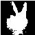
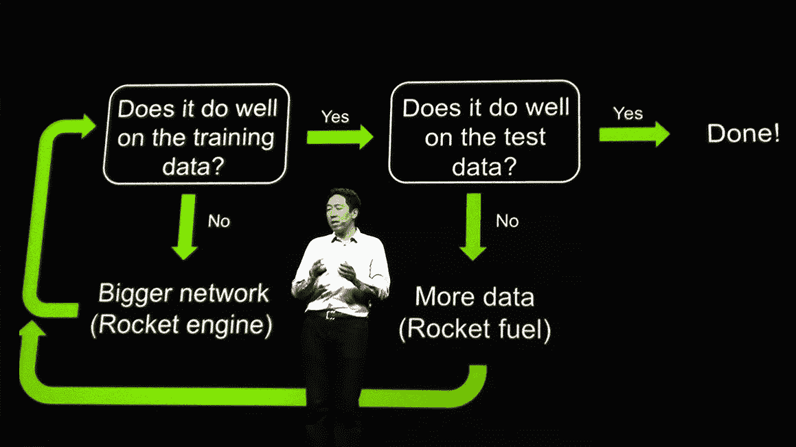
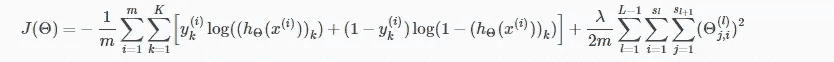
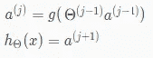

# 使用神经网络从零开始构建手势识别-机器学习简单而有趣

> 原文：<https://towardsdatascience.com/build-hand-gesture-recognition-from-scratch-using-neural-network-machine-learning-easy-and-fun-d7652dd105af?source=collection_archive---------4----------------------->

## 从自拍图像到学习神经网络模型


Photo by [Perry Grone](https://unsplash.com/@perrygrone?utm_source=medium&utm_medium=referral) on [Unsplash](https://unsplash.com?utm_source=medium&utm_medium=referral)

## 介绍

这种算法应该适用于所有不同的肤色，只要确保你的手放在中间。

对于这个解决方案，我使用了 [GNU Octave](https://www.gnu.org/software/octave/) 和 Visual Studio 代码。

*数据和代码可以在我的 Github 库中找到。*

[](https://github.com/Gago993/HandGestureRecognitionNeuralNetwork) [## gago 993/HandGestureRecognitionNeuralNetwork

### 使用神经网络的手势识别软件-gago 993/handsgeturerecognitionneuralnetwork

github.com](https://github.com/Gago993/HandGestureRecognitionNeuralNetwork) 

我们需要做的所有工作可以分为 5 个步骤:

1.  生成和准备数据
2.  生成要素
3.  生成 ML 模型
4.  测试 ML 模型
5.  用 ML 模型预测

**那么让我们开始…**

## 生成和准备数据

因为我们是从底层构建这个项目。我们需要做的第一件事是创建用于训练神经网络模型的数据。

对于这一步，我使用我的电脑内置摄像头。我从手上抓拍了 78 张图片，展示了 4 种不同的手势，它们被分成 4 个文件夹。我裁剪了一些图像，使它们更适合稍后训练我们的模型。所有训练(准备)图像都存储在 ***数据集*** 文件夹中。

*   左—包含 27 个向左指的手的图像
*   右-包含 24 个向右指的手的图像
*   手掌—包含 11 个手掌图像
*   和平—包含 14 个和平之手的图像(V 形符号)


Image 1: Dataset Example (Peace V Sign)

## 生成要素

训练图像准备就绪后，我们可以继续下一步，即处理所有图像并创建特征。从图像中分离手的主要算法通过几个简单的步骤完成:

1.  加载图像
2.  将图像大小调整为 50x50
3.  将图像从 RGB 转换为 YCbCr 颜色
4.  选择中心点颜色(期望手放在图像的中间)
5.  根据步骤 3 中定义的肤色范围分割手部。
6.  用白色标记所选像素，用黑色标记其他像素

这个算法放在***processskinimage . m***文件中。我记下了代码中的每一步。

该图像皮肤处理由***create _ image _ dataset . m***文件使用，该文件遍历所有图像，使用上述代码处理它们，并将它们分别写入左、右、手掌、和平文件夹中名为***dataset _ resized***的单独文件夹中。

最后，我们需要准备我们的图像，以便它们可以用于生成和测试我们的神经网络模型。因为我们得到了 78 幅图像，它们是 50x50 像素，所以我们将它们保存为 78x2500 大小的矩阵，其中每一列代表我们图像中的像素。我们也将随机地把矩阵分成两组。训练矩阵将被保存在 ***x_features_train*** 矩阵中，并将包含 80%的图像和 ***x_features_test*** 中的测试矩阵以及其他 20%的图像。标签将分别保存在 ***y_labels_train*** 和***y _ labels _ test***中。

创建特征矩阵的代码如下所示

```
...
% Generate random number from 1 to 10
randNum = ceil(rand() * 10);% Split the images in 80%-20% train-test set
if randNum > 2
% Create the features for the image
X_train = [X_train; image_out(:)'];
y_train = [y_train; label];
else
X_test = [X_test; image_out(:)'];
y_test = [y_test; label];
endif
...
```

有四种类型的标签:

*   [1 0 0 0] —左指手形图像
*   [0 1 0 0] —右手图像
*   [0 0 1 0] —手掌图像
*   [0 0 0 1] —和平标志手形图像

这个标签是在***create _ image _ dataset . m***中创建的，如下面的代码所示。其中 ***文件夹*** 是包含图像的文件夹名称， ***是成员*** 从上面的列表中返回 4 个选项中的一个。

```
...
label_keys = { 'left', 'right', 'palm', 'peace'};
...
label = ismember(label_keys, folder);
...
```

这个脚本完成后，我们可以在***dataset _ resized***文件夹中检查已处理的图像，我们应该会看到类似这样的内容



Image 2: Processed Image (Peace V Sign)

还应该有***x _ features _ train***和***y _ labels _ train***文件，我们将在下一步中使用它们来训练我们的模型，还有***x _ features _ test***和***y _ labels _ test***用于稍后测试我们的模型。

在继续之前，在这篇博客中，我假设你已经熟悉神经网络，这就是为什么我不打算深入神经网络的解释。

为了充分理解概念和公式，我建议阅读我的帖子，以便更深入地理解神经网络。

[](/everything-you-need-to-know-about-neural-networks-and-backpropagation-machine-learning-made-easy-e5285bc2be3a) [## 你需要知道的关于神经网络和反向传播的一切-机器学习变得容易…

### 神经网络的基础解释，包括理解背后的数学

towardsdatascience.com](/everything-you-need-to-know-about-neural-networks-and-backpropagation-machine-learning-made-easy-e5285bc2be3a) 

## 生成 ML 模型

让我们从定义我们的神经网络结构开始。我们将在网络中使用一个隐藏层。输入层的大小将是 2500 个节点，因为我们的图像是 50x50 像素。隐藏层大小将是 25 个节点，输出将是 4 个节点(4 种类型的符号)。

定义隐藏层大小没有严格的公式，但通常取决于“它与数据的拟合程度如何？”



Image 3: Andrew Ng on Neural Network Size

这里我们将使用 ***main.m*** 文件，我们将:

*   加载要素和标注
*   随机初始化θ值(NN 节点权重)
*   创建成本函数并向前传播
*   为 NN 成本函数创建梯度(*反向传播*
*   使用 ***fmincg*** 最小化器最小化成本函数

**加载特征和标签**

让我们开始第一步，加载要素和标签。我们通过使用 ***dlmread*** 函数来实现。

```
...
X = dlmread('x_features_train');

% Labels for each processed training image
%[1 0 0 0] - left, [0 1 0 0] - right, [0 0 1 0] - palm, [0 0 0 1] - peace
y = dlmread('y_labels_train');
...
```

**随机初始化θ值(NN 节点权重)**

接下来我们需要使用***randinitializeweights . m***函数初始化 Theta 值。它由下面的代码表示

```
epsilon = sqrt(6) / (L_in + L_out);
W = zeros(L_out, 1 + L_in);
W = (rand(L_out, 1 + L_in) * 2 * epsilon) - epsilon;
```

其中生成的值在[-ε，ε]之间。该代码与“均匀分布方差”的统计公式相关。如果你对这个公式更感兴趣，我会在这个博客的末尾留下链接，或者你可以提出问题。

**创建成本函数并向前传播**

我们的下一个目标是实现下面等式定义的*成本函数*。



Image 4: Regularized Cost Function

其中 *g* 是激活函数(在这种情况下是 Sigmoid 函数)



为了计算成本，我们需要使用前馈计算。代码在***nncostfunction . m .***中实现。我们将在示例中使用 for 循环来计算成本，我们还需要将 1 的列添加到 X 矩阵中，表示“偏差”值。θ₁(θ1)和θ₂(θ2)值是神经网络中每个单元的参数，θ₁的第一行对应于第二层中的第一个隐藏单元。

**为 NN 成本函数创建梯度(*反向传播* )**

为了能够最小化成本函数，我们需要计算 NN 成本函数的梯度。为此，我们将使用*反向传播*算法*，*是“误差反向传播”的缩写，用于最小化我们的成本函数，这意味着最小化我们的 NN 的误差和最小化每个输出神经元的误差。这个计算是在***nncostfunction . m***中实现的代码的一部分

**使用 *fmincg* minimizer** 最小化成本函数

一旦我们计算出梯度，我们可以通过使用高级优化器(如 *fmincg)最小化成本函数 J(θ)来训练神经网络。*这个函数不是 Octave 的一部分，所以我是从吴恩达的[机器学习课程中得到的。据我所知，这个函数比 Octave 中实现的函数更快，它使用了](https://www.coursera.org/learn/machine-learning)[共轭梯度法](https://en.wikipedia.org/wiki/Conjugate_gradient_method)。

*fmincg* 接受 3 个参数，如下面的代码示例所示。它采用成本函数、连接成单个向量的初始θ (Theta)参数和选项参数。

在我们的测试例子上运行 *fmincg* 之后，我们得到了一个向量中的θ值，我们需要在矩阵中对它们进行整形，以简化矩阵乘法。

## 测试 ML 模型

现在，我们成功地从神经网络中生成了我们的 Theta(权重)值。接下来要做的是检查我们的模型与训练的吻合程度，以及它在测试数据上的表现。

为了预测我们将使用 ***预测*** 函数位于 ***预测. m*** 文件中。

该函数采用参数和特征矩阵。然后，它将表示“偏差”值的 1 列添加到特征矩阵中。只需将两个 NN 层的特征乘以θ值。然后，它获得大小为(number_of_images x 4)的向量 h2，其中每列(4)表示该图像在该类别中的可能性(左、右、手掌、和平)。最后 if 返回概率最高的一个。

让我们执行训练集准确性和测试集准确性。

```
...
pred = predict(Theta1, Theta2, X_train);
% Compare the prediction with the actual values
[val idx] = max(y_train, [], 2);
fprintf('\nTraining Set Accuracy: %f\n', mean(double(pred == idx)) * 100);...
pred = predict(Theta1, Theta2, X_test);
% Compare the prediction with the actual values
[val idx] = max(y_test, [], 2);
fprintf('\nTest Set Accuracy: %f\n', mean(double(pred == idx)) * 100);
```

我们得到的是

```
Training Set Accuracy: 100.000000%
Test Set Accuracy: 90.909091%
```

## 用 ML 模型预测

我还制作了一些额外的图片，并将它们放在 ***测试*** 文件夹中。它们代表完整的图像(未编辑)，所以我可以测试神经网络模型的性能。我得到的是对他们四个人的预测。

```
pred =  2
Type: rightpred =  1
Type: leftpred =  3
Type: palmpred =  4
Type: peace
```

您可以用您的图像甚至您自己的训练图像来尝试这一点。只需将您的训练图像放在 ***数据集*** 文件夹下，并调用***create _ image _ dataset . m***文件来创建训练和测试矩阵。同样所有的 ***测试*** 图片都在 ***测试*** 文件夹下，你就可以调用 ***main.m*** 脚本了。

# 结论

恭喜你从零开始构建你的机器学习神经网络模型。希望这将有助于理解使用神经网络时的总体情况以及如何迈出第一步。如有任何问题或建议，请发表评论或联系我。

希望你喜欢它！

## 有用的链接

 [## 统计/分布/制服- Wikibooks，开放世界的开放书籍

### 顾名思义,(连续)均匀分布是一种概率密度为……

en.wikibooks.org](https://en.wikibooks.org/wiki/Statistics/Distributions/Uniform#Variance) [](https://stats.stackexchange.com/questions/47590/what-are-good-initial-weights-in-a-neural-network#answer-297777) [## 神经网络中什么是好的初始权重？

### 我刚刚听说，从范围$(\frac{-1}中选择神经网络的初始权重是一个好主意…

stats.stackexchange.com](https://stats.stackexchange.com/questions/47590/what-are-good-initial-weights-in-a-neural-network#answer-297777) [](https://mattmazur.com/2015/03/17/a-step-by-step-backpropagation-example/) [## 一个逐步反向传播的例子

### 背景技术反向传播是训练神经网络的常用方法。网上不缺论文说…

mattmazur.com](https://mattmazur.com/2015/03/17/a-step-by-step-backpropagation-example/)