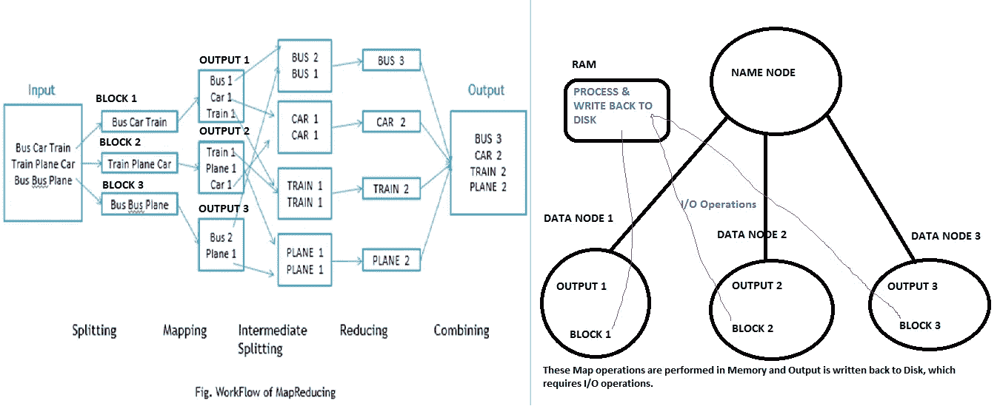
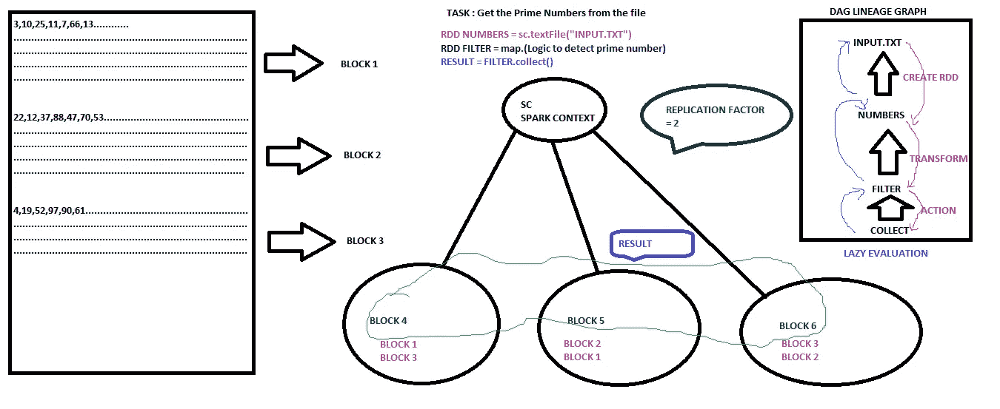
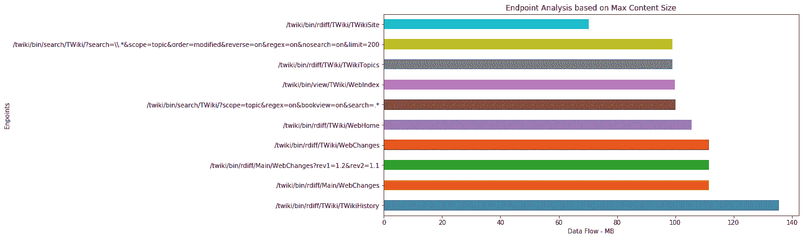
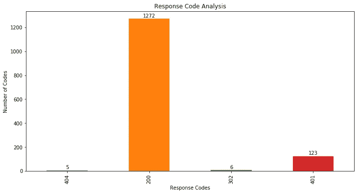
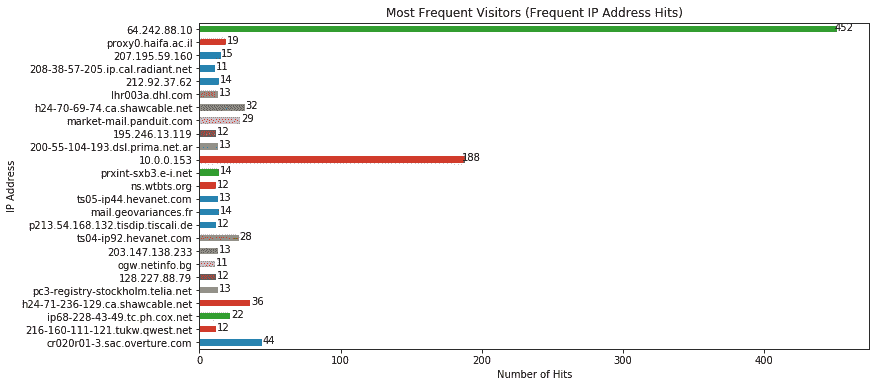
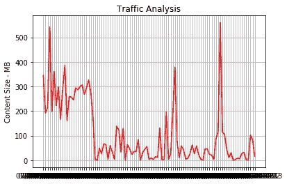
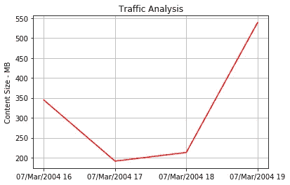
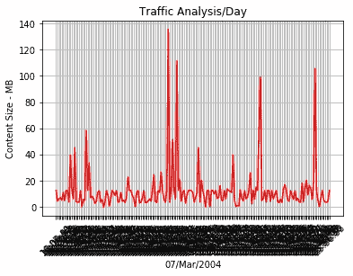
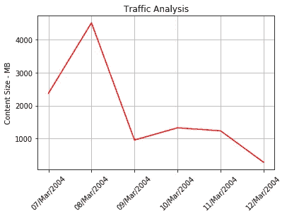
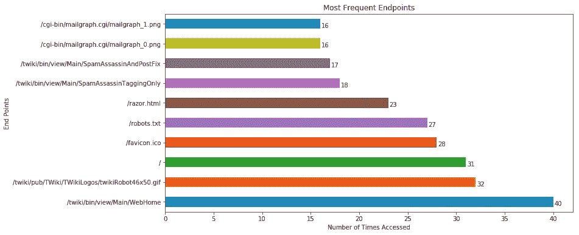

# 使用 Apache Spark 构建日志分析应用程序

> 原文：<https://towardsdatascience.com/build-log-analytics-application-using-apache-spark-b5eeca1e53ba?source=collection_archive---------10----------------------->

使用 Apache Spark 开发真实世界应用程序的一步一步的过程，主要重点是解释 Spark 的体系结构。

如果我们有 Hadoop，为什么还要 Apache Spark 架构？

Hadoop 分布式文件系统(HDFS ),它以 Hadoop 原生格式存储文件，并在集群中并行化这些文件，同时应用 MapReduce 算法来实际并行处理数据。这里的问题是数据节点存储在磁盘上，处理必须在内存中进行。因此，我们需要进行大量的 I/O 操作来进行处理，而且网络传输操作会跨数据节点传输数据。这些操作总的来说可能会阻碍数据的快速处理。



Hadoop Map Reduce Algorithm (Left Image Source : researchgate.net)

如上图所述，数据块存储在磁盘上的数据记录中，地图操作或其他处理必须在 RAM 中进行。这需要来回的 I/O 操作，从而导致整体结果的延迟。

**Apache Spark** :官网描述为:“Apache Spark 是一个**快速**和**通用**集群计算系统”。

**快** : Apache spark 很快，因为计算是在内存中进行并存储的。因此，没有 Hadoop 架构中讨论的 I/O 操作。

**通用:**是一个支持通用执行图的优化引擎。它还支持丰富的 SQL 和结构化数据处理， [MLlib](https://spark.apache.org/docs/latest/ml-guide.html) 用于机器学习， [GraphX](https://spark.apache.org/docs/latest/graphx-programming-guide.html) 用于图形处理，以及 [Spark Streaming](https://spark.apache.org/docs/latest/streaming-programming-guide.html) 用于实时数据处理。



Spark Architecture. Eg : Detect prime numbers

Spark 的入口点是 Spark 上下文，它处理执行者节点。Spark 的主要抽象数据结构是弹性分布式数据集(RDD)，它代表了一个可以并行操作的**不可变**元素集合。

让我们讨论上面的例子来更好地理解:一个文件由数字组成，任务是从这个巨大的数字块中找到质数。如果我们把它们分成三块 B1，B2，B3。这些块是不可变的，由 spark 存储在内存中。这里，复制因子=2，因此我们可以看到，其他节点的副本存储在相应的其他分区中。这使得它具有容错体系结构。

步骤 1:使用 Spark 上下文创建 RDD

第二步:**变换**:当对这些 RDD 应用 **map()** 操作时，新的块，即 B4、B5、B6 被创建为新的 RDD，它们又是不可变的。这一切操作都发生在内存中。注:B1，B2，B3 仍然作为原来的存在。

第三步:**动作**:当 **collect()，**这个时候实际的结果被收集并返回。

**懒评估** : Spark 不会马上评估每个转换，而是将它们批量放在一起，一次性评估全部。在其核心，它通过**规划计算顺序和跳过潜在的不必要步骤**来优化查询执行。主要**优点**:增加可管理性**，**节省计算并提高速度，降低复杂性，优化。

**它是如何工作的？**我们执行代码来创建 Spark 上下文，然后使用 sc 创建 RDD，然后使用 map 执行转换来创建新的 RDD。实际上，这些操作并不在后端执行，而是创建一个**有向无环图(DAG)谱系**。仅当执行**动作**时，即获取结果，例如: **collect()** 操作被调用，然后它引用 DAG 并向上爬以获取结果，参考该图，当向上爬时，它看到过滤器 RDD 尚未创建，它向上爬以获取上部结果，最后反向计算以获取精确结果。

RDD — **弹性:**即借助 RDD 谱系图容错。RDD 是其输入的确定性函数。这加上不变性也意味着 RDD 的部分可以在任何时候被重新创建。这使得缓存、共享和复制变得容易。

**分布式**:数据驻留在多个节点上。

**数据集:**代表你所处理的数据的记录。用户可以通过 JDBC 从外部加载数据集，数据集可以是 JSON 文件、CSV 文件、文本文件或数据库，没有特定的数据结构。

在文章的一部分，我们将使用 Apache Spark 的 **pyspark 和 SQL** 功能从头开始创建一个 Apache 访问日志分析应用程序。Python3 和 pyspark 的最新版本。**数据来源**:[**Apache access log**](https://github.com/ahujaraman/live_log_analyzer_spark/blob/master/apache-access_log/access_log/access_log)

必备库

```
pip install pyspark
pip install matplotlib
pip install numpy
```

步骤 1:由于日志数据是非结构化的，我们从每一行解析并创建一个结构，在分析时，每一行又会变成每一行。

步骤 2:创建 Spark Context、SQL Context、DataFrame(是组织到命名列中的**数据**的分布式集合。它在概念上相当于关系数据库中的表)

步骤 3:分析以 MB 为单位传输最多内容的前 10 个端点



Top End Points with Maximum Content Flow



Response Code Analysis



Visitors(IP Address) which access the system most frequently



Traffic Analysis for Past One Week



Hour Level Traffic Analysis on Particular Day



Day Level Traffic Analysis

通过分析峰值以及哪些端点被哪些 IP 地址击中，可以清楚地检测出异常值。



Week Level Each Day Traffic Analysis

在这里，我们可以看到 3 月 8 日的一个不寻常的峰值，可以对其进行进一步分析，以确定差异。

地块分析代码:



End Points which are most Frequenty Hit

获取完整的应用代码:【https://github.com/ahujaraman/live_log_analyzer_spark 