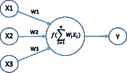
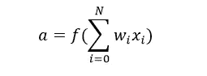
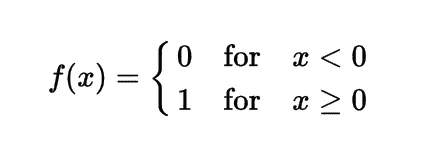
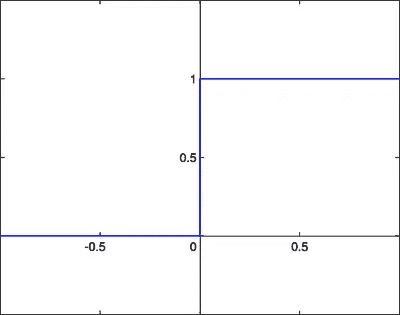
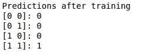
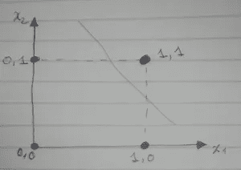
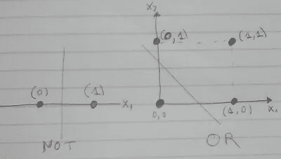
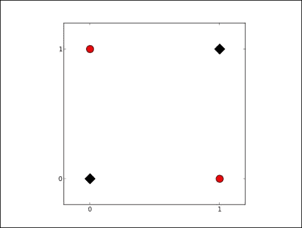

# 从头开始构建神经网络—第 2 部分

> 原文：<https://towardsdatascience.com/build-neural-network-from-scratch-part-2-673ec7cdd89f?source=collection_archive---------4----------------------->

*神经网络系列简介(GINNS)——第二部分*

# **简介**

在这篇文章中，我们将为 And 逻辑门构建一个感知机，这个模型我们将使用 python 和 numpy 从头开始构建。在这里，我假设你已经阅读了神经网络入门系列—第 1 部分，并且你已经熟悉了神经网络的基本概念。如果您不熟悉这个主题，我强烈建议您从第 1 部分开始。你还在吗？太好了，这篇文章将是我迄今为止写得最短的文章之一，我想在你建立良好的直觉和对神经网络的理解的同时保持事情的简单，所以让我们开始吧，但是首先，让我解释一下为什么从零开始建立一个超级虚拟神经网络**为什么从零开始实现一个神经网络？**

但是为什么要从头开始实现一个神经网络呢？我相信你真正想要的是创建强大的神经网络，可以预测你照片中的人是乔治·卢卡斯还是卢克·天行者？不要！，哦好吧，我不怪你。

现在，玩笑归玩笑。即使你计划在未来使用 Tensorflow、Keras 或另一个神经网络库，从头实现一个网络至少一次也是非常有价值的练习。它帮助你理解神经网络是如何工作的，这对设计有效的模型是必不可少的。所以，我希望我说服你留在这里。

# 单层神经网络(感知机)

感知器算法是最简单的人工神经网络类型，它的灵感来自于称为神经元的单个神经细胞的信息处理。

Perceptron

在感知器中，为了计算输出，我们将输入乘以各自的权重并与阈值进行比较，概括来说，输入的加权和通过一个阶跃/激活函数，如下所示:

Weighted sum passed to an activation function.

# 激活功能

给定一个输入或一组输入，节点的激活函数定义该节点的输出。一个标准的计算机芯片电路可以被看作是一个激活功能的数字网络，激活功能可以是“开”(1)或“关”(0)，这取决于输入。在我们的示例中，我们将使用二元阶跃函数，如下所示:

step function

# 下面是代码！

Perceptron

1.  负载输入(x)和输出(y)
2.  初始化权重和其他参数:**学习率**是控制权重更新量的配置参数，**训练步骤(也称为历元)**是进行向前和向后传播的单个步骤。
3.  计算输入(X)和权重矩阵(W)之间的点积，这里我们用 np.dot()做矩阵乘法，点积也叫内积，比如 X 和 W 之间的内积是 x1*w1 + x2*w2 + x3*w3 + … + Xn*Wn。
4.  在 l1 上应用激活功能。l1 实际上是我们网络的输出。
5.  当我们开始训练网络猜测预测时，计算模型产生的损失或错误，然后我们比较预测的类和真实的类。理想情况下，当我们训练神经网络时，我们想要的是找到最佳权重(W ),使我们的模型误差最小化。
6.  计算变化因子，我们称之为更新，如果我们的模型正确地预测了类，误差等于零，并且权重没有变化，但是如果它出错，那么我们可以对权重进行负(减少)或正(增加)更新。
7.  我们在 100 个训练步骤中训练我们的模型，并使用在线或随机学习，这意味着我们使用单个训练示例来进行参数更新。这里，单个训练示例是随机选取的。

培训后的输出:

y_pred after training

# 使用案例和限制

虽然感知器对我们示例中的实例进行了很好的分类，但该模型有局限性，实际上，感知器是一个线性模型，在大多数情况下，线性模型不足以学习有用的模式。

Left: And Gate, Right: Not and OR Logic Gates

像感知器这样的线性模型不是通用函数逼近器，如果您试图改变 XOR 逻辑门的问题，感知器会失败，因为 XOR 不具有线性可分性，如下图所示:

[source](https://www.packtpub.com/mapt/book/big_data_and_business_intelligence/9781783988365/8/ch08lvl1sec59/limitations-of-the-perceptron)

神经网络是众所周知的通用函数逼近器，那么我们遗漏了什么？这就是隐藏层的来源，也是我们接下来要讨论的内容。

## 下一步是什么？

我们将讨论隐藏层的力量和它们能够进行的处理，以及我们如何使用基于反向传播和梯度下降的算法来训练复杂的神经网络，如果你愿意更深入地研究神经网络的内部细节，请查看下面的链接，敬请关注！

## 参考资料:

*   [神经网络和深度学习](http://neuralnetworksanddeeplearning.com/index.html)
*   http://cs231n.github.io/neural-networks-1/
*   [用 Python 从零开始实现神经网络——简介](http://www.wildml.com/2015/09/implementing-a-neural-network-from-scratch/)
*   [在 Python 和 TensorFlow 中从头开始构建神经网络](https://beckernick.github.io/neural-network-scratch/)
*   [用 Python 和 R 从零开始理解和编码神经网络](https://www.analyticsvidhya.com/blog/2017/05/neural-network-from-scratch-in-python-and-r/)
*   [11 行 Python 中的神经网络(第 1 部分)](https://iamtrask.github.io/2015/07/12/basic-python-network/)

## 在你走之前！

如果你喜欢这些作品，请留下你的掌声👏*推荐这篇文章，让别人也能看到。*

大卫·福莫的《❤与 T4》。

愿原力与你同在！