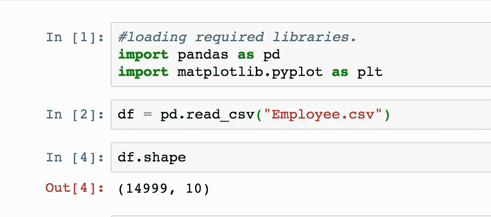
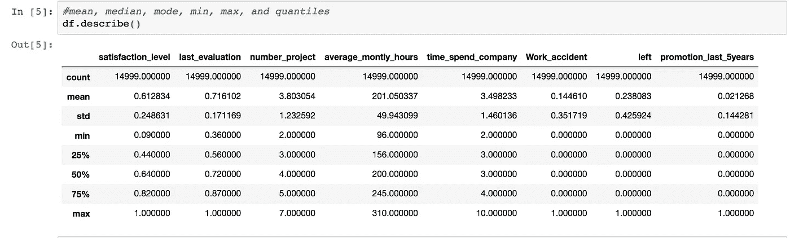
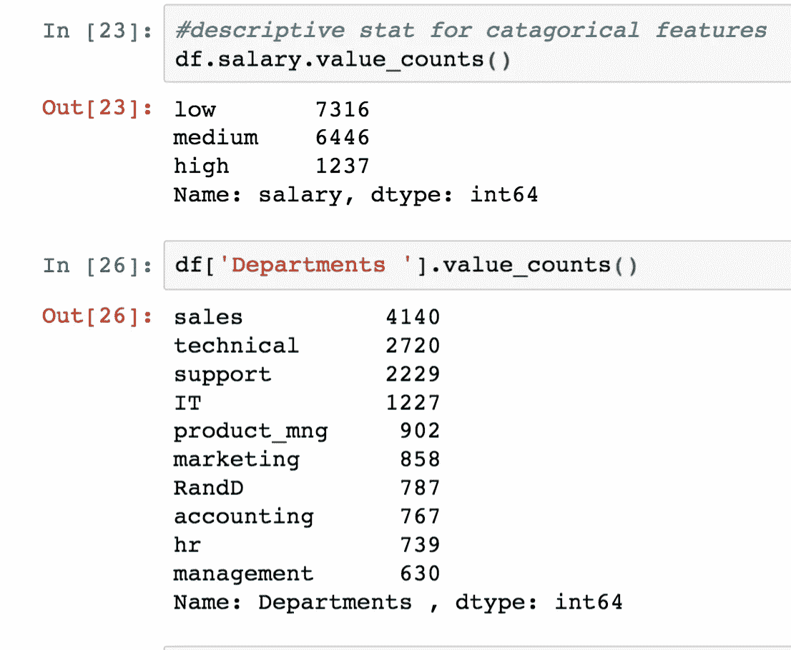
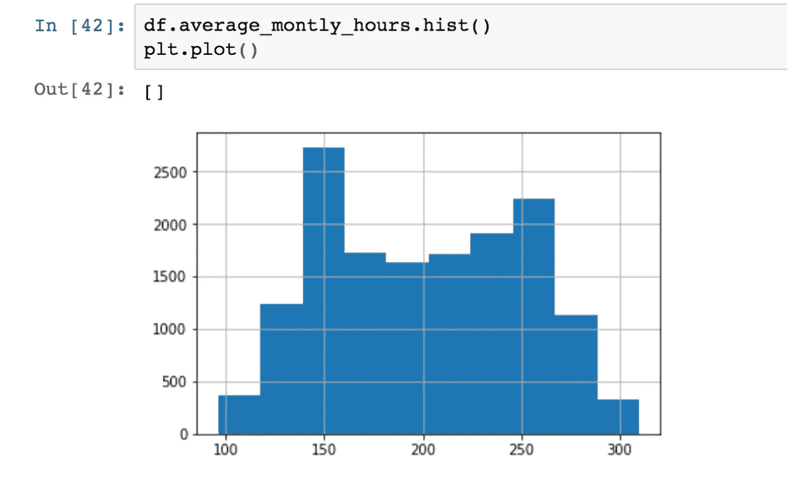
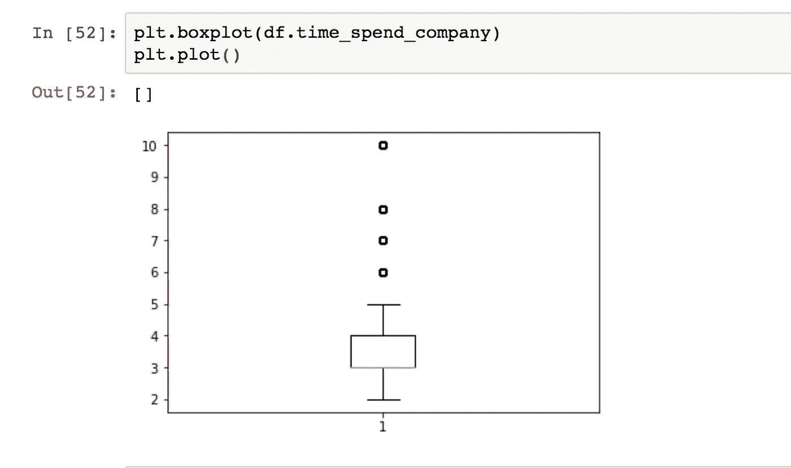
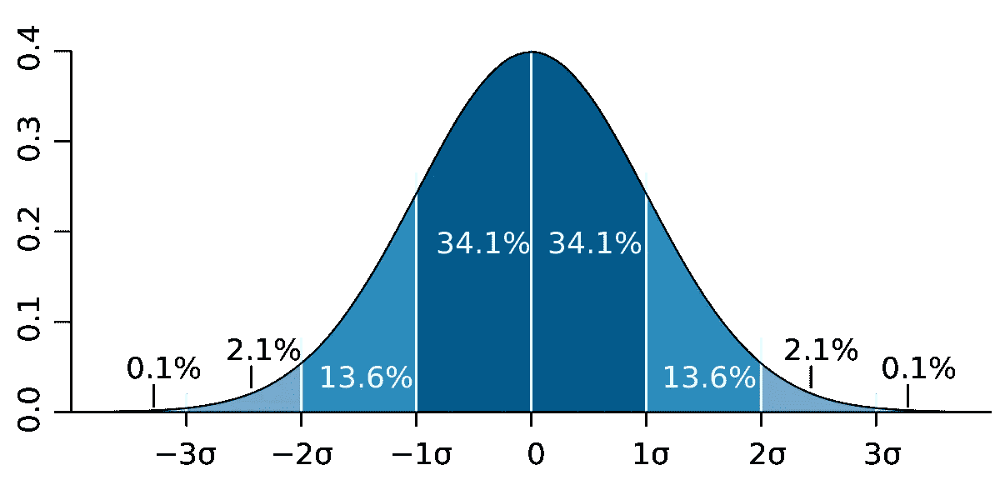
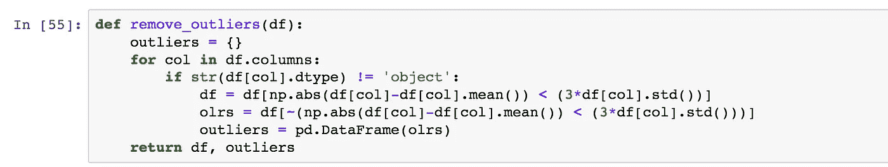

# 使用探索性数据分析和熊猫围绕数据构建故事。数据科学的艺术部分。

> 原文：<https://towardsdatascience.com/build-the-story-around-data-using-exploratory-data-analysis-and-pandas-c85bf3beff87?source=collection_archive---------5----------------------->

探索性数据分析，简称 EDA，是赢得数据科学竞赛的秘方。EDA 是数据科学的创造性部分，是一个使用统计工具围绕数据编写的故事。EDA 还使科学家能够对数据进行隐喻性的考古挖掘，挖掘出任何潜在的见解。训练一个基本的机器学习算法只需要不到五行的代码。相比之下，EDA 和数据准备需要更长的时间，占数据科学家 80%的时间。

**EDA 是什么？** 简单来说，EDA 是一套在假设检验和实验之外探索和理解数据的统计方法。

**使用 python 执行 EDA**
使用 python 执行 EDA 非常容易，因为 python 有无数的统计分析包(如 numpy、pandas、matplotlib 等)。在 EDA 中主要进行三种分析，即:

单变量分析
双变量分析
多变量分析

我们将使用 python 逐步执行所有这三种类型的分析，并得出一些结论。从[这里](https://github.com/khotveer/Exploratory-data-analysis)下载数据集，从[这里](https://github.com/khotveer/Exploratory-data-analysis)下载完整代码。

使用 pandas 加载数据并检查数据框的维度。

**reading Employee.csv file**

# 单变量分析

一旦我们加载数据，我们就可以开始第一种 EDA，称为单变量分析。“Uni”表示一个,“Variate”表示变量，因此单变量分析表示对一个变量或一个特征的分析。单变量基本上告诉我们每个特征中的数据是如何分布的，还告诉我们中心趋势，如平均值、中值和众数。

**描述性统计**

**连续特征**
首先，检查集中趋势均值、中值和众数的度量，检查每个特征的最小值和最大值以及分位数。要做所有这些事情，我们只需使用 pandas 的“describe()”函数。

**statistical description**

从上表中，我们可以看到，员工的平均满意度仅为 61.12%，偏离了 24%，这意味着员工满意度之间存在很大差异，这直接影响了生产率。此外，我们可以看到 50%的员工同时从事 4 个不同的项目。这里的 50%分位数也称为中位数，我们使用中位数是因为中位数不会受到离群值的影响。其中平均值容易受到异常值的影响。

**分类特征** 分类变量中的描述性统计使用频率表和模式技术进行分析

**frequency tables**

从上图中，我们可以说几乎 48%的员工工资很低，只有 8%的员工工资很高。

**可视化**

**直方图** 在单变量分析中，我们使用直方图来分析和可视化频率分布。在熊猫身上绘制直方图非常简单明了。

从上图中，我们看到数据不是正态分布的，因此我们无法对这些数据执行许多统计操作。

**箱线图** 单变量分析中使用的第二个可视化工具是箱线图，这种类型的图形用于检测数据中的异常值。数据点超过三个标准偏差，通常称为异常值。离群值直接影响统计分析，因此我们必须首先检测它，然后从数据中删除(或修复)它。matplotlib 中的箱线图如下所示

**box-plot for time spent in the company**

从上图中，我们可以看到，有四名员工在公司花的时间比其他所有员工都多。所以这些员工的待遇与普通员工不同。因此，我们必须单独处理异常值。

**离群值**
使用中位数的整点是中位数不能受离群值的影响，这里均值容易受离群值的影响。有许多处理异常值的技术，其中一种技术采用三个标准差之间的所有数据。根据[经验法则](https://en.wikipedia.org/wiki/68%E2%80%9395%E2%80%9399.7_rule)，几乎 99.97%的数据属于如下所示的三个标准差。

[**empirical rule**](https://en.wikipedia.org/wiki/68%E2%80%9395%E2%80%9399.7_rule)

数据点位于称为异常值的三个标准偏差之上，因此我们采用三个标准偏差之间的数据来排除异常值。曲线下的面积称为 p 值，距离平均值的度量由标准差给出。

**python function for removing outliers**

该 python 函数将输入作为 pandas 数据框，并返回异常值和数据在三个标准差之间的数据框，该技术称为 3-sigma 技术。

现在 EDA 被称为数据科学的艺术部分，因为每个人都有不同的方法来查看数据并从中挖掘一些模式。我们用 python 做了很多 EDA。在接下来的博客中，我将向您展示如何用 python 执行推断统计。如果你喜欢这个博客，请喜欢并评论，直到那时快乐学习。

**Connect with the Raven team on** [**Telegram**](https://t.me/ravenprotocol)