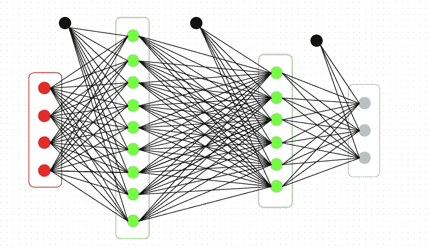
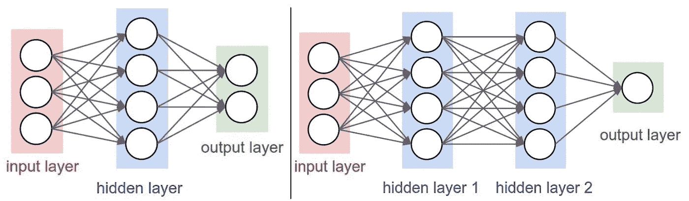
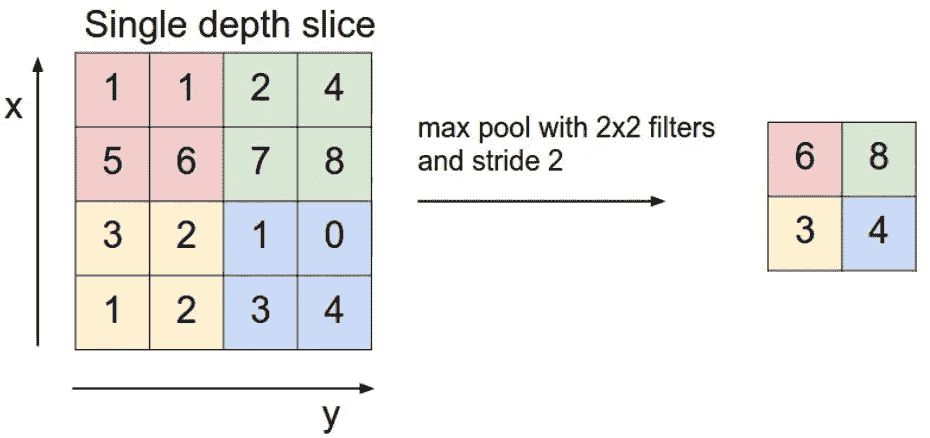
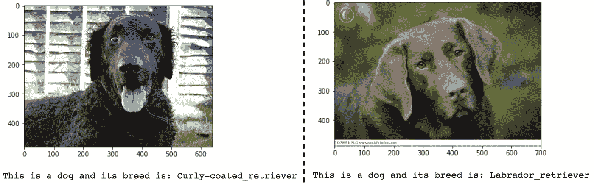

# 使用 TensorFlow 构建您的第一个深度学习分类器:狗品种示例

> 原文：<https://towardsdatascience.com/build-your-first-deep-learning-classifier-using-tensorflow-dog-breed-example-964ed0689430?source=collection_archive---------0----------------------->



Convoluted Neural Networks (like the one pictured above) are powerful tools for Image Classification

# 介绍

在本文中，我将向您介绍几种技术，帮助您迈出开发算法的第一步，该算法可用于经典的**图像分类**问题:从图像中检测狗的品种。

到本文结束时，我们将开发出代码，接受任何用户提供的图像作为输入，并返回对狗的品种的估计。此外，如果检测到人类，该算法将提供最相似的狗品种的估计。

# 1.什么是卷积神经网络？

卷积神经网络(也称为 CNN 或 ConvNet)是一类**深度神经网络**，已在许多计算机视觉和视觉图像应用中广泛采用。

一个著名的 CNN 应用案例在斯坦福大学研究小组的[研究论文](https://www.nature.com/articles/nature21056?error=cookies_not_supported&code=c8ab8524-38e7-47c0-af7a-5912873b07b6)中有详细描述，他们在论文中展示了使用单一 CNN 对皮肤病变进行分类。仅使用像素和疾病标签作为输入，从图像中训练神经网络。

卷积神经网络由多层组成，与其他图像分类算法相比，它需要相对较少的预处理。

他们通过使用滤镜并将其应用于图像来学习。该算法采用一个小正方形(或“窗口”)并开始在图像上应用它。每个过滤器允许 CNN 识别图像中的特定模式。CNN 寻找图像中过滤器匹配图像内容的部分。


An example of a CNN Layer Architecture for Image Classification (source: [https://bit.ly/2vwlegO](https://bit.ly/2vwlegO))

网络的前几层可以检测简单的特征，如线、圆、边。在每一层中，随着我们越来越深入神经网络的各个层，网络能够结合这些发现，并不断学习更复杂的概念。

## 1.1 有哪几种层？

CNN 的整体架构由输入层、隐藏层和输出层组成。它们有几种类型的层，例如卷积层、激活层、汇集层、下降层、密集层和软最大层。



Neural Networks consist of an input layer, hidden layers, and an output layer (source: [https://bit.ly/2Hxhjaw](https://bit.ly/2Hxhjaw))

卷积层(或 Conv 层)是构成卷积神经网络的核心。Conv 层由一组滤镜组成。每个过滤器可以被认为是一个小正方形(具有固定的宽度和高度),其延伸通过输入体积的整个深度。

在每次通过时，过滤器在输入体积的宽度和高度上“卷积”。这个过程产生一个二维激活图，它给出了该滤波器在每个空间位置的响应。

为了避免过度拟合，池层用于在激活图上应用非线性缩减采样。换句话说，池层在丢弃信息方面很激进，但如果使用得当，也是有用的。在 CNN 架构中，一个池层通常跟随一个或两个 Conv 层。



Pooling layers are used to apply non-linear downsampling on activation maps (source: [https://bit.ly/2Hxhjaw](https://bit.ly/2Hxhjaw))

通过随机忽略某些激活函数，丢弃层也用于减少过拟合，而密集层是完全连接的层，通常位于神经网络的末端。

## 1.2 什么是激活功能？

使用激活函数处理层和神经网络的输出，激活函数是添加到隐藏层和输出层的节点。

你会经常发现 ReLu 激活函数用在隐藏层，而最终层通常由 SoftMax 激活函数组成。这个想法是，通过堆叠线性和非线性函数层，我们可以检测大范围的模式，并准确预测给定图像的标签。

SoftMax 通常位于最后一层，它基本上是一个归一化器，产生一个离散的概率分布向量，这对我们来说很好，因为 CNN 的输出是一个图像对应于特定类别的概率。


The most common activation functions include the ReLU and Sigmoid activation functions

当涉及到模型评估和性能评估时，选择损失函数。在用于图像分类的 CNN 中，通常选择[类别交叉熵](https://aboveintelligent.com/deep-learning-basics-the-score-function-cross-entropy-d6cc20c9f972)(简单地说:它对应于-log(error))。有几种方法可以使用梯度下降来最小化误差——在本文中，我们将依靠“ [rmsprop](http://ruder.io/optimizing-gradient-descent/) ”，这是一种自适应学习率方法，作为一种以准确性为衡量标准的优化器。

# 2.设置算法的构建模块

为了构建我们的算法，我们将使用 [TensorFlow](https://www.tensorflow.org/) 、 [Keras](https://keras.io/) (运行在 TensorFlow 之上的神经网络 API)，以及 [OpenCV](https://opencv.org/) (计算机视觉库)。

完成该项目时，训练和测试数据集也可用(参见 [GitHub repo](https://github.com/udacity/dog-project) )。

## **2.1 检测图像是否包含人脸**

为了检测提供的图像是否是人脸，我们将使用 OpenCV 的[人脸检测算法](https://docs.opencv.org/trunk/d7/d8b/tutorial_py_face_detection.html)。在使用任何面部检测器之前，标准程序是将图像转换为灰度。下面，`detectMultiScale`函数执行`face_cascade`中存储的分类器，并将灰度图像作为参数。

## 2.2 检测图像是否包含狗

为了检测所提供的图像是否包含一张狗的脸，我们将使用一个预训练的 [ResNet-50](http://ethereon.github.io/netscope/#/gist/db945b393d40bfa26006) 模型，该模型使用 [ImageNet](https://en.wikipedia.org/wiki/ImageNet) 数据集，该数据集可以将对象从 [1000 个类别](https://gist.github.com/yrevar/942d3a0ac09ec9e5eb3a)中分类。给定一个图像，这个预训练的 [ResNet-50 模型](http://ethereon.github.io/netscope/#/gist/db945b393d40bfa26006)返回图像中包含的对象的预测。

当使用 [TensorFlow](https://www.tensorflow.org/) 作为后端时，[Keras](https://keras.io/)CNN 需要一个 4D 数组作为输入。下面的`path_to_tensor`函数将彩色图像的字符串值文件路径作为输入，将其调整为 224x224 像素的正方形图像，并返回适合提供给 Keras CNN 的 4D 数组(称为“张量”)。

此外，所有预训练模型都有额外的归一化步骤，即必须从每个图像的每个像素中减去平均像素。这在导入函数`preprocess_input`中实现。

如上面的代码所示，对于最终预测，我们通过获取预测概率向量的 [*argmax*](https://docs.scipy.org/doc/numpy-1.14.0/reference/generated/numpy.argmax.html) 来获得与模型的预测对象类别相对应的整数，我们可以通过使用 ImageNet 标签[字典](https://gist.github.com/yrevar/942d3a0ac09ec9e5eb3a)来识别对象类别。

# 3.使用迁移学习建立你的 CNN 分类器

现在我们有了在图像中检测人类和狗的功能，我们需要一种从图像中预测品种的方法。在这一节中，我们将创建一个对狗的品种进行分类的 CNN。

为了在不牺牲准确性的情况下减少训练时间，我们将使用[转移学习](/transfer-learning-leveraging-insights-from-large-data-sets-d5435071ec5a)来训练 CNN 这是一种允许我们使用在大型数据集上预先训练好的网络的方法。通过保留早期的层并仅训练新添加的层，我们能够利用通过预训练算法获得的知识并将其用于我们的应用。

[Keras](https://keras.io/applications/) 包括几个预训练的深度学习模型，可用于预测、特征提取和微调。

## 3.1 模型架构

如前所述， [ResNet-50 模型](https://github.com/KaimingHe/deep-residual-networks)输出将成为我们的输入层——称为*瓶颈*特性。在下面的代码块中，我们通过运行以下代码来提取与训练、测试和验证集相对应的瓶颈特性。

我们将建立我们的模型体系结构，以便 ResNet-50 的最后一个卷积输出作为我们的模型的输入。我们只添加了一个[全局平均池](https://keras.io/layers/pooling/)层和一个[全连接](https://keras.io/layers/core/)层，其中后者包含每个狗类别的一个节点，并具有一个 [Softmax](https://keras.io/activations/#softmax) 激活函数。

```
_________________________________________________________________ Layer (type) Output Shape Param # ================================================================= global_average_pooling2d_3 ( (None, 2048) 0 _________________________________________________________________ dense_3 (Dense) (None, 133) 272517 ================================================================= Total params: 272,517 Trainable params: 272,517 Non-trainable params: 0 _________________________________________________________________
```

正如我们在上面代码的输出中看到的，我们最终得到了一个有 272，517 个参数的神经网络！

## 3.2 编译和测试模型

现在，我们可以使用 CNN 来测试它在我们的狗图像测试数据集中识别品种的能力。为了微调模型，我们进行了 20 次迭代(或“[时期](/epoch-vs-iterations-vs-batch-size-4dfb9c7ce9c9)”)，其中模型的超参数被微调，以减少使用 RMS Prop 优化的损失函数([类别交叉熵](https://rdipietro.github.io/friendly-intro-to-cross-entropy-loss/))。

```
Test accuracy: 80.0239%
```

该算法提供了一个测试集，测试准确率为 **80%** 。一点都不差！

## 3.3 用模型预测犬种

现在我们有了算法，让我们编写一个函数，它以图像路径作为输入，并返回由我们的模型预测的狗的品种。

# 4.测试我们的 CNN 分类器

现在，我们可以编写一个函数，它接受一个图像的文件路径，并首先确定该图像是否包含一个人、一只狗，或者两者都不包含。

如果在图像中检测到一只**狗**，返回预测的品种。如果在图像中检测到一个**人**，返回相似的狗品种。如果图像中未检测到**或**，则提供指示错误的输出。

我们已经准备好测试这个算法了！让我们在一些样本图像上测试该算法:



这些预测在我看来很准确！

最后，我注意到该算法容易出错，除非它是一个清晰的正面拍摄，图像上的噪声最小。因此，我们需要使算法对噪声更加鲁棒。此外，我们可以用来改进我们的分类器的一种方法是[图像增强](https://medium.com/nanonets/how-to-use-deep-learning-when-you-have-limited-data-part-2-data-augmentation-c26971dc8ced)，它允许您通过提供训练集中提供的图像的变体来“增强”您的数据。