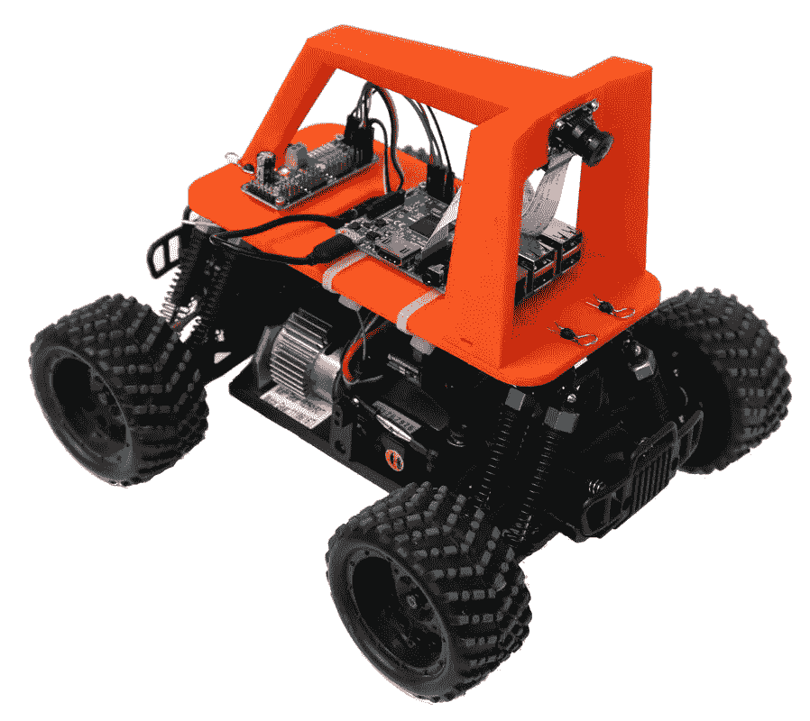

# 打造你自己的自动驾驶(玩具)汽车

> 原文：<https://towardsdatascience.com/build-your-own-self-driving-toy-car-ad00a6804b53?source=collection_archive---------4----------------------->

如果你有兴趣建造自己的自动驾驶(玩具)汽车，并在此过程中学习一些人工智能概念，你应该留下来通读。

# 简短介绍

随着数据和计算能力的不断增加，深度学习的应用正在扰乱当今的许多行业。它的新战场之一是机器人技术。深度学习正在改变机器人在[感知和控制](https://arxiv.org/pdf/1612.07139.pdf)领域的格局，这是自动驾驶汽车及其更广泛部署取得成功的关键。

深度学习工具的最新进展( [TensorFlow](https://www.tensorflow.org/) 、 [Keras](https://keras.io/) 等)。)和廉价计算平台的可访问性( [Raspberry Pi](https://www.raspberrypi.org/) )使得机器人和人工智能的实验变得更加容易(而且有趣！)对于学术界和大型科技公司以外的人来说。

# 目标

我们将从 [Udacity 自动驾驶汽车纳米度](https://www.udacity.com/drive)课程中获取我的[行为克隆](https://medium.com/towards-data-science/using-deep-learning-to-clone-driving-behavior-51f4c9593a57)项目中描述的深度神经网络，并使用机器人操作系统( [ROS](http://www.ros.org/) )作为中间件在远程控制(RC)赛车上运行它。最终目标是让机器人能够自主完成赛道:

这只是这一领域许多近期项目中的一个，如果你在网上搜索的话，还有很多这样的项目。甚至还有比赛(最著名的一次在美国奥克兰举行)，人们和这些机器人赛跑，试图打破人类最好的时间。

我的项目可能与其他项目不同的是，它使用 ROS 作为软件栈和金属之间的连接层。

这个项目是一个很好的例子，展示了深度学习如何用于端到端地训练汽车自动驾驶，并使用人工智能解决机器人的感知和控制挑战。

# 我如何建立一个？

让我们首先来看一下硬件，以便让您入门:

1.  [遥控车](https://www.amazon.com/2-4Ghz-Exceed-RC-Magnet-Electric/dp/9269803775/ref=wl_mb_wl_huc_mrai_2_dp)
2.  [树莓派 3](https://www.raspberrypi.org/products/raspberry-pi-3-model-b/)
3.  [树莓派相机](https://www.raspberrypi.org/products/camera-module-v2/)
4.  [广角镜头](https://www.kiwi-electronics.nl/magnetische-lens-voor-raspberry-pi-groothoek?lang=en)
5.  [伺服驱动器](https://www.amazon.com/SunFounder-PCA9685-Channel-Arduino-Raspberry/dp/B014KTSMLA/ref=sr_1_1?s=electronics&ie=UTF8&qid=1492275083&sr=1-1&keywords=servo+driver)
6.  [3D 打印支架](https://github.com/bdjukic/selfdriving-robot-car/tree/master/3d_print_model)

由于我的硬件构建是基于[驴车](http://www.donkeycar.com/)，你可以在这里获得关于硬件组装[的更详细说明。你会注意到，当谈到选择你的遥控车有很多选择。在这个项目的第一次迭代中，我选择了](https://docs.google.com/document/d/11IPqZcDcLTd2mtYaR5ONpDxFgL9Y1nMNTDvEarST8Wk/edit) [Elegoo 机器人汽车套件](https://www.amazon.com/Elegoo-Four-wheel-Ultrasonic-Intelligent-Educational/dp/B01DPH0SWY)，结果证明这不是一个好主意，因为该套件没有用于控制转向角度的专用伺服系统。这使得对你的神经网络建模以及之后与自动驾驶仪的集成变得更加困难。有了[磁铁](https://www.amazon.com/2-4Ghz-Exceed-RC-Magnet-Electric/dp/9269803775/ref=wl_mb_wl_huc_mrai_2_dp)，你可以更好的控制遥控车。

# 软件呢？

如果你很急，你也可以从[驴车](https://github.com/wroscoe/donkey)拿软件栈。我走了另一条路，试图通过观察驴车项目并从我以前的 Udacity 项目中吸取经验来自己构建大脑。我喜欢理查德·费曼在这个话题上的一句名言:

> 我无法创造的东西，我不明白。知道如何解决每一个已经解决的问题。

正如我已经提到的，我决定选择机器人操作系统(ROS)作为基于深度学习的自动驾驶仪和硬件之间的中间件。这是一个陡峭的学习曲线，但就该项目的完整代码库的大小而言，它最终完全得到了回报。

ROS 提供了强大的发布者/订阅者模型，对每个组件(摄像机、转向和油门控制、操纵杆等)的分布式节点支持。).它还具有强大的调试和日志记录功能。如果你是 ROS 新手，我强烈推荐[这本书](https://www.amazon.com/ROS-Robotic-Projects-Lentin-Joseph/dp/1783554711)，它通过有趣的项目教你基础知识。

在我的例子中，我在车上运行了摄像机和执行器(转向和油门)节点。操纵杆、自动驾驶和训练节点正在我的台式机上运行。推理(神经网络预测)是计算密集型，所以必须将它从 Raspberry Pi 转移到更强大的机器上。

记住，你需要 [Ubuntu Mate](https://ubuntu-mate.org/raspberry-pi/) 发行版才能在你的 Raspberry Pi 上运行 ROS。这里还有一个[链接](http://ubiquityrobotics.com/blog/2016/01/24/Raspberry-Pi-Cam.html)用于 ROS 节点摄像头支持。

# **AI 呢？**

汽车的自动驾驶基于现在著名的 NVIDIA 的[论文](https://arxiv.org/pdf/1604.07316.pdf)，该论文使用[卷积神经网络](https://en.wikipedia.org/wiki/Convolutional_neural_network) (CNN)来预测汽车的转向角度，仅基于安装在汽车前面的摄像头的图像输入。你可以在我之前的[文章](https://medium.com/towards-data-science/using-deep-learning-to-clone-driving-behavior-51f4c9593a57)中读到更多关于这个话题的内容。我最近偶然发现了这篇[论文](http://cs231n.stanford.edu/reports/2017/pdfs/626.pdf)，这篇论文探索了针对同一问题的一些其他深度神经网络架构。你应该去看看！

与我之前的 Udacity 项目相比，我必须为 CNN 做的一项调整是引入宁滨数据。在以下情况下，您应该考虑使用它:

> 一列连续数字有太多的唯一值，无法有效地建模，因此您可以自动或手动将这些值分配给组，以创建一组较小的离散范围。

在这种情况下，连续数字列是来自操纵杆的汽车转向角度。我发现这个修改改进了我的模型预测。另一方面，油门目前是固定的，这也是我想使用预测方法的事情。

# 结论

参与这个项目是了解 ROS 的一个很好的方式(好处和挑战)。事实证明，ROS 被几家自主汽车/小型巴士公司用作原型平台和/或投入生产。

此外，当你把你的神经网络从模拟器中拿出来放在一辆“真正的”汽车上时，在硬件上工作可以揭示一些问题。

您在自己的机器人车上运行 ROS 节点所需的所有代码都可以在我的项目报告中找到，同时还有助手脚本:

 [## 自动驾驶机器人汽车

### 自动驾驶机器人汽车基于 Raspberry Pi 和 Arduino 的机器人汽车，能够基于深度…

github.com](https://github.com/bdjukic/selfdriving-robot-car) 

如果你住在柏林，请务必参加即将于 7 月 29 日举行的机器人比赛:

 [## 柏林比赛日-黑客/比赛机器人

### 加入我们在海拉风险投资公司举办的柏林自动驾驶汽车和自动驾驶活动的黑客/比赛日。种族…

www.meetup.com](https://www.meetup.com/Berlin-Self-Driving-Cars-Autonomous-Mobility/events/238595677/)