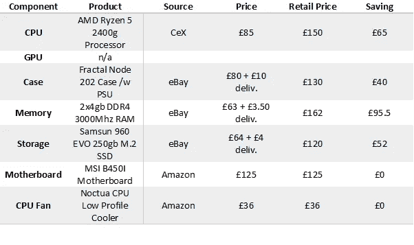
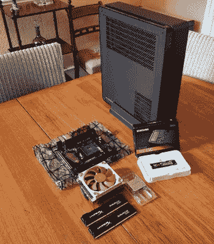

# 第一次构建回大学/学校预算计算机

> 原文：<https://towardsdatascience.com/building-a-back-to-uni-school-budget-computer-for-the-first-time-3e1d2b2e048b?source=collection_archive---------10----------------------->

从零开始建造一台计算机是我长久以来的一个梦想，但是我很担心，因为我缺乏计算机硬件方面的知识。相反，我经常最终购买笔记本电脑，但这些很快就会过时，不再适合我的数据科学需求。这是关于你自己建造一台计算机的最好的部分；你才是决定计算机到底是用来做什么的人！

这篇文章概述了我决定使用哪些组件，如何将它们组合在一起，以及如何在确保一切正常的情况下削减成本的过程。在此版本中，**许多商品的购买价格为其建议零售价的 50% — 70%** **，如下表所示，**没有性能问题。

# **我需要什么来开始？**

## 耐心，而且是大量的耐心！

当然，如果费用对你来说不是一个很大的问题，那么你可以直接订购许多商品，并在几天内全部拿到。然而，如果你想要最好的交易，可能需要一段时间的网上竞价或清仓甩卖，但坚持不懈往往会得到回报。给一个总的想法，我的构建从开始到结束花了 3 到 4 周，这包括一些邮费上的延迟。

## 做你的研究！

有许多组件可用，但并非所有组件都兼容或最佳。这可能是压倒性的第一，因为有数百个，如果不是数千个电脑组件，它很容易丢失。然而，有一些惊人的资源可以帮助我们，并在下一节中更详细地讨论它们。

## **有计划，坚持！**

当搜索组件时，确切地知道你要的是什么版本是有帮助的，而不是仅仅被现有的所吸引。

## 就是这样！

除了一些工具和一些方便的工作之外，您将准备好构建自己的工具。有些构建可能有点棘手，但这对我来说肯定不正常，组件手册将是你最好的指南。

# 我在哪里可以找到关于我的构建的帮助？

PC Part Picker 对于寻找兼容部件非常有用，建议您详细阅读评论，了解每个组件的优点和缺点:

 [## 挑选零件。构建您的 PC。对比分享。— PCPartPicker 英国

### 构建您自己的 PC 并需要从哪里开始的想法？浏览我们的构建指南，其中涵盖了适用于所有人的系统…

uk.pcpartpicker.com](https://uk.pcpartpicker.com/) 

有大量的书面指南，许多组件包含的说明通常有助于构建方面，但我发现 YouTube 是一个惊人的资源，许多创作者提供了关于构建计算机的详细建议，我将列出一些我最喜欢的:

## [**OzTalksHW**](https://www.youtube.com/channel/UC6Jxh95N32m1JvKG_-fQ6QQ)

Oz 为所有规格的预算构建提供了一个很好的来源，如果你愿意冒险，它展示了直接从中国进口的最便宜的组件。

## [RandomGamingHD](https://www.youtube.com/user/RandomGaminginHD/videos)

另一位 budget build 创建者经常测试仍然可用且功能正常的旧组件的性能，甚至在他的本地转储中保存旧显卡以免被销毁。

## 克里斯多福莉娅

有趣的是，一个最初是业余电影制作人的 YouTuber 用户找到了自己的位置，他展示个人电脑的组装，呼吁卖家在二手市场上定价过高，并展示，如果运气好的话，你可以买到二手物品的交易。

这些是我使用的主要渠道，但还有更多，你经常可以找到针对你的构建甚至特定组件的视频。

# 我想要我的电脑做什么？

这完全取决于你，但就我的目的而言，我想要符合以下标准(按重要性排序)的东西:

1.  强大到足以运行数据科学模型
2.  尽可能便宜
3.  安静且低功耗，因此可以整夜运行
4.  微妙的美学和运输相当容易
5.  未来可升级

你自己的需求会有所不同，但我想要一些东西，可以在一夜之间运行我的一些机器学习模型，但我不能花一大笔钱这样做。因此，在构建时考虑了项目成本和运行机器的电费。

功耗可能是你甚至没有想过的事情，但是，[当你考虑到许多家庭比特币采矿爱好者正在因为运行他们的机器的成本超过他们是我的成本而却步](https://cointelegraph.com/news/bitcoin-minings-electricity-bill-is-it-worth-it)时，如果你正在买单，这可能值得考虑。

一旦你决定了什么对你的构建是重要的，那么你就可以开始考虑哪些组件是最好的。为了符合我的标准，我决定尽可能选择最小的版本，它目前足够强大，如果需要的话，以后可以很容易升级，而且成本效益高。

# **需要哪些组件？**

与你可能认为的相反，如今制造一台计算机非常简单，而且经常被比作将乐高积木拼在一起。我很惊讶这个过程是如此的简单，甚至没有任何经验的人也能做到。

要创建一台完整的计算机，您需要以下部件:

-处理器(称为 CPU)和冷却器

-图形卡(称为 GPU)

-主板

-内存(也称为 RAM)

-存储(称为硬盘)

-凯斯

-电源(被称为 PSU)

# 我应该买哪些组件？

## 处理器和显卡

我的构建围绕着 AMD 的新锐龙处理器。这些不仅是英特尔系列的一个很好的预算选择，而且他们还发布了两个也有集成显卡的处理器；**锐龙 3 2200 克和锐龙 5 2400 克**。这意味着他们根本不需要显卡就可以运行游戏并达到中端显卡的性能！

因此，我能够从构建中完全排除对独立显卡的需求，从而降低至少 150 英镑的成本。当然，这永远无法满足一个独立处理器和一个高端显卡组合的全部性能，但如果达到最大图形性能不是一个优先事项，并且对于一些游戏来说已经足够了，这是一个很好的预算解决方案。

## 外壳和电源

CPU 和 GPU 都包括在内，然后我考虑我想要的美学。我认为一个小而有吸引力的案例很重要，并把重点放在了作为完美解决方案的 [**分形节点 202**](http://www.fractal-design.com/home/product/cases/node-series/node-202-integra-sfx-450w-psu) 上。这种外壳不仅很小(大约是 PS4 或 Xbox One 的大小)，而且**还带有内置电源单元**。然而，在选择这个案例时，我需要考虑一些重要的挑战:

-所提供的电源在功率输出、效率和安全性方面是否足够好？

-这会导致我的其他组件出现兼容性问题吗？

首先，机箱的电源提供 450 瓦的功率，因为我们没有单独的显卡，这足以为组件供电。你可以用 [**这个计算器**](http://www.coolermaster.com/power-supply-calculator/) 检查你的体型，我的体型被计算出大约 200W，用显卡更接近 400W。电源也通过了[青铜认证](https://www.techpowerup.com/forums/threads/how-does-psu-efficiency-affect-me-and-do-i-really-need-an-80-plus-gold-power-supply.129456/)，这基本上确保了它为计算机提供能量的效率相当高，并且不会作为热量浪费掉，这有利于降低能源成本。这也提供了一些安全保证，有一些更便宜的情况下，也包括电源可用，但没有认证，这是一个风险，可能会损坏您的电脑和家用电器。

## 母板

有了这些决定，然后我必须找到一个兼容的主板。这是最棘手的部分，也是由于选择有限，我最终以全价购买的唯一主要组件。因为机箱的大小，我被迫需要最小的主板，被称为迷你 ITX。此外，由于 AMD 的处理器作为 CPU 和 GPU 的功能是新的，只有一定范围的最新主板开箱即用。因此，我决定购买**微星的新 B450I 迷你 ITX** 主板，内置 Wi-Fi 和蓝牙。

[https://www . Amazon . co . uk/gp/product/b 07 fnmlctc/ref = oh _ aui _ detail page _ o01 _ s00？ie=UTF8 & psc=1](https://www.amazon.co.uk/gp/product/B07FNMLCTC/ref=oh_aui_detailpage_o01_s00?ie=UTF8&psc=1)

这种购买感觉像是一个巨大的风险，因为在制作这种产品的日期没有对该产品的评论，但我能够找到几个早期测试 YouTube 视频，证实它应该与处理器兼容，所以我决定值得冒这个风险，因为它比任何替代品便宜近 100 英镑。

## 内存储器

有了这个主板，我就被要求购买一种通常用于笔记本电脑的 M.2 存储类型。我强烈推荐使用 SSD 存储设备作为主系统，一个很好的总结可以在这里找到****但是总之 SSD 运行得更快。如果您需要更多存储空间，您可以随时添加大容量硬盘驱动器，但使用固态硬盘作为您的主要设备将缩短启动时间，甚至缩短 windows 中的文件加载时间。我能够在易贝上购买一个 250GB 的三星 960 evo SSD，对于操作系统和基本使用来说，这已经足够大了。****

## ****记忆****

****然后，我不得不购买一些内存(或 RAM ),并再次需要检查兼容性。理解 RAM 可能有点棘手，但我会尽力总结我的发现。****

****RAM 有三个质量衡量标准，第一个是 DDR2、DDR3 和 DDR4([https://en.wikipedia.org/wiki/DDR_SDRAM](https://en.wikipedia.org/wiki/DDR_SDRAM))类别，为了与我的主板配合工作，我需要 DDR 4 类型。****

****第二个衡量标准是由 [MHz 数量](https://www.pcsteps.com/7932-real-ram-speed-mhz-cas-latency/)表示的内存速度，因为我们使用 AMD 的锐龙 5 2400g 处理器，所以建议使用 [**至少 3000MHz 的两个棒以获得理想的性能**](https://www.pcper.com/reviews/Graphics-Cards/AMD-Ryzen-5-2400G-Memory-Speed-Performance-Analysis) 。****

****最后，我需要在 8GB、16GB 或 32GB 之间决定所需的内存量。由于 ram 目前很贵，我决定 8GB 对我来说应该足够了，如果需要，以后可以很容易地升级。****

## ****冷却****

****最后，您需要考虑如何确保所有组件都保持冷却并且不会过热。因为这个版本不包括图形卡，所以事情变得简单了一些，但是处理器冷却非常重要。AMD 的锐龙 5 2400g 配备了一个股票风扇包括这是伟大的预算建设，但因为我的情况是如此之薄，这不太可能适合。因此，我决定购买一个 [**更薄的风扇单元**](https://www.amazon.co.uk/gp/product/B075SG1T3X/ref=oh_aui_detailpage_o00_s00?ie=UTF8&psc=1) ，其中包括导热膏，足以让我的组件保持良好的温度。****

****下图显示了组装前的所有组件:****

********

****很难建议您想要购买哪些物品，因为您需要仔细考虑您的需求以及您需要哪些组件。然而，我希望这能让我对我的构建过程有所了解，从而对你有所帮助。****

****我的建议是决定你需要的一两个组件，例如最快的处理器、最好的显卡或有吸引力的外壳，然后以此为起点寻找其他兼容的组件。如前所述，PC Part Picker 在建议哪些组件适合您的构建方面做得非常出色，评论甚至提供了更多建议。****

# ******我怎样才能省钱？******

****我能够以零售价的 50%-70%在易贝和清仓甩卖上竞价购买我的许多部件。这比简单地购买新的花费更长的时间，但是只要有一点耐心和明智的选择，你就能以低于零售价的价格买到所需的大部分(如果不是全部)部件。****

****我从 CeX(一家英国零售店)购买了机箱、易贝的 SSD M.2 硬盘和 RAM 以及 AMD 锐龙处理器。不幸的是，如前所述，由于产品太新，主板必须以全价购买。****

****最终价格汇总如下:****

********

****总的来说，我的构建成本约为 470 英镑，通过谨慎购买，我在组件上节省了 200 至 250 英镑。此外，我不仅能够通过一些运气在 AMD 处理器上获得一笔惊人的交易，而且我还通过首先不需要构建显卡至少节省了 250 英镑(英伟达 RTX 1060 6GB)。****

****购买处理器是有风险的，因为该产品在网上的描述中几乎没有任何信息，并认为这可能是一个错误。然而，处理器来了，工作完美，虽然它没有任何包装或股票冷却器风扇，但这不是一个问题，我的建设，因为股票风扇不会适合的情况下，无论如何。****

****如果我决定不把它放进这么小的盒子里，成本可能会进一步降低，但它仍然比任何笔记本电脑替代品、类似性能的预建配置甚至新手机都要便宜得多，我对自己能够找到的交易感到惊讶。****

# ****如何将这些组件组合在一起？****

****现在你有了所有的部分，你需要把它们拼在一起，而且通常会按照一定的顺序排列，这样它们才能正确的组合。对齐取决于您购买的产品和构建的类型，但主板和机箱可能应该有一个过程的良好描述。另外，我在网上找到了我正在处理的案件的视频，以确保我的过程是正确的。****

****对于我的构建，过程如下:****

****1.将 CPU 安装到主板上，****

****2.使用导热膏，连接 CPU 风扇并插入主板****

****3.安装 M.2 固态硬盘****

****4.安装内存****

****5.将主板(带端口导轨)放入机箱内****

****6.将电源线连接到指定的主板插座****

****除了一些棘手的对齐问题，我发现最后一步是最难的。大多数电缆匹配是显而易见的，但我花了一段时间来找出从外壳的前面电源开关连接电缆的地方，但能够很容易地在网上找到解决方案，并使用主板手册。**此外，请确保在连接电源和用电器工作时要小心，你最不希望的就是意外触电！******

# ******我应该安装哪个操作系统？******

****为了方便使用，我最终安装了 windows 10，这可能很贵，但我能在易贝上找到一个便宜的激活密钥。第一次安装时，我按照以下指南从 u 盘运行 window 的安装程序:****

****[http://www . toms guide . com/FAQ/id-3694993/create-bootable-USB-installer-windows . html](http://www.tomsguide.com/faq/id-3694993/create-bootable-usb-installer-windows.html)****

****如果你真的预算紧张，那么 Linux 是一个很好的选择，它完全免费，并且有一些令人惊讶的界面。如果你愿意接受挑战，你甚至可以在电脑上安装 Mac IOS 来创建一个“黑客电脑”，但这不是我感兴趣的事情。****

# ******最终想法******

****我从组装电脑和在线竞标组件中获得了很多乐趣。这花了一些时间，但值得耐心，并强烈建议任何有兴趣升级其硬件的人这样做，并希望您发现这对您自己的构建想法有用。****

****与任何网上投标一样，在寻找好的交易时要耐心和小心，以确保你没有买到描述不佳、不起作用的产品。此外，请确保您研究了哪些组件是兼容的，并在头脑中为您想要的构建类型保持一个明确的目标。****

****最后，你可能要考虑市场价格。例如，我选择避免使用显卡，因为价格处于历史高位，Nvidia 的最新产品系列将很快发布，因此旧产品的价格可能会下降。如果我有耐心，我可以等待主板价格下跌，甚至拯救自己，但这是一个权衡，你将不得不决定自己的建设。****

****谢谢****

****哲学（philosophy 的缩写）****