# 构建贝叶斯深度学习分类器

> 原文：<https://towardsdatascience.com/building-a-bayesian-deep-learning-classifier-ece1845bc09?source=collection_archive---------5----------------------->

在这篇博客文章中，我将教你如何使用 [Keras](https://keras.io/) 和 [tensorflow](https://www.tensorflow.org/) 来训练贝叶斯深度学习分类器。在深入具体的培训示例之前，我将介绍几个重要的高级概念:

1.  贝叶斯深度学习是什么？
2.  什么是不确定性？
3.  为什么不确定性很重要？

然后，我将介绍两种在深度学习模型中包含不确定性的技术，并查看一个使用 Keras 在 [cifar10](https://www.cs.toronto.edu/%7Ekriz/cifar.html) 数据集上的冻结 [ResNet50](https://arxiv.org/abs/1512.03385) 编码器上训练完全连接的层的具体示例。通过这个例子，我还将讨论探索贝叶斯深度学习分类器的不确定性预测的方法，并提供未来改进模型的建议。

# 感谢

这篇文章基于两篇博客文章([这里](http://alexgkendall.com/computer_vision/bayesian_deep_learning_for_safe_ai/)和[这里](http://mlg.eng.cam.ac.uk/yarin/blog_3d801aa532c1ce.html))和剑桥大学机器学习小组关于贝叶斯深度学习的[白皮书](https://arxiv.org/pdf/1703.04977.pdf)。如果你在读完这篇文章后想了解更多关于贝叶斯深度学习的知识，我鼓励你查看所有这三个资源。感谢剑桥大学机器学习小组令人惊叹的博文和论文。

# 贝叶斯深度学习是什么？

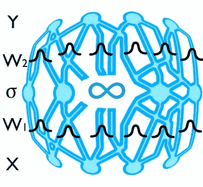

*Visualizing a Bayesian deep learning model.*

贝叶斯统计是统计领域中的一种理论，其中关于世界真实状态的证据是用信任度来表示的。贝叶斯统计和深度学习在实践中的结合意味着在你的深度学习模型预测中包含不确定性。早在 [1991](http://papers.nips.cc/paper/419-transforming-neural-net-output-levels-to-probability-distributions.pdf) 就提出了在神经网络中包含不确定性的想法。简而言之，贝叶斯深度学习在典型神经网络模型中发现的每个权重和偏差参数上添加了先验分布。在过去，贝叶斯深度学习模型并不经常使用，因为它们需要更多的参数来优化，这可能使模型难以工作。然而，最近，贝叶斯深度学习变得更加流行，新技术正在开发中，以在模型中包括不确定性，同时使用与传统模型相同数量的参数。

# 什么是[不确定性](https://en.wikipedia.org/wiki/Uncertainty)？

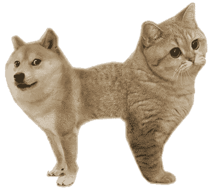

*An example of ambiguity. What should the model predict?*

不确定性是一种知识有限的状态，无法准确描述现有状态、未来结果或一个以上的可能结果。当它涉及深度学习和分类时，不确定性也包括模糊性；人类定义和概念的不确定性，不是自然界的客观事实。

# 不确定性的类型

有几种不同类型的不确定性，在这篇文章中我将只讨论两种重要的不确定性。

## 任意不确定性

随机不确定性衡量的是你无法从数据中理解的东西。它可以用观察所有解释变量的能力来解释。把随机不确定性想象成感知不确定性。实际上有两种类型的随机不确定性，异方差和同方差，但是我在这篇文章中只讨论异方差不确定性。在[的这篇](http://alexgkendall.com/computer_vision/bayesian_deep_learning_for_safe_ai/)博客文章中，对同性恋进行了更深入的探讨。

立体图像中任意不确定性的具体例子有遮挡(相机看不到的场景部分)、缺乏视觉特征(如空白墙壁)或曝光过度/不足区域(眩光和阴影)。

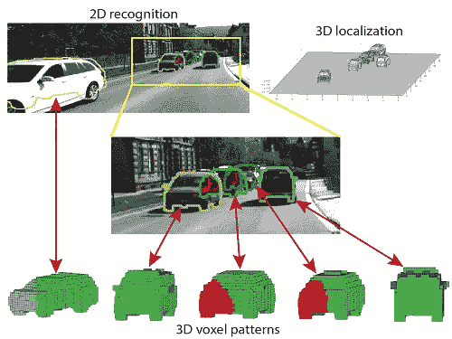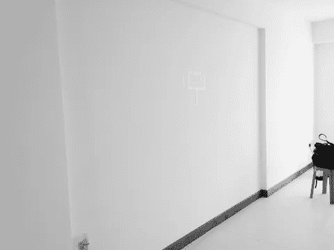

Examples of occlusions, lack of visual features and under/over exposure.

## 认知不确定性

认知不确定性衡量的是由于缺乏训练数据，模型不知道什么。它可以用无限的训练数据来解释。将认知不确定性视为模型不确定性。

观察认知不确定性的一个简单方法是在 25%的数据集上训练一个模型，在整个数据集上训练第二个模型。仅在 25%的数据集上训练的模型将比在整个数据集上训练的模型具有更高的平均认知不确定性，因为它看到的例子更少。

一个有趣的认知不确定性的例子在现在著名的非热狗应用中被发现。从我自己使用该应用程序的经验来看，该模型表现非常好。但仔细观察后发现，这个网络似乎从未被训练过“不是热狗”的图片，这些图片中的物品上有番茄酱。因此，如果给模特看一张你腿上沾有番茄酱的照片，模特会被骗以为那是热狗。贝叶斯深度学习模型将预测这些情况下的高度认知不确定性。

# 为什么不确定性很重要？

在机器学习中，我们试图创建真实世界的近似表示。今天创建的流行深度学习模型产生点估计，但不是不确定性值。了解您的模型是过于自信还是过于自信有助于您对模型和数据集进行推理。上面解释的两种不确定性是重要的，原因各不相同。

注意:在分类问题中，softmax 输出为每个类别提供了一个概率值，但这与不确定性不同。softmax 概率是一个输入相对于其他类成为给定类的概率。因为概率是相对于其他类的，所以它无助于解释模型的总体置信度。

## 为什么任意不确定性很重要？

*Even for a human, driving with glare is difficult*

在观察空间的一部分比其他部分具有更高噪声水平的情况下，随机不确定性是很重要的。例如，任意的不确定性在第一起涉及无人驾驶汽车的死亡事故中发挥了作用。特斯拉表示，在这起事件中，汽车的自动驾驶仪未能识别明亮天空下的白色卡车。能够预测任意不确定性的图像分割分类器将认识到图像的这个特定区域难以解释，并预测高度不确定性。在特斯拉事件中，尽管汽车的雷达可以“看到”卡车，但雷达数据与图像分类器数据不一致，汽车的路径规划器最终忽略了雷达数据(已知雷达数据有噪声)。如果图像分类器在其预测中包含高度不确定性，则路径规划者将会知道忽略图像分类器预测，而使用雷达数据(这过于简单，但实际上将会发生。参见下面的卡尔曼滤波器)。

## 为什么认知不确定性很重要？

认知不确定性很重要，因为它识别模型从未被训练理解的情况，因为这些情况不在训练数据中。机器学习工程师希望我们的模型能够很好地概括与训练数据不同的情况；然而，在深度学习的安全关键应用中，希望是不够的。高认知不确定性是一个危险信号，表明模型更有可能做出不准确的预测，当这种情况发生在安全关键应用中时，该模型不应被信任。

认知的不确定性也有助于探索你的数据集。例如，认知的不确定性可能有助于 20 世纪 80 年代发生的这个特定的神经网络灾难。在这种情况下，研究人员训练了一个神经网络来识别隐藏在树中的坦克和没有坦克的树。经过训练后，网络在训练集和测试集上表现得非常好。唯一的问题是，所有坦克的图像都是在阴天拍摄的，所有没有坦克的图像都是在晴天拍摄的。这个分类器实际上已经学会了辨别晴天和阴天。哎呦。

*Tank & cloudy vs no tank & sunny*

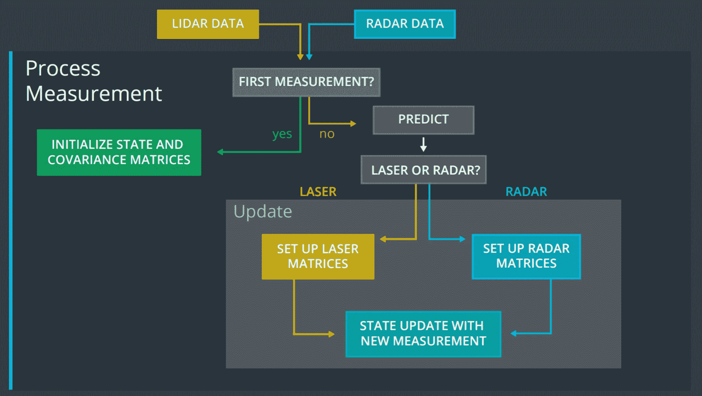

*Radar and lidar data merged into the Kalman filter. Image data could be incorporated as well.*

深度学习模型中的不确定性预测在机器人技术中也很重要。我目前就读于 Udacity 自动驾驶汽车纳米学位，并一直在学习汽车/机器人用于识别和跟踪物体的技术。自动驾驶汽车使用一种叫做[卡尔曼滤波器](https://en.wikipedia.org/wiki/Kalman_filter)的强大技术来追踪物体。卡尔曼滤波器组合一系列包含统计噪声的测量数据，并产生比任何单个测量更精确的估计。传统的深度学习模型无法对卡尔曼滤波器做出贡献，因为它们只预测结果，不包括不确定项。理论上，贝叶斯深度学习模型可以有助于卡尔曼滤波器跟踪。

# 计算深度学习分类模型中的不确定性

任意不确定性和认知不确定性是不同的，因此，它们的计算方式也不同。

## 计算任意不确定性

任意不确定性是输入数据的函数。因此，深度学习模型可以通过使用修改的损失函数来学习预测任意的不确定性。对于分类任务，贝叶斯深度学习模型将有两个输出，softmax 值和输入方差，而不是仅预测 softmax 值。教导模型预测任意方差是无监督学习的一个示例，因为模型没有方差标签可供学习。下面是标准分类交叉熵损失函数和计算贝叶斯分类交叉熵损失的函数。

我创建的损失函数是基于这篇论文[中的损失函数。在本文中，损失函数创建了一个均值为零的正态分布和预测方差。它通过从分布中采样来扭曲预测的 logit 值，并使用扭曲的预测来计算 softmax 分类交叉熵。损失函数运行 T 个蒙特卡罗样本，然后取 T 个样本的平均值作为损失。](https://arxiv.org/pdf/1703.04977.pdf)

*Figure 1: Softmax categorical cross entropy vs. logit difference for binary classification*

在图 1 中，y 轴是 softmax 分类交叉熵。x 轴是“正确的”logit 值和“错误的”logit 值之间的差值。“右”表示该预测的正确类别。“错误”表示该预测的错误类别。我将使用术语“logit difference”来表示图 1 中的 x 轴。当“logit difference”在图 1 中为正时，softmax 预测将是正确的。当“logit difference”为负时，预测将是不正确的。在解释任意损失函数时，我将继续使用术语“逻辑差”、“正确的”逻辑和“错误的”逻辑。

图 1 有助于理解正态分布失真的结果。当使用正态分布对 logit 值(在二元分类中)进行扭曲时，这种扭曲实际上创建了一个正态分布，其原始预测“logit 差异”和预测方差的平均值作为分布方差。将 softmax 交叉熵应用于失真的 logit 值与沿着图 1 中的线对“logit 差异”值进行采样是相同的。

对扭曲的逻辑取分类交叉熵应该理想地产生一些有趣的性质。

1.  当预测的 logit 值远大于任何其他 logit 值时(图 1 的右半部分)，增加方差只会增加损失。这是真的，因为导数在图的右半部分是负的。即，与“logit difference”的相等减少相比，增加“logit difference”仅导致 softmax 分类交叉熵的稍微更小的减少。在这种情况下，最小损耗应该接近于 0。
2.  当“错误的”logit 远大于“正确的”logit(图的左半部分)且方差为~0 时，损失应为~ `wrong_logit-right_logit`。你可以看到这在图 1 的右半部分。当“logit 差”为-4 时，softmax 交叉熵为 4。图中这一部分的斜率为~ -1，因此随着“logit 差异”继续减小，这应该是正确的。
3.  为了使模型能够学习任意的不确定性，当“错误的”logit 值大于“正确的”logit 值(图的左半部分)时，对于大于 0 的方差值，损失函数应该最小化。对于具有高度随机不确定性的图像(即，模型很难对该图像做出准确预测)，该特征鼓励模型通过增加其预测方差来在训练期间找到局部损失最小值。

当“错误的”logit 值大于“正确的”logit 值时，我能够使用论文中建议的损失函数通过增加方差来减少损失，但是由于增加方差而减少的损失非常小(<0.1). During training, my model had a hard time picking up on this slight local minimum and the aleatoric variance predictions from my model did not make sense. I believe this happens because the slope of Figure 1 on the left half of the graph is ~ -1\. Sampling a normal distribution along a line with a slope of -1 will result in another normal distribution and the mean will be about the same as it was before but what we want is for the mean of the T samples to decrease as the variance increases.

To make the model easier to train, I wanted to create a more significant loss change as the variance increases. Just like in the paper, my loss function above distorts the logits for T Monte Carlo samples using a normal distribution with a mean of 0 and the predicted variance and then computes the categorical cross entropy for each sample. To get a more significant loss change as the variance increases, the loss function needed to weight the Monte Carlo samples where the loss decreased more than the samples where the loss increased. My solution is to use the [elu](http://image-net.org/challenges/posters/JKU_EN_RGB_Schwarz_poster.pdf) 激活函数，这是一个以 0 为中心的非线性函数)。

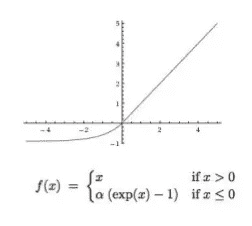

*ELU activation function*

我将 elu 函数应用于分类交叉熵的变化，即原始未失真损失与失真损失的比较，`undistorted_loss - distorted_loss`。对于图 1 的左半部分，elu 将正态分布的平均值从零移开。对于接近 0 的非常小的值，elu 也是线性的，因此图 1 右半部分的平均值保持不变。

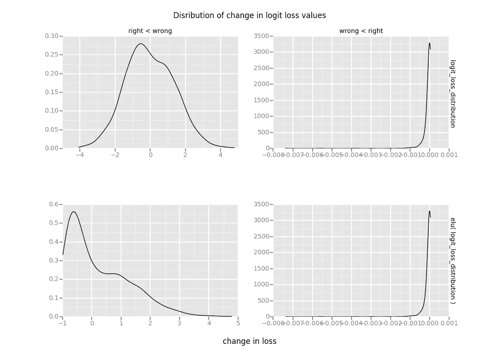

*Figure 2: Average change in loss & distorted average change in loss.*

在图 2 中，`right < wrong`对应于图 1 左半部分的一个点，而`wrong < right`对应于图 2 右半部分的一个点。您可以看到,“错误”logit 情况下的结果分布看起来类似于正态分布，而“正确”情况下的结果大多是接近零的小值。将`-elu`应用于损失变化后，`right < wrong`的均值变得更大。在本例中，它从-0.16 变为 0.25。`wrong < right`的意思保持不变。我将图 2 中下方图表的平均值称为“失真的平均损失变化”。随着图 1 右半部分方差的增加,“失真平均损耗变化”应保持在 0 附近，并且当图 1 右半部分方差增加时，应始终增加。

然后，我用原始未失真的分类交叉熵来衡量“失真的平均损失变化”。这样做是因为对于所有大于 3 的 logit 差异，错误 logit 情况下的失真平均损失变化大致相同(因为线的导数为 0)。为了确保损失大于零，我添加了未失真的分类交叉熵。“损失的扭曲平均变化”总是随着方差的增加而减少，但是对于小于无穷大的方差值，损失函数应该最小化。为了确保最小化损失的方差小于无穷大，我添加了方差项的指数。如图 3 所示，方差的指数是方差超过 2 后的主要特征。

*Figure 3: Aleatoric variance vs loss for different ‘wrong’ logit values*

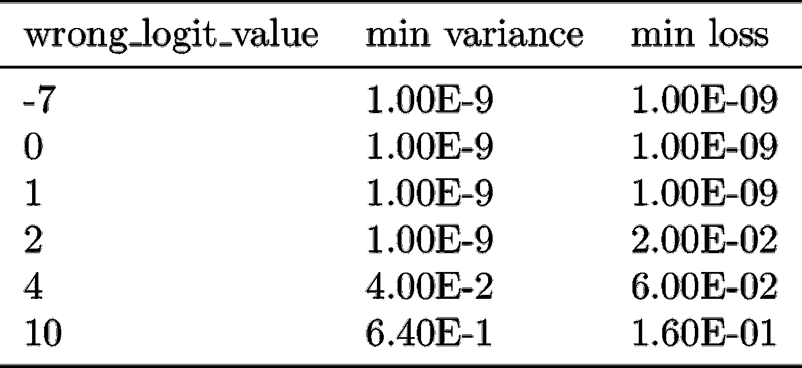

*Figure 4: Minimum aleatoric variance and minimum loss for different ‘wrong’ logit values*

这些是针对二元分类示例计算上述损失函数的结果，在该示例中,“正确”的 logit 值保持为常数 1.0，而“错误”的 logit 值会针对每一行发生变化。当“错误的”logit 值小于 1.0(因此小于“正确的”logit 值)时，最小方差为 0.0。随着错误的“logit”值增加，使损失最小化的方差也增加。

注意:在生成此图时，我运行了 10，000 次蒙特卡洛模拟来创建平滑的线条。在训练模型时，我只运行了 100 次蒙特卡洛模拟，因为这应该足以得到一个合理的平均值。

*Brain overload? Grab a time appropriate beverage before continuing.*

## 计算认知不确定性

对认知不确定性建模的一种方式是在测试时使用蒙特卡罗抽样(一种变分推理)。关于为什么辍学可以模拟不确定性的完整解释，请查看[这篇](http://mlg.eng.cam.ac.uk/yarin/blog_3d801aa532c1ce.html)博客和[这篇](https://arxiv.org/pdf/1703.04977.pdf)白皮书。实际上，蒙特卡洛漏失抽样意味着将漏失包括在模型中，并在测试时打开漏失多次运行模型，以创建结果分布。然后可以计算预测熵(预测分布中包含的平均信息量)。

为了理解如何使用 dropout 来计算认知不确定性，可以考虑将上面的猫狗图像垂直分成两半。

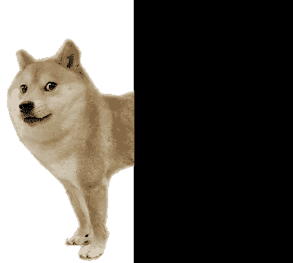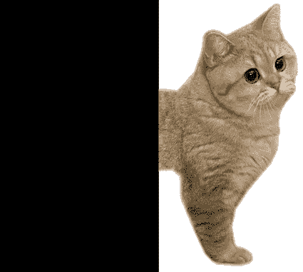

如果你看到左半部分，你会预测狗。如果你看到右半边，你会预测猫。完美的五五分成。这个图像会有很高的认知不确定性，因为这个图像展示了你同时与猫类和狗类相关联的特征。

下面是计算认知不确定性的两种方法。它们做完全相同的事情，但是第一个更简单，只使用 numpy。第二种使用额外的 Keras 层(并获得 GPU 加速)来进行预测。

注意:认知不确定性不用于训练模型。当评估测试/真实世界的例子时，它仅在测试时间(但是在训练阶段)被计算。这不同于随机的不确定性，随机的不确定性是作为训练过程的一部分被预测的。此外，根据我的经验，产生合理的认知不确定性预测比随机不确定性预测更容易。

# 训练贝叶斯深度学习分类器

除了上面的代码之外，训练贝叶斯深度学习分类器来预测不确定性不需要比通常用于训练分类器更多的代码。

在这个实验中，我使用 Resnet50 中的冻结卷积层和 [ImageNet](http://www.image-net.org/) 的权重来编码图像。我最初试图在不冻结卷积层的情况下训练模型，但发现模型很快变得过度拟合。

我的模型的可训练部分是 ResNet50 输出之上的两组`BatchNormalization`、`Dropout`、`Dense`和`relu`层。使用单独的`Dense`层计算逻辑值和方差。注意，方差层应用了一个`softplus`激活函数来确保模型总是预测大于零的方差值。然后，针对任意损失函数重新组合 logit 和 variance 图层，并仅使用 logit 图层计算 softmax。

我使用两个损失来训练模型，一个是任意的不确定性损失函数，另一个是标准的分类交叉熵函数。这允许创建 logit 的最后一个`Dense`层只学习如何产生更好的 logit 值，而创建方差的`Dense`层只学习预测方差。两个先前的`Dense`层将在这两个损失上训练。任意不确定性损失函数的权重小于分类交叉熵损失，因为任意不确定性损失包括分类交叉熵损失作为其一项。

我用了 100 次蒙特卡罗模拟来计算贝叶斯损失函数。每个历元大约需要 70 秒。我发现，将蒙特卡洛模拟的次数从 100 次增加到 1000 次，每个训练周期会增加大约 4 分钟。

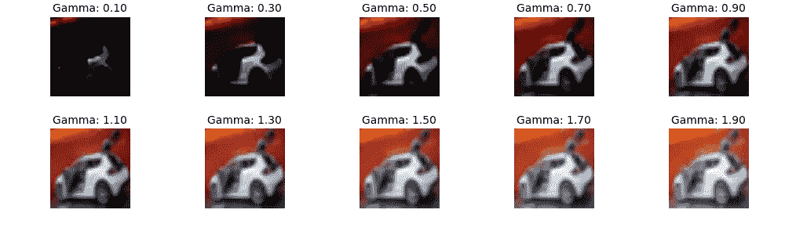

*Example image with gamma value distortion. 1.0 is no distortion*

我通过随机应用 0.5 或 2.0 的伽玛值来降低或增加每张图像的亮度，向训练集添加了增强数据。在实践中，我发现 cifar10 数据集没有很多理论上表现出高度随机不确定性的图像。这大概是故意的。通过向训练集中的图像添加具有调整的灰度值的图像，我试图给模型更多的图像，这些图像应该具有高度的随机不确定性。

不幸的是，预测认知的不确定性需要相当长的时间。在我的 Mac CPU 上，完全连接的层预测训练集的所有 50，000 个类大约需要 2-3 秒，但预测认知不确定性需要 5 分钟以上。这并不奇怪，因为认知的不确定性需要对每张图像进行蒙特卡罗模拟。我运行了 100 次蒙特卡洛模拟，因此有理由预计预测认知不确定性所需的时间是随机不确定性的 100 倍。

最后，我的[项目](https://github.com/kyle-dorman/bayesian-neural-network-blogpost)被设置为在未来轻松切换底层编码器网络和其他数据集的训练模型。如果您想更深入地训练自己的贝叶斯深度学习分类器，请随意使用它。

# 结果

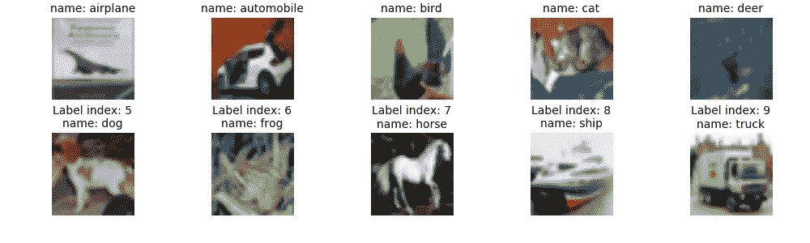

*Example of each class in cifar10*

我的模型在测试数据集上的分类准确率是 86.4%。这无论如何都不是一个惊人的分数。我能够得到高于 93%的分数，但只是牺牲了随机不确定性的准确性。有几个不同的超参数我可以用来提高我的分数。我花了很少的时间调整两个损失函数的权重，我怀疑改变这些超参数可以大大提高我的模型精度。我也可以解冻 Resnet50 层，并训练这些。虽然在这个数据集上获得更好的准确性分数是有趣的，但贝叶斯深度学习是关于预测和不确定性估计的，所以我将在这篇文章的剩余部分评估我的模型的不确定性预测的有效性。

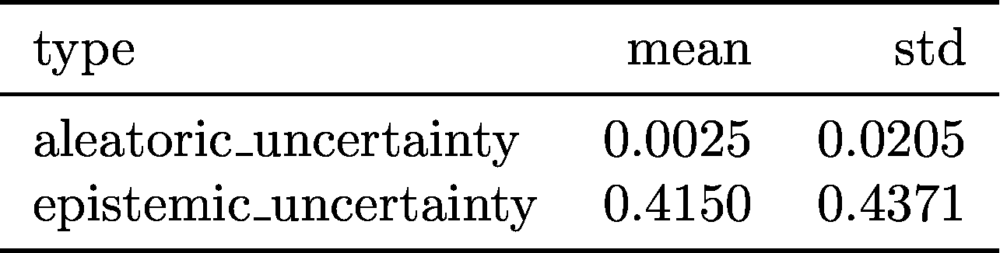

*Figure 5: uncertainty mean and standard deviation for test set*

任意的不确定性值往往比认知的不确定性小得多。这两个值不能在同一个图像上直接比较。但是，可以将它们与该模型针对该数据集中的其他图像预测的不确定性值进行比较。

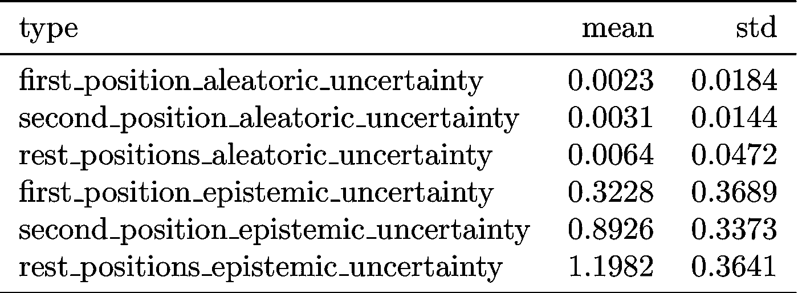

*Figure 6: Uncertainty to relative rank of ‘right’ logit value.*

为了进一步探索不确定性，我根据正确 logit 的相对值将测试数据分成三组。在图 5 中，“第一个”包括所有正确的预测(即“右”标签的 logit 值是最大值)。“第二”，包括“右”标签是第二大 logit 值的所有情况。“休息”包括所有其他情况。86.4%的样本属于“第一”组，8.7%属于“第二”组，4.9%属于“其余”组。图 5 显示了这三组测试集的随机和认知不确定性的平均值和标准偏差。正如我所希望的，认知和任意的不确定性与“正确”逻辑的相对等级相关。这表明模型更有可能将不正确的标签识别为它不确定的情况。此外，当模型的预测正确时，模型预测大于零的不确定性。我希望这个模型能够展现出这种特性，因为即使它的预测是正确的，这个模型也可能是不确定的。

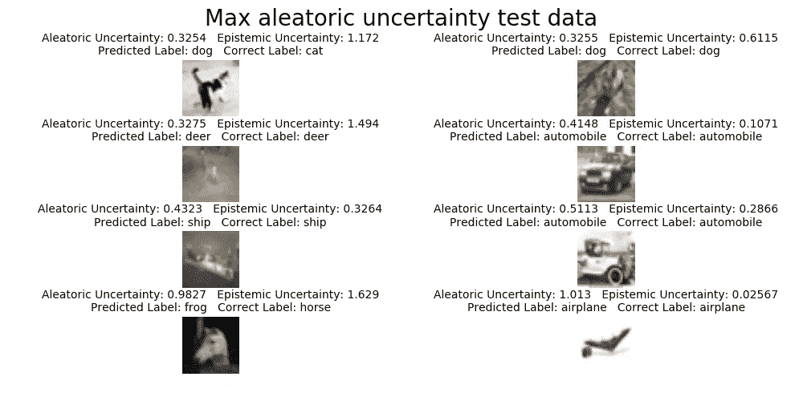

*Images with highest aleatoric uncertainty*

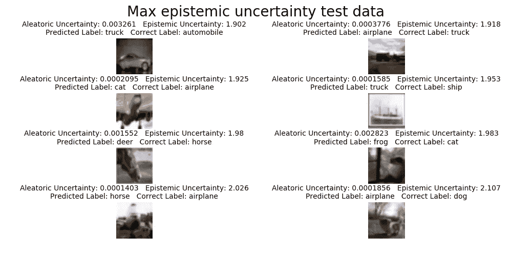

*Images with the highest epistemic uncertainty*

以上是随意性和认知不确定性最高的图像。虽然看这些图像很有趣，但我不太清楚为什么这些图像有很高的随意性或认知不确定性。这是训练图像分类器产生不确定性的一个缺点。整个图像的不确定性减少到单个值。理解图像分割模型中的不确定性通常要容易得多，因为比较图像中每个像素的结果更容易。

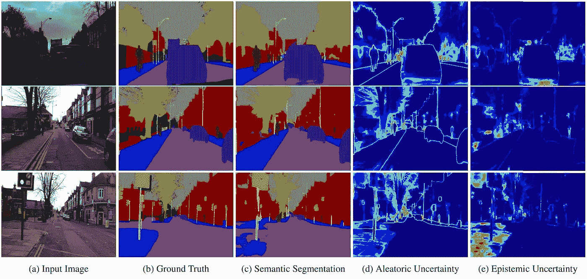

*“Illustrating the difference between aleatoric and epistemic uncertainty for semantic segmentation. You can notice that aleatoric uncertainty captures object boundaries where labels are noisy. The bottom row shows a failure case of the segmentation model, when the model is unfamiliar with the footpath, and the corresponding increased epistemic uncertainty.”* [*link*](http://alexgkendall.com/computer_vision/bayesian_deep_learning_for_safe_ai/)

如果我的模型很好地理解了随机不确定性，那么我的模型应该为具有低对比度、高亮度/暗度或高遮挡的图像预测更大的随机不确定性值。为了测试这一理论，我将一系列伽马值应用于我的测试图像，以增加/减少增强图像的像素强度和预测结果。

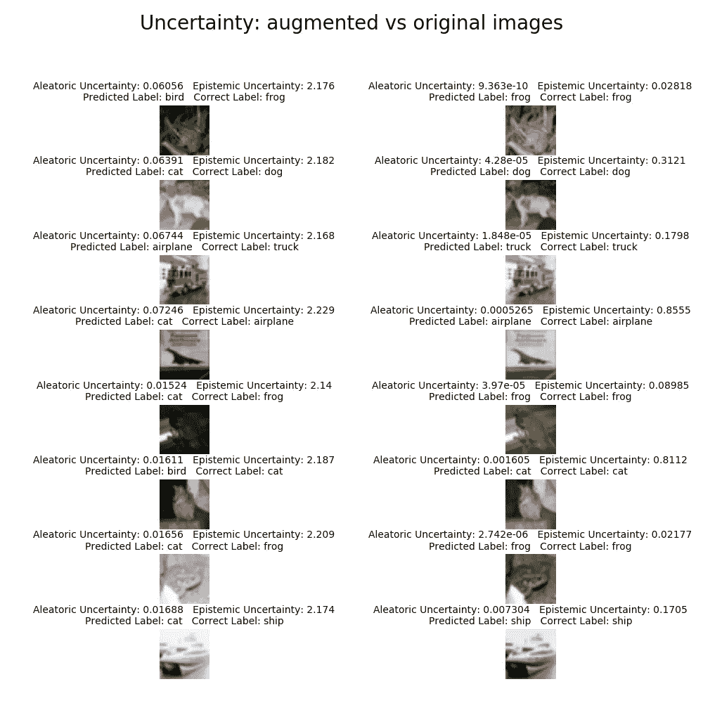

*Figure 7: Left side: Images & uncertainties with gamma values applied. Right side: Images & uncertainties of original image.*

该模型在增强图像上的准确度为 5.5%。这意味着伽玛图像完全欺骗了我的模型。该模型没有被训练成在这些伽马失真上得分很高，所以这是意料之中的。图 6 显示了左侧的八个增强图像的预测不确定性和右侧的八个原始不确定性和图像。前四幅图像具有增强图像的最高预测随机不确定性，后四幅图像具有增强图像的最低随机不确定性。我很兴奋地看到，与原始图像相比，该模型预测了每个增强图像更高的任意性和认知不确定性！随机不确定性应该更大，因为模拟的不利照明条件使图像更难理解，而认知不确定性应该更大，因为模型没有在具有较大伽马失真的图像上训练。

# 后续步骤

这篇文章中详细描述的模型只探索了贝叶斯深度学习冰山的一角，并且展望未来，我相信我可以通过几种方式来改进模型的预测。例如，我可以继续使用损失权重，并解冻 Resnet50 卷积层，看看我是否可以在不失去上述不确定性特征的情况下获得更好的精度分数。我还可以尝试在一个数据集上训练一个模型，这个数据集有更多表现出高度随机不确定性的图像。一个候选是德国交通标志识别基准数据集，我在我的一个 Udacity 项目中使用过它。这个数据集专门用于使分类器“应对由于光照变化、部分遮挡、旋转、天气条件而导致的视觉外观的巨大变化”。对我来说听起来像是随机的不确定性！

除了尝试改进我的模型，我还可以进一步探索我的训练模型。一种方法是看我的模型如何处理对立的例子。为此，我可以使用像伊恩·古德费勒创建的 [CleverHans](https://github.com/tensorflow/cleverhans) 这样的库。这个库使用一个对抗性的神经网络来帮助探索模型漏洞。看看 CleverHans 产生的对立例子是否也会导致高度的不确定性，这将是很有趣的。

另一个我很想探索的库是 Edward，这是一个用于概率建模、推理和评论的 Python 库。 [Edward](http://edwardlib.org/) 支持创建具有概率分布的网络图层，并使其易于执行变分推断。[这篇](https://alpha-i.co/blog/MNIST-for-ML-beginners-The-Bayesian-Way.html)博文使用 Edward 在 MNIST 数据集上训练贝叶斯深度学习分类器。

如果你已经做到了这一步，我非常感动和感激。希望这篇文章激发了你在下一个深度学习项目中加入不确定性。

*原载于*[*gist.github.com*](https://gist.github.com/f93c1df82ed22ab4e1ec99fd93d0ea27)*。*