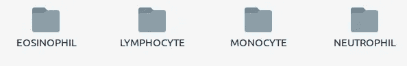
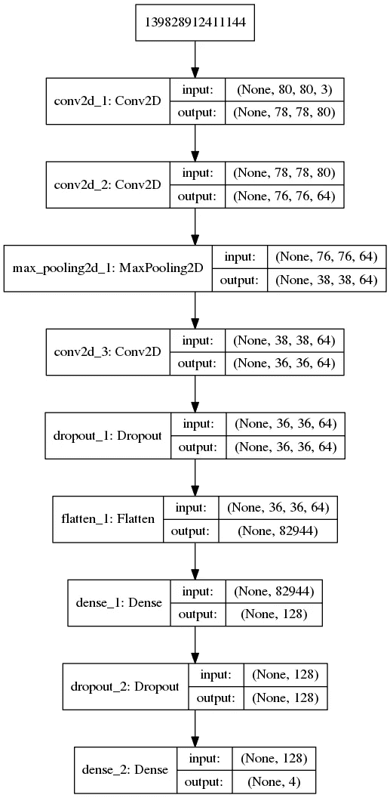
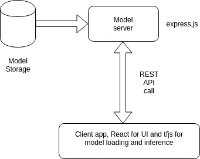

# 使用 Keras 和 tfjs 构建血细胞分类模型

> 原文：<https://towardsdatascience.com/building-a-blood-cell-classification-model-using-keras-and-tfjs-5f7601ace931?source=collection_archive---------4----------------------->

人工智能真的是一个重大的游戏改变者。人工智能的应用是巨大的，它在医疗保健领域的范围是巨大的。先进的人工智能工具可以帮助医生和实验室技术人员更准确地诊断疾病，例如，尼日利亚的医生可以使用这种工具从血液样本中识别他根本不知道的疾病，这有助于他更好地了解疾病，从而可以更快地开发治疗方法，这是人工智能民主化的一个优势，因为人工智能模型和工具在世界各地都可以使用， 尼日利亚的医生可以使用麻省理工学院或世界上任何其他大学的研究学者正在使用的工具和技术。

## 机器学习的主要问题:

机器学习当然是今天人工智能进步的主要成分。但是，使人工智能民主化意味着建立一个基础设施，允许任何人在世界各地使用相同的技术来构建强大的工具。可能阻止任何人构建人工智能的两个主要问题是计算能力和训练数据集的不可用性。但是这些问题正在以有趣的方式得到解决，它们如下:

*   **Kaggle(数据集之家):**数据集的不可用性是主要问题之一，但 Kaggle 是人们可以创建数据集并托管它们以供他人使用的最佳场所，人们已经使用这些工具创建了令人惊叹的东西。
*   **谷歌联合实验室:**谷歌联合实验室是机器学习的主要驱动力，它允许任何拥有谷歌账户的人访问 GPU。没有这些 GPU，任何人都不可能训练需要巨大计算量的 ML 模型。

## **血细胞数据集**

对于数据科学家来说，数据集就像一座金矿，如果数据集可用于特定问题，它将减少工程团队所需的大量工作，因为不需要开发基础架构来收集和存储数据。几个月前，我想开发这个系统，Kaggle 帮了我很多，以获得数据集。这是我在 Kaggle 上找到的[数据集](https://www.kaggle.com/paultimothymooney/blood-cells)，感谢**保罗·穆尼**提供了这个数据集。

**数据集结构:**数据集包含 12，500 个血细胞的增强图像。数据集由 4 个类组成，如下所示:



Classes of blood cell dataset

每个类包含 3000 幅图像。该图显示了每个类别的示例图像:


Sample images from all classes

我把每张图片的尺寸缩小到(80×80×3)以便更容易训练。

Kaggle 要求您在下载数据集之前登录，因为我们使用的是 colab，所以不需要将数据集下载到我们的本地机器上，而是将它拉到我们的 google colab 实例中。

## 使用谷歌联合实验室

简单地说，谷歌联合实验室提供了一个基于云的 python 笔记本，其中有一个虚拟实例绑定到 GPU 运行时，谷歌 colab 的 GPU 运行时由 NVIDIA k-80 提供支持，这是一个强大的 GPU，也很昂贵。但是 co-lab 允许我们免费使用 GPU，而无需付费。一个实例的最大时间是 12 小时，12 小时后该实例将被销毁并创建一个新的，所以我们只能执行那些不超过 12 小时的计算。让我们看看如何使用 colab 来训练我们的神经网络。

**向 Kaggle 认证:**

Kaggle CLI 允许您下载数据集并向竞赛提交代码/笔记本。注册 kaggle 后，您可以下载 kaggle.json 文件，其中包含所有凭据，kaggle CLI 使用这些凭据进行授权。

*   创建一个新的单元格，并创建一个名为。kaggle，使用命令`!mkdir .kaggle`
*   使用 pip:在新单元中安装 ka ggle CLI—`!pip install kaggle`
*   下载数据集:`!kaggle datasets download -d paulthimothymooney/blood-cells`
*   确保所有目录都存在于下载的数据集中`!ls dataset2-master/images`
*   您应该看到 3 个目录:TEST、TEST_SIMPLE 和 TRAIN
*   目录 TRAIN 包含训练图像，我们将使用这个目录作为训练图像。

**预处理:**

我们需要将图像作为 numpy 数组加载，并将其提供给我们正在训练的神经网络。我们将使用 Keras 来构建一个神经网络，Keras 提供了一个内置的 ImageDataGenerator 来处理大多数预处理任务。

我们导入了开发模型所需的一些对象:

```
**from** **keras.models** **import** Sequential
**from** **keras.layers** **import** Dense, Conv2D, Dropout, MaxPool2D, Flatten
**from** **keras.preprocessing** **import** image
```

`keras.preprocessing`提供处理各种类型数据集所需的方法和对象。从图像模块中，我们创建一个具有所有必需配置的 ImageDataGenerator。

```
generator = image.ImageDataGenerator(
        rescale = 1./255,
        featurewise_center=**False**,  *# set input mean to 0 over the dataset*
        samplewise_center=**False**,  *# set each sample mean to 0*
        featurewise_std_normalization=**False**,  *# divide inputs by std of the dataset*
        samplewise_std_normalization=**False**,  *# divide each input by its std*
        zca_whitening=**False**,  *# apply ZCA whitening*
        rotation_range=10,  *# randomly rotate images in the range (degrees, 0 to 180)*
        width_shift_range=0.1,  *# randomly shift images horizontally (fraction of total width)*
        height_shift_range=0.1,  *# randomly shift images vertically (fraction of total height)*
        horizontal_flip=**True**,  *# randomly flip images*
        vertical_flip=**False**)
```

如前一节所述，训练数据存在于``dataset2-master/images/TRAIN`目录中，我们提供此路径到 ImageDataGenerator，以便我们所有的配置和扩充都应用于训练图像。

```
dataset = generator.flow_from_directory(
    shuffle = **True**,
    batch_size = 32,
    target_size = (80, 80),
    directory = 'dataset2-master/images/TRAIN'
)
```

这都是关于预处理，你可以调整这些参数，通过减少或增加图像增强的效果，使之更好地拟合，总有改进的余地。

## CNN 简介:

CNN(卷积神经网络)是一种神经网络，它包含一组卷积层和一个与之相连的前馈网络。卷积运算并不是一个新的运算，它在图像处理中的应用已经很多年了。卷积运算的主要作用是从图像中提取边缘，换句话说，它们可用于提取图像的重要特征。如果已知所谓的滤波器值，任何人都不可能确定任何图像的最佳滤波器值，因为我们将卷积与神经网络一起使用，梯度下降将自动优化滤波器值以提取图像的最重要特征。吴恩达的课程 deeplearning.ai 帮助你更好地理解这种网络的工作方式。因为这超出了本文的范围。

## 我们的网络:

这项任务必须使用 CNN，因为简单的前馈网络不可能学习数据集中每个类的独特特征。我们使用的 CNN 架构如下所示:



Neural Network Architecture

我创建了一个函数模型()，它返回一个顺序模型，如下所示:

```
**def** model():
    model = Sequential()
    model.add(Conv2D(80, (3,3), strides = (1, 1), activation = 'relu'))
    model.add(Conv2D(64, (3,3), strides = (1, 1), activation = 'relu', input_shape = (80, 80, 3)))
    model.add(MaxPool2D(pool_size = (2,2)))
    model.add(Conv2D(64, (3,3), strides = (1,1), activation = 'relu'))
    model.add(Dropout(0.25))
    model.add(Flatten())

    model.add(Dense(128, activation = 'relu'))
    model.add(Dropout(0.5))
    model.add(Dense(4, activation = 'softmax'))

    model.compile(loss = 'categorical_crossentropy', optimizer = 'adadelta', metrics = ['accuracy'])

    **return** model
```

最后，我们训练模型，如下所示:

```
nn = model()
nn.fit_generator(dataset, steps_per_epoch = **None**, epochs = 30, verbose = 1)
nn.save('Model.h5')
```

模型经过 30 个历元的训练，得到了 92.67% 的精度**，这是一个很好的精度，你可以增加更多的层或者进行超参数调整来提高精度。**

# 部署模型:

一旦训练完成，我们需要将模型部署到生产中，以便每个人都可以使用它，有各种策略可用于部署机器学习系统。我想在客户端机器上运行整个推理，所以我开始构建一个可以这样做的 web 应用程序。

## 设置先决条件:

我们需要以下要求来建立一个客户端应用程序，该应用程序具有以下架构:



App architrcture

安装节点和 npm 并设置环境，以相同的顺序安装以下依赖项:

```
npm install -g create-react-app
create-react-app app_name
cd app_name
npm install --save @tensorflow/tfjs//on server side:
mkdir server
cd server
npm init
//fill up the details, make sure package.json is created
npm install express --save
```

*   **模型服务器**:这是一个 express.js REST 端点，客户端可以通过发送 REST GET 请求来请求模型文件。(在服务器端)

*   **模型存储:**我们需要创建一个与 tfjs 兼容的模型，tensorflow 提供了一个名为 tensorflowjs 的工具，这是一个包含实用程序的 python 工具包，我们可以使用下面的命令来安装:`pip install tensorflowjs`

完成后，我们可以使用下面的命令使用 tensorflowjs_converter 将模型转换为 tfjs 格式:

```
$tensorflowjs_converter --input_format keras \
                        Model.h5 \
                        ModelData/model_data
// Model.h5 is the downloaded model after training, last argument is the target folder, where we need to store the model files.
```

一旦转换，它将创建一组称为碎片的文件，碎片是通过基于层分割模型获得的，每个碎片包含特定层的权重。使用碎片非常有帮助，因为每个碎片可以存储在不同的地方，并且可以在需要时下载，所以我们可以为我们的机器学习模型建立一个分布式存储。 **model.json** 当然是包含各个分片信息的文件。如果我们改变一个碎片的目录，我们可以修改这个文件。在 API 调用中，我们只将 model.json 文件发送给客户端，tfjs 将自动获取每个碎片以在客户端机器(即浏览器)上组装一个模型。

## 最后一部分:开发客户端推理机

在这一节中，我不会过多强调 UI 设计，相反，我会强调推理部分，即如何使用我们安装的 tfjs 运行推理。转到 react 应用程序目录。

*   **创建一个模型容器类:**我首先为我们的模型创建了一个包装类。这个类的一个实例表示一个准备好进行推理的模型。这个模型类的代码是自我可理解的:
*   **一个推理函数:**我定义了一个函数，可以取模型对象和输入图片源，输入源可以是 HTML img，或者 URL，或者图片的字节流。

代码如下所示:

*   **初始化模型对象:**我们现在必须创建一个模型对象来保存一个用于推理的模型。

```
**let** modelCache = **new** ModelContainer(null);
modelCache.loadFromURL('http://192.168.0.105:5443/model_metadata')
```

*   **运行推理:**一旦我们有了一个模型对象，我们就可以随时运行推理，根据我设计的 UI，每当用户点击 predict 按钮时，就应该执行推理。因此，运行预测的 React 组件部分如下所示:

## 结论

这个项目对我来说真的是一次很棒的经历，我学会了如何使用 google colab 在云上训练 ML 模型，我也学会了如何为生产部署 ML 模型。

这是一个开源项目，请随意更改:

**回购网址:** [反应-客户](https://github.com/Narasimha1997/BloodCell-Identification-tfjs-client)

**云笔记本(模型训练用):** [training.ipynb](https://github.com/Narasimha1997/Blood-Cell-type-identification-using-CNN-classifier)

非常感谢您花费宝贵的时间阅读本文。如果你感兴趣，请开始回购。也可以在 [Linkedin](https://www.linkedin.com/in/narasimha-prasanna-hn-17aa89146/) 上联系我。

干杯！