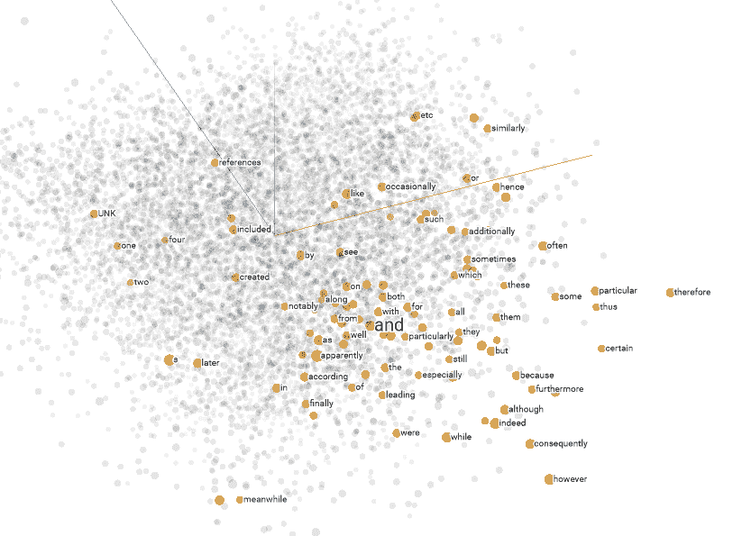
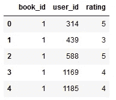
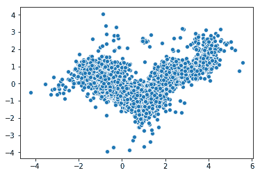
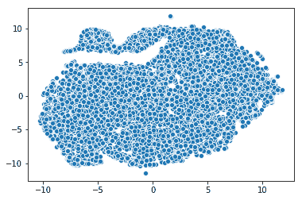
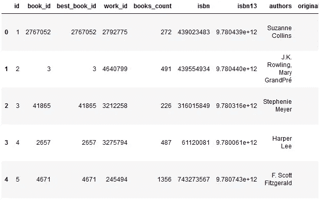
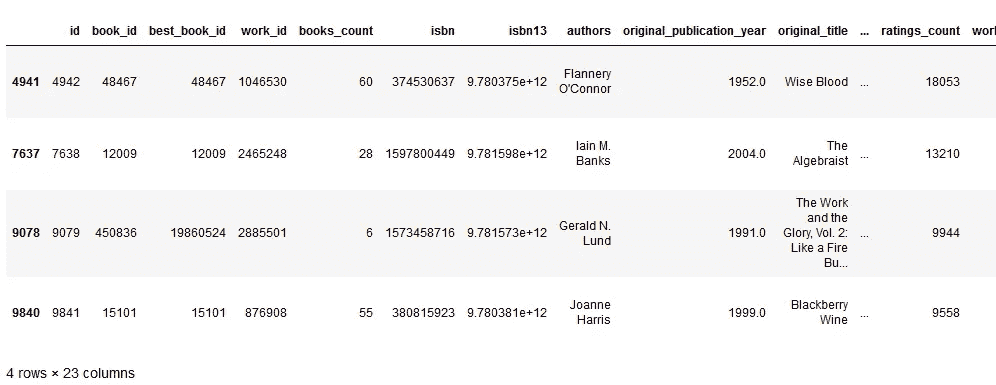

# 使用 Keras 构建图书推荐系统

> 原文：<https://towardsdatascience.com/building-a-book-recommendation-system-using-keras-1fba34180699?source=collection_archive---------8----------------------->

## 如何使用嵌入创建图书推荐系统？


Figure 1: Photo by [Brandi Redd](https://unsplash.com/@brandi1?utm_source=medium&utm_medium=referral) on [Unsplash](https://unsplash.com?utm_source=medium&utm_medium=referral)

推荐系统试图预测用户在给出其旧的项目评级或偏好的情况下将给予项目的评级或偏好。几乎每个大公司都使用推荐系统来提高他们的服务质量。

在本文中，我们将看看如何使用嵌入来创建图书推荐系统。

对于我们的数据，我们将使用 [goodbooks-10k 数据集](https://www.kaggle.com/zygmunt/goodbooks-10k)，其中包含一万本不同的书籍和大约一百万个评级。它有三个特性 book_id、user_id 和 rating。如果你不想自己从 Kaggle 下载数据集，你可以从[我的 Github 库](https://github.com/TannerGilbert/Tutorials/blob/master/Recommendation%20System/Recommendation%20System.ipynb)获得文件以及本文中的完整代码。

# 把...嵌入

嵌入是从离散对象到连续值向量的映射，比如我们的例子中的单词或书籍的 id。这可用于查找离散对象之间的相似性，如果模型不使用嵌入层，这些相似性对模型来说是不明显的。

嵌入向量是低维的，并且在训练网络时被更新。下图显示了使用 [Tensorflows 嵌入投影仪](http://projector.tensorflow.org/)创建的嵌入示例。



Figure 2: Projector Embeddings

# 获取数据

熊猫将用于数据集中的加载。然后，数据将被分成一个训练和测试集，我们将创建两个变量，为我们提供唯一的用户和图书数量。

```
dataset = pd.read_csv('ratings.csv')
train, test = train_test_split(dataset, test_size=0.2, random_state=42)
n_users = len(dataset.user_id.unique())
n_books = len(dataset.book_id.unique())
```



Figure 3: Rating-Dataset Head

数据集已经被清理，所以我们不需要采取任何进一步的数据清理或预处理步骤。

# 创建嵌入模型

[Keras 深度学习框架](https://keras.io/)使得创建神经网络嵌入以及使用多个输入和输出层变得容易。

我们的模型将具有以下结构:

1.  **输入:**书籍和用户的输入
2.  **嵌入层:**书籍和用户的嵌入
3.  **点:**使用点积合并嵌入

在嵌入模型中，嵌入是在训练期间学习的权重。这些嵌入不仅可以用于提取关于数据的信息，还可以被提取和可视化。

出于简单的原因，我没有在最后添加任何完全连接的层，尽管这可能会增加相当多的准确性。因此，如果你想要一个更准确的模型，这是可以尝试的。

下面是创建模型的代码:

```
from keras.layers import Input, Embedding, Flatten, Dot, Dense
from keras.models import Modelbook_input = Input(shape=[1], name="Book-Input")
book_embedding = Embedding(n_books+1, 5, name="Book-Embedding")(book_input)
book_vec = Flatten(name="Flatten-Books")(book_embedding)user_input = Input(shape=[1], name="User-Input")
user_embedding = Embedding(n_users+1, 5, name="User-Embedding")(user_input)
user_vec = Flatten(name="Flatten-Users")(user_embedding)prod = Dot(name="Dot-Product", axes=1)([book_vec, user_vec])
model = Model([user_input, book_input], prod)
model.compile('adam', 'mean_squared_error')
```

# 训练模型

现在我们已经创建了我们的模型，我们准备训练它。因为我们有两个输入层(一个用于书籍，一个用于用户)，所以我们需要指定一个训练数据数组作为我们的 x 数据。对于本文，我训练了 10 个时期的模型，但是如果你想得到更好的结果，你可以训练更长的时间。

以下是培训代码:

```
history = model.fit([train.user_id, train.book_id], train.rating, epochs=10, verbose=1)
model.save('regression_model.h5')
```

# 可视化嵌入

嵌入可以用来可视化概念，比如我们案例中不同书籍之间的关系。为了可视化这些概念，我们需要使用降维技术进一步降低维度，如[主成分分析(PSA)](https://en.wikipedia.org/wiki/Principal_component_analysis) 或[t-分布式随机邻居嵌入(TSNE)](https://en.wikipedia.org/wiki/T-distributed_stochastic_neighbor_embedding) 。

从 10000 个维度(每本书一个)开始，我们使用嵌入将它们映射到 5 个维度，然后使用 PCA 或 TSNE 将它们进一步映射到 2 个维度。

首先，我们需要使用 *get_layer* 函数提取嵌入内容:

```
# Extract embeddings
book_em = model.get_layer('Book-Embedding')
book_em_weights = book_em.get_weights()[0]
```

现在，我们将使用 PCA 将我们的嵌入转换为二维，然后使用 [Seaborn](https://seaborn.pydata.org/) 散布结果:

```
from sklearn.decomposition import PCA
import seaborn as snspca = PCA(n_components=2)
pca_result = pca.fit_transform(book_em_weights)
sns.scatterplot(x=pca_result[:,0], y=pca_result[:,1])
```



Figure 4: Visualizing embeddings with PCA

使用 TSNE 也可以做到这一点:

```
from sklearn.manifold import TSNEtsne = TSNE(n_components=2, verbose=1, perplexity=40, n_iter=300)
tnse_results = tsne.fit_transform(book_em_weights)
sns.scatterplot(x=tnse_results[:,0], y=tnse_results[:,1])
```



Figure 5: Visualizing embeddings with TSNE

# 提出建议

使用我们训练过的模型进行推荐很简单。我们只需要输入一个用户和所有的书，然后选择对这个特定用户有最高预测评分的书。

下面的代码显示了为特定用户进行预测的过程:

```
# Creating dataset for making recommendations for the first user
book_data = np.array(list(set(dataset.book_id)))
user = np.array([1 for i in range(len(book_data))])
predictions = model.predict([user, book_data])
predictions = np.array([a[0] for a in predictions])
recommended_book_ids = (-predictions).argsort()[:5]
print(recommended_book_ids)
print(predictions[recommended_book_ids])
```

此代码输出:

```
array([4942, 7638, 8853, 9079, 9841], dtype=int64)
array([5.341809 , 5.159592 , 4.9970446, 4.9722786, 4.903894 ], dtype=float32)
```

我们可以使用图书 id，通过使用 *books.csv* 文件来获得关于图书的更多信息。

```
books = pd.read_csv(‘books.csv’)
books.head()
```



Figure 6: Book-Dataset Head

```
print(books[books[‘id’].isin(recommended_book_ids)])
```



Figure 7: Recommended books

# 结论

嵌入是一种从离散对象(如单词)到连续值向量的映射方法。它们对于寻找相似性、可视化目的以及作为另一个机器学习模型的输入是有用的。

这个例子当然不是完美的，为了获得更好的性能，可以尝试很多方法。但是对于更高级的问题，这是学习如何使用嵌入的一个很好的起点。

您可以添加一些东西来获得更好的结果:

*   在点积后添加完全连接的层
*   为更多时代而训练
*   缩放评级栏
*   等等。

如果你喜欢这篇文章，可以考虑订阅我的 Youtube 频道并在社交媒体上关注我。

如果你有任何问题或批评，可以通过 [Twitter](https://twitter.com/Tanner__Gilbert) 或评论区联系我。