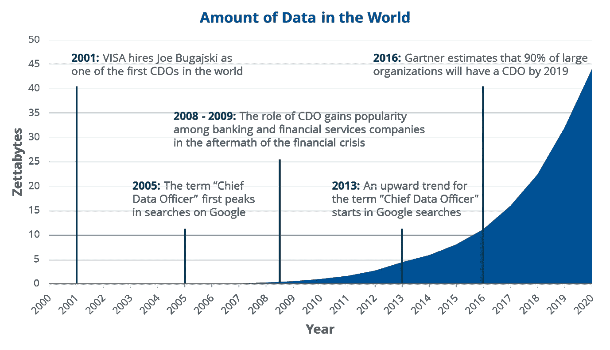
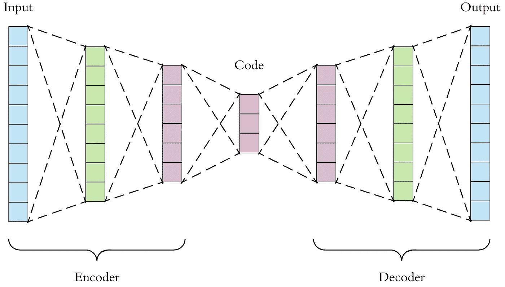
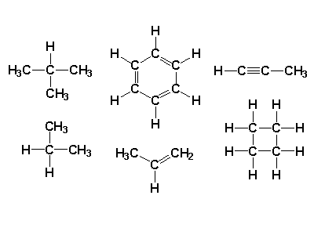
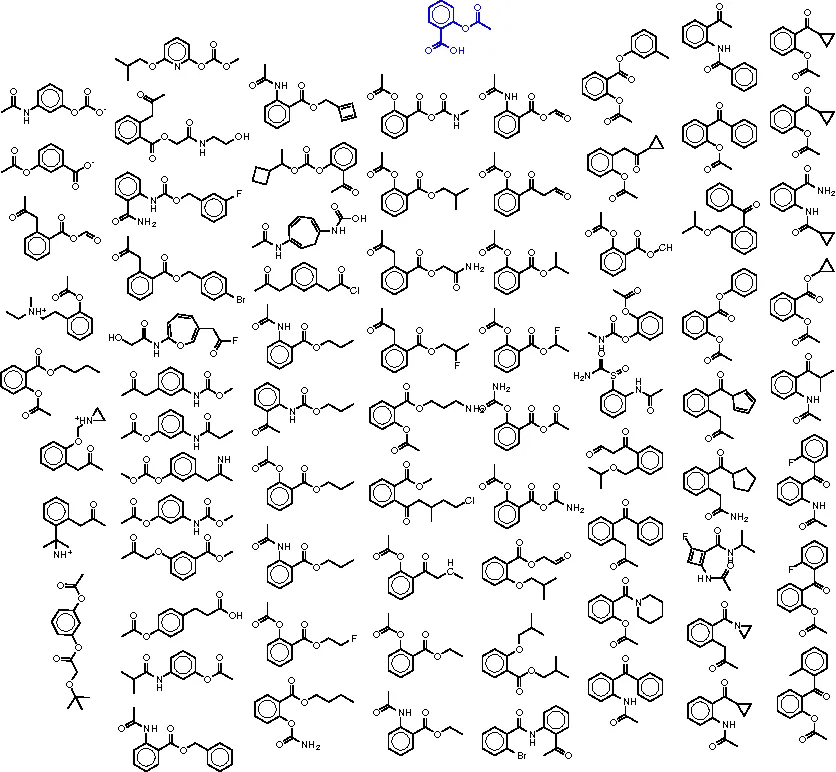

# 构建碳分子自动编码器

> 原文：<https://towardsdatascience.com/building-a-carbon-molecule-autoencoder-21973e5f88b6?source=collection_archive---------14----------------------->

## 是什么让碳分子如此特别

化学信息学是一个不断发展的领域，与人工智能一样，原因之一是:可用数据的增加。不可阻挡的数据增长预计不会放缓，有报告显示[数据预计在未来十年每两年翻一番。](https://qz.com/472292/data-is-expected-to-double-every-two-years-for-the-next-decade/)

Welcomes to the information age; data might become the new dollar

这很重要，因为*历史上*，我们计算算法的准确度和精确度只受到我们给它们的数据的限制。

> 但是，尽管文本、视觉和数字等流行数据类型数量激增，化学信息却停滞不前。

缺乏数据的原因有很多:

1.  化学数据没有单一的标准格式
2.  化学数据是离散的，非常脆弱
3.  实验数据经常被边缘化并被保密

解决数据问题的最好方法是充分利用现有资源，否则就自己创造数据。令人欣慰的是，网上不乏大量未标记的化学数据，如 [Chemspider](http://www.chemspider.com/) 、 [Pubchem](https://pubchem.ncbi.nlm.nih.gov/) 和 [Chemexpr](http://www.chemexper.com/) 。未标记数据非常适合无监督学习，在无监督学习中，输入数据不需要预先分配相应的标记数据集列表。

使用 Pubchem 上的未标记碳目录，我建立了一个深度自动编码器，其中潜在层由神经网络(NN)认为是未标记微笑数据集中最重要的细节组成。

# 项目碳编码

自动编码器是一种神经网络架构，通过它**输出被有意训练成尽可能与输入相似。**

> 如果你输入一朵花的图片，输出应该尽可能看起来像原来的花。

The architecture of a vanilla autoencoder

它有一种美学上令人愉悦的对称形状。数据被压缩到红色的潜在层，类似于压缩文件。然而，自动编码器并不一定比其他压缩算法更好。所以我们有一个算法，它输出的东西和它的输入非常相似，这并不比其他压缩算法好多少；那么自动编码器有什么用呢？

自动编码器对于其架构中特定的 T21 部分很有用；**隐藏层。**也称潜在层，本质上是数据最重要特征的**浓缩层**。

> 这使得自动编码器非常适合降维和降噪。

该项目分为 4 个部分:

1.  导入和规范化 SMILES 字符串数据
2.  将规范化字符串转换为一个热点向量
3.  构建深度神经网络模型
4.  编译模型并拟合数据

该数据集是超过 12，000 个碳基分子的列表。选择单一元素是为了让自动编码器的潜在层能够学习使碳分子与其他元素相比具有独特性的特征。碳也被选中，因为它是最通用的元素之一，因此**有一个更大的具有更多多样性的数据集，这有利于减少过度拟合。**

Just a couple examples of carbon based molecules in the dataset

自动编码器被训练以识别其输入和输出之间的损失，以便模型学习最佳地复制给定的输入。输入层由 63 个节点组成，通过大小为 32 和 14 的另外两个过滤器。每层大约减半节点数，直到达到潜在层中 7 个节点的瓶颈。在完成编码过程时，操作被反转，并且解码器的每层的节点数量相对于编码器对称地增加。因此，经过训练的模型对碳分子的独特结构有着牢固的把握。

> 你可以把它想象成一瓶神奇的精华，让碳变得如此多才多艺。

一旦训练完成，潜在层可以用于生成模型，将普通自动编码器转换为可变自动编码器(VAE)。理论上，这种 VAE 能够*产生*新的碳分子，其中一些可能在材料科学、纳米技术或生物技术中有用。**该模型还可以用作对抗性自动编码器(AAE)** 的基础，这是另一种类型的生成算法，在关于药物等分子生成的研究实验中表现优于 VAEs。

Chemical design of a molecule using generative A.I

潜在层为它所压缩的数据的大量新见解提供了基础。人工智能可能会在数据中发现我们以前不知道的模式或特征。

Charged 项目的所有代码和数据集都可以在我的 Github 上的这个[库](https://github.com/flawnson/Carbon_Molecule_Autoencoder-master)中找到。

我们刚刚开始使用人工智能来帮助科学学科的研究人员加快他们的方法，产生更准确的结果，并为他们的假设提供验证。随着好处越来越为人所知，这两个领域的专家之间的合作被摒弃，我们的数据集将会增长，我们人工智能的力量也将增长。

# 关键要点

1.  数据现在是世界上最有价值的资源之一，但仍然很少找到干净的标记化学数据
2.  自动编码器似乎有悖直觉，但对于其架构的一个特定部分:潜在层，却有着巨大的潜力
3.  自动编码器从输入数据中压缩和提取最重要的细节；我们可以在生殖人工智能中利用这种压缩
4.  变异的自动编码器和敌对的自动编码器已经在生殖人工智能领域和科学界掀起了波澜

**还在看这个？想要更多吗？不确定下一步该做什么？**

*   分享到 [LinkedIn](http://www.linkedin.com) 、[脸书](http://www.facebook.com)，或者 [Twitter](http://www.twitter.com) ！(顺便加我)
*   查看[我的作品集](http://www.flawnson.com)了解更多酷项目、内容和更新！
*   在任何平台上寻求问题、合作和想法！

# 向前！