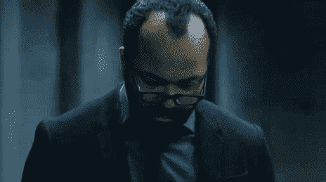
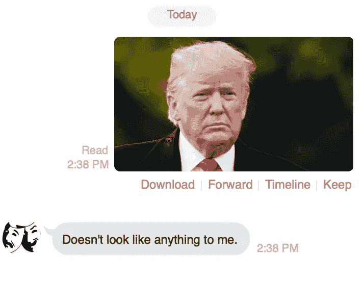
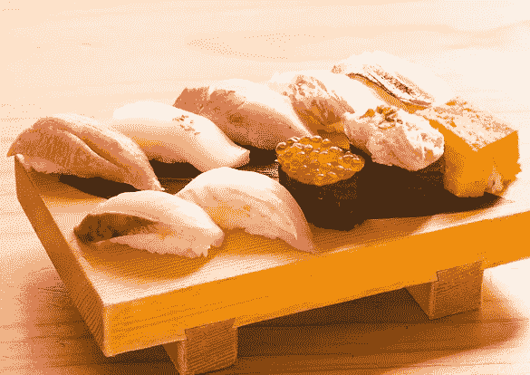
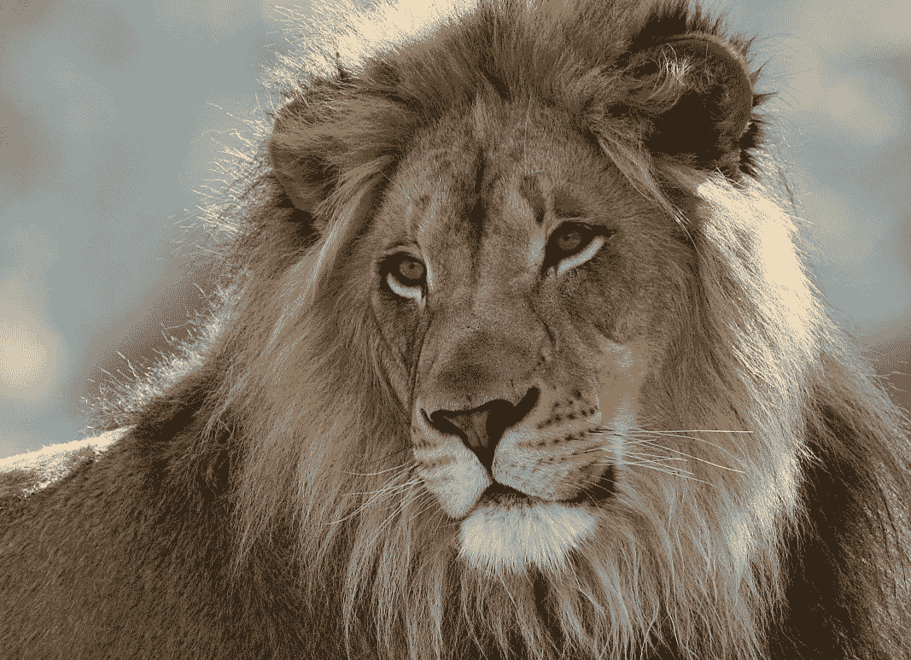
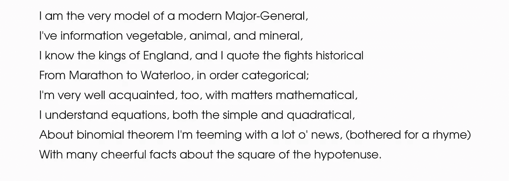
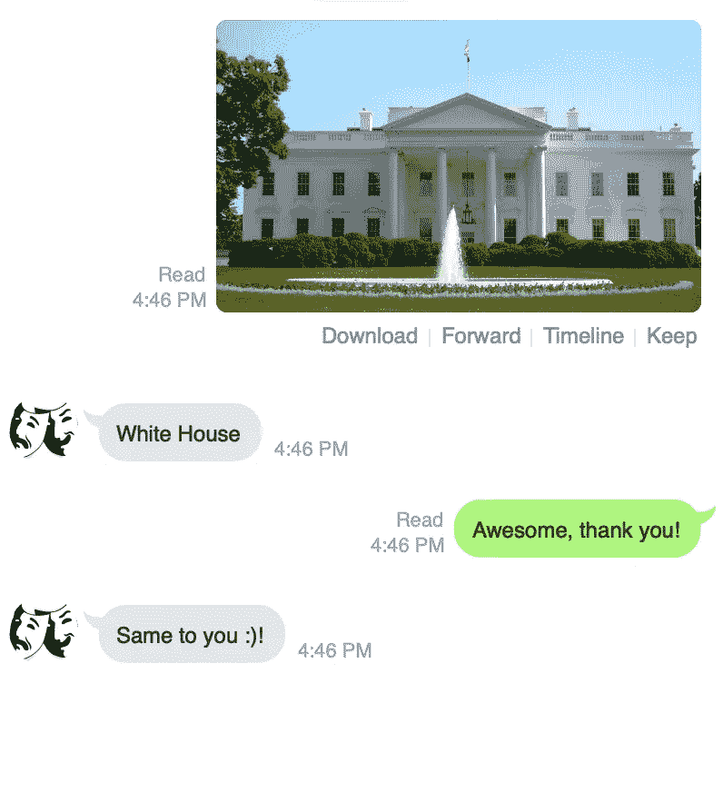
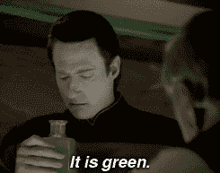
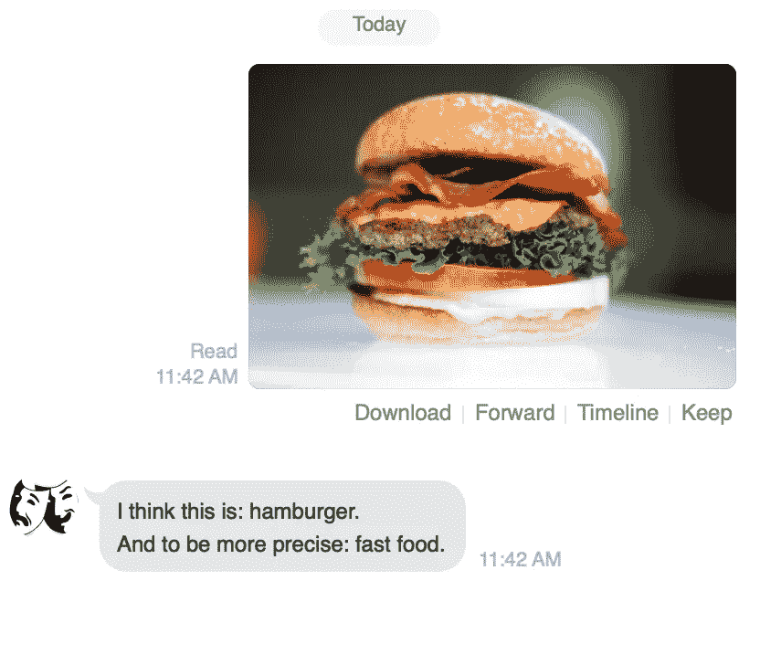
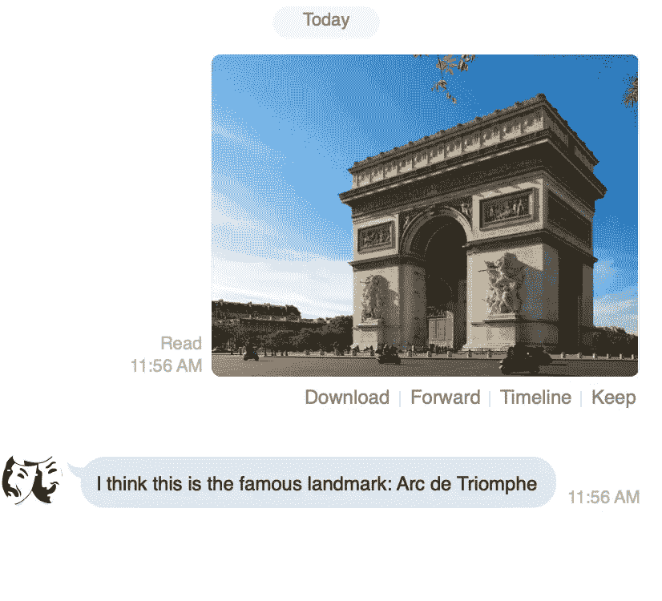

# 使用对象检测和 OCR 构建聊天机器人

> 原文：<https://towardsdatascience.com/building-a-chat-bot-with-image-recognition-and-ocr-721ee7b2a70b?source=collection_archive---------9----------------------->

在本系列的第 1 部分中，我们让我们的机器人能够从文本中检测情绪并做出相应的响应。但这是它能做的全部，而且不可否认相当无聊。

当然，在真实的聊天中，我们经常发送各种媒体:从文本、图像、视频、gif 到任何其他东西。所以在这里，我们旅程的下一步，让我们给机器人一个愿景。本教程的目标是让我们的机器人接收图像，回复它们，并最终给我们一个关于图像中主要物体的粗略描述。

我们开始吧！

如果您还没有跟进，您可以在这里找到最新的代码:

所以我们要修改的代码在我们的事件响应循环方法中，这里:

我们的机器人已经对图像做出反应，但它不知道它们是什么，并且以一种相当温和的方式做出反应。



我们可以试一试，自己看看。让我们启动我们的服务器(和 ngrok)，并向我们的机器人发送一个图像。



到目前为止一切顺利。我们的机器人至少知道它何时接收到图像。

在这个系列中，我们一直使用 google cloud APIs，所以对于我们的图像检测，我们将使用 Google Cloud Vision。按照这里的快速入门来设置您的项目:[https://cloud . Google . com/vision/docs/quick start-client-libraries](https://cloud.google.com/vision/docs/quickstart-client-libraries)。记得使用我们在第 1 部分中设置的同一个项目。

一旦你完成了这些，现在是时候回到编码上来了。让我们将以下内容添加到我们的 Gemfile 中，并运行 bundle install:

```
gem 'google-cloud-vision'
```

让我们在 **main.rb** 中添加以下内容:

```
require ‘google/cloud/vision’
```

接下来，我们想要创建云语言 API 的一个实例:

You can find your project ID in your google cloud console.

我们要使用的 vision API 特性叫做 [**注释**](https://googleapis.github.io/google-cloud-ruby/docs/google-cloud-vision/latest/Google/Cloud/Vision/Annotation.html) 。给定一个**文件路径**到本地机器上的一个图像，它将尝试基于我们传递给方法调用的值来识别图像。

在下面的例子中(来自 Google 的文档):

```
vision = [**Google**](https://googleapis.github.io/google-cloud-ruby/docs/google-cloud-vision/latest/Google.html)::[**Cloud**](https://googleapis.github.io/google-cloud-ruby/docs/google-cloud-vision/latest/Google/Cloud.html)::[**Vision**](https://googleapis.github.io/google-cloud-ruby/docs/google-cloud-vision/latest/Google/Cloud/Vision.html).[new](https://googleapis.github.io/google-cloud-ruby/docs/google-cloud-vision/latest/Google/Cloud/Vision.html#new-class_method)
image = vision.image "path/to/face.jpg"

annotation = vision.annotate image, faces: **true**, labels: **true**
annotation.faces.count *#=> 1* annotation.labels.count *#=> 4* annotation.text *#=> nil*
```

我们告诉 vision API 尝试识别人脸和标签。“标签”本质上是 API 确定它已经识别的对象。如果给我们一张狗的照片，我们可能会被贴上以下标签:

```
{
  "responses": [
    {
      "labelAnnotations": [
        {
          "mid": "/m/0bt9lr",
          "description": "dog",
          "score": 0.97346616
        },
        {
          "mid": "/m/09686",
          "description": "vertebrate",
          "score": 0.85700572
        },
        {
          "mid": "/m/01pm38",
          "description": "clumber spaniel",
          "score": 0.84881884
        },
        {
          "mid": "/m/04rky",
          "description": "mammal",
          "score": 0.847575
        },
        {
          "mid": "/m/02wbgd",
          "description": "english cocker spaniel",
          "score": 0.75829375
        }
      ]
    }
  ]
}
```

让我们创建以下方法来利用这一功能:

上面的方法(不可否认是幼稚的)基于 Google cloud vision 的 API 的结果，获取一个文件路径并返回一个字符串。在 **annotate** 方法中，我们传递了一些参数，这些参数告诉 API 我们想要检测什么。

这个方法的返回(响应)是一个级联的短路流，首先检查著名的地标、任何文本，最后检查它检测到的任何对象(标签)。出于本教程的目的，这个流程纯粹是任意的和简化的(即，不要给我发电子邮件告诉我如何改进它)。

下面这张图我们来试试吧:



和结果(截断):

```
description: "cuisine", score: 0.9247923493385315, confidence: 0.0, topicality: 0.9247923493385315, bounds: 0, locations: 0, properties: {}
description: "sushi", score: 0.9149415493011475, confidence: 0.0, topicality: 0.9149415493011475, bounds: 0, locations: 0, properties: {}
description: "food", score: 0.899940550327301, confidence: 0.0, topicality: 0.899940550327301, bounds: 0, locations: 0, properties: {}
description: "japanese cuisine", score: 0.8769422769546509, confidence: 0.0, topicality: 0.8769422769546509, bounds: 0, locations: 0, properties: {}
```

由于没有地标或文本，我们收到了 API 能够检测到的标签。在这种情况下，我们看到它已被确定为“寿司”根据我对标签检测结果的经验，第二个标签(具有第二高的话题性)倾向于普通人如何识别该图片。

让我们在下面再试一次:



输出(再次被截断):

```
description: "wildlife", score: 0.9749518036842346, confidence: 0.0, topicality: 0.9749518036842346, bounds: 0, locations: 0, properties: {}
description: "lion", score: 0.9627781510353088, confidence: 0.0, topicality: 0.9627781510353088, bounds: 0, locations: 0, properties: {}
description: "terrestrial animal", score: 0.9247941970825195, confidence: 0.0, topicality: 0.9247941970825195, bounds: 0, locations: 0, properties: {}
```

我们看到了，《狮子》是第二部热播剧。

好的，另一个好的衡量标准，让我们尝试一些文本提取:



Just a screenshot of my text editor

让我们看看我们得到了什么:

```
2.4.2 :022 > puts analyze_image("major_general.png")
I am the very model of a modern Major-General,
I've information vegetable, animal, and mineral,
I know the kings of England, and I quote the fights historical
From Marathon to Waterloo, in order categorical;
I'm very well acquainted, too, with matters mathematical,
I understand equations, both the simple and quadratical,
About binomial theorem I'm teeming with a lot o' news, (bothered for a rhyme)
With many cheerful facts about the square of the hypotenuse.
 => nil
2.4.2 :023 >
```

还不错。

好吧，为了完整起见，最后一个。让我们尝试一个地标:


我们的方法给了我们:

```
2.4.2 :030 > puts analyze_image(“statue_of_liberty.jpg”)
Statue of Liberty
```

好了，我们的方法正在按预期工作，现在让我们实际使用我们的聊天机器人。

当我们通过我们的客户端(Line)向我们的聊天机器人发送一个图像时，客户端将响应体中的图像数据(以及其他相关信息)返回给我们的回调。因为我们的图像识别方法需要一个文件路径，所以我们必须将上述图像数据保存到我们的本地机器上。

让我们修改我们的方法来做到这一点。将回调方法的相关部分更改为以下内容:

这里有点不对劲。首先，我们创建一个新的 [Tempfile](https://ruby-doc.org/stdlib-1.9.3/libdoc/tempfile/rdoc/Tempfile.html) ，并使用响应主体(图像数据)作为其内容。然后，我们将临时文件的路径传递给刚刚在控制台中测试过的**分析图像**方法。让我们用我们的机器人试一试，作为一个理智检查。



Such a nice bot…

它成功地为我们识别出了一个地标。

我们的机器人现在只是作为一个美化的控制台打印行工作，这不是很健谈。我们希望这个东西听起来更自然，让我们稍微清理一下我们的方法，让它听起来更“人性化”。



In fact, it is.

让我们对代码进行必要的修改。我们将修改一个现有的方法 **analyze_image** 并创建一个新方法**get _ analyze _ image _ response**。下面是:

同样，这不是一个关于 Ruby 的教程，而是概念；然而，让我们回顾一下我们刚刚做的事情。在 **analyze_image** 中，我们简单地删除了字符串 reply，并用我们的新方法 **get_analyze_image_response 替换它。**该方法采用一个注释对象，并基于图像中识别的对象类型，使用注释对象的描述值构建一个句子(字符串)。

我们来试试吧！

经典:



It’s a bacon cheeseburger, but I’ll give you that one.

现在是一个里程碑:



It indeed is!

就是这样！我们的机器人现在使用光学字符识别从图像中提取文本，并给我们提供它在我们发送的任何图像中找到的对象的基本描述。

目前，我们的机器人只能回复一次性消息。但是如果它有“记忆”，并且能够进行真正的对话呢？我们将在第 3 部分讨论多步沟通。

以下是我们到目前为止的所有代码: