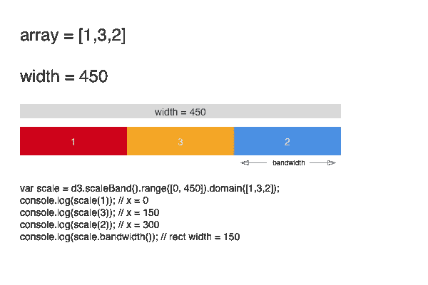
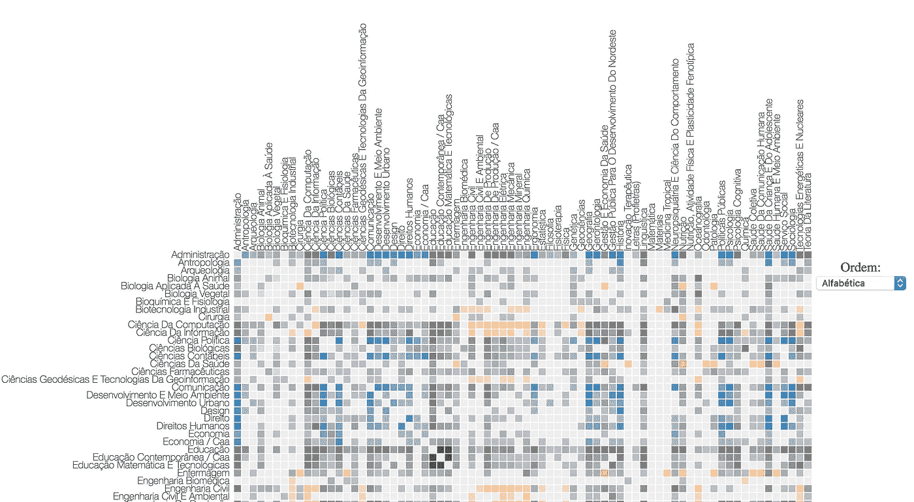

# 用 d3 构建共现矩阵分析学位论文中的重叠主题

> 原文：<https://towardsdatascience.com/building-a-co-occurrence-matrix-with-d3-to-analyze-overlapping-topics-in-dissertations-fb2ae9470dee?source=collection_archive---------4----------------------->


Thanks [Min An](https://www.pexels.com/u/minan1398/)!

我硕士学位研究的目标是**在不同领域的研究人员之间激发新的合作机会**。但在此之前，我需要后退一步，看看**是否有任何合作已经发生**。酷，但是如何开始做这件事呢？

当作者为他们的作品写摘要时，他们也会添加一些关键词。我的第一个猜测是，通过这些关键词，我可以开始看到来自不同知识领域的论文是如何相互作用的。

于是我把自己大学(2016)的所有学位论文都找来，构建了一个矩阵，把关键词重叠的作品可视化。

我有两项主要工作:**获取数据**和**构建 d3 可视化**。

# 1️⃣——获取数据

每次学生拿到学位，她都需要把最终论文发到这个网站:[http://repositorio.ufpe.br/](http://repositorio.ufpe.br/)。为了从这些论文中获取关键词，我必须:

1.  获取所有学位论文的列表
2.  下载 pdf 文件
3.  提取文本并获得每篇论文的关键词

## 🎓1 —获取所有论文的列表

多亏了 Scrapy，这部分比我想象的要容易得多。为了用框架从网站中提取数据，我们需要编写一个蜘蛛。

> “蜘蛛是你定义的类，Scrapy 用它从一个网站(或一组网站)抓取信息。”[来源](https://doc.scrapy.org/en/latest/intro/tutorial.html#our-first-spider)

在 Spider 类中，我们定义了基本 URL，Scrapy 应该如何处理分页，还定义了将要提取的数据。

我得到了这个元数据:

```
{            
'author',
'title',
'date':            
'abstract',            
'research_field',            
'url_to_pdf'     
}
```

## 📁2-下载 pdf

我构建了一个 python 脚本，使用[请求](http://docs.python-requests.org/en/master/)、*一个优雅而简单的 Python HTTP 库，为人类而建*。

```
with open(new_file_name, 'wb') as pdf:
    temp = requests.get("[http://repositorio.ufpe.br](http://repositorio.ufpe.br)" + link, stream=True)
    for block in temp.iter_content(512):
        if not block:
            breakpdf.write(block)
```

## 🔡3 —提取文本并获得每篇论文的关键词

对于这个任务，我使用了 [PyPDF2](https://github.com/mstamy2/PyPDF2) 和[空间](https://spacy.io/)。通常作者把关键词放在摘要下面，所以我浏览 PDF 的页面，如果我找到像“关键词”和“ *palavras-chave* ”(在葡萄牙语中是关键词的意思)这样的词，我会把内容保存在一个 txt 文件中。

我使用 spaCy 来标记文本，因为 PDF 提取并不完美。

在这个过程之后，我得到了包含“关键词”的每一页的文本。为了只得到关键词本身，我遍历单词，得到所有跟在“关键词”后面的单词，因为它们通常是页面中的最后一项。然后，我最后将数据加载到 dataframe 中进行一些转换，并将其保存到 csv 文件中。

## 关键词对我想做的事情有好处吗？

我注意到的一件事是，关键字可能非常普通。如果我的目标是检查不同研究领域的主题如何相互作用，我应该分析摘要，因为在那里有更多的机会找到相互作用的点。

让我们举一个真实的例子来说明一下。对于本论文:“[农民工大学生适应中的认知和非认知方面](http://repositorio.ufpe.br/bitstream/handle/123456789/17872/Disserta%C3%A7%C3%A3o%20Emily%20%20Gai%C3%A3o%20e%20Albuquerque%20%28vers%C3%A3o%20definitiva%29.pdf?sequence=1&isAllowed=y,Disserta%C3%A7%C3%A3o%20Emily%20%20Gai%C3%A3o%20e%20Albuquerque%20%28vers%C3%A3o%20definitiva%29)”的关键词是:

*   学术经历
*   弹性
*   执行职能
*   论证
*   大学生

但在阅读摘要时，我发现了这个:

> “为了实现这些目标，进行了以下分析:描述性统计、T 检验、方差分析(ANOVA)、相关探索性双变量分析、探索性因子分析和多元线性回归。”

这篇论文来自认知心理学的研究生项目，但它的主题来自统计学，也可能来自计算机科学，对吗？关键字不能显示这一点。因此，我的下一步将是利用摘要中的文本建立一个深度学习模型。

但是我们需要从某个地方开始，所以我做了一些简单的事情:从每个研究领域得到前 10 个关键词，我假设这些词可以用来描述这个领域。

> 首先去做，然后做对，然后做得更好——艾迪·osmani‏

好了，现在我们准备开始构建可视化。

# 2️⃣——构建可视化

我们将使用[迈克·博斯托克](https://medium.com/u/c918c478bb49?source=post_page-----fb2ae9470dee--------------------------------) [悲惨世界共现矩阵](https://bost.ocks.org/mike/miserables/)作为我们的“模板”。让我们首先创建一个矩形，并将其添加到背景中:

```
var margin = {
        top: 285,
        right: 0,
        bottom: 10,
        left: 285
    },
    width = 700,
    height = 700;
var svg = d3.select("graph").append("svg").attr("width", width).attr("height", height);svg.append("rect")
    .attr("class", "background")
    .attr("width", width - margin.right)
    .attr("height", height - margin.top)
    .attr("transform", "translate(" + margin.right + "," + margin.top + ")");svg.append("rect")
    .attr("class", "background")
    .attr("width", width)
    .attr("height", height);
```

现在我们可以深入了解 d3 的魔力了。

## 1-转换数据

数据看起来像这样:

```
{
    "nodes": [{
            "group": "humanas",
            "index": 0,
            "name": "ADMINISTRAÇÃO"
        },
        {
            "group": "humanas",
            "index": 1,
            "name": "ANTROPOLOGIA"
        },
        [...]
    ],
    "links": [{
            "source": 0,
            "target": 0,
            "value": 0.0
        }, {
            "source": 0,
            "target": 1,
            "value": 2.0
        }, 
        [...]
    ]
}
```

我们将逐行构建矩阵。首先，我们读取数据并为每一行创建一个数组。

```
d3.json("data/data.json", function(data) {
    var matrix = [];
    var nodes = data.nodes;
    var total_items = nodes.length;// Create rows for the matrix
    nodes.forEach(function(node) {
        node.count = 0;
        node.group = groupToInt(node.group);matrix[node.index] = d3.range(total_items).map(item_index => {
            return {
                x: item_index,
                y: node.index,
                z: 0
            };
        });
    });
    // Fill matrix with data from links and count how many times each item appears
    data.links.forEach(function(link) {
        matrix[link.source][link.target].z += link.value;
        matrix[link.target][link.source].z += link.value;
        nodes[link.source].count += link.value;
        nodes[link.target].count += link.value;
    });});
```

因为我们将逐行构建方块，所以我们需要浏览每一行，然后浏览每一列。

## 2-放置正方形并添加颜色

为了将每个方块放置在正确的位置，我们将使用 d3.scaleBand()标尺。这个 scale 的作用是获得一个包含值的数组，然后为每个数组项分配一个坐标。每个项目的所有坐标加上带宽值加起来就是总宽度。



How d3.scaleBand() words

这个规模令人敬畏，因为我们不需要手工计算。

要给每个方块添加颜色，您可以使用 d3.schemeCategory20 标度。

这是大量的新代码，让我们来看看:

```
d3.json("data/data.json", function(data) {[...] //transform the datavar matrixScale = d3.scaleBand().range([0, width]).domain(d3.range(total_items));
var opacityScale = d3.scaleLinear().domain([0, 10]).range([0.3, 1.0]).clamp(true);
var colorScale = d3.scaleOrdinal(d3.schemeCategory20);// Draw each row (translating the y coordinate) 
    var rows = svg.selectAll(".row")
        .data(matrix)
        .enter().append("g")
        .attr("class", "row")
        .attr("transform", (d, i) => {
            return "translate(0," + matrixScale(i) + ")";
        });var squares = rows.selectAll(".cell")
        .data(d => d.filter(item => item.z > 0))
        .enter().append("rect")
        .attr("class", "cell")
        .attr("x", d => matrixScale(d.x))
        .attr("width", matrixScale.bandwidth())
        .attr("height", matrixScale.bandwidth())
        .style("fill-opacity", d => opacityScale(d.z)).style("fill", d => {
            return nodes[d.x].group == nodes[d.y].group ? colorScale(nodes[d.x].group) : "grey";
        })
        .on("mouseover", mouseover)
        .on("mouseout", mouseout);
});
```

我们还创建了一个比例来设置每个方块的不透明度。在我们的例子中，不透明度值是有至少一个关键字匹配的论文的数量。一个关键词匹配意味着一个关键词同时出现在两篇论文中。

## 3-添加列

我们对行做了同样的事情，但是现在我们旋转它们:

```
d3.json("data/data.json", function(data) {

   [...] //transform the data [...] //place the squares and add colorvar columns = svg.selectAll(".column")
        .data(matrix)
        .enter().append("g")
        .attr("class", "column")
        .attr("transform", (d, i) => {
            return "translate(" + matrixScale(i) + ")rotate(-90)";
        });
});
```

## 4-添加文本标签

为了添加占位符，我们使用行和列选择来添加一个 svg 文本元素。

```
d3.json("data/data.json", function(data) {

    [...] //transform the data [...] //place the squares and add color [...] //add columnsrows.append("text")
        .attr("class", "label")
        .attr("x", -5)
        .attr("y", matrixScale.bandwidth() / 2)
        .attr("dy", ".32em")
        .attr("text-anchor", "end")
        .text((d, i) => capitalize_Words(nodes[i].name));

    columns.append("text")
        .attr("class", "label")
        .attr("y", 100)
        .attr("y", matrixScale.bandwidth() / 2)
        .attr("dy", ".32em")
        .attr("text-anchor", "start")
        .text((d, i) => capitalize_Words(nodes[i].name));
});
```

## 5-添加排序功能

重新组织矩阵行有助于分析。在我们的例子中，我们可以按照字母顺序、每个项目(即研究领域)的连接数量以及每个知识领域的聚类来组织它们。使用 d3.scaleBand()矩阵很容易做到这一点。

数组的每一项都对应一个程序 id，所以如果我们以不同的方式对数组排序，我们会得到每个矩阵方块不同的坐标。

```
// Precompute the orders.
var orders = {
    name: d3.range(total_items).sort((a, b) => {
        return d3.ascending(nodes[a].name, nodes[b].name);
    }),
    count: d3.range(total_items).sort((a, b) => {
        return nodes[b].count - nodes[a].count;
    }),
    group: d3.range(total_items).sort((a, b) => {
        return nodes[b].group - nodes[a].group;
    })
};
```

然后，我们向 html select 标记添加功能:

```
d3.select("#order").on("change", function() {
    changeOrder(this.value);
});function changeOrder(value) {
        matrixScale.domain(orders[value]);
        var t = svg.transition().duration(2000);

        t.selectAll(".row")
            .delay((d, i) => matrixScale(i) * 4)
            .attr("transform", function(d, i) {
                return "translate(0," + matrixScale(i) + ")";
            })
            .selectAll(".cell")
            .delay(d => matrixScale(d.x) * 4)
            .attr("x", d => matrixScale(d.x));

        t.selectAll(".column")
            .delay((d, i) => matrixScale(i) * 4)
            .attr("transform", (d, i) => "translate(" + matrixScale(i) + ")rotate(-90)");
    }
```

为了增加一个好的效果，我们还添加了一个动画的转换。



The final result

就是这样！现在我们只是添加一些白线，并为每个方块添加一个工具提示。你可以在这里看到最终结果[或者在这里](http://bl.ocks.org/dmesquita/raw/5abae723e08fade117ae98faa7317d1d/)查看最终代码[。](https://gist.github.com/dmesquita/5abae723e08fade117ae98faa7317d1d)

这只是一个开始，现在我需要做的是如何显示关键词和论文。当然，我会回到这里与你分享，哈哈

感谢阅读！😁

你觉得这篇文章有帮助吗？我尽力每个月写一篇深入的文章，当我发表新的文章时，你可以收到电子邮件。