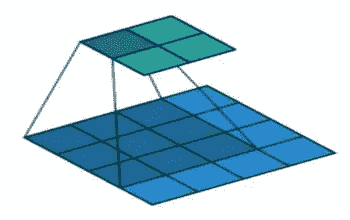
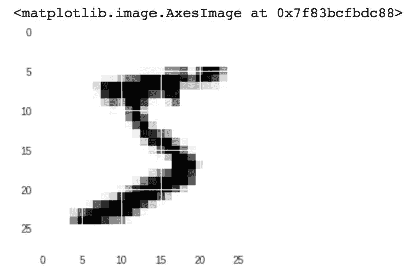
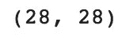
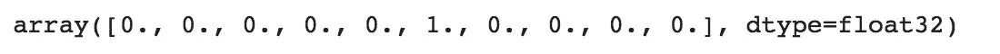
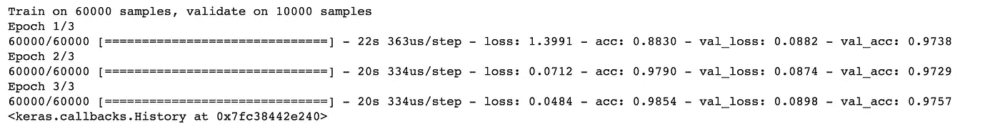
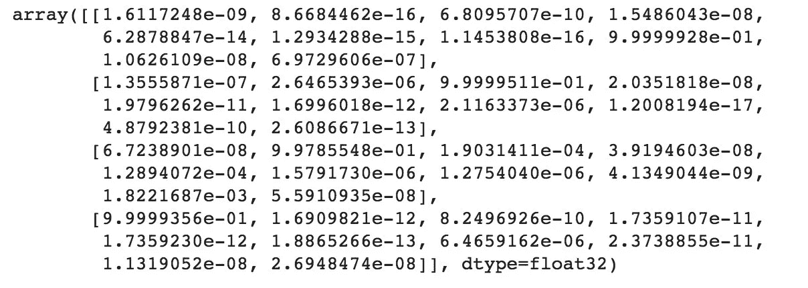
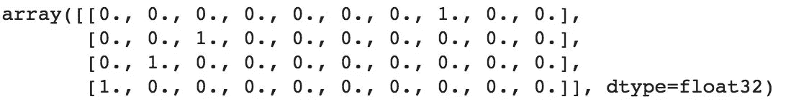

# 在 Keras 中构建卷积神经网络(CNN)

> 原文：<https://towardsdatascience.com/building-a-convolutional-neural-network-cnn-in-keras-329fbbadc5f5?source=collection_archive---------0----------------------->

深度学习正成为机器学习的一个非常受欢迎的子集，因为它在许多类型的数据上具有高水平的性能。使用深度学习对图像进行分类的一个很好的方法是建立一个卷积神经网络(CNN)。Python 中的 Keras 库使得构建 CNN 变得非常简单。

计算机使用像素来看图像。图像中的像素通常是相关的。例如，某一组像素可以表示图像中的边缘或一些其他图案。卷积用这个来帮助识别图像。

卷积将像素矩阵与滤波器矩阵或“内核”相乘，并对乘积值求和。然后卷积滑动到下一个像素，并重复相同的过程，直到覆盖了所有的图像像素。这个过程如下图所示。(关于深度学习和神经网络的介绍，可以参考我的深度学习文章[这里](/building-a-deep-learning-model-using-keras-1548ca149d37))。



CNN ([image credit](http://datacamp.com))

在本教程中，我们将使用流行的 mnist 数据集。该数据集由 70，000 张 0-9 的手写数字图像组成。我们将尝试通过 CNN 确认他们的身份。

## 加载数据集

mnist 数据集是作为 Keras 库的一部分方便地提供给我们的，因此我们可以轻松地加载数据集。在数据集中提供的 70，000 幅图像中，60，000 幅用于训练，10，000 幅用于测试。

当我们加载下面的数据集时，X_train 和 X_test 将包含图像，y_train 和 y_test 将包含这些图像所代表的数字。

```
from keras.datasets import mnist#download mnist data and split into train and test sets
(X_train, y_train), (X_test, y_test) = mnist.load_data()
```

## 探索性数据分析

现在让我们来看看数据集中的一幅图像，看看我们正在处理什么。我们将绘制数据集中的第一幅图像，并使用“shape”函数检查其大小。

```
import matplotlib.pyplot as plt#plot the first image in the dataset
plt.imshow(X_train[0])
```



```
#check image shape
X_train[0].shape
```



默认情况下，mnist 数据集中每个图像的形状都是 28 x 28，所以我们不需要检查所有图像的形状。当使用真实世界的数据集时，你可能没有这么幸运。28 x 28 也是一个相当小的尺寸，所以 CNN 可以很快地浏览每张图片。

## 数据预处理

接下来，我们需要在训练模型时将数据集输入(X_train 和 X_test)调整为模型预期的形状。第一个数字是图像的数量(X_train 为 60，000，X_test 为 10，000)。然后是每个图像的形状(28x28)。最后一个数字是 1，表示图像是灰度的。

```
#reshape data to fit model
X_train = X_train.reshape(60000,28,28,1)
X_test = X_test.reshape(10000,28,28,1)
```

我们需要“一次性编码”我们的目标变量。这意味着将为每个输出类别创建一个列，并为每个类别输入一个二进制变量。例如，我们看到数据集中的第一个图像是 5。这意味着数组中的第六个数字将是 1，而数组的其余部分将填充 0。

```
from keras.utils import to_categorical#one-hot encode target column
y_train = to_categorical(y_train)
y_test = to_categorical(y_test)y_train[0]
```



## 构建模型

现在我们已经准备好构建我们的模型了。代码如下:

```
from keras.models import Sequential
from keras.layers import Dense, Conv2D, Flatten#create model
model = Sequential()#add model layers
model.add(Conv2D(64, kernel_size=3, activation=’relu’, input_shape=(28,28,1)))
model.add(Conv2D(32, kernel_size=3, activation=’relu’))
model.add(Flatten())
model.add(Dense(10, activation=’softmax’))
```

我们将使用的模型类型是顺序的。顺序是在 Keras 中建立模型的最简单的方法。它允许你一层一层地建立模型。

我们使用“add()”函数向模型中添加层。

我们的前两层是 Conv2D 层。这些卷积层将处理我们的输入图像，这些图像被视为二维矩阵。

第一层中的 64 和第二层中的 32 是每层中的节点数。根据数据集的大小，这个数字可以调高或调低。在我们的例子中，64 和 32 工作得很好，所以我们现在坚持使用它。

核大小是我们卷积的滤波器矩阵的大小。因此，内核大小为 3 意味着我们将有一个 3×3 的滤波器矩阵。回头参考介绍和第一张图片来复习一下。

激活是层的激活功能。我们将为前两层使用的激活函数是 ReLU，或修正线性激活。这种激活函数已被证明在神经网络中工作良好。

我们的第一层也接受一个输入形状。这是前面看到的每个输入图像的形状，28，28，1，1 表示图像是灰度的。

在 Conv2D 层和密集层之间，有一个“展平”层。展平用作卷积层和致密层之间的连接。

“密集”是我们将在输出图层中使用的图层类型。密集是一种标准图层类型，在许多情况下用于神经网络。

我们的输出层将有 10 个节点，每个节点对应一个可能的结果(0–9)。

激活是“softmax”。Softmax 使输出总和达到 1，因此输出可以解释为概率。然后，该模型将根据哪个选项的概率最高来进行预测。

## 编译模型

接下来，我们需要编译我们的模型。编译模型需要三个参数:优化器、损失和指标。

优化器控制学习速率。我们将使用“亚当”作为我们的优化器。在许多情况下，Adam 通常是一个很好的优化器。adam 优化器在整个训练过程中调整学习率。

学习率决定了计算模型最佳权重的速度。较小的学习率可能会导致更准确的权重(直到某一点)，但计算权重所需的时间会更长。

我们将使用‘分类交叉熵’作为损失函数。这是最常见的分类选择。分数越低，表示模型的性能越好。

为了使事情更容易解释，当我们训练模型时，我们将使用“准确性”度量来查看验证集的准确性分数。

```
#compile model *using accuracy to measure model performance*
model.compile(optimizer='adam', loss='categorical_crossentropy', metrics=['accuracy'])
```

## 训练模型

现在我们将训练我们的模型。为了进行训练，我们将对我们的模型使用带有以下参数的“fit()”函数:训练数据(train_X)、目标数据(train_y)、验证数据和历元数。

对于我们的验证数据，我们将使用我们的数据集中提供给我们的测试集，我们已经将它分为 X_test 和 y_test。

历元数是模型在数据中循环的次数。在一定程度上，我们运行的时代越多，模型就会改进得越多。此后，模型将在每个时期停止改进。对于我们的模型，我们将把历元的数量设置为 3。

```
#train the model
model.fit(X_train, y_train, validation_data=(X_test, y_test), epochs=3)
```



经过 3 个时期后，我们在验证集上达到了 97.57%的准确率。这是一个非常好的开始！恭喜你，你现在已经建立了一个 CNN！

## 使用我们的模型进行预测

如果您想要查看我们的模型对测试数据做出的实际预测，我们可以使用 predict 函数。预测函数将给出一个包含 10 个数字的数组。这些数字是输入图像代表每个数字(0-9)的概率。编号最高的数组索引表示模型预测。每个数组的总和等于 1(因为每个数字都是一个概率)。

为了显示这一点，我们将显示测试集中前 4 幅图像的预测。

注意:如果我们有新数据，我们可以将新数据输入到 predict 函数中，以查看我们的模型对新数据做出的预测。由于我们没有任何新的未知数据，我们现在将使用测试集显示预测。

```
#predict first 4 images in the test set
model.predict(X_test[:4])
```



我们可以看到，我们的模型预测了前四幅图像的 7、2、1 和 0。

我们来对比一下这个和实际结果。

```
#actual results for first 4 images in test set
y_test[:4]
```



实际结果显示，前四个图像也是 7、2、1 和 0。我们的模型预测正确！

感谢阅读！本教程的 Github 库可以在[这里](https://github.com/eijaz1/Building-a-CNN-in-Keras-Tutorial)找到！