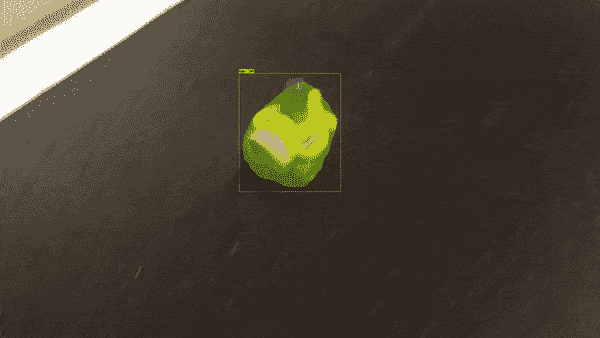
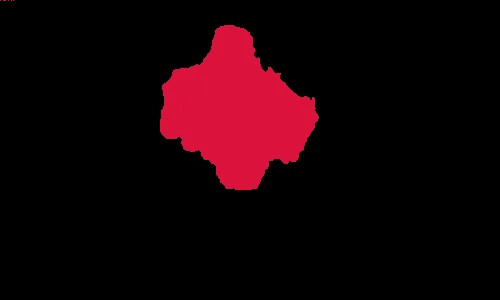
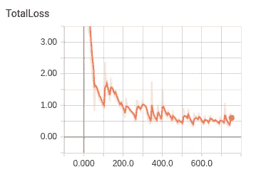
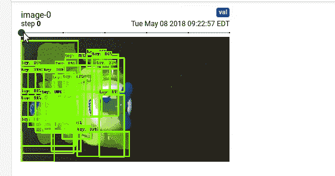

# 建立带有张量流对象检测的定制掩模 RCNN 模型

> 原文：<https://towardsdatascience.com/building-a-custom-mask-rcnn-model-with-tensorflow-object-detection-952f5b0c7ab4?source=collection_archive---------3----------------------->

*用数据做酷事！*

您现在可以使用 [Tensorflow 对象检测库](https://github.com/tensorflow/models/tree/master/research/object_detection)构建一个自定义的遮罩 RCNN 模型！掩模 RCNN 是一个实例分割模型，可以逐个像素地识别任何对象的位置。本文是我广受欢迎的[帖子](/using-tensorflow-object-detection-to-do-pixel-wise-classification-702bf2605182)的第二部分，在这里我解释了 Mask RCNN 模型的基础知识，并在视频上应用了一个预先训练好的 Mask 模型。

训练掩模模型比训练对象检测模型稍微复杂一些，因为在训练时也需要对象掩模。我花了一些迭代来弄清楚这个过程，我在这里分享了关键的细节。我在一个玩具上训练了一个面具 RCNN 模型。参见下面的演示:



Custom Mask RCNN Model on a toy

你可以在我的 [Github repo](https://github.com/priya-dwivedi/Deep-Learning/tree/master/Custom_Mask_RCNN) 上找到代码。

如果你有一个有趣的项目需要帮助，请联系我在 priya.toronto3@gmail.com

**1)收集数据并创建掩码**

常规的对象检测模型要求您使用边界框来注释图像中的对象。然而，蒙版模型的输入是带有蒙版的 PNG 文件。请参见下面的示例:



Object Mask — Toy

利用这个二进制掩模图像，模型可以提取边界框的坐标以及对象的像素位置。

我用来创建蒙版的工具是[像素注释工具](https://github.com/abreheret/PixelAnnotationTool)。这个工具的输出是 API 想要的格式的 PNG 文件。您可以在注释工具中打开图像，并使用画笔给玩具“上色”。将外部着色并标记为感兴趣区域之外也很重要。我花了大约 20 秒的时间来着色和保存每一张还不错的蒙版图片。如果你想让蒙版非常精确，那么在边缘使用精细的笔刷。通过我的实验，我观察到训练一个掩模 RCNN 模型比训练一个更快的 RCNN 模型需要更少的图像来达到相同的精度。

**2。生成 TF 记录**

Tensorflow 对象检测模型的输入是一个 TFRecord 文件，您可以将其视为图像、边界框、遮罩等的压缩表示，以便在训练模型时将所有信息放在一个地方。创建这个文件最简单的方法是使用一个类似的脚本，该脚本可用于 pet 数据集的 [TFRecord，并针对我们的情况对其进行一点修改。我已经分享了我在 Github repo 上使用的脚本。](https://github.com/tensorflow/models/blob/master/research/object_detection/dataset_tools/create_pet_tf_record.py)

您还需要创建一个 label.pbtxt 文件，用于将标签名称转换为数字 id。对我来说，这很简单

```
item {
 id: 1
 name: ‘toy’
}
```

**3。选择模型超参数**

现在你可以选择你想要使用的遮罩模型。Tensorflow API 提供了 [4 个模型选项](https://github.com/tensorflow/models/blob/master/research/object_detection/g3doc/detection_model_zoo.md)。我选择了掩模 RCNN 盗梦 V2，这意味着盗梦 V2 被用作特征提取器。该模型在推理时间上是最快的，尽管它可能不具有最高的准确性。模型参数存储在配置文件中。我为相同类型的 coco 模型使用了[配置文件](https://github.com/tensorflow/models/blob/master/research/object_detection/samples/configs/mask_rcnn_inception_v2_coco.config),并更新了类的数量和路径，使大多数模型参数保持不变。

**4。训练模型**

锁定输入文件和参数后，您可以开始培训。我能够在几个小时内在 CPU 上训练这个模型。您可以同时在两个独立的终端上启动培训作业和评估作业。启动 tensorboard 监控性能。当我看到损失趋于平稳时，我停止了训练。



Tensorboard 中最酷的事情是，随着训练的进行，它允许你在测试集的样本图像上可视化预测。下面的 gif 显示了随着训练的进行，模型变得确定其遮罩和边界框预测。



**5。在您的定制视频上测试模型**

为了测试模型，我们首先选择一个模型检查点(通常是最新的)并将其导出到一个冻结的推理图中。这个脚本也在我的 github 上。我在我的 Iphone 上录制的新视频中测试了这个模型。正如在我的[上一篇](https://medium.com/towards-data-science/is-google-tensorflow-object-detection-api-the-easiest-way-to-implement-image-recognition-a8bd1f500ea0)文章中，我使用 Python moviepy 库将视频解析成帧，然后在每一帧上运行 object detector，并将结果整理回视频中。

# 后续步骤

未来的额外探索

*   我想将这个模型扩展到同一张图片中的多个类别的物体。TFRecord creator 脚本需要一些修改，这样它才能正确地为每个对象分配正确的标签和掩码
*   正如我提到的，我在这个项目中使用了最轻量级的模型。我很想看看该套件中速度较慢的其他型号在检测准确性方面的表现

给我一个❤️，如果你喜欢这个职位:)希望你拉代码，并尝试自己。

我有自己的深度学习咨询公司，喜欢研究有趣的问题。我已经帮助许多初创公司部署了基于人工智能的创新解决方案。请到 http://deeplearninganalytics.org/来看看我们吧。

你也可以在 https://medium.com/@priya.dwivedi 的[看到我的其他作品](https://medium.com/@priya.dwivedi)

如果你有一个我们可以合作的项目，请通过我的网站或 info@deeplearninganalytics.org 联系我

**参考文献:**

*   [蒙版 RCNN 纸](https://arxiv.org/abs/1703.06870)
*   [谷歌 Tensorflow 物体检测 Github](https://github.com/tensorflow/models/tree/master/research/object_detection)
*   [COCO 数据集](http://mscoco.org/home/)
*   [了解黑白实例切分和语义切分的区别](https://stackoverflow.com/questions/33947823/what-is-semantic-segmentation-compared-to-segmentation-and-scene-labeling)
*   非常好的[解释](https://www.youtube.com/watch?v=UdZnhZrM2vQ&t=111s)屏蔽 RCNN