# 为交互式群组分析构建仪表板

> 原文：<https://towardsdatascience.com/building-a-dashboard-for-interactive-cohort-analysis-6a9d904bcbda?source=collection_archive---------2----------------------->

## 我们如何留住不同的用户群？

Source: Pixabay

# 介绍

群组是指具有共同定义特征的一组受试者。我们可以观察一个群体在不同时间的表现，并与其他群体进行比较。群组用于医学、心理学、计量经济学、生态学和许多其他领域，以在时间上的间隔进行交叉分析(比较受试者之间的差异)。([来源](https://en.wikipedia.org/wiki/Cohort_study))

在这篇文章中，我们将重点观察用户在使用 Jupyter 笔记本的产品中的行为。

产品业务中保留的重要性从[延续到之前的](https://medium.com/towards-data-science/generating-product-usage-data-from-scratch-with-pandas-319487590c6d)，在那里我们模拟了产品使用数据，可以总结为三个数字:

*   **95% =重新吸引用户与获得新用户的成本差异** ( [来源](https://amplitude.com/mobile-analytics))
*   **5% =可将收入提高至 95%的留存额增加量** ( [来源](https://amplitude.com/mobile-analytics))
*   **77% =前三天每日活跃用户流失的平均百分比** ( [来源](http://andrewchen.co/new-data-shows-why-losing-80-of-your-mobile-users-is-normal-and-that-the-best-apps-do-much-better/))

Trying to grow a product without being able to retain users

检查留存率的关键问题是如何快速、方便地调查不同用户群在产品上平均花费了多少时间。为了做到这一点，可视化需要是交互式的，我们可以通过构建一个仪表板来实现。

我们从上一篇文章中模拟的数据集开始(略有改动)，该数据集由 10.000 个用户组成，具有三个分类变量:国家(值为 NL、FR 和 AU)、平台(值为 iOS 和 Android)和 user_registered(值为 True 和 False)。小的调整和解释包含在笔记本中。

这篇文章中的所有代码都可以在 GitHub 上的笔记本中找到。

**代码**

我们从导入所有必需的依赖项开始:

接下来，我们打开包含所有产品使用数据的 CSV:

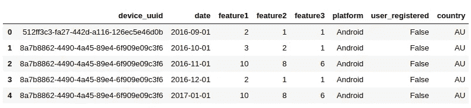

Preview of all_user_data_df

我们列出了所有三个变量的值，稍后我们将根据这些值对用户进行细分:

# 细分用户

下一步是细分用户。我们选择想要分割的特性的值:

这方面的一个例子是对 iOS 平台上未注册的荷兰用户进行细分:

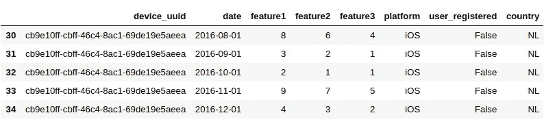

Segmentation example

# 构建群组

## 第一步

之后，我们在分割的数据帧上建立群组。第一步是创建一个函数，为每个用户定义一个群组(当用户开始使用产品时):

然后，我们对分段数据帧使用函数:

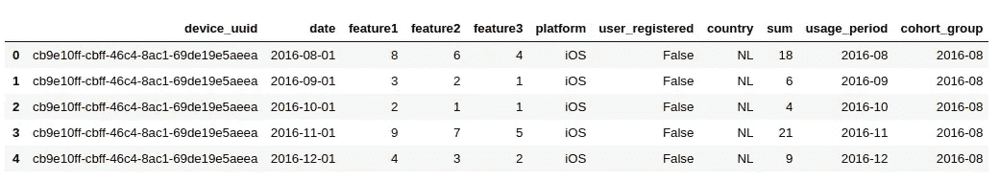

## 第二步:

我们将所有事件和用户分组:

我们将该函数应用于现有数据框:

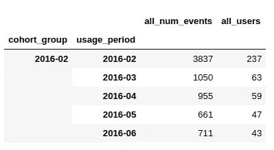

## 第三步:

我们基于 usage_period 为每个群组定义群组周期:

Cohort_period 0 对应的是使用产品第一个月的用户数和事件数。群组周期 1
对应于使用产品的第二个月的相同数据，以此类推。

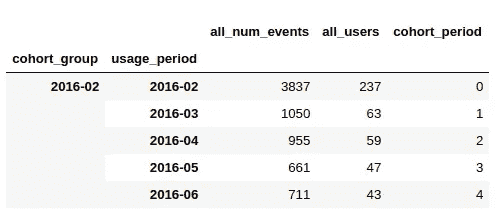

## 第四步:

我们重新索引数据帧，并设置群组组和群组周期作为索引。我们还计算了每个群组第一个月的用户数量。这两者对于
在下一步计算保留都是必要的:

我们将其应用于群组数据帧:

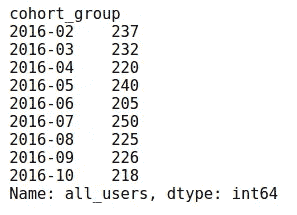

Number of users in each cohort

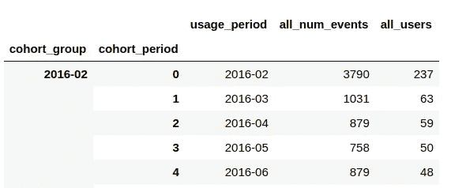

Sum of all events with unique users in each cohort period for the cohort group 2016–02

## 第五步:

然后我们计算每个群体的保持率。我们在 cohort_group(索引为 0 的第一列)上拆分，将索引中的唯一值透视到各个列中。然后，我们将每个群组中开始使用该产品的用户数量除以每个相应月份中继续使用该产品的用户数量(1 =第二个月，2 =第三个月，…)。

值~ 0.2658 对应于 2016–02 年群组中在第二个月使用该产品的用户数除以在第一个月使用该产品的用户数。它回答了这样一个问题:在 2016 年至 2002 年期间，有多少用户在使用产品的第二个月继续使用该产品？(26.6%)

值~ 0.2658 对应于 2016–02 年群组中在第二个月使用该产品的用户数除以在第一个月使用该产品的用户数。它回答了这样一个问题:在 2016 年至 2002 年期间，有多少用户在使用产品的第二个月继续使用该产品？(26.6%)

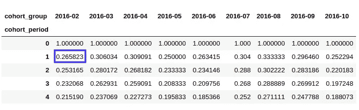

Cohort reindex and group size

我们将上述 5 个群组步骤中的所有函数合并为一个函数，稍后用于交互式可视化。
它的输入是细分数据，输出是每个群组的用户留存率:

# 静态可视化

然后，我们使用所有群组函数构建的 user_retention 数据框架用于可视化不同的用户群组如何随着时间的推移保留在产品中。

## 保留曲线

首先，我们可视化保留曲线。每条线对应不同的组群。每条曲线上方的空间越小，保留的用户百分比就越高。或者相反，曲线越快下降到低值，我们在吸引用户继续使用产品方面就越不成功。

我们使用蓝色色图，用更深的蓝色来显示后面的群组。我们看不出不同人群的记忆有任何明显差异。

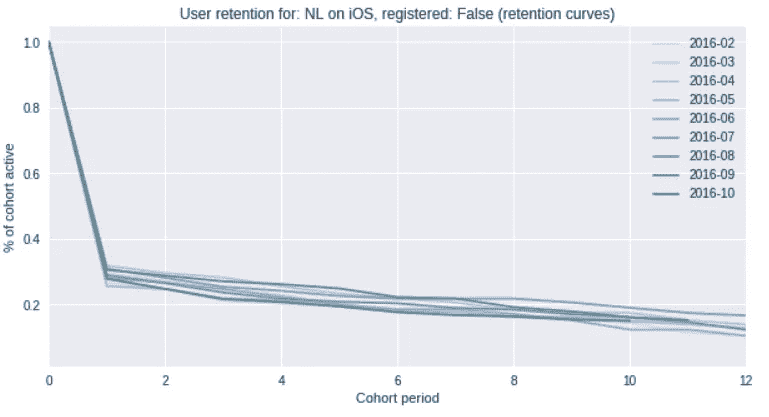

Visualization — retention curves

## 热图

接下来，我们用热图来直观显示保留情况。这一次我们使用了二进制颜色图，其中较深的颜色对应于特定群组在特定群组期间保留的较高百分比的用户
。

我们可以再次看到，保持率不会随着时间的推移而发生很大变化。25%的用户在使用后的第二个月内缓慢但持续地流失(这也可以在上面的 user_retention 数据框中看到)。

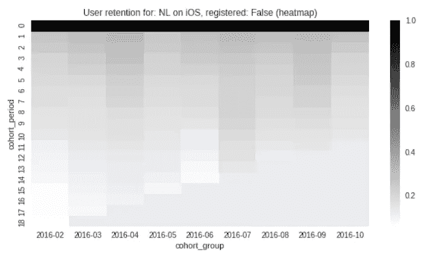

Visualization — heatmap

# 交互式可视化

最后一步包括组合所有已构建的功能，并以这样一种方式进行组合，即我们可以根据指定的变量值同时对用户进行细分，构建群组，并通过曲线和热图直观显示保留情况。

通过使用 interact 函数，我们可以选择要分段的变量值。这提供了一个交互式的重新计算和可视化，因此我们可以比较我们的用户的不同部分的保留。

我们可以在下面的例子中观察到，与 Android 用户相比，iOS 用户的保留率更低，这是通过上述调整(包含在笔记本中)模拟的。

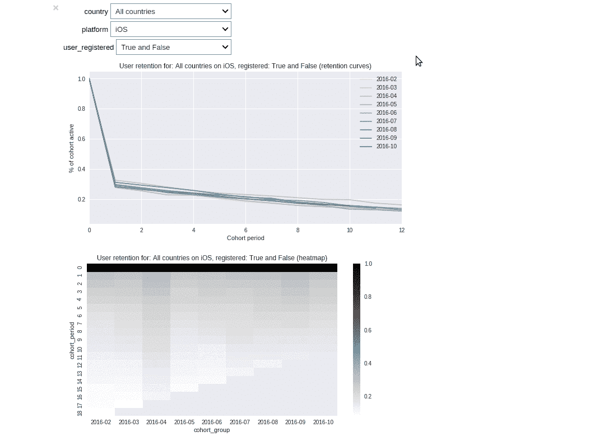

Dashboard for interactive cohort analysis

# 已用资源

部分队列分析主要基于格雷戈·瑞达的帖子。如果您想更深入地了解数据建模部分，推荐阅读本书。