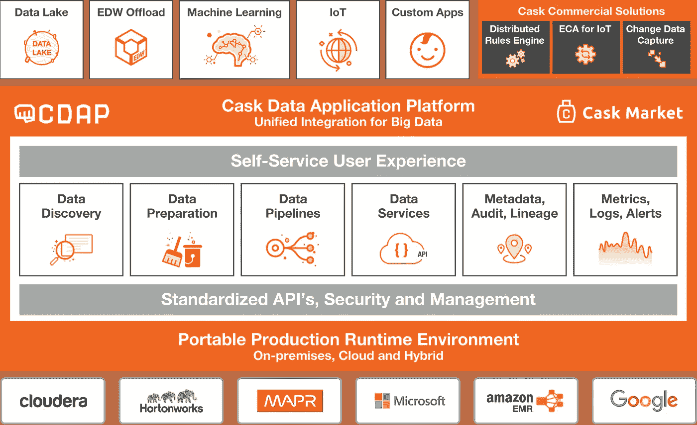
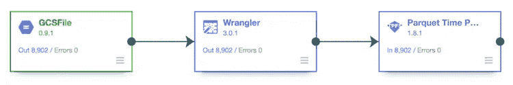
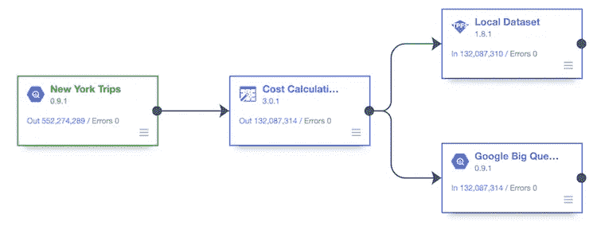
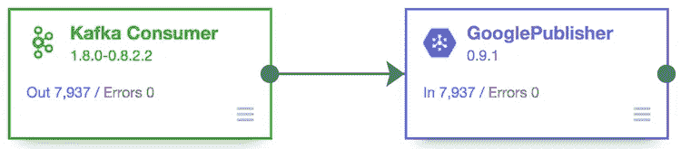
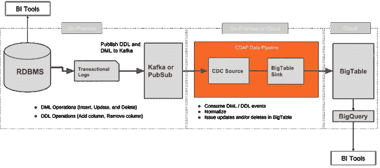
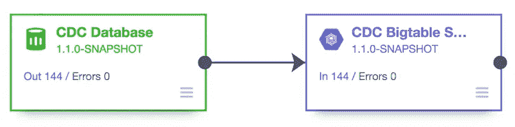
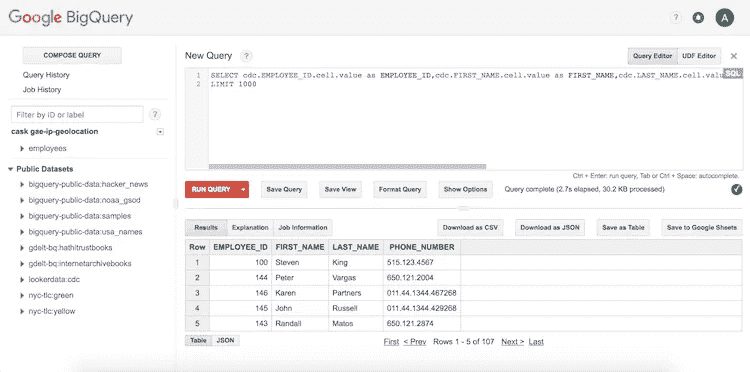
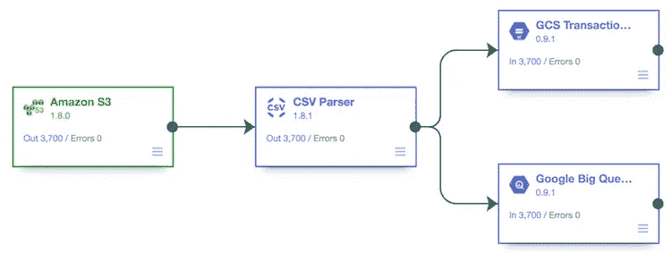
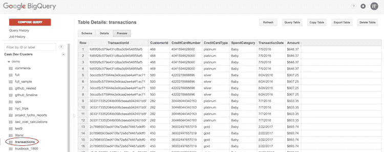
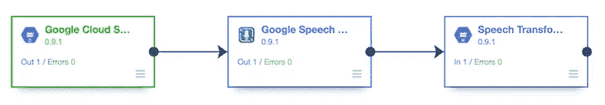

# 与 CDAP 一起在 GCP 建立一个数据湖

> 原文：<https://towardsdatascience.com/building-a-data-lake-on-gcp-with-cdap-6271c264f22e?source=collection_archive---------5----------------------->

## 首先看看谷歌收购的木桶的开源平台



Visit Cask Product page to know more on [CDAP](http://cask.co/products/cdap/)

众所周知，传统的数据分析平台(如数据仓库)难以扩展且成本高昂，难以满足当前的数据存储和计算需求。如果在内部部署，为处理大数据而专门构建的平台通常需要大量的前期和持续投资。或者，云计算是以经济的方式扩展和容纳如此大量数据的完美工具。虽然经济性是正确的，但企业迁移其内部数据仓库或在云中构建新的仓库或数据湖的过程中会面临许多挑战。这些问题包括构建网络、保护关键数据、拥有使用所选云技术的合适技能，以及找出合适的工具和技术来创建加载、转换和混合数据的操作工作流。

> 技术什么都不是。重要的是你对人们有信心，他们基本上是善良和聪明的，如果你给他们正确的工具，他们会和他们一起做美好的事情。——**乔布斯**

企业比以往任何时候都更加依赖数据。拥有合适的工具集授权给合适的人可以使数据随时可用，从而更好、更快地做出决策。在将数据仓库迁移到云中或在云中构建数据仓库的过程中，最重要的步骤之一是选择合适的工具集，使集成变得简单，并使他们能够专注于解决业务挑战，而不是专注于基础设施和技术。

在这篇博文中，我们将讨论[**【CDAP】(木桶数据应用平台)**](http://cask.co/products/cdap/) 如何与 [**谷歌云平台(GCP)**](https://cloud.google.com/) 技术无缝集成，构建云中的数据湖。我们将了解 CDAP 如何帮助数据管理专业人士通过使用 CDAP 集成更多数据来实现他们在 GCP 迁移或构建数据湖的业务目标，从而最大化他们在 GCP 的投资价值。

CDAP 管道(工作流)是一种移动、转换、混合和丰富数据的数据编排功能。CDAP 管道管理所有管道活动的调度、协调和监控，并处理故障情况。CDAP 管道提供了数百个预建连接器的集合、基于开源流媒体引擎的简化流处理，以及与 BigTable、BigQuery、谷歌云存储、谷歌 PubSub 和其他 GCP 技术的新的开箱即用连接。因此，它们使用户能够在谷歌云环境中的任何地方集成几乎任何数据。

治理是任何数据湖或数据仓库的重要需求，无论是部署在内部还是云中。自动捕获和索引 CDAP 境内任何管道的技术、业务和运营元数据的能力，使发现数据集、执行影响分析、跟踪数据集的谱系和创建审计跟踪变得非常容易。

因此，让我们来看看 CDAP 最近添加的一些功能，以与谷歌云平台技术集成。

# 数据准备和与 GCS 的管道集成

有了**木桶**，优化宏观用户流程的无缝工作流程在处理复杂技术的同时提供了完整而有趣的体验。根据客户的第一手观察，这样做可以提高效率，降低运营成本，减少用户的挫折感，并最终实现数据访问的民主化，从而更快地从数据中获得更大的价值。本着实现更高效率的精神，让我们首先将 CDAP 的数据准备功能与谷歌云存储集成起来。

[**谷歌云存储(GCS)**](https://cloud.google.com/storage/) 是统一对象存储，支持内容分发、备份和归档、灾难恢复、大数据分析等领域的各种非结构化数据。您可以使用 CDAP 管道将数据移入和移出 GCS，以用于分析、应用和各种用例。借助 CDAP，您可以快速可靠地简化工作流程和操作，或者使用相同的流程将您的客户或供应商数据从亚马逊 S3、Azure ADLS 或 WASB 转移到谷歌云存储中。

CDAP 管道提供了用于与 GCS 本地集成的插件，无论您使用的是结构化数据还是非结构化数据。它们还提供了与 CDAP 数据准备功能的无缝集成，使您可以轻松创建与项目的 GCS 连接、浏览 GCS 并立即处理您的数据，而无需使用代码或移动到另一个控制台。

观看下面的截屏，了解 CDAP 数据准备和 CDAP 管道和气体控制系统的集成流程。

This flow from the start (Configuring GCS) to finish (Pipeline Deployed) takes around ~ 2 minutes to build, and not a single line of code was written

除了与 CDAP 数据准备集成之外，以下 CDAP 插件也可用于 GCS:

*   **GCS 文本文件源—** 一个源插件，允许用户读取存储在 GCS 上的纯文本文件。文件可以是 CSV、制表符分隔、行分隔 JSON、固定长度等。
*   **GCS 二进制文件源—** 一个源插件，允许用户以 blobs 形式读取存储在 GCS 上的文件。可以读取 XML、AVRO、Protobuf、图像和音频文件等文件。

CDAP 数据准备自动确定文件类型，并根据文件扩展名和文件内容类型使用正确的源。下面是一个简单的管道和配置相关的 GCS 文本文件源，供您参考。



# Google BigQuery 集成

Google 云平台的另一个重要组成部分是 [**Google BigQuery**](https://cloud.google.com/bigquery/) 。Google BigQuery 是一个无服务器、完全托管的 Pb 级数据仓库，它使企业能够以高度并发的方式执行所有数据仓库操作。通过 CDAP 的原生 Google BigQuery connector，Spark、Spark Streaming 和 MapReduce 作业可以用来将大量数据快速加载到 BigQuery 中。CDAP 对嵌套模式和复杂模式的支持允许在 BigQuery 中高效地分析不同的数据类型。在配置插件时，数据集表的模式无缝地对用户可用。数据集内的新表无需额外工作即可创建。



上面的管道读取纽约 Trips 数据集(在 Google BigQuery 上作为公共数据集提供)，对集群执行一些转换和计算，并将结果写回 Google BigQuery。这个例子可能与真实用例不太相关，因为您可以使用 BigQuery SQL 来完成这里所做的事情，但是这个管道仅用于演示目的，以显示 Google BigQuery 的源和接收器可以读取和写入。

这些 BigQuery 插件简化了从 BigQuery 导入元数据，并根据管道模式自动创建表和正确的模式。

# Google PubSub 集成

[**Google PubSub**](https://cloud.google.com/pubsub/) 是一个完全托管的实时消息服务，让你将来自传感器、日志和点击流的数据摄取到你的数据湖中。CDAP 对 Spark Streaming、Kafka、MQTT 的支持，以及对 Google PubSub 的原生连接，使得将历史数据与实时数据相结合变得容易，从而获得对您的客户的完整的 360 度视图。它还可以轻松地在内部和云之间移动数据。



下面是一个简单的实时 CDAP 数据管道，用于将数据从内部 Kafka 实时推送到 Google 云平台 PubSub。发布的数据可立即用于进一步的转换和处理。

# 用例

# EDW 卸载| Oracle CDC 到 Google BigTable

在过去的几十年中，企业已经为数据仓库安装了设备和其他预配置的硬件。这些解决方案通常需要在专有技术上进行大量投资，其目标是让管理和分析数据变得更容易。然而，最近开源技术的进步提供了存储和处理大量数据的更便宜的方法，打破了企业的围墙，使企业质疑昂贵硬件的成本。这一次，企业不再用新硬件替换旧系统，而是寻求在对他们有意义的时候迁移到云来构建他们的数据湖。但是，需要正确的工具来支持云中数据仓库的许多可能的用例。高效、可靠地将数据从本地数据仓库卸载到云需要四件事情:

*   易于加载数据和保持数据更新
*   支持对小型和大型数据集进行快速查询的查询工具
*   支持高并发性而不降低性能
*   自定义报告和仪表板工具。

Google BigTable 结合 Google BigQuery 提供了支持批量加载的能力，以及查询大规模加载的数据的能力。对于报表和仪表板， [**Google Data Studio**](https://datastudio.google.com/) 或任何其他流行的 BI 工具可以与 Google Query 结合使用，以满足许多报表需求。

现在，主要问题是企业如何有效地将数据从其内部仓库卸载到 BigTable 中，并保持 BigTable 中的数据同步。为了支持 EDW 卸载到 BigTable 用例，CDAP 提供了在关系数据库和数据管道上执行**变更数据捕获** (CDC)的能力，以及用于消费变更数据事件和更新相应的 Google BigTable 实例以保持数据同步的插件。变更数据捕获解决方案可以使用三种方法之一来捕获源数据库中的变更:

1.  通过 [Oracle Golden Gate](http://www.oracle.com/technetwork/middleware/goldengate/overview/index.html) 进入源表的交易日志
2.  通过 [Oracle 日志挖掘器](https://docs.oracle.com/cd/B19306_01/server.102/b14215/logminer.htm)或
3.  使用[变更跟踪](https://docs.microsoft.com/en-us/sql/relational-databases/track-changes/about-change-tracking-sql-server)来跟踪 SQL Server 的变更

第一个解决方案读取数据库事务日志，并将所有 DDL 和 DML 操作发布到 Kafka 或 Google PubSub 中。实时 CDAP 数据管道使用 Kafka 或 Google PubSub 中的这些变更集，使用 CDC BigTable Sink 插件对 BigTable 进行规范化并执行相应的插入、更新和删除操作。



下面是一个管道，它从流源读取变更集，并将它们写入 BigTable，重新创建所有的表更新，并使它们保持同步。



要从 BigQuery 查询，请将表作为外部表添加。点击 了解更多操作方法信息 [**。**](https://cloud.google.com/bigquery/external-data-bigtable)



# 在云之间移动|从亚马逊到谷歌，反之亦然

企业可能出于多种原因决定从一个公共云平台迁移到另一个公共云平台，或者选择多个云提供商。一个原因可能是不同的公共云提供商提供了比当前提供商更好的价格，或者在提供的服务方面更匹配。另一个常见的情况是，一家企业最近经历了一次合并，收购方已经优先选择了他们的公共云提供商。不管原因是什么，简化迁移或支持多个云的一种方法是从与云环境集成的多云数据管理平台开始。通过使用多云数据管理解决方案，如 CDAP，您可以无缝地创建一个抽象，隐藏底层云的差异，并允许工作流和数据的简单迁移。在混合云环境中，从一开始就采用这样的平台是非常有价值的，在混合云环境中，您可能要管理本地(托管)私有云和公共云。

借助 CDAP 管道，构建能够高效、可靠地将数据从一个公共云存储迁移到另一个公共云存储的工作流非常简单。下面是一个例子，展示了如何将亚马逊 S3 的数据迁移到 GCS 中，并在迁移过程中转换和存储到 Google BigQuery 中。



管道执行后，管道的执行结果可以在 GCS 和 BigQuery 中获得。



# 人工智能集成|使用谷歌语音翻译器翻译音频文件

转录是将你录制的音频转换成高度准确、可搜索和可读的文本的最佳方式；能够索引和搜索音频内容非常有用，因为这有助于用户找到相关内容。它可以用来提高有机流量，改善可访问性，还可以通过转录音频文件来增强您的人工智能，从而为您的客户提供更好的服务。

假设您有一家提供客户支持服务的公司，您正在记录随机的客户对话以提高服务质量，从而更好地了解代表如何处理电话。改善服务的第一步是将录制的音频文件转录成数字化的可读文本。此外，文本可以通过各种 AI / ML 工作流来确定呼叫的情绪、客户情绪、解决延迟等。

[**Google Cloud Speech API**](https://cloud.google.com/translate/docs/getting-started)利用强大的神经网络模型将音频转换为文本。它识别超过 110 种语言和变体，以支持您的全球用户群。

简化录制的大量音频文件的转录，谷歌云平台技术和 CDAP 一起为用户提供了一个集成的，可扩展的和无代码的方式来转录音频文件。这种集成使用户可以在几分钟到几小时内，而不是几周或几个月内，为任何生产部署构建可以轻松安排和监控的管道。

下面是一个简单的 CDAP 管道，它获取存储在谷歌云存储上的原始音频文件，通过谷歌语音翻译插件传递，并将转录的文本写入谷歌云存储上的另一个位置。



谷歌语音翻译 CDAP 插件已经准备好根据被录制文件的类型进行少量的设置。在上面的例子中，应用于原始音频文件的翻译生成一个 JSON 输出，它描述了被转录的文件，并计算了转录的置信度。

```
{
 "path": "/audio/raw/audio.raw", 
 "speeches": [
    {
      "confidence": 0.9876289963722229, 
      "transcript": "how old is the Brooklyn Bridge" 
    } 
  ]
}
```

# 资源

案例研究:[数据湖](http://cask.co/customers/data-lake/)、 [XML 转换](http://cask.co/customers/xml-ingest-and-transform/)、[数据发现](http://cask.co/customers/data-discovery-for-data-science/)、[信息安全智能分析](http://cask.co/customers/security-analytics-and-reporting/)

导读:[卡夫卡消费](https://github.com/cdap-guides/cdap-kafka-ingest-guide)，[推特数据](https://github.com/cdap-guides/cdap-twitter-ingest-guide)，[数据处理同流程](https://github.com/cdap-guides/cdap-flow-guide) & [水槽](https://github.com/cdap-guides/cdap-flume-guide)

代码示例:[Twitter sensing](https://github.com/caskdata/cdap-apps/tree/develop/TwitterSentiment)， [MovieRecommender](https://github.com/caskdata/cdap-apps/tree/develop/MovieRecommender) ， [Netlens](https://github.com/caskdata/cdap-apps/tree/develop/Netlens) ， [Wise](https://docs.cask.co/cdap/current/en/examples-manual/tutorials/wise.html)

教程:[诈骗 ML 分类](https://www.youtube.com/watch?v=bt_qTj63c04&t=10s)，[迁移 S3 到 ADLS](https://www.youtube.com/watch?v=mZErrxU-79Y&t=88s) ， [EDW 优化](https://www.youtube.com/watch?v=d-HfyVTfdM8&t=4s)

API : [CDAP API 和依赖包](https://docs.cask.co/cdap/current/en/reference-manual/index.html)

如果您正在使用或评估 GCP，并且正在寻找提高您在 GCP 上的集成的方法，您可能想要 [**试用 CDAP**](http://cask.co/get-cdap/) 并安装来自木桶市场的 GCP 连接器。同样，如果你是开发人员或数据工程师/科学家，你可以下载 [CDAP 本地沙盒](https://cdap.io/downloads/#local-sandbox)

*原载于*[*blog . cdap . io*](https://blog.cdap.io/2017/11/data-lake-on-gcp-with-cdap/)*。*