# 在 TensorFlow 中构建软决策树

> 原文：<https://towardsdatascience.com/building-a-decision-tree-in-tensorflow-742438cb483e?source=collection_archive---------2----------------------->

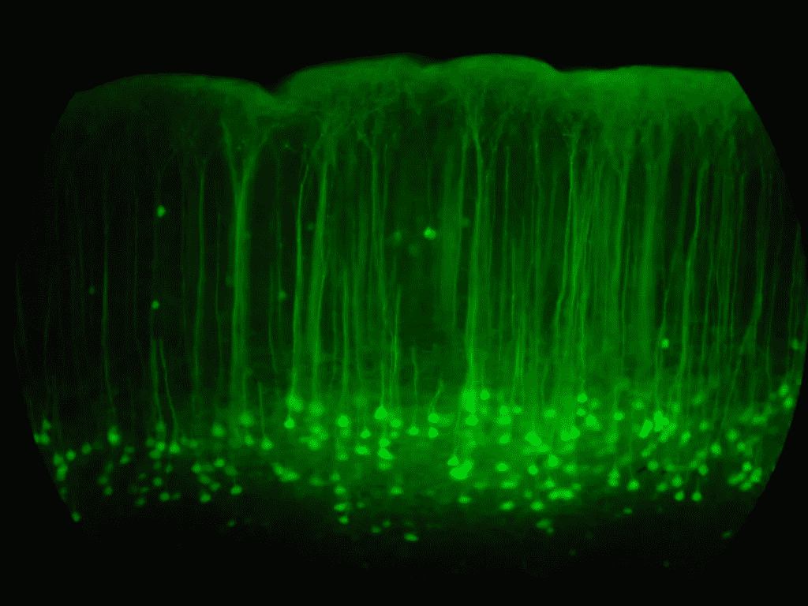

20X magnification of the somatosensory cortex (by [Robert Cudmore](https://www.flickr.com/photos/cudmore/5427064) — [CC BY-SA 2.0](https://creativecommons.org/licenses/by-sa/2.0/))

# 介绍

深度学习产品在行业内引起了越来越多的兴趣。虽然计算量很大，但在处理自然语言或图像处理等非结构化数据的分类方面，它们已被证明是有效的。

高价值数据科学产品的目标不仅在于其高价值交付，还在于其被业务接受。因此，可解释性仍然是一个重要因素。

Google Brain 最近发布了一篇[论文](https://arxiv.org/abs/1711.09784)，提议实现软决策树。

在这篇博客中，我从他们的论文中摘录了一些要点，并举例说明了神经网络是如何模仿树形结构的。

# 目标

1.  什么是数据科学中的决策树？
2.  神经网络怎么会有树状结构？
3.  在 TensorFlow 中实现软决策树

# 软决策树

## 树

为了不拘泥于形式，在数据科学中，树由三个主要成分组成:

*   分割条件
*   修剪条件
*   离开

分割条件将数据分割到叶子上。修剪条件决定了分区停止的时间。最后，也是最重要的，树叶包含预测的目标值，该值已被拟合到分区内的数据。

如图 1 所示，每个分割条件都是特性的函数。

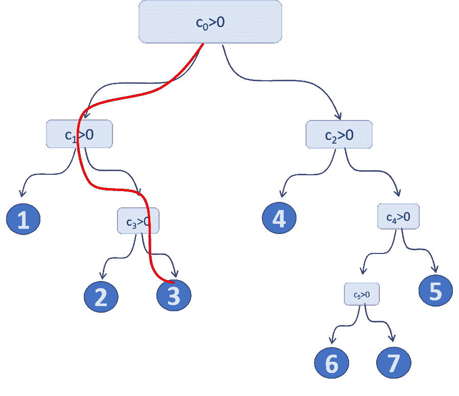

*Figure 1: Basic Tree. Each data-point travels through the tree until one of the leafs. The path is determined by the split conditions, which are functions of the features. The leafs determine the prediction target.*

每个内部节点中的分裂和叶子的目标输出由损失函数的优化来确定。为每个数据点分配一个预测成本。

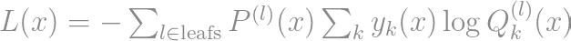

在哪里


是数据点 x 的目标

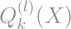

是叶的目标类的概率。我们还表示了叶选择器:

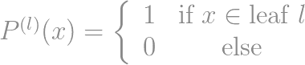

这个符号将在下一节中阐明。

## 神经网络

神经网络由一组对其输入特征的平滑操作组成。所谓平滑，我的意思是每个操作在其变量中是连续可微的。

可微性是一个至关重要的因素，因为最佳变量是使用损失和操作的梯度计算的。起初这似乎是个问题，如果我们想把树设计成树的每个内部节点，基于分割条件分配它的一个孩子的每个数据点。

因此，我们用神经网络构建树的第一步是通过允许数据在每次分裂时以一定的概率向左和向右移动来消除分裂条件。

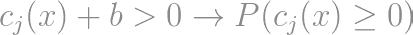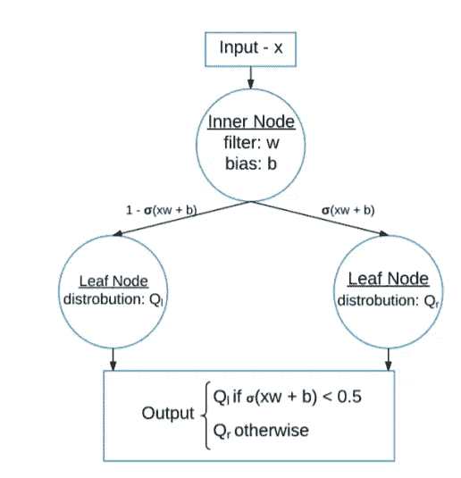

*Figure 2: The hard split-condition of the tree is replaced by split-probability.*

因此，每个数据点在树中没有唯一的路径。它们现在属于树的每一片叶子，具有一定的概率，即路径概率。

让我们表示从树根到第 n 个(内部)节点的路径概率，

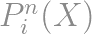

我们可以回顾一下我们之前写的损失函数，对于每个数据点 **x** :

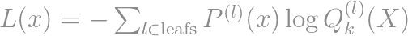

这只不过是对分类交叉熵的加权，

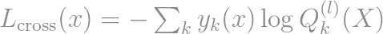

以 ***x*** 的概率属于一片树叶，这就是路径概率。

## 正规化

我们现在已经重写了分割条件。叶输出可以保持概率，例如 softmax。

最后一个问题仍然存在，但是，优化将收敛到一个适当的局部最小值？

内部节点权重的更新取决于损失的梯度，因此也取决于路径概率

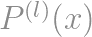

让我们仔细看看它在一些内部节点 j:

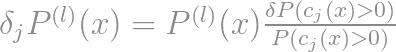

我们立即看到了这里的一个问题。如果某片叶子的概率

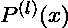

对于大量数据来说很小，那么权重在下一步中几乎不被更新。更有甚者，在这次更新之后，这种可能性仍然很小。因此，我们的模型可能会收敛并陷入这些无用的局部极小值。

一棵性能树不仅有最大纯度的叶子，而且在叶子上尽可能均匀地分布数据。如果我们的模型陷入这些局部极小值，我们就只能得到一些高度密集的叶子和许多稀疏的叶子。在这种情况下，我们失去了树的用处，我们最终得到一个逻辑回归模型的小集合。

谷歌大脑的团队提出了一个解决这个问题的方法，

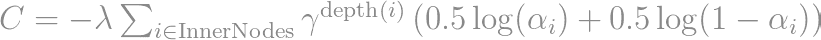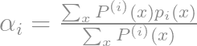

这种正则化有利于均匀的二进制分裂，并且不利于内部节点级别上的早期净化。衰减率 gamma 在树的早期内部节点中增加了重点。

现在一切都设置好了，我们可以讨论 TensorFlow 实现了。

# TensorFlow 实现

TensorFlow 是 Google Brain 的一个流行的开源软件库，主要用于深度学习模型的开发。用户在静态计算图上定义操作，并根据需要运行图的不同部分。

让我们用一些基本公式来总结不同的成分:

*   **拆分条件**

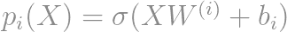

*   修剪条件:让我们坚持一个简单的最大深度
*   **叶片输出**

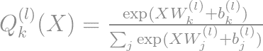

*   每个数据点 x 的**损失**

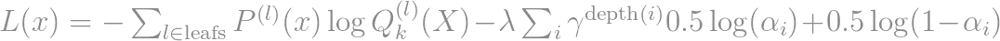

我们将工作分成三类:

*   **TreeProperties** :包含模型的所有超参数相关属性。
*   **节点**:定义所有节点级的操作，如内部节点转发如下所示的概率，叶子节点转发 softmax:


*   **软决策树**:为每个数据点建立所有的内节点、叶子并输出预测目标。

让我们仔细看看！

如第 3.2.2 节所示，超参数 **self.decay_penalty** 和**self . regularization _ penalty**分别对应于衰减率γ和权重λ。

下一节课更有趣。

在实例化时，我们定义节点分裂概率的权重和偏差。在构建节点时，我们首先转发节点的输出，要么是 softmax 预测概率，要么是内部节点分裂的概率。

损失也在节点级别上更新。内部节点仅通过前面描述的正则化来增加损失。

最后，所有的节点被组合成一棵树。目标的输出预测和节点的概率分布组合成**自输出**和**自叶分布**。

# 对 MNIST 进行测试

最后，让我们对 MNIST 进行一些测试。使用以下超参数构建树:

```
max_depth = 7
regularisation_penality=10.
decay_penality=0.9
```

并且选择训练批量为 32，验证批量为 256。我们得出以下结果:

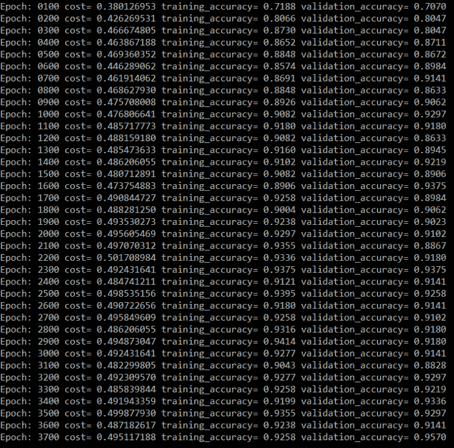

还不错。当然没有 CNN 那么有竞争力，但是我们看到了很多有前途的想法！

请务必查看[的完整实现](https://github.com/benoitdescamps/Neural-Tree)。

# 我写了更多精彩的东西！

@ [调整超参数(第一部分):successful halvin](/tuning-hyperparameters-part-i-successivehalving-c6c602865619)g

@[tensor flow 中的自定义优化器](https://www.kdnuggets.com/2018/01/custom-optimizer-tensorflow.html)

@[XGBOOST 回归预测区间](https://medium.com/bigdatarepublic/regression-prediction-intervals-with-xgboost-428e0a018b)