# 使用 Keras 构建深度学习模型

> 原文：<https://towardsdatascience.com/building-a-deep-learning-model-using-keras-1548ca149d37?source=collection_archive---------1----------------------->

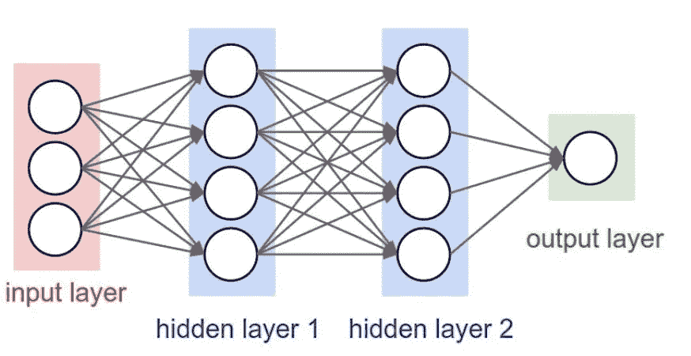

A Neural Network ([image credit](http://cs231n.github.io/neural-networks-1/))

深度学习是机器学习中越来越受欢迎的子集。深度学习模型是使用神经网络构建的。神经网络接受输入，然后使用训练期间调整的权重在隐藏层中处理这些输入。然后模型给出一个预测。调整权重以找到模式，从而做出更好的预测。用户不需要指定要寻找什么样的模式——神经网络会自己学习。

Keras 是一个用 Python 编写的用户友好的神经网络库。在本教程中，我将使用 Keras 检查两个深度学习模型:一个用于回归，一个用于分类。我们将建立一个回归模型来预测员工的每小时工资，我们将建立一个分类模型来预测患者是否患有糖尿病。

注意:我们将使用的数据集相对干净，因此我们不会执行任何数据预处理来为建模准备数据。您将在未来项目中使用的数据集可能不那么清晰-例如，它们可能会有缺失值-因此您可能需要使用数据预处理技术来改变您的数据集以获得更准确的结果。

## **读入训练数据**

对于我们的回归深度学习模型，第一步是读入我们将用作输入的数据。对于这个例子，我们使用的是“小时工资”数据集。首先，我们将使用 Pandas 读入数据。我不会详细介绍熊猫，但如果你想进一步深入数据科学和机器学习，这是一个你应该熟悉的库。

“df”代表数据帧。熊猫以数据帧的形式读入 csv 文件。“head()”函数将显示数据帧的前 5 行，以便您可以检查数据是否已正确读入，并初步了解数据的结构。

```
Import pandas as pd#read in data using pandas
train_df = pd.read_csv(‘data/hourly_wages_data.csv’)#check data has been read in properly
train_df.head()
```

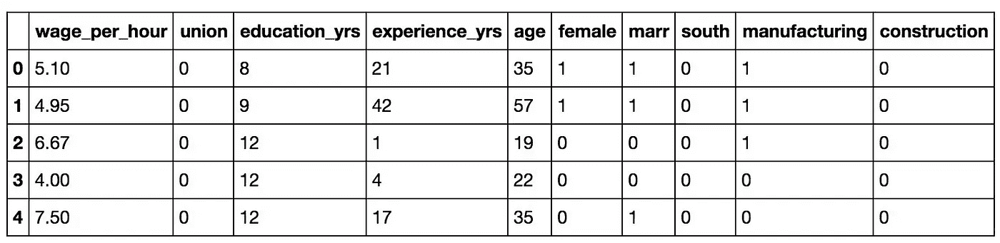

## 将数据集分成输入和目标

接下来，我们需要将数据集分成输入(train_X)和目标(train_y)。我们的输入将是除“每小时工资”之外的每一列，因为“每小时工资”是我们将试图预测的。因此，“每小时工资”将是我们的目标。

我们将使用 pandas 'drop '函数从数据帧中删除' wage_per_hour '列，并将其存储在变量' train_X '中。这将是我们的投入。

```
*#create a dataframe with all training data except the target column*
train_X = train_df.drop(columns=['wage_per_hour'])

*#check that the target variable has been removed*
train_X.head()
```

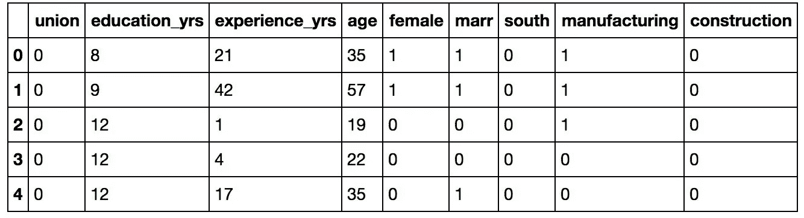

我们将在目标变量(train_y)中插入“每小时工资”列。

```
*#create a dataframe with only the target column*
train_y = train_df[['wage_per_hour']]

*#view dataframe*
train_y.head()
```

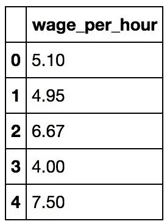

## 构建模型

接下来，我们必须建立模型。代码如下:

```
**from** **keras.models** **import** Sequential
**from** **keras.layers** **import** Dense*#create model*
model = Sequential()

*#get number of columns in training data*
n_cols = train_X.shape[1]

*#add model layers*
model.add(Dense(10, activation='relu', input_shape=(n_cols,)))
model.add(Dense(10, activation='relu'))
model.add(Dense(1))
```

我们将使用的模型类型是顺序的。顺序是在 Keras 中建立模型的最简单的方法。它允许你一层一层地建立模型。每一层都有与其下一层相对应的权重。

我们使用“add()”函数向模型中添加层。我们将添加两个层和一个输出层。

“密集”是图层类型。密集是适用于大多数情况的标准图层类型。在密集层中，前一层中的所有节点都连接到当前层中的节点。

我们在每个输入层中有 10 个节点。这个数字也可以是数百或数千。增加每层中的节点数量会增加模型容量。稍后，我将进一步详细介绍增加模型容量的效果。

“激活”是该层的激活功能。激活函数允许模型考虑非线性关系。例如，如果你预测病人患糖尿病，从 10 岁到 11 岁和从 60 岁到 61 岁是不同的。

我们将使用的激活函数是 ReLU 或整流线性激活。虽然它是两个线性部分，但已被证明在神经网络中工作良好。


ReLU Activation Function ([image credit](https://www.researchgate.net/figure/ReLU-activation-function_fig3_319235847))

第一层需要一个输入形状。输入形状指定输入中的行数和列数。输入中的列数存储在' n_cols '中。逗号后面没有任何东西表示可以有任意数量的行。

最后一层是输出层。它只有一个节点，是给我们预测的。

## 编译模型

接下来，我们需要编译我们的模型。编译模型需要两个参数:optimizer 和 loss。

优化器控制学习速率。我们将使用“亚当”作为我们的优化器。在许多情况下，Adam 通常是一个很好的优化器。adam 优化器在整个训练过程中调整学习率。

学习率决定了计算模型最佳权重的速度。较小的学习率可能会导致更准确的权重(直到某一点)，但计算权重所需的时间会更长。

对于我们的损失函数，我们将使用‘均方误差’。它是通过计算预测值和实际值之间的平均平方差来计算的。对于回归问题，这是一个流行的损失函数。这个值越接近 0，模型的表现就越好。

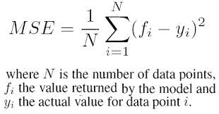

Mean Squared Error ([image credit](https://www.researchgate.net/figure/Mean-Squared-Error-formula-used-to-evaluate-the-user-model_fig1_221515860))

```
*#compile model using mse as a measure of model performance*
model.compile(optimizer='adam', loss='mean_squared_error')
```

## 训练模型

现在我们将训练我们的模型。为了训练，我们将在我们的模型上使用具有以下五个参数的‘fit()’函数:训练数据(train_X)、目标数据(train_y)、验证分割、历元和回调的数量。

验证分割将随机分割数据用于训练和测试。在训练期间，我们将能够看到验证损失，它给出了我们的模型在验证集上的均方误差。我们将验证分割设置为 0.2，这意味着我们在模型中提供的 20%的训练数据将被留出用于测试模型性能。

历元数是模型在数据中循环的次数。在一定程度上，我们运行的时代越多，模型就会改进得越多。此后，模型将在每个时期停止改进。此外，纪元越多，模型运行的时间就越长。为了对此进行监控，我们将使用“提前停止”。

如果模型停止改进，提前停止将在达到时期数之前停止模型的训练。我们将我们的提前停止监视器设置为 3。这意味着在连续 3 个时期模型没有改善之后，训练将停止。有时，验证损失可以停止改善，然后在下一个时期改善，但是在验证损失没有改善的 3 个时期之后，它通常不会再次改善。

```
**from** **keras.callbacks** **import** EarlyStopping*#set early stopping monitor so the model stops training when it won't improve anymore*
early_stopping_monitor = EarlyStopping(patience=3)*#train model*
model.fit(train_X, train_y, validation_split=0.2, epochs=30, callbacks=[early_stopping_monitor])
```

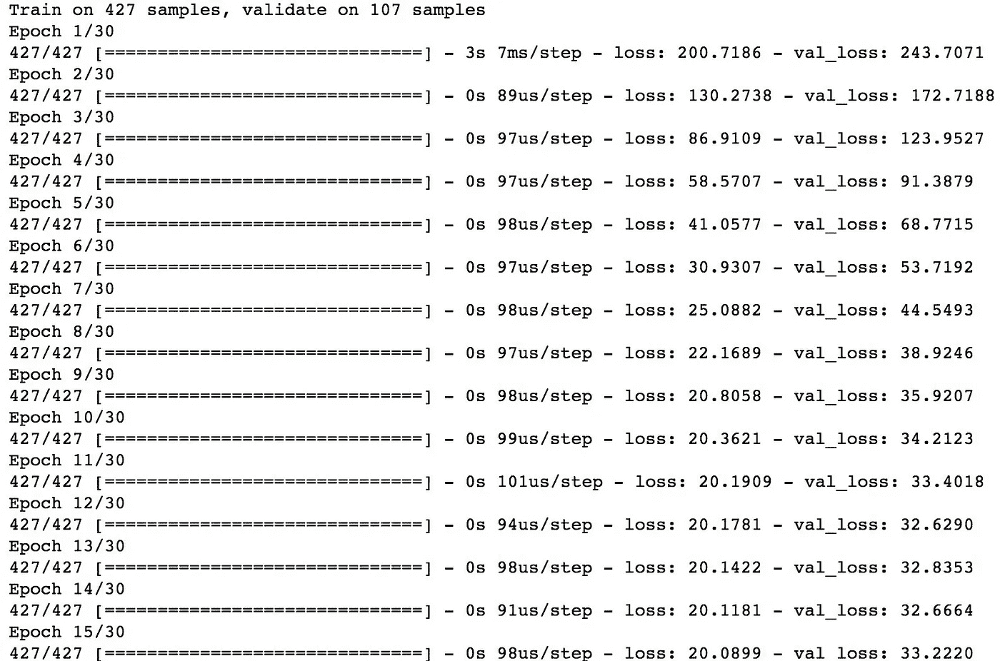

## 根据新数据做出预测

如果您想使用这个模型对新数据进行预测，我们可以使用' predict()'函数，传入我们的新数据。输出将是“每小时工资”预测。

```
#example on how to use our newly trained model on how to make predictions on unseen data (we will pretend our new data is saved in a dataframe called 'test_X').test_y_predictions = model.predict(test_X)
```

恭喜你。你在 Keras 建立了深度学习模型！它还不是非常准确，但可以通过使用大量的训练数据和“模型容量”来改善。

## 模型容量

随着模型中节点和层数的增加，模型容量也会增加。增加模型容量可以产生更精确的模型，直到某个点，在该点模型将停止改进。通常，您提供的训练数据越多，模型就应该越大。我们只使用了极少量的数据，所以我们的模型非常小。模型越大，需要的计算能力就越大，训练的时间也就越长。

让我们使用与先前模型相同的训练数据创建一个新模型。这次，我们将添加一层，并将每层中的节点增加到 200 个。我们将训练模型，看看增加模型容量是否会提高我们的验证分数。

```
*#training a new model on the same data to show the effect of increasing model capacity*

*#create model*
model_mc = Sequential()

*#add model layers*
model_mc.add(Dense(200, activation='relu', input_shape=(n_cols,)))
model_mc.add(Dense(200, activation='relu'))
model_mc.add(Dense(200, activation='relu'))
model_mc.add(Dense(1))

*#compile model using mse as a measure of model performance*
model_mc.compile(optimizer='adam', loss='mean_squared_error')*#train model*
model_mc.fit(train_X, train_y, validation_split=0.2, epochs=30, callbacks=[early_stopping_monitor])
```

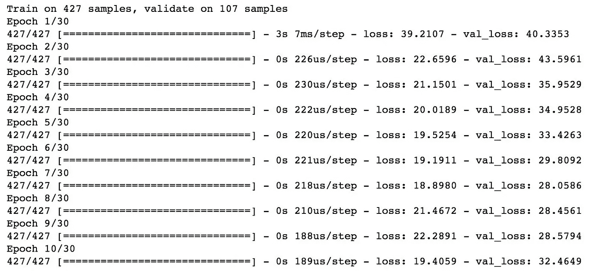

我们可以看到，通过增加模型容量，我们已经将验证损失从旧模型中的 32.63 提高到新模型中的 28.06。

## 分类模型

现在让我们继续构建我们的分类模型。由于许多步骤都是以前模型的重复，我将只讨论新概念。

对于下一个模型，我们将预测患者是否患有糖尿病。

```
*#read in training data*
train_df_2 = pd.read_csv('documents/data/diabetes_data.csv')

*#view data structure*
train_df_2.head()
```

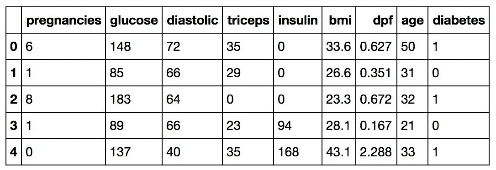

```
*#create a dataframe with all training data except the target column*
train_X_2 = train_df_2.drop(columns=['diabetes'])

*#check that the target variable has been removed*
train_X_2.head()
```

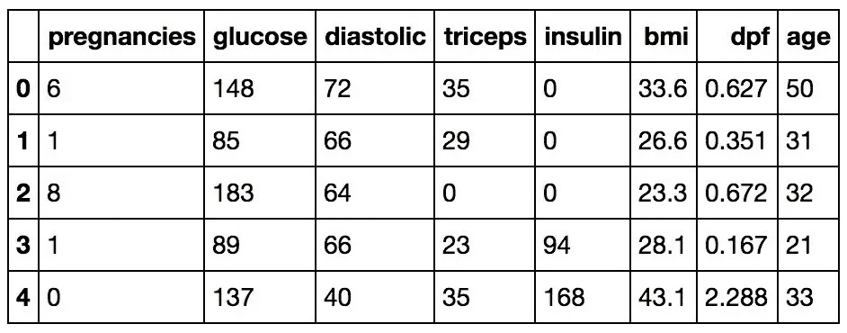

在分离目标列时，我们需要调用“to _ categorical()”函数，以便对列进行“一键编码”。目前，没有糖尿病的患者在糖尿病列中用 0 表示，而有糖尿病的患者用 1 表示。对于一键编码，整数将被删除，每个类别将输入一个二进制变量。在我们的情况下，我们有两个类别:没有糖尿病和糖尿病。没有糖尿病的患者将由[1 0]表示，患有糖尿病的患者将由[0 1]表示。

```
**from** **keras.utils** **import** to_categorical*#one-hot encode target column*
train_y_2 = to_categorical(train_df_2.diabetes)

*#vcheck that target column has been converted*
train_y_2[0:5]
```

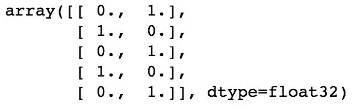

```
*#create model*
model_2 = Sequential()

*#get number of columns in training data*
n_cols_2 = train_X_2.shape[1]

*#add layers to model*
model_2.add(Dense(250, activation='relu', input_shape=(n_cols_2,)))
model_2.add(Dense(250, activation='relu'))
model_2.add(Dense(250, activation='relu'))
model_2.add(Dense(2, activation='softmax'))
```

我们模型的最后一层有两个节点——每个节点对应一个选项:患者有糖尿病或没有糖尿病。

激活是“softmax”。Softmax 使输出总和达到 1，因此输出可以解释为概率。然后，该模型将根据哪个选项的概率更高来进行预测。

```
*#compile model using accuracy to measure model performance*
model_2.compile(optimizer='adam', loss='categorical_crossentropy', metrics=['accuracy'])
```

我们将使用‘分类交叉熵’作为损失函数。这是最常见的分类选择。分数越低，表示模型的性能越好。

为了使事情更容易解释，我们将使用“准确性”度量来查看每个时期结束时验证集的准确性分数。

```
*#train model*
model_2.fit(X_2, target, epochs=30, validation_split=0.2, callbacks=[early_stopping_monitor])
```

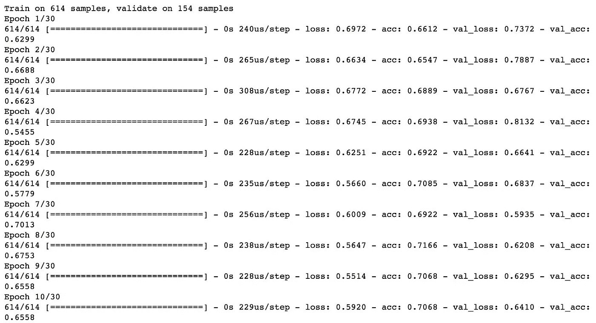

恭喜你。你现在正在 Keras 中构建令人惊叹的深度学习模型！

感谢阅读！本教程的 github 库可以在[这里](https://github.com/eijaz1/Deep-Learning-in-Keras-Tutorial)找到。