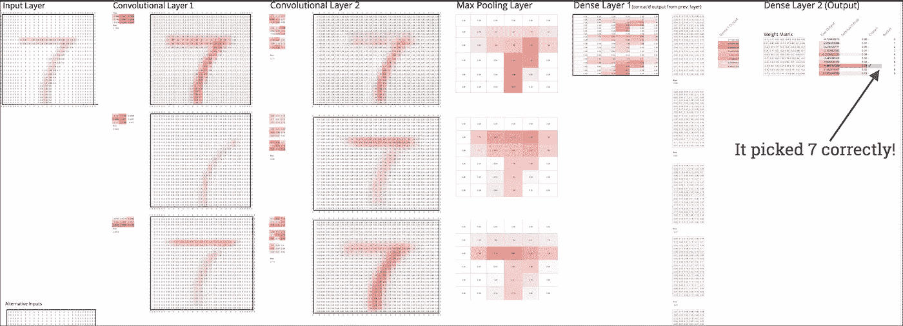
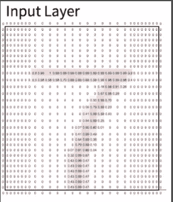
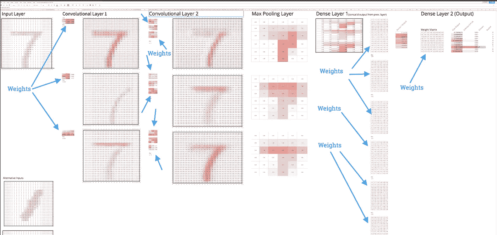
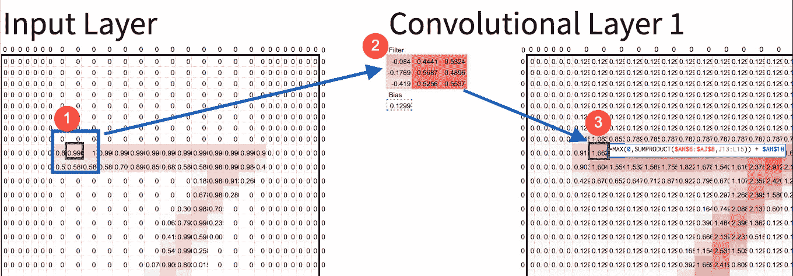
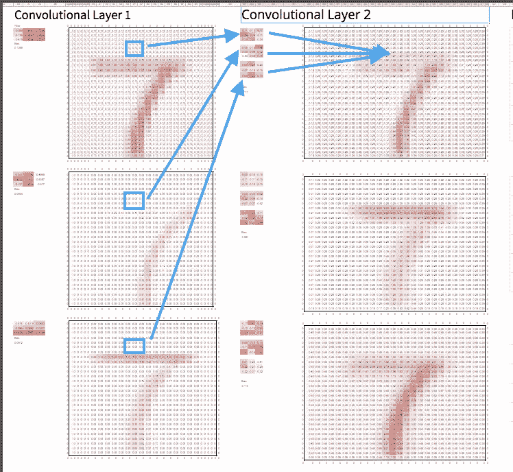
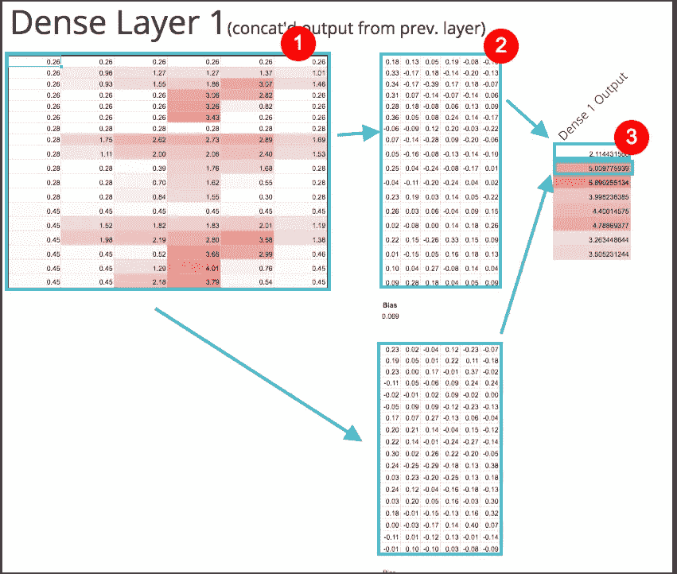

# 在 Google Sheets 中构建深度神经网络

> 原文：<https://towardsdatascience.com/building-a-deep-neural-net-in-google-sheets-49cdaf466da0?source=collection_archive---------2----------------------->

我想告诉你深度卷积神经网络并不像听起来那么可怕。我将通过展示我在 Google Sheets 中制作的一个实现来证明这一点。这里有[这里有](https://docs.google.com/spreadsheets/d/1SwfVctd4TjdN2S8BL09ktpQN_41sARYzD3NEHyr-8Z0/edit?usp=sharing)。复制它(使用左上方的*文件→制作副本*选项)，然后你可以摆弄它，看看不同的杠杆如何影响模型的预测。

本文的其余部分将是一个简短的介绍，以了解卷积神经网络(CNN)背后的高级直觉，然后是一些推荐的资源以获得更多信息。

在继续之前，我想对 [FastAI](http://www.fast.ai/) 大声疾呼。我最近完成了他们精彩的[深度学习课程](http://course.fast.ai/index.html)，所有的灵感和功劳真的都归于他们。出色的讲师[杰瑞米·霍华德](https://medium.com/u/34ab754f8c5e?source=post_page-----49cdaf466da0--------------------------------)和他的联合创始人[雷切尔·托马斯](https://medium.com/u/ee56d0bac1b7?source=post_page-----49cdaf466da0--------------------------------)向全班展示了在 Excel 中制作 CNN 的想法。但据我所知，该电子表格无法在网上获得，也似乎没有完全完成网络。我正在对他们的工作做一个小小的扩展，并把它放在 Google Sheets 上，这样每个人都可以更容易地玩。

# 我是怎么造出来的？

我在 [MNIST](https://en.wikipedia.org/wiki/MNIST_database) 数据集上训练了一个(非常)简单的 CNN，这是一堆手写数字的黑白图像。每个图像是 28x28 像素。每个像素被表示为一个介于 0(无油墨)和 1(最大油墨)之间的数字。这是一个可以使用的经典数据集，因为它足够小，足够快，但又足够真实，可以显示机器学习的复杂性。模型的工作是确定图像的编号。每个图像总是恰好是一个数字 0-9。

Example image from MNIST. 28x28 pixels. Note: I added conditional formatting in Sheets so pixels with more “ink” show up more red.

我使用一个名为 [Keras](https://keras.io/) 的流行深度学习库来训练这个模型(参见这里的代码)，然后将我的模型中训练好的权重放入工作表中。训练出来的权重只是数字。把它放到表中，这意味着从我的模型中复制并粘贴一堆数字到表中。最后一步是添加公式来复制模型所做的事情，这只是常规的乘法和加法。让我重申一下:*复制深度学习模型预测的数学止于乘法和加法* [1]。

模型的每一层都有权重(也称为“参数”)。任何机器学习模型都会自动学习权重。这个模型大约有 1000 个砝码。更复杂的模型可以轻松拥有数亿个。您可以在下面看到该型号的所有 1000 个重量:

# 何时使用卷积神经网络？

你使用 CNN 在*序列*数据中寻找模式，在这些数据中你有非常肯定的模式存在，但是你发现很难将这些模式用语言表达出来，或者通过简单的规则提取出来。**美国有线电视新闻网认为秩序很重要。**

例如，对图片进行分类是 CNN 的主要用例，因为像素在逻辑上是连续的，任何人都很清楚有大量的模式。然而，只要试着把猫和吉娃娃的确切区别用语言表达出来，你就会明白为什么 CNN 是有用的。

另一方面，如果你有两支球队之间的最新棒球统计数据，并且你想预测获胜者，那么 CNN 将是一个奇怪的选择。你所拥有的数据(例如赢的次数，输的次数，或者球队的平均击球率)本质上并不是连续的。顺序在那里并不重要，我们已经提取了我们认为有用的模式。所以 CNN 的不会有帮助。

# CNN 背后的直觉

为了理解这些野兽，让我们把深度卷积神经网络分解成它的组成部分“深度”、“卷积”和“神经网络”。

## 回旋

想象一下你是盲人。但是你的工作是找出这个手写图像是什么数字。你可以和看到图像的人说话，但是他们不知道数字是什么。所以你只能问他们简单的问题。你能做什么？

你可以采取的一种方法是问这样的问题，“它在顶部是不是大部分都是直的？”，“对角线从右到左？”等。有了足够多这样的问题，你实际上可以很好地猜测它是 7，或者 2，或者其他什么。

直觉上，这就是卷积的作用。计算机是盲目的，所以它做它能做的，并且问许多小的模式问题。

Box 1 is multiplied by box 2\. Sum the result, and you get box 3\. That’s a convolution.

要问这些问题，图像中的每个像素都要通过一个函数(也称为“卷积”)来产生相应的像素，从而回答这些小模式问题中的一个。**卷积使用过滤器来寻找模式**。例如，请注意上面的滤镜(截图中的 2 号)如何在右侧变得更红，而在左侧变得更少。该过滤器将主要寻找左边缘。

为什么它会找到左边界可能不太明显，但是[摆弄一下电子表格](https://docs.google.com/spreadsheets/d/1SwfVctd4TjdN2S8BL09ktpQN_41sARYzD3NEHyr-8Z0/edit?usp=sharing)，你会亲眼看到数学是如何计算出来的。**滤镜发现看起来像自己的东西**。CNN 通常会使用数百个过滤器，所以你会得到每个像素的许多小“分数”，有点像左边缘分数、上边缘分数、对角线、角等。

## 深的

好吧，问边很酷，但是更复杂的形状呢？这就是“深层”多层事物出现的地方。因为现在我们已经有了图像的“左边缘”、“上边缘”和其他简单的“过滤器”，我们可以添加另一个层，并在*所有先前的过滤器上运行卷积，并组合它们！因此，结合 50/50 的左边缘和上边缘可以给你一个圆角。很酷吧。*

The second convolution takes corresponding pixels from the previous convolution layer and multiplies each by it’s own filter. Just like before, we sum the result, and that produces a new corresponding pixel for the second convolution layer.

严肃的 CNN 将会有许多层，这允许模型建立越来越抽象和复杂的形状。甚至在仅仅 4 或 5 层之后，你的模型就可以开始发现脸、动物和各种有意义的形状。

## 神经网络

现在，您可能会问自己，“这一切都很好，但要想出所有正确的过滤器听起来真的很乏味。”“最后呢？我如何将这些过滤器中的所有答案组合成有用的东西？”。

首先，有必要认识到，在高层次上，我们的 CNN 实际上有两个“部分”。第一部分，卷积，为我们在图像数据中找到有用的特征。第二部分，电子表格末尾的“密集”层(如此命名是因为每个神经元都有如此多的权重),为我们进行分类。一旦你有了这些特征，密集层实际上与运行一系列线性回归并将它们组合成每个可能数字的分数没有什么不同。最高分是模特的猜测。

Matrix 1 is the output from our convolutions. Then every pixel from matrix 1 is multiplied by a corresponding number in matrix 2 . The summation of that produces number 3\. You repeat that process again for the boxes in green. You end up with 8 outputs, or “neurons” in deep learning jargon.

计算出所有正确的权重用于过滤器和最后的密集层将是非常烦人的。幸运的是，自动计算这些权重是神经网络的全部内容，所以我们不需要担心这个。但如果你很好奇，你应该谷歌一下“反向传播”。

# 摘要

每个 CNN 大致有两个部分。卷积总是在开始时寻找图像中有用的特征，最后的层通常称为“密集”层，根据这些特征对事物进行分类。

为了对它们有一个真实的感受，我会鼓励你去玩电子表格。从头到尾跟踪一个像素。弄乱过滤器，看看会发生什么。我还在电子表格的注释中解释了更多的技术细节。

## 资源

要了解更多信息，我推荐以下资源:

[交互式卷积](http://setosa.io/ev/image-kernels/)——一个关于卷积的杀手级交互式教程(即只有 C 部分，没有 NN 部分)作者维克多·鲍威尔。

[程序员实用深度学习](http://course.fast.ai/) —来自 Fast 的课程。我参加了 AI，并从中学到了很多。它是在线的，而且完全免费。

展示 CNN 基础知识的精彩视频 —这是来自杰瑞米·霍华德(FastAI 创始人)的一段 20 分钟的视频。太棒了。视频嵌入在该页面中。从打开视频的第 21 分钟开始。

## 笔记

[1]—*训练*CNN 所需的数学包括微积分，所以它可以自动调整权重。但是一旦模型被训练，它实际上只需要乘法和加法来做预测。实际上，微积分是由你正在使用的深度学习库来处理的。