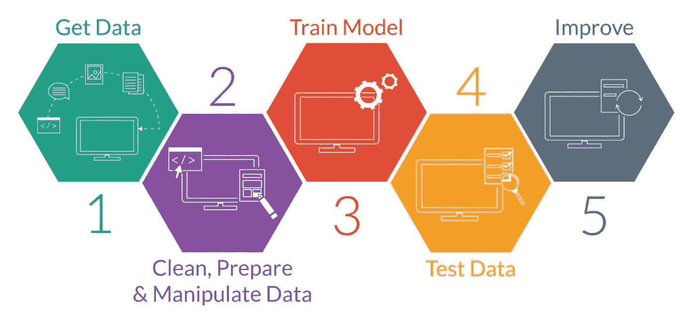
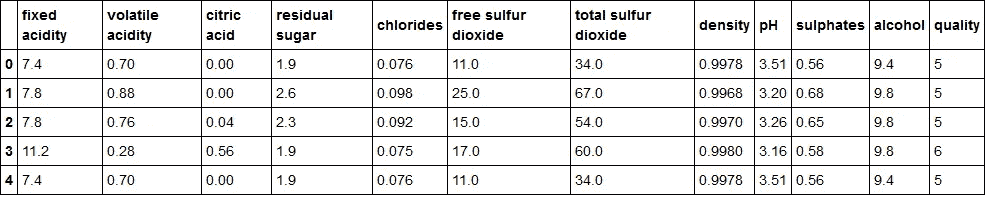
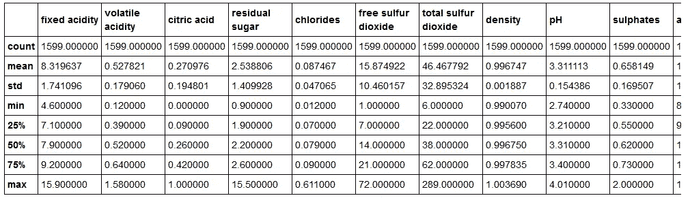
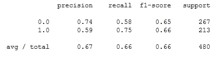
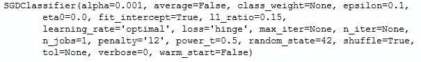
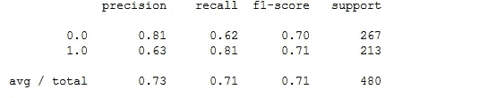

# 用 Python 构建可部署的 ML 分类器

> 原文：<https://towardsdatascience.com/building-a-deployable-ml-classifier-in-python-46ba55e1d720?source=collection_archive---------4----------------------->


如今，由于问题的复杂性和大量的相关数据，机器学习已经完全成为寻找问题解决方案的必要、有效和高效的方法。在大多数资源中，机器学习模型是在结构化数据中开发的，只是为了检查模型的准确性。但是，在开发机器学习模型时，实时的一些主要要求是在构建模型、模型中的参数调整以及将模型保存到文件系统以供以后使用或部署时处理不平衡的数据。在这里，我们将看到如何用 python 设计一个二进制分类器，同时处理上面指定的所有三个需求。

在开发机器学习模型时，我们通常会将所有的创新放在标准的工作流程中。涉及的一些步骤是获取数据，对数据进行特征工程，通过迭代训练和测试建立具有适当参数的模型，并在生产中部署建立的模型。



Machine Learning Work Flow

我们将通过构建一个二元分类器来完成这个工作流程，该分类器根据可用的特征来预测红酒的质量。[数据集在 UCI 机器学习库中公开。](https://archive.ics.uci.edu/ml/datasets/wine+quality) Scikit 学习库在这里用于分类器设计。对于源代码， [github](https://github.com/sambit9238/Machine-Learning/blob/master/WineQuality.ipynb) 链接是-

[](https://github.com/sambit9238/Machine-Learning/blob/master/WineQuality.ipynb) [## sambit 9238/机器学习

### 机器学习——它代表了机器学习在不同场景中的一些实现。

github.com](https://github.com/sambit9238/Machine-Learning/blob/master/WineQuality.ipynb) 

首先，我们需要导入所有必要的依赖项并加载数据集。在任何 ml 模型设计中，我们总是需要 numpy 和 pandas，因为它们都涉及到数据帧、矩阵和数组操作。

```
import numpy as np
import pandas as pd
df = pd.read_csv("winequality-red.csv")
df.head()
```

数据集看起来像-



从这里可以看出，质量是用数字 3 到 8 来表示的。为了使它成为二进制分类问题，让我们把质量> 5 看作是好的，否则就是坏的。

```
df["quality_bin"] = np.zeros(df.shape[0])
df["quality_bin"] = df["quality_bin"].where(df["quality"]>=6, 1)
#1 means good quality and 0 means bad quality
```

来获得数据描述的摘要—

```
df.describe()
```



从快照中可以看出，数据值在某些属性上有很大偏差。将这些值标准化是一个很好的做法，因为这将使差异达到一个合理的水平。此外，由于大多数算法在背景中使用欧几里德距离，因此在模型建立中具有缩放特征更好。

```
from sklearn.preprocessing import StandardScaler
X_data = df.iloc[:,:11].values
y_data = df.iloc[:,12].values
scaler = StandardScaler()
X_data = scaler.fit_transform(X_data)
```

这里使用了 fit_transform，这样标准缩放器将适合 X_data 并转换 X_data。如果你需要在两个不同的数据集上进行拟合和变换，你也可以分别调用拟合和变换函数。现在，我们总共有 1599 个数据实例，其中 855 个质量差，744 个质量好。这里的数据显然是不平衡的。因为数据实例的数量较少，所以我们将进行过采样。 ***但是需要注意的是，重采样应该总是只在训练数据上进行，而不是在测试/验证数据上*。**现在，让我们将数据集分为训练数据集和测试数据集进行建模。

```
from sklearn.cross_validation import train_test_split
X_train, X_test, y_train, y_test = train_test_split(X_data, y_data, test_size=0.3, random_state=42) 
#so that 30% will be selected for testing data randomly
```

除了训练和测试分割，你还可以采用被认为是更有效的交叉验证方法。现在我们有 588 个质量差的和 531 个质量好的实例用于训练。剩下 267 个质量差的和 213 个质量好的测试实例。是时候对训练数据进行重新采样，以便平衡数据，使模型不会有偏差。这里我们将使用 SMOTE 算法进行过采样。

```
from imblearn.over_sampling import SMOTE
#resampling need to be done on training dataset only
X_train_res, y_train_res = SMOTE().fit_sample(X_train, y_train)
```

经过过采样后，在训练集中有 588 个好的和坏的葡萄酒样本。现在是选择模型的时候了。我在这里采用了随机梯度分类器。但是，你现在可以检查几个模型并比较它们的准确性来选择合适的。

```
from sklearn.linear_model import SGDClassifier
sg = SGDClassifier(random_state=42)
sg.fit(X_train_res,y_train_res)
pred = sg.predict(X_test)
from sklearn.metrics import classification_report,accuracy_score
print(classification_report(y_test, pred))
print(accuracy_score(y_test, pred))
```

结果看起来像-



Classification Report

得到的准确率为 65.625%。学习率、损失函数等参数。在模型的性能中起主要作用。使用 GridSearchCV 可以有效地为模型选择最佳参数。

```
#parameter tuning 
from sklearn.model_selection import GridSearchCV
#model
model = SGDClassifier(random_state=42)
#parameters
params = {'loss': ["hinge", "log", "perceptron"],
          'alpha':[0.001, 0.0001, 0.00001]}
#carrying out grid search
clf = GridSearchCV(model, params)
clf.fit(X_train_res, y_train_res)
#the selected parameters by grid search
print(clf.best_estimator_)
```



Best Parameters for the Classifier

正如这里可以看到的，这里只提供了损失函数和 alpha，用于寻找最佳选项。其他参数也可以这样做。损失函数的最佳选项似乎是“铰链”红外线性 SVM，α值似乎是 0.001。现在，我们将使用网格搜索选择的最佳参数建立一个模型。

```
#final model by taking suitable parameters
clf = SGDClassifier(random_state=42, loss="hinge", alpha=0.001)
clf.fit(X_train_res, y_train_res)
pred = clf.predict(X_test)
```

现在，我们选择了模型，调整了参数，因此是时候在部署之前验证模型了。

```
print(classification_report(y_test, pred))
print(accuracy_score(y_test, pred))
```



Classification Report

从这里可以看出，调整参数后，指标值提高了 2–3%。准确率也从 65.625%提高到了 70.625%。如果你仍然对这个模型不满意，你也可以通过一些训练和测试迭代来尝试其他算法。现在，既然模型已经构建好了，就需要将它保存到文件系统中，以便以后使用或部署到其他地方。

```
from sklearn.externals import joblib
joblib.dump(clf, "wine_quality_clf.pkl")
```

当您需要分类器时，可以使用 joblib 简单地加载它，然后传递特征数组以获得结果。

```
clf1 = joblib.load("wine_quality_clf.pkl")
clf1.predict([X_test[0]])
```

恭喜你。现在你已经准备好设计一个可部署的机器学习模型了。:-D

参考资料:-

[](https://www.cs.cmu.edu/afs/cs/project/jair/pub/volume16/chawla02a-html/node6.html) [## 重击

### 重击

SMOTEwww.cs.cmu.edu](https://www.cs.cmu.edu/afs/cs/project/jair/pub/volume16/chawla02a-html/node6.html) [](http://scikit-learn.org/stable/modules/grid_search.html) [## 3.2.调整估计器的超参数-sci kit-了解 0.19.1 文档

### 请注意，这些参数的一个小子集通常会对预测或计算产生很大影响…

scikit-learn.org](http://scikit-learn.org/stable/modules/grid_search.html) [](http://scikit-learn.org/stable/auto_examples/preprocessing/plot_scaling_importance.html) [## 功能缩放的重要性-sci kit-了解 0.19.1 文档

### 通过标准化(或 Z 分数标准化)进行特征缩放对于许多应用程序来说是一个重要的预处理步骤

scikit-learn.org](http://scikit-learn.org/stable/auto_examples/preprocessing/plot_scaling_importance.html)