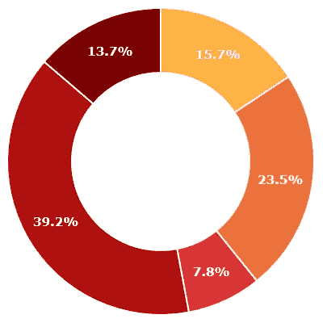

# 用 D3.js 和 Svidget.js 构建圆环图小部件

> 原文：<https://towardsdatascience.com/building-a-donut-chart-widget-with-d3-js-and-svidget-js-8c150ccb01ae?source=collection_archive---------1----------------------->

D3.js 是一个非常著名和受人尊敬的 JavaScript 库，可以让你创建复杂的数据可视化，比如图表和图形。它已经成为 web 数据可视化的同义词。 [Svidget.js](http://www.svidget.com) 是一个 JavaScript 框架，允许您在纯 SVG 中创建数据可视化小部件。从表面上看，这两个公司似乎是在相互竞争，但实际上恰恰相反。通过使用 D3 来输出一些惊人的数据可视化，并使用 Svidget.js 来简化部署和重用的包装，我们可以创建非常棒的可视化组件，可以轻松地嵌入到任何地方。简单来说，Svidget 就是汉堡小圆面包，D3 就是肉饼。

首先，让我们从小部件的角度考虑一个圆环图。它的属性或参数是什么？我们可以调用什么动作或方法？小部件会触发什么事件？Svidget 小部件由 3 个构件组成— **参数**、**动作**和**事件**。定义这些工件是*widget 化*的第一步。(关于构建小部件的完整介绍，包括这些概念，可以在 svidget.com 上找到。)

三者中最难的是计算参数。为了获得一些灵感，我们可以看看现有的实现，如[charist . js](http://gionkunz.github.io/chartist-js/api-documentation.html#chartistpie-declaration-defaultoptions)或 [Google Charts](https://developers.google.com/chart/interactive/docs/gallery/piechart#configuration-options) 。请记住，我们通常不想提供所有类型的配置，而是提供一个很好的抽象概念，让消费者快速启动并运行。根据最初的发现，我想出了:

*   数据—小部件的数据，以数组形式表示
*   maxSlices —将剩余数据分组到“其他”切片之前的最大切片数
*   开始角度—图表开始的角度，以度为单位，通常为 0 度
*   排序—如何对图表进行排序:“无”、“asc”或“desc”
*   颜色—为切片着色的颜色数组
*   宽度-圆环的宽度(终点-起点半径)

注意:最终的小部件可能还包含样式参数，我们将在后面介绍。

对于小部件操作，图表几乎不需要暴露什么。图表相对被动。但是出于演示的目的，让我们添加一个名为 animate 的动作，它将强制图表在被调用时自动显示。(第一次加载图表时会播放相同的动画。)

对于小部件事件，有两个有用的事件——一个是选择事件，它告诉我们何时通过鼠标悬停(或在移动设备上点击)选择了切片或片段；另一个是激活事件，它告诉我们用户何时点击了切片(在移动设备上，他们将点击以选择，然后再次点击以激活)。

既然我们已经弄清楚了所有的小部件工件，让我们把它们放在一起。在 Svidget 中，您可以在 SVG 中用 XML 声明性地定义所有这些内容。有关这方面的更多信息，请从 GitHub repo 下载 [svidget.xsd](https://github.com/joeax/svidget/blob/master/svidget.xsd) 模式。综上所述，小部件 SVG 最初看起来如下:

```
<svg ae kl" href="http://www.w3.org/2000/svg" rel="noopener ugc nofollow" target="_blank">http://www.w3.org/2000/svg"
  xmlns:svidget="[http://www.svidget.org/svidget](http://www.svidget.org/svidget)" 
  width="400" height="400" viewBox="0 0 400 400" svidget:version="0.3.4"><svidget:params>
  <svidget:param name="data" />
  <svidget:param name="maxSlices" />
  <svidget:param name="startAngle" />
  <svidget:param name="sort" />
  <svidget:param name="colors" />
  <svidget:param name="width" />
</svidget:params><svidget:actions>
  <svidget:action name="animate" binding="animate">
    <svidget:actionparam name="duration" type="number" />
  </svidget:action>
</svidget:actions><svidget:events>
  <svidget:event name="sliceSelect" />
  <svidget:event name="sliceActivate" />
</svidget:events>
```

接下来，让我们布局我们的 SVG。这只是一个框架，D3 会处理剩下的部分。

```
<g id="chart" transform="translate(200 200)"></g>
```

最后，让我们对肉进行编码——使用 D3 填充甜甜圈图。

```
// set up
var outerRadius = CHART_RADIUS;
var innerRadius = outerRadius — _width;
var widget = svidget.$; // get an instance to the current widget// params
// note: data in form of [['Item 1', 3], ['Item 2', 6]]
var data = widget.param('data').value();
var startAngle = widget.param('startAngle').value();
var sort = widget.param('sort').value();
var colors = widget.param('colors').value();// colors
var colorRange = d3.scale.ordinal().range(colors);// pie layout — for layout out arcs as a pie/donut chart
var pie = d3.layout.pie()
 .startAngle(toRadians(startAngle))
 .endAngle(toRadians(startAngle + 360))
 .sort(sortDataFunc(sort))
 .value(function(d) { 
   return numIt(d[1]); /* second element in data inner array */ 
 });// the main arc object
var arc = d3.svg.arc()
 .outerRadius(outerRadius)
 .innerRadius(innerRadius);// create chart and slices
var chart = d3.select('#chart');
var slices = chart.selectAll('.slice')
 .data(pie(data))
 .enter()
 .append('g');
var paths = slices.append('path');// draw slices
paths.attr('stroke', '#fff')
 .attr('stroke-width', 2)
 .attr('d', arc)
 .style('fill', function(d, i) { 
   return colorRange(i); 
 });// draw labels
slices.append('text')
 .attr('dy', '.35em')
 .style('text-anchor', 'middle')
 .attr('transform', function(d) { 
   return 'translate(' + arc.centroid(d) + ')'; 
 })
 .text(function(d) { 
   d.data[0]; // d.data == ['Label', 0]
 });
```

既然我们的 donutChart.svg 小部件文件已经完成并准备就绪，在网站上嵌入就变得容易了。只需使用 HTML 标签，传递您想要的参数值:

```
<object id="donutChart" role="svidget" data="path/to/donutChart.svg" type="image/svg+xml" width="400" height="400">
  <param name="data" value="[['banana', 7], ['apple', 6], ['cherry', 2], ['orange', 10], ['grape', 3.5]]" />
  <param name="maxSlices" value="-1" />
  <param name="startAngle" value="0" />
  <param name="sort" value="none" />
  <param name="colors" value="['#ffb244','#ed723c','#da3333','#b01111','#7a0000']" />
  <param name="width" value="60" />
</object>
```

最后的结果是:



The resulting donut chart

完整的工作示例代码可以在这里找到[。](http://www.svidget.com/examples/donutchart)

虽然我们使用 D3 创建了一个圆环图小部件，但是它的使用潜力远远超过了图表。事实是，像 Chartist 这样的图书馆做图表做得非常好。我们可以将 Chartist 图表包装成一个 Svidget 小部件，类似于我们使用 D3 生成图表的方式，但是对于熟练的 JavaScript 开发人员来说，其优势可能并不明显。但是对于其他人来说，抽象出使用复杂库 D3 的实现细节是非常有益的。

有人问我，为什么要创建 Svidget.js 库？简单来说，它用交互式 SVG 解决了生产者-消费者抽象问题。在我的行业中，我们在数据中心运营的实时可视化仪表板中使用 SVG 小部件。消费者可以通过选择这些小部件并将它们连接到数据上来构建任何一个仪表板。相反，一个独立的制作团队可以构建通用的、可重用的小部件。这些小部件远远不止是简单的图表——它们可以代表冷却风扇、发电机、电路，甚至门。

同样，任何人都可以使用 Svidget 让非技术人员将复杂的 SVG 插图嵌入到他们的网站中。

乔·阿格斯特是基础层的首席软件工程师。编码是我众多努力中的一项。我还写了一部科幻小说《最后的六天》(T7)，现在可以在 Kindle 上阅读。