# 用 Zeppelin Spark 和 Neo4j 构建图形数据管道

> 原文：<https://towardsdatascience.com/building-a-graph-data-pipeline-with-zeppelin-spark-and-neo4j-8b6b83f4fb70?source=collection_archive---------3----------------------->

# 向 Zeppelin 添加网络支持

交互式笔记本如今非常流行。无论您是在数据工程(数据处理)中使用它们，还是在数据科学项目(数据分析/ML)中使用它们，它们都是“事实上的”标准，并且正在许多组织中取代幻灯片演示。除了 Jupyter 笔记本之外，Apache Zeppelin 的应用也很广泛，特别是因为它与 Apache Spark 和其他大数据系统集成得很好。

从我在不同环境下使用 Zeppelin 和 Neo4j 的经验开始，我开发了 Zeppelin 解释器，它连接到 Neo4j，以便直接在笔记本中查询和显示图形数据(图形和表格格式)。[这个解释器现在是 zeplin 0.8](https://zeppelin.apache.org/docs/0.8.0/interpreter/neo4j.html)的一部分，所以你可以开箱即用来查询和可视化你的图形数据！

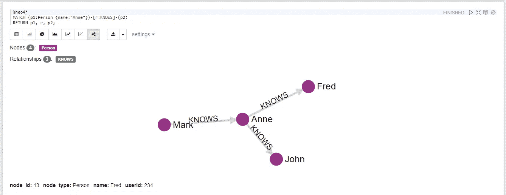

本文将展示如何在 Docker 环境中使用 Zeppelin、Spark 和 Neo4j 来构建简单的数据管道。
我们将使用*芝加哥犯罪数据集*，它涵盖了自 2001 年以来发生的犯罪。整个数据集包含大约 600 万起犯罪和关于它们的元数据，例如位置、犯罪类型和日期等等。

在本例中，我们将使用由[so crata API](https://dev.socrata.com/foundry/data.cityofchicago.org/6zsd-86xi)返回的 1000 个犯罪构成的数据集子集。

# 步骤 1:配置容器

你应该已经安装了 *Docker* 和 *Docker-Compose* 。

不幸的是 [Zeppelin 在嵌入式版本上有一个 bug](https://issues.apache.org/jira/browse/ZEPPELIN-3586) ,我们需要解决它，使它像容器一样工作。为此，我们创建了自己的 docker 文件:

这是我们的合成文件。基本上将官方的 Neo4j 容器和我们的 Zeppelin 容器合并为两个服务。

*对于您的本地设置，只需更改* `*neo4j-zeppelin.yml*` *的第 22 行和第 23 行，以便提供正确的路径。*

现在让我们运行这个示例代码来加速我们的堆栈:

```
docker-compose -f neo4j-zeppelin.yml up -d
```

现在我们有两个可到达的服务:

*   齐柏林飞艇: [http://localhost:8080](http://localhost:8080)
*   neo4j:[http://localhost:7474](http://localhost:7474)

# 步骤 2:配置 Zeppelin

如果您从我的 GitHub 存储库中下载并执行 compose 文件，那么一切都是预先配置好的。

但是我们来看一些**隐藏配置。**右上角有一个菜单

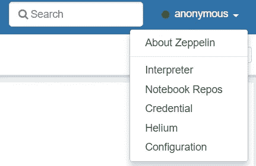

点击**解释器**，然后按“火花”筛选列表。

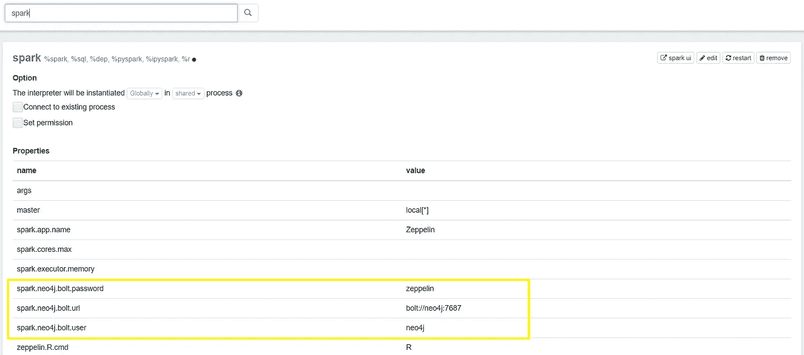

如您所见，用黄色突出显示的是 [Neo4j-Spark-Connector](https://github.com/neo4j-contrib/neo4j-spark-connector/releases) 连接 Neo4j 所需的三个属性。

现在，如果您将解释器过滤器更改为“neo4j ”,您会发现:

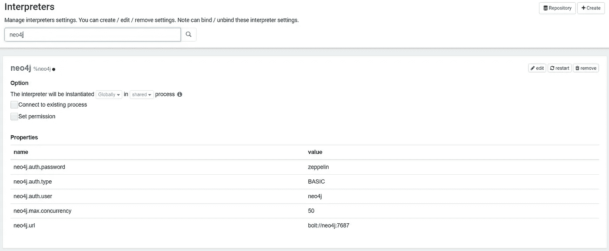

该页面包含 Neo4j 解释器的属性，尤其是 auth 信息。

# 第三步:我们的数据处理笔记本


The notebook in action

我们已经配置了 Zeppelin / Spark / Neo4j 堆栈，现在让我们享受一下数据分析的乐趣。

在 Zeppelin 中，每个笔记本由段落或块组成，每个段落或块包含处理特定任务的代码块。

在我们的笔记本中，*第一个块*用于从 Spark-Packages 存储库中下载我们项目中所需的依赖项:Neo4j-Spark-Connector

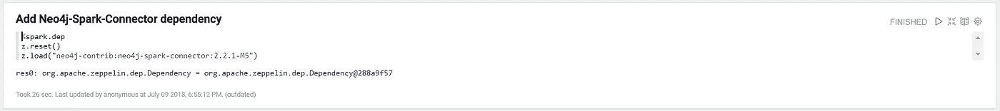

在第二个块中，我们下载数据集并存储到我们的文件系统中

正如我在介绍中所说，我们将使用芝加哥犯罪数据集的一个小子集。

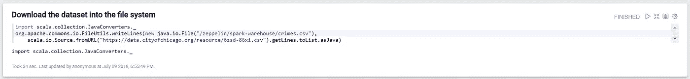

在第三个块中，我们将数据集从文件系统读入 Spark 数据集


在*第四块*中，我们使用

```
crimeDF.printSchema
```


从这个模式开始，我们将像这样构造一个图模型


Graph Schema

我们有 4 个节点:

*   `Beat`(警区)带`**beat**`属性；
*   `Crime`具有`**id, description, case_number, point**` 属性；
*   `CrimeType`带有`**primary_type**`性质；
*   `CrimeDate`具有`**parsed_date**`和`**date**`属性

和 3 种关系:

*   `ON_BEAT`从`**Beat**`开始，到`**Crime**`结束；
*   `IS_TYPE`从 a `**Crime**`开始，到 a `**CrimeType**`结束；
*   `ON_DATE`从 a `**Crime**`开始，到 a `**CrimeDate**`结束；

在*第五块*中，我们将创建新列，以便添加*解析日期*和*地理空间参考*。顺便说一下，从 Neo4j 3.4 开始，数据库本身支持[日期和空间数据](https://medium.com/neo4j/working-with-neo4j-date-and-spatial-types-in-a-react-js-app-5475b5042b50)，但不幸的是 Neo4j-Spark-Connector 还不支持它。

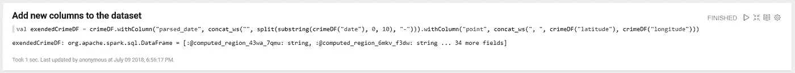

在*第六块*中，我们通过使用 [Zeppelin 上下文 API](https://zeppelin.apache.org/docs/0.8.0/usage/other_features/zeppelin_context.html) 简单地探索我们的数据集:

```
z.show(exendedCrimeDF)
```

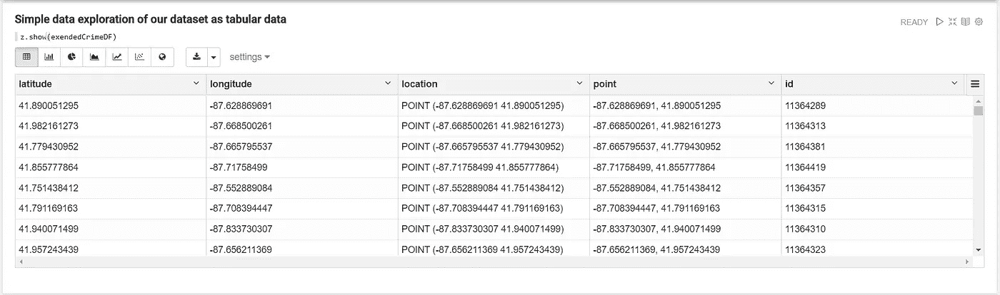

现在让我们跳到第七个模块*中，在这里我们使用 Neo4j-Spark-Connector 获取数据。我们使用提供方法的`Neo4jDataFrame`:*

```
Neo4jDataFrame.mergeEdgeList(sc: SparkContext,
    dataFrame: DataFrame,
    source: (label,Seq[prop]),
    relationship: (type,Seq[prop]),
    target: (label,Seq[prop]))
```

要将数据帧合并回 Neo4j 图形:

*   两个节点按顺序由第一个属性合并；
*   两个节点之间的关系被合并，序列中的所有属性都将在该关系上设置；
*   序列中的属性名用作数据框的列名，目前没有名称转换；
*   结果以 10000 为一批发送到图表中。

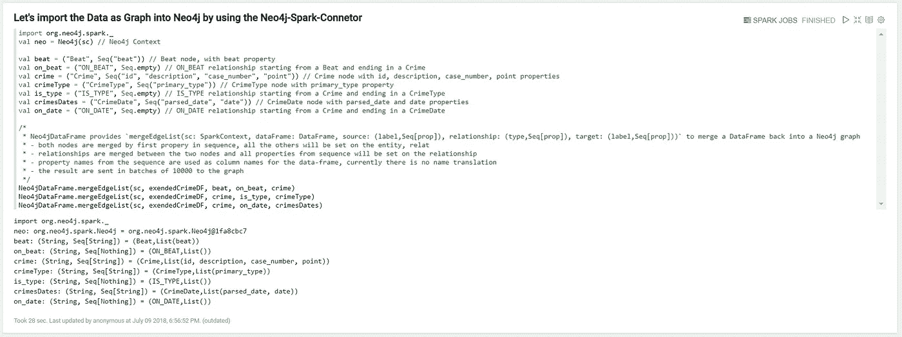

到目前为止，我们只在齐柏林飞艇和火花乐队工作。现在图形数据已经导入到 Neo4j 中，我们可以使用 Neo4j 解释器从 Zeppelin 查询 Neo4j。
要使用 Neo4j 解释器，我们必须使用特定的解释器绑定

```
%neo4j
```

接下来是我们的密码查询:

```
MATCH (crime:Crime)-[is:IS_TYPE]->(type:CrimeType),
 (crime)-[on:ON_DATE]->(date:CrimeDate)
RETURN crime, is, type, on, date
LIMIT 10
```

结果将显示为图形，如下图所示:

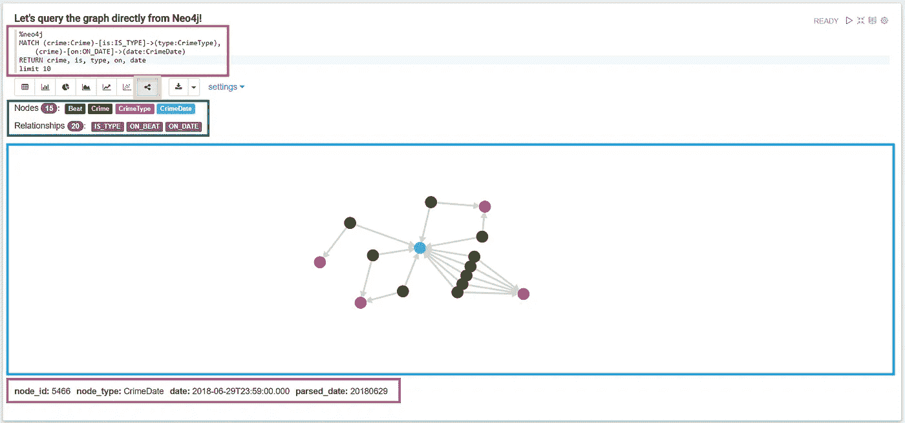

A Neo4j query block with graph query and visualization

该科分为五个不同的领域:

*   红色:用于编写密码查询的区域；
*   黄色:显示最新 Zeppelin 发行版中可用的新**图形可视化**的按钮；
*   绿色:关于图形的一般信息；节点、边等…
*   蓝色:用于呈现图形可视化的区域
*   紫色:当你点击一个节点/边时，相关数据将会显示的区域

此外，结果图也将作为一个扁平的表格。因此，所有其他可视化(图表等)也是可用的，您可以通过单击相应的按钮在它们之间简单地切换。

图形可视化附带设置，以便提供一些配置:

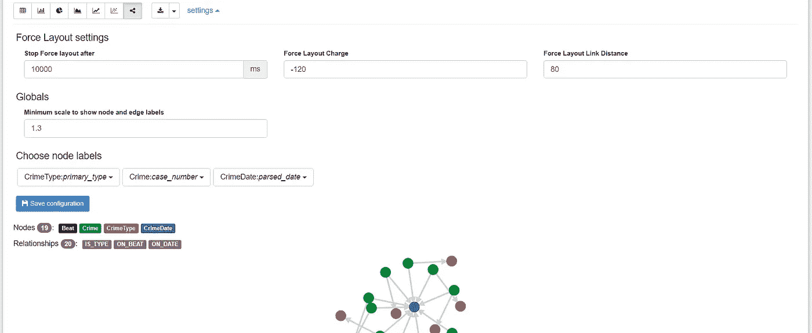

The graph visualization settings

例如，通过这些设置，您可以自定义显示为节点标题的属性。

使用鼠标滚轮，您可以放大/缩小图表，以显示如下所示的标题

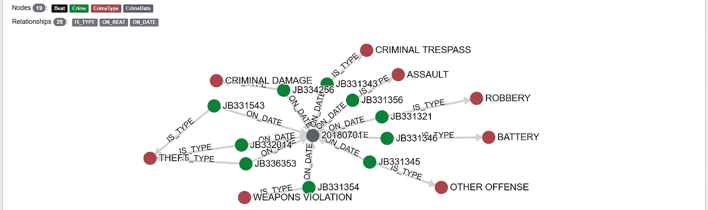

## 利用 Zeppelin 动态表单

Neo4j 解释器可以利用 [Zeppelin 动态表单](https://zeppelin.apache.org/docs/0.8.0/usage/dynamic_form/intro.html)来构建参数化查询，就像这样:

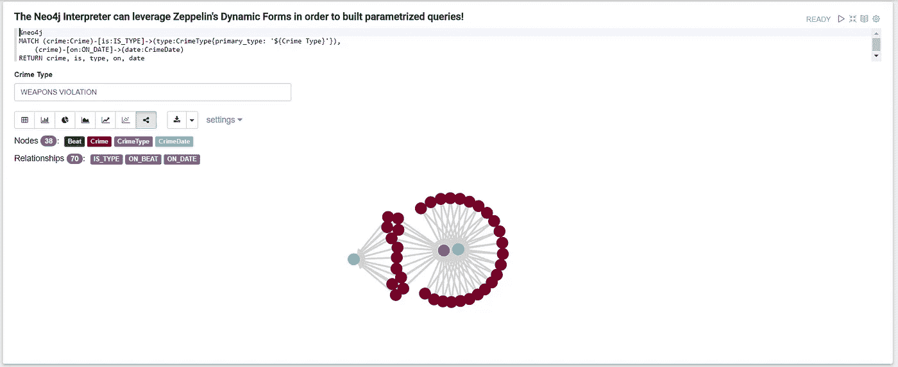

# 好处:增加地理空间可视化

Zeppelin 有一个名为 [Helium](https://zeppelin.apache.org/helium_packages.html) 的可插拔架构，可以轻松添加新的可视化内容。在右上方的菜单中点击氦气条目，然后在氦气页面中启用 zeplin-Leaflet 作为[，如图所示](https://www.npmjs.com/package/volume-leaflet)。然后，您的密码查询结果也可以在地图上可视化。

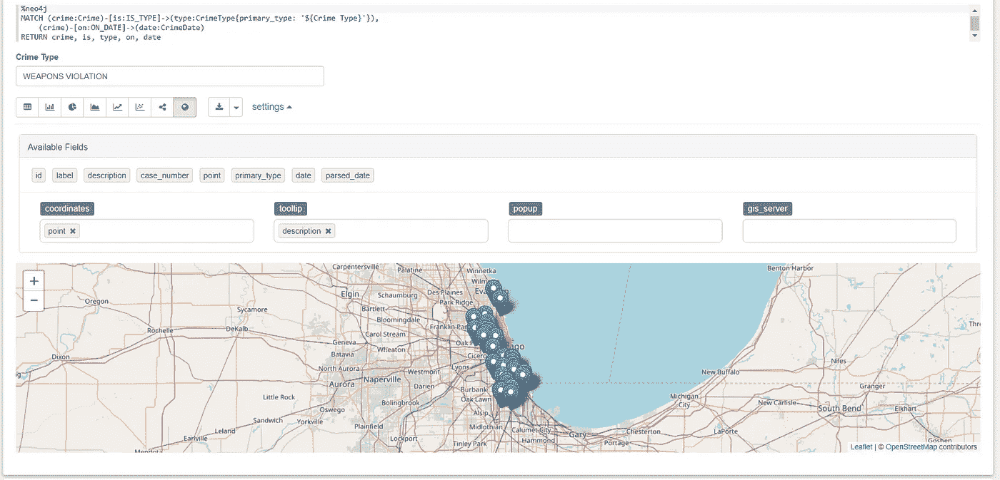

你可以直接从 [GitHub](https://github.com/conker84/zeppelin-neo4j) 下载整个笔记本代码。我很想得到你对 Apache Zeppelin 的 Neo4j 和图形解释器的反馈，请在评论或我的 GitHub 问题中告诉我。此外，如果你有 Zeppelin 和 Spark 的很酷的图形用例，也请分享它们，这样更多的人可以了解图形的**力量。**