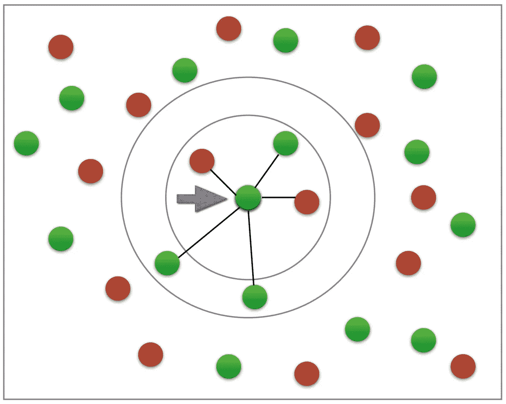
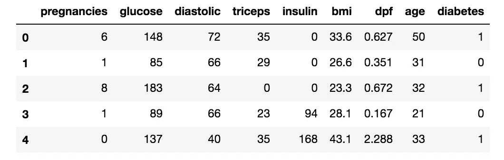
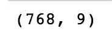
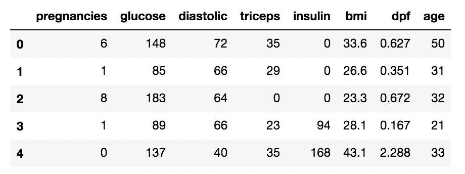
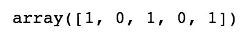
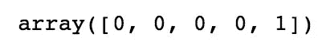
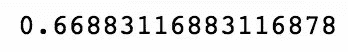
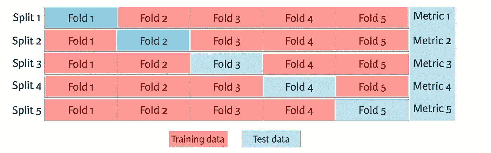
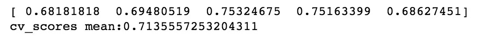
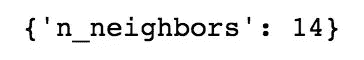

# 用 Scikit-learn 构建 k-近邻模型

> 原文：<https://towardsdatascience.com/building-a-k-nearest-neighbors-k-nn-model-with-scikit-learn-51209555453a?source=collection_archive---------1----------------------->



k-NN ([Image credit](https://www.datacamp.com/))

k-近邻(k-NN)是一种有监督的机器学习模型。监督学习是指模型从已经标记的数据中学习。监督学习模型接受一组输入对象和输出值。然后，该模型根据这些数据进行训练，以学习如何将输入映射到所需的输出，这样它就可以学习根据看不见的数据进行预测。

k-NN 模型通过获取一个数据点并查看“k”个最接近的标记数据点来工作。然后，给数据点分配“k”个最接近点中大多数的标签。

例如，如果 k = 5，3 个点为“绿色”，2 个点为“红色”，那么所讨论的数据点将被标记为“绿色”，因为“绿色”占大多数(如上图所示)。

Scikit-learn 是一个用于 Python 的机器学习库。在本教程中，我们将使用 Scikit-learn 构建一个 k-NN 模型来预测患者是否患有糖尿病。

## 读入训练数据

对于我们的 k-NN 模型，第一步是读入我们将用作输入的数据。对于这个例子，我们使用糖尿病数据集。首先，我们将使用 Pandas 读入数据。我不会详细介绍熊猫，但如果你想进一步深入数据科学和机器学习，这是一个你应该熟悉的库。

```
import pandas as pd#read in the data using pandas
df = pd.read_csv(‘data/diabetes_data.csv’)#check data has been read in properly
df.head()
```



接下来，我们来看看我们有多少数据。我们将在数据帧上调用“shape”函数，查看数据中有多少行和多少列。行表示患者的数量，列表示特征(年龄、体重等)的数量。)在数据集中。

```
#check number of rows and columns in dataset
df.shape
```



我们可以看到，我们有 768 行数据(潜在的糖尿病患者)和 9 列数据(8 个输入特征和 1 个目标输出)。

## 将数据集分成输入和目标

现在让我们把数据集分成输入(X)和目标(y)。我们的输入将是除“糖尿病”之外的每一列，因为“糖尿病”是我们将试图预测的。因此，“糖尿病”将是我们的目标。

我们将使用 pandas 'drop '函数从数据帧中删除列' diabetes ',并将其存储在变量' X '中。这将是我们的投入。

```
*#create a dataframe with all training data except the target column*
X = df.drop(columns=[‘diabetes’])*#check that the target variable has been removed*
X.head()
```



我们将把数据集的“糖尿病”列插入到目标变量(y)中。

```
#separate target values
y = df[‘diabetes’].values#view target values
y[0:5]
```



## 将数据集拆分为训练和测试数据

现在，我们将数据集分为训练数据和测试数据。训练数据是模型将从中学习的数据。测试数据是我们将用来查看模型在看不见的数据上表现如何的数据。

Scikit-learn 有一个我们可以使用的名为“train_test_split”的函数，它使我们可以很容易地将数据集分成训练和测试数据。

```
from sklearn.model_selection import train_test_split#split dataset into train and test data
X_train, X_test, y_train, y_test = train_test_split(X, y, test_size=0.2, random_state=1, stratify=y)
```

“train_test_split”接受 5 个参数。前两个参数是我们之前分开的输入和目标数据。接下来，我们将“测试大小”设置为 0.2。这意味着 20%的数据将用于测试，剩下 80%的数据作为模型学习的训练数据。将“random_state”设置为 1 可以确保我们每次都能获得相同的分割，这样我们就可以重现我们的结果。

将“分层”设置为 y 会使我们的训练分割表示 y 变量中每个值的比例。例如，在我们的数据集中，如果 25%的患者患有糖尿病，75%的患者没有糖尿病，将“分层”设置为 y 将确保随机拆分有 25%的糖尿病患者和 75%的非糖尿病患者。

## 构建和训练模型

接下来，我们必须建立模型。代码如下:

```
from sklearn.neighbors import KNeighborsClassifier# Create KNN classifier
knn = KNeighborsClassifier(n_neighbors = 3)# Fit the classifier to the data
knn.fit(X_train,y_train)
```

首先，我们将创建一个新的 k-NN 分类器，并将“n_neighbors”设置为 3。概括地说，这意味着如果与新数据点最近的 3 个点中至少有 2 个是没有糖尿病的患者，那么新数据点将被标记为“没有糖尿病”，反之亦然。换句话说，一个新的数据点由 3 个最近点的多数标记。

我们将“n_neighbors”设置为 3 作为起点。我们将在下面更详细地讨论如何更好地为“n_neighbors”选择一个值，以便模型可以提高其性能。

接下来，我们需要训练模型。为了训练我们的新模型，我们将使用“fit”函数并传递我们的训练数据作为参数，以使我们的模型符合训练数据。

## 测试模型

一旦模型训练完毕，我们就可以使用模型上的“预测”功能对测试数据进行预测。如前面检查“y”时所见，0 表示患者没有糖尿病，1 表示患者有糖尿病。为了节省空间，我们将只显示测试集的前 5 个预测。

```
#show first 5 model predictions on the test data
knn.predict(X_test)[0:5]
```



我们可以看到，该模型预测测试集中的前 4 名患者“没有糖尿病”,而第 5 名患者“患有糖尿病”。

现在让我们看看我们的模型在整个测试集上有多精确。为此，我们将使用“score”函数，并传入我们的测试输入和目标数据，以查看我们的模型预测与实际结果的匹配程度。

```
#check accuracy of our model on the test data
knn.score(X_test, y_test)
```



我们的模型具有大约 66.88%的准确度。这是一个好的开始，但我们将在下面看到如何提高模型性能。

恭喜你。你现在已经建立了一个惊人的 k-NN 模型！

## k 倍交叉验证

交叉验证是指数据集被随机分成“k”个组。其中一组用作测试集，其余的用作训练集。该模型在训练集上被训练，并在测试集上被评分。然后重复该过程，直到每个唯一的组都被用作测试集。

例如，对于 5 重交叉验证，数据集将被分成 5 组，模型将被训练和测试 5 次，因此每组都有机会成为测试集。这可以从下图中看出。



5-fold cross validation ([image credit](https://www.datacamp.com/))

我们之前使用的训练-测试-拆分方法称为“保持”。交叉验证比使用维持方法更好，因为维持方法的得分取决于如何将数据拆分为定型集和测试集。交叉验证为模型提供了在多个拆分上进行测试的机会，因此我们可以更好地了解模型在看不见的数据上的表现。

为了使用交叉验证来训练和测试我们的模型，我们将使用交叉验证值为 5 的“cross_val_score”函数。“cross_val_score”将我们的 k-NN 模型和我们的数据作为参数。然后，它将我们的数据分成 5 组，并对我们的数据进行 5 次拟合和评分，每次都将准确度分数记录在一个数组中。我们将准确性分数保存在“cv_scores”变量中。

为了计算 5 个分数的平均值，我们将使用 numpy 的 mean 函数，传入“cv_score”。Numpy 是 Python 中一个有用的数学库。

```
from sklearn.model_selection import cross_val_score
import numpy as np#create a new KNN model
knn_cv = KNeighborsClassifier(n_neighbors=3)#train model with cv of 5 
cv_scores = cross_val_score(knn_cv, X, y, cv=5)#print each cv score (accuracy) and average them
print(cv_scores)
print(‘cv_scores mean:{}’.format(np.mean(cv_scores)))
```



使用交叉验证，我们的平均分数约为 71.36%。与我们之前使用维持方法进行的测试相比，这更准确地展示了我们的模型在未知数据上的表现。

## 使用 GridSearchCV 超调模型参数

当建立我们的初始 k-NN 模型时，我们将参数“n_neighbors”设置为 3 作为起点，该选择背后没有真正的逻辑。

超调参数是指通过一个过程来为您的模型找到最佳参数，以提高精度。在我们的例子中，我们将使用 GridSearchCV 来寻找‘n _ neighbors’的最优值。

GridSearchCV 通过在我们指定的参数范围内多次训练我们的模型来工作。这样，我们可以用每个参数测试我们的模型，并找出最佳值以获得最佳精度结果。

对于我们的模型，我们将为“n_neighbors”指定一个值范围，以查看哪个值最适合我们的模型。为此，我们将创建一个字典，将' n_neighbors '设置为键，并使用 numpy 创建一个值从 1 到 24 的数组。

我们使用网格搜索的新模型将采用新的 k-NN 分类器、我们的 param_grid 和交叉验证值 5，以便找到‘n _ neighbors’的最佳值。

```
from sklearn.model_selection import GridSearchCV#create new a knn model
knn2 = KNeighborsClassifier()#create a dictionary of all values we want to test for n_neighbors
param_grid = {‘n_neighbors’: np.arange(1, 25)}#use gridsearch to test all values for n_neighbors
knn_gscv = GridSearchCV(knn2, param_grid, cv=5)#fit model to data
knn_gscv.fit(X, y)
```

训练之后，我们可以检查我们测试的‘n _ neighbors’的哪个值表现最好。为此，我们将在模型上调用‘best _ params _’。

```
#check top performing n_neighbors value
knn_gscv.best_params_
```



我们可以看到，14 是“n_neighbors”的最佳值。当“n_neighbors”为 14 时，我们可以使用“best_score_”函数来检查我们的模型的准确性。best_score_ '输出通过交叉验证获得的分数的平均准确度。

```
#check mean score for the top performing value of n_neighbors
knn_gscv.best_score_
```


通过使用网格搜索为我们的模型找到最佳参数，我们已经将我们的模型精度提高了 4%以上！

感谢阅读！本教程的 GitHub 库(jupyter 笔记本和数据集)可以在[这里](https://github.com/eijaz1/k-NN-Tutorial-Scikit-learn)找到。

如果你想了解我的机器学习内容，请关注我:)