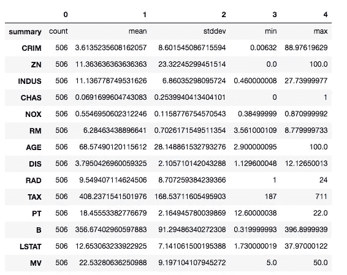
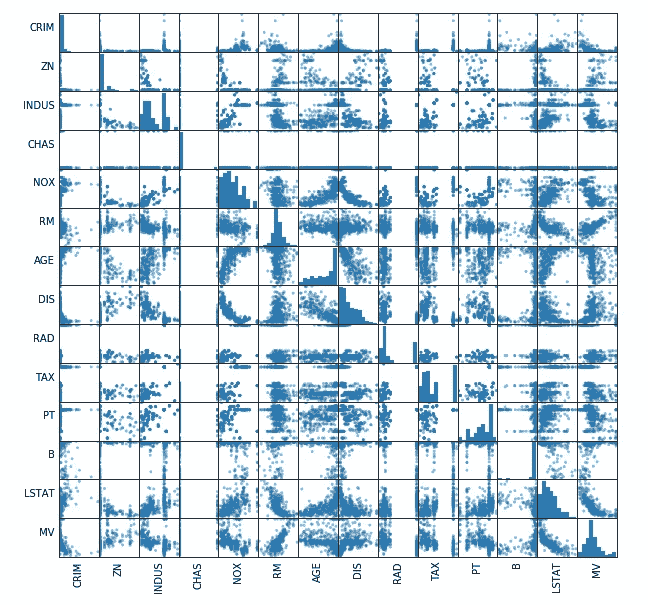
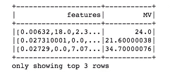
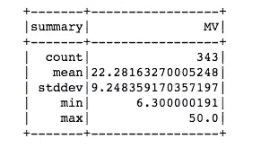
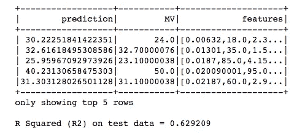
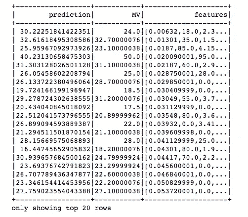
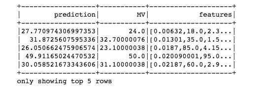

# 使用 PySpark 和 MLlib 构建线性回归

> 原文：<https://towardsdatascience.com/building-a-linear-regression-with-pyspark-and-mllib-d065c3ba246a?source=collection_archive---------0----------------------->


Photo credit: Pixabay

[Apache Spark](https://spark.apache.org/) 已经成为机器学习和数据科学最常用和最受支持的开源工具之一。

在这篇文章中，我将帮助你开始使用 [Apache Spark 的 spark.ml 线性回归](https://spark.apache.org/docs/2.2.0/ml-classification-regression.html#linear-regression)来预测波士顿房价。我们的数据来自 [Kaggle 竞赛:波士顿郊区的房屋价值](https://www.kaggle.com/c/boston-housing/data)。对于每个房屋观察，我们有以下信息:

各城镇的人均犯罪率。

**ZN** —面积超过 25，000 平方英尺的住宅用地比例

**INDUS** —每个城镇非零售商业亩数比例。

**CHAS** —查尔斯河虚拟变量(= 1，如果区域边界为河流；否则为 0)。

**NOX** —氮氧化物浓度(百万分之一)。

**RM** —每个住宅的平均房间数。

**年龄**—1940 年前建造的自有住房比例。

DIS —到五个波士顿就业中心的加权平均距离。

**RAD** —放射状公路可达性指标。

**税** —每 1 万美元的全价值财产税税率。

**pt ratio**——按城镇划分的学生/教师比率。

**黑人** — 1000(Bk — 0.63)其中 Bk 是按城镇划分的黑人比例。

**LSTAT** —较低的人口地位(百分比)。

**MV** —以千美元为单位的自有住房的中值。这是目标变量。

输入数据集包含各种房屋的详细信息。根据提供的信息，目标是提出一个模型来预测该地区给定房屋的中值。

# 加载数据

```
from pyspark import SparkConf, SparkContext
from pyspark.sql import SQLContext
sc= SparkContext()
sqlContext = SQLContext(sc)house_df = sqlContext.read.format('com.databricks.spark.csv').options(header='true', inferschema='true').load('boston.csv')
house_df.take(1)
```

***【Row(CRIM = 0.00632，ZN=18.0，INDUS=2.309999943，CHAS=0，NOX=0.537999988，RM=6.574999809，AGE = 65.19999695，DIS=4.090000153，RAD=1，TAX=296，PT = 15.30000019***

# 数据探索

以树格式打印模式。

```
house_df.cache()
house_df.printSchema()root
 |-- CRIM: double (nullable = true)
 |-- ZN: double (nullable = true)
 |-- INDUS: double (nullable = true)
 |-- CHAS: integer (nullable = true)
 |-- NOX: double (nullable = true)
 |-- RM: double (nullable = true)
 |-- AGE: double (nullable = true)
 |-- DIS: double (nullable = true)
 |-- RAD: integer (nullable = true)
 |-- TAX: integer (nullable = true)
 |-- PT: double (nullable = true)
 |-- B: double (nullable = true)
 |-- LSTAT: double (nullable = true)
 |-- MV: double (nullable = true)
```

执行描述性分析

```
house_df.describe().toPandas().transpose()
```



Figure 1

散点图是粗略确定多个自变量之间是否存在线性相关性的一个很好的方法。

```
import pandas as pdnumeric_features = [t[0] for t in house_df.dtypes if t[1] == 'int' or t[1] == 'double']
sampled_data = house_df.select(numeric_features).sample(False, 0.8).toPandas()
axs = pd.scatter_matrix(sampled_data, figsize=(10, 10))
n = len(sampled_data.columns)
for i in range(n):
    v = axs[i, 0]
    v.yaxis.label.set_rotation(0)
    v.yaxis.label.set_ha('right')
    v.set_yticks(())
    h = axs[n-1, i]
    h.xaxis.label.set_rotation(90)
    h.set_xticks(())
```



Figure 2

很难看到。让我们找出自变量和目标变量之间的相关性。

```
import six
for i in house_df.columns:
    if not( isinstance(house_df.select(i).take(1)[0][0], six.string_types)):
        print( "Correlation to MV for ", i, house_df.stat.corr('MV',i))Correlation to MV for  CRIM -0.3883046116575088
Correlation to MV for  ZN 0.36044534463752903
Correlation to MV for  INDUS -0.48372517128143383
Correlation to MV for  CHAS 0.17526017775291847
Correlation to MV for  NOX -0.4273207763683772
Correlation to MV for  RM 0.695359937127267
Correlation to MV for  AGE -0.37695456714288667
Correlation to MV for  DIS 0.24992873873512172
Correlation to MV for  RAD -0.3816262315669168
Correlation to MV for  TAX -0.46853593528654536
Correlation to MV for  PT -0.5077867038116085
Correlation to MV for  B 0.3334608226834164
Correlation to MV for  LSTAT -0.7376627294671615
Correlation to MV for  MV 1.0
```

相关系数范围从–1 到 1。当接近 1 时，说明有很强的正相关性；例如，当房间数量增加时，中值往往会增加。当系数接近–1 时，说明有很强的负相关性；当处于较低地位的人口比例上升时，中间值往往会下降。最后，系数接近零意味着没有线性相关性。

目前，我们将保留所有变量。

为机器学习准备数据。我们只需要两列—功能和标签(“MV”):

```
from pyspark.ml.feature import VectorAssemblervectorAssembler = VectorAssembler(inputCols = ['CRIM', 'ZN', 'INDUS', 'CHAS', 'NOX', 'RM', 'AGE', 'DIS', 'RAD', 'TAX', 'PT', 'B', 'LSTAT'], outputCol = 'features')
vhouse_df = vectorAssembler.transform(house_df)
vhouse_df = vhouse_df.select(['features', 'MV'])
vhouse_df.show(3)
```



Figure 3

```
splits = vhouse_df.randomSplit([0.7, 0.3])
train_df = splits[0]
test_df = splits[1]
```

# 线性回归

```
from pyspark.ml.regression import LinearRegressionlr = LinearRegression(featuresCol = 'features', labelCol='MV', maxIter=10, regParam=0.3, elasticNetParam=0.8)
lr_model = lr.fit(train_df)
print("Coefficients: " + str(lr_model.coefficients))
print("Intercept: " + str(lr_model.intercept))
```

***系数:【0.0，0.007302310571175137，-0.03286303124593804，1.413473328268，-7.919323668，5.21692169246***

对训练集的模型进行总结，并打印出一些指标:

```
trainingSummary = lr_model.summary
print("RMSE: %f" % trainingSummary.rootMeanSquaredError)
print("r2: %f" % trainingSummary.r2)
```

***RMSE:4.675914
R2:0.743627***

RMSE 测量模型预测值和实际值之间的差异。然而，RMSE 本身是没有意义的，直到我们与实际的“MV”值进行比较，如平均值、最小值和最大值。经过这样的比较，我们的 RMSE 看起来还不错。

```
train_df.describe().show()
```



Figure 4

r 的平方为 0.74 表明，在我们的模型中，大约 74%的“MV”可变性可以用该模型来解释。这与 Scikit-Learn 的[结果一致。还不错。然而，我们必须小心，训练集上的性能可能不是测试集上性能的良好近似。](/simple-and-multiple-linear-regression-in-python-c928425168f9)

```
lr_predictions = lr_model.transform(test_df)
lr_predictions.select("prediction","MV","features").show(5)from pyspark.ml.evaluation import RegressionEvaluator
lr_evaluator = RegressionEvaluator(predictionCol="prediction", \
                 labelCol="MV",metricName="r2")
print("R Squared (R2) on test data = %g" % lr_evaluator.evaluate(lr_predictions))
```



Figure 5

```
test_result = lr_model.evaluate(test_df)
print("Root Mean Squared Error (RMSE) on test data = %g" % test_result.rootMeanSquaredError)
```

***测试数据的均方根误差(RMSE)= 5.52048***

果然，我们在测试集上取得了更差的 RMSE 和 R 平方。

```
print("numIterations: %d" % trainingSummary.totalIterations)
print("objectiveHistory: %s" % str(trainingSummary.objectiveHistory))
trainingSummary.residuals.show()
```

***操作数:11
目标历史记录:【0.49999999999956，0.4281126976，069，304，0.22593628，5989，17，0.20326326，5959，582，0.1。546667***


Figure 6

使用我们的线性回归模型进行一些预测:

```
predictions = lr_model.transform(test_df)
predictions.select("prediction","MV","features").show()
```



Figure 7

# 决策树回归

```
from pyspark.ml.regression import DecisionTreeRegressordt = DecisionTreeRegressor(featuresCol ='features', labelCol = 'MV')
dt_model = dt.fit(train_df)
dt_predictions = dt_model.transform(test_df)
dt_evaluator = RegressionEvaluator(
    labelCol="MV", predictionCol="prediction", metricName="rmse")
rmse = dt_evaluator.evaluate(dt_predictions)
print("Root Mean Squared Error (RMSE) on test data = %g" % rmse)
```

***测试数据上的均方根误差(RMSE)= 4.39053***

**特征重要性**

```
dt_model.featureImportances
```

***SparseVector(13，{0: 0.0496，1: 0.0，4: 0.0118，5: 0.624，6: 0.0005，7: 0.1167，8: 0.0044，10: 0.013，12: 0.1799})***

```
house_df.take(1)
```

***【Row(CRIM = 0.00632，ZN=18.0，INDUS=2.309999943，CHAS=0，NOX=0.537999988，RM=6.574999809，AGE = 65.19999695，DIS=4.090000153，RAD=1，TAX=296，PT = 15.30000019***

显然，在我们的数据中，房间数量是预测房屋中值价格的最重要特征。

# 梯度推进的树回归

```
from pyspark.ml.regression import GBTRegressor
gbt = GBTRegressor(featuresCol = 'features', labelCol = 'MV', maxIter=10)
gbt_model = gbt.fit(train_df)
gbt_predictions = gbt_model.transform(test_df)
gbt_predictions.select('prediction', 'MV', 'features').show(5)
```



Figure 8

```
gbt_evaluator = RegressionEvaluator(
    labelCol="MV", predictionCol="prediction", metricName="rmse")
rmse = gbt_evaluator.evaluate(gbt_predictions)
print("Root Mean Squared Error (RMSE) on test data = %g" % rmse)
```

**测试数据的均方根误差(RMSE )= 4.19795**

梯度推进的树回归在我们的数据上表现最好。

源代码可以在 [Github](https://github.com/susanli2016/PySpark-and-MLlib/blob/master/Linear_regression_house.ipynb) 上找到。我很高兴听到任何反馈或问题。